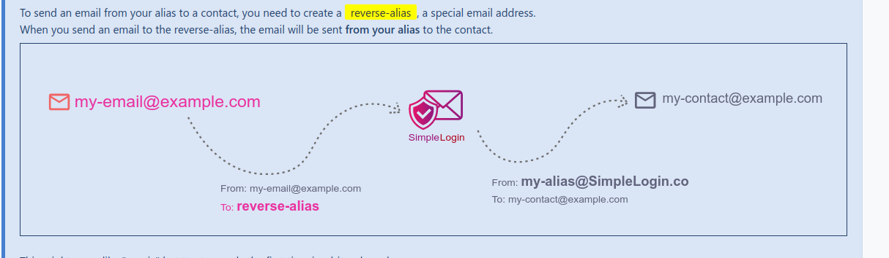

## Doc 2FA

- https://mshelton.medium.com/two-factor-authentication-for-beginners-b29b0eec07d7

### Password reset 

- https://github.com/KathanP19/HowToHunt/blob/master/Password_Reset_Functionality/Password_Reset_Flaws_by_Sm4rty.md
- https://www.shielder.com/blog/2022/09/how-to-decrypt-manage-engine-pmp-passwords-for-fun-and-domain-admin-a-red-teaming-tale/

### FIDO with PAM (Linux)

- https://docs.nitrokey.com/fr/nitrokey3/linux/desktop-login
- https://pychao.com/2020/06/10/update-on-using-protonmail-bridge-on-headless-wordpress-linux-servers/

```bash
#PKGBUILD
makepkg -sri
```

## Doc Opsec

- https://privacy.sexy/
- https://switching.software/
- https://prism-break.org/fr/
- https://wiki.nothing2hide.org/
- https://anonymousplanet.org/guide
- https://eylenburg.github.io/index.html
- https://www.privacyguides.org/en/basics/threat-modeling/

```bash
# https://archive.is/0OLMG#selection-377.0-377.51
# sudo crontab -e
*/1 * * * * sudo rm /etc/machine-id && sudo systemd-machine-id-setup
```


## Cheatsheets

- https://github.com/pluja/awesome-privacy
- https://github.com/Lissy93/awesome-privacy
- https://github.com/StellarSand/privacy-settings
- https://github.com/mendel5/alternative-front-ends
- https://osint-opsec.fr/opsec-egosrufing-infostealer/


## Tools

### Selfhosted

#### PDFs

- https://github.com/24eme/signaturepdf
- https://github.com/Stirling-Tools/Stirling-PDF
- [Guide - How to sign PDFs with timestamp - freeTSA](https://www.freetsa.org/guide/)

#### Local LLMs

- https://www.chatpdf.com/
- https://ollama.com/library/codellama
- https://github.com/zylon-ai/private-gpt/
- https://github.com/SecureAI-Tools/SecureAI-Tools

### Online

- https://search.disroot.org/ # private bin, nextcloud, filesharing
- https://filigrane.beta.gouv.fr/
- https://www.freetsa.org/index_en.php
- https://github.com/sebsauvage/ZeroBin
- https://github.com/gorhill/uBlock/wiki/Blocking-mode:-medium-mode
- https://wiki.zenk-security.com/doku.php?id=les_achats_en_chine


### Mail

- https://blog.slonser.info/posts/email-attacks/

```txt
<spoofed@gmail.com> "spoofed" <slonser.bugbounty@gmail.com>
```

- https://pissmail.com/
- https://temp-mail.org/en/
- https://freephonenum.com/
- https://receive-smss.com/
- https://justdeleteme.xyz/

#### Reverse alias

- https://simplelogin.io/




### RGPD Erasure

- https://www.datarequests.org/generator#!request_type=erasure
- https://www.datarequests.org/blog/sample-letter-gdpr-erasure-request/
- https://www.cnil.fr/fr/le-dereferencement-dun-contenu-dans-un-moteur-de-recherche

### TOR with cli

```bash
sudo pacman -S tor proxychains-ng
sudo systemctl start tor.service
```

- https://archive.org (deleted and protected articles)
- https://github.com/schollz/croc
- https://phackt.com/tor-proxychains

```bash
proxychains4 firefox
chromium --proxy-server="socks://localhost:9050"

# All traffic through tor
proxychains bash

proxychains ssh -D 127.0.0.1:9050 user@remote_server
```


## Operating systems

### Android

- https://aurorastore.org/		# You can also see if any app has build-in trackers
- https://exodus-privacy.eu.org/
- https://github.com/0x192/universal-android-debloater

#### Apps android

- https://osmand.net/
- https://f-droid.org/en/packages/com.jarsilio.android.scrambledeggsif/
- https://f-droid.org/en/packages/de.markusfisch.android.binaryeye/
- https://f-droid.org/en/packages/com.menny.android.anysoftkeyboard/
- https://f-droid.org/en/packages/com.artifex.mupdf.viewer.app/
- https://f-droid.org/en/packages/com.jmstudios.redmoon/

```bash
#remove metadata (i.e scrambledeggsif)
exiftool -all= image.png
```

### Linux

[cryptsetup](../linux/partition_chiffree.md) (use distro's installer)

- https://entropyqueen.github.io/posts/Setting_up_2FA_on_Linux_with_PAM
- https://madaidans-insecurities.github.io/guides/linux-hardening.html

### Windows

[bitlocker](https://learn.microsoft.com/en-us/windows/security/operating-system-security/data-protection/bitlocker/) (not available in home/family edition - **see licenses /editions**)

- https://rentry.co/debloatguide#disabling-windows-telemetry
- https://github.com/Sycnex/Windows10Debloater


## DNS proxies

- https://pranavk-official.gitlab.io/posts/post-2/
- https://security.stackexchange.com/questions/122547/is-there-a-point-to-dnscrypt-when-using-vpn

*Dnscrypt*

- https://github.com/DNSCrypt/dnscrypt-proxy/wiki/Installation-linux (quad9)

*Dns0/Cloudfare -> logs!!*

- https://www.dns0.eu/
- https://pranavk-official.gitlab.io/posts/post-2/
- https://www.cloudflare.com/ssl/encrypted-sni/#results
- https://support.nordvpn.com/hc/en-us/articles/20350921723409-How-to-disable-IPv6
- https://blog.powerdns.com/2019/09/25/centralised-doh-is-bad-for-privacy-in-2019-and-beyond

```bash
# public wifi only
yay -S cloudflare-warp-bin 
```

## Browser + apps resistFingerprinting

- https://searchengine.party/
- https://browserleaks.com/
- https://webbrowsertools.com/privacy-test/
- https://www.avoidthehack.com/manually-install-extensions-ungoogled-chromium
- https://forum.level1techs.com/t/how-to-obscure-your-web-browser-and-keep-a-comfy-experience/103588


```txt
# Searx using gdorks
!g site:.com "chromium.woolys*"
```

### Firefox

- https://librewolf.net/    # A custom version of Firefox, focused on privacy, security and freedom
- https://shutuptrackers.com/browser/tweaks.php
- https://wiki.archlinux.org/title/Firefox/Privacy
- https://brainfucksec.github.io/firefox-hardening-guide
- https://addons.mozilla.org/en-US/firefox/addon/chameleon-ext/
- https://addons.mozilla.org/en-US/firefox/addon/canvasblocker/ (canvas + clientRects, audio)
- https://addons.mozilla.org/en-US/firefox/addon/font-fingerprint-defender/?utm_source=addons.mozilla.org&utm_medium=referral&utm_content=search (fonts)
- https://support.mozilla.org/bm/questions/1043508

#### Hardening `user.js`

```bash
yay -S arkenfox-user.js
arkenfox-updater 

#about:profiles (remove default) -> ~/.mozilla/firefox/string.default-release/user.js
#browser.search.separatePrivateDefault -> comment to keep searx

# privacy.resistFingerprinting -> set all to true
# privacy.firstparty.isolate -> false (modifier user.js)
# network.cookie.cookieBehavior = 1 // comment, default = 5
```

- Deactivate `safebrowsing/telemetry` (own risk)
- Delete `crashreporter, pingsender` (wiki firefox arch)


```bash
yay -S arkenfox-user.js
arkenfox-updater 

#about:profiles (remove default) -> ~/.mozilla/firefox/string.default-release/user.js
#browser.search.separatePrivateDefault -> comment to keep searx
```

### Brave

- https://community.brave.com/t/disable-webgl-web-tracking/189143/2

```bash
# sudo nano /usr/bin/brave
...
exec /opt/brave-bin/brave "${FLAG_LIST[@]}" "${@}" --incognito --disable-webgl
```

### Ungoogled Chromium

- https://chromium.woolyss.com/#privacy
- https://github.com/ungoogled-software/ungoogled-chromium
- https://github.com/ghostwords/chameleon
- https://github.com/da2x/fluxfonts, https://medium.com/@Los-merengue/linux-daemon-configuration-c07e4eda3f37
- https://chromewebstore.google.com/detail/all-fingerprint-defender/meojnmfhjkahlfcecpdcdgjclcilmaij (fonts + audio)
- https://superuser.com/questions/1333563/disable-history-in-chromium
- https://vytal.io/ (chrome chameleon equivalent)
- https://www.whatismybrowser.com/guides/the-latest-user-agent/chrome (extension UserAgent Switcher)
- https://www.thundercloud.net/infoave/new/how-to-turn-off-motion-sensors-in-chrome/
- https://www.reddit.com/r/linuxquestions/comments/sw4t5o/disable_pulseaudio_sinks/

```bash
pacmd list | grep chromium
pactl unload-module 9
```

**Violentmonkey: spoofing js scripts**

- https://greasyfork.org/en/scripts/29352-screen-resolution-spoof
- https://github.com/dillbyrne/random-agent-spoofer/issues/283

```bash
chrome://flags # disable canvas, video, webGL + webRTC, enable-generic-sensor-extra-classes; enable icognito, disable engine collection, disable referrers , get*ClientRects()/canvas::MeasureText deception...
chrome://settings/content/sensors # disable all (laisser données des sites)


# ModHeader set

# Accept-Encoding: gzip, deflate, br
# Accept-Language: en-US,en;q=0.5
# X-Forwarded-For: 138.168.153.96 (chameleon firefox)
# User-Agent: Mozilla/5.0 (Windows NT 10.0; Win64; x64) AppleWebKit/537.36 (KHTML, like Gecko) Chrome/125.0.0.0 Safari/537.36

# Tor like -> Vytal -> Custom + Win32
# User-Agent: Mozilla/5.0 (Windows NT 10.0; rv:109.0) Gecko/20100101 Firefox/115.0
```
