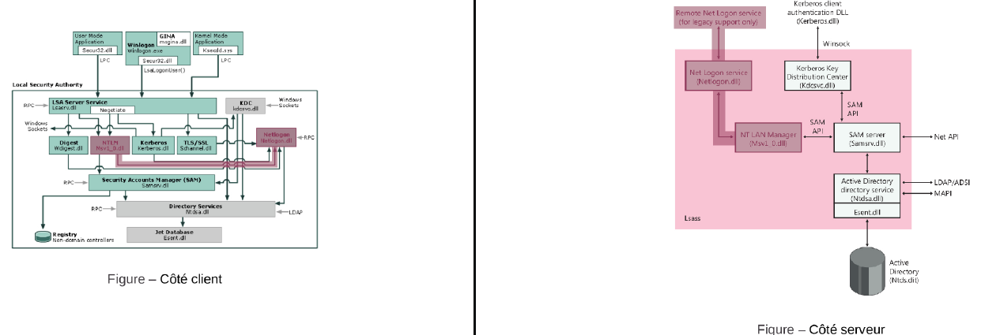
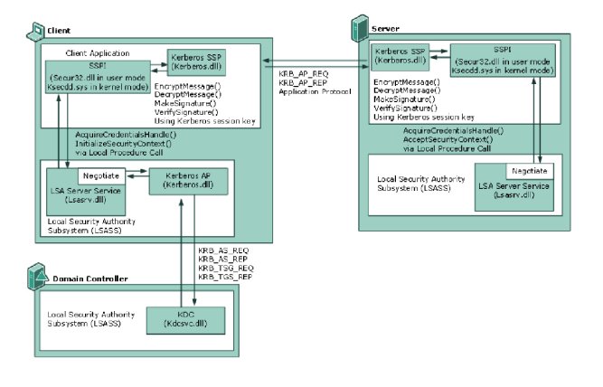
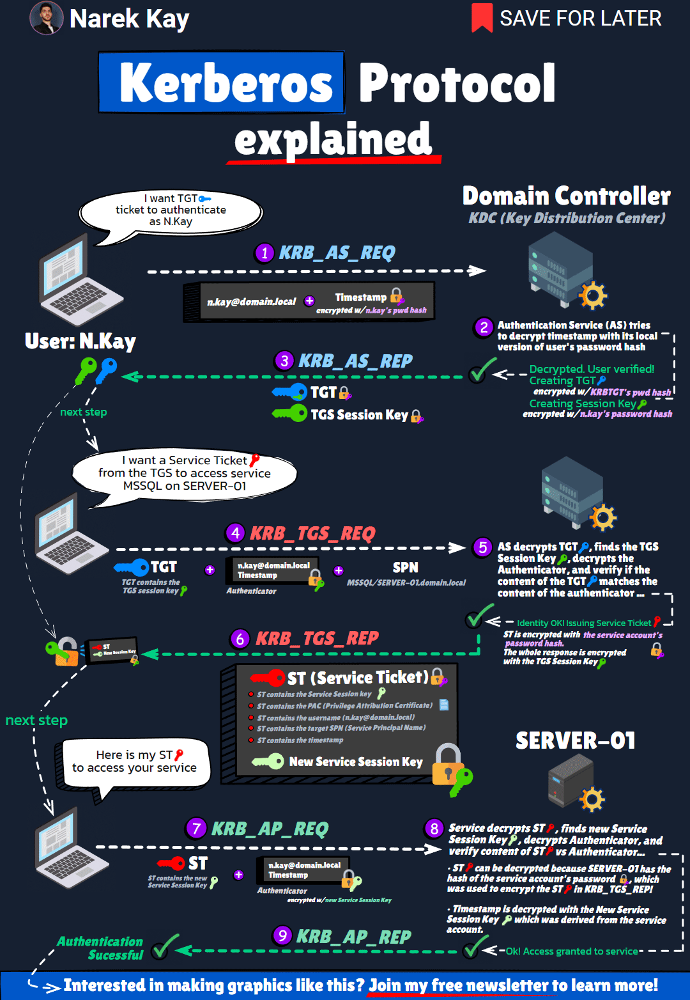
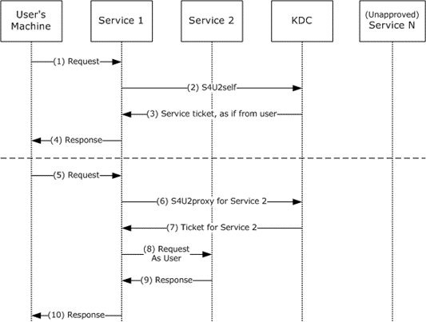

## Documentation

### LDAP

- https://www-sop.inria.fr/members/Laurent.Mirtain/ldap-livre.html

### Windows (authentication & best practices)

- https://github.com/LoicVeirman/Hello-My-Dir
- https://learn.microsoft.com/en-us/windows/win32/secauthn/lsa-authentication
- https://learn.microsoft.com/en-us/windows-server/identity/laps/laps-overview
- https://learn.microsoft.com/en-us/windows-server/identity/ad-ds/manage/group-managed-service-accounts/group-managed-service-accounts/group-managed-service-accounts-overview
- https://cyber.gouv.fr/publications/recommandations-pour-ladministration-securisee-des-si-reposant-sur-ad
- https://cyber.gouv.fr/publications/securiser-la-journalisation-dans-un-environnement-microsoft-active-directory

### AD

- https://zer1t0.gitlab.io/posts/attacking_ad/
- https://techcommunity.microsoft.com/blog/askds/ntlm-vs-kerberos/4120658
- https://m0chan.github.io/2019/07/30/Windows-Notes-and-Cheatsheet.html
- https://attl4s.github.io/assets/pdf/You_do_(not)_Understand_Kerberos.pdf
- https://hideandsec.sh/books/cheatsheets-82c/page/active-directory-certificate-services

### Cheatsheets

- https://www.thehacker.recipes/
- https://jlajara.gitlab.io/Potatoes_Windows_Privesc
- https://hashcat.net/wiki/doku.php?id=example_hashes
- https://github.com/frostbits-security/MITM-cheatsheet
- https://github.com/S1ckB0y1337/Active-Directory-Exploitation-Cheat-Sheet
- https://orange-cyberdefense.github.io/ocd-mindmaps/img/pentest_ad_dark_2023_02.svg

## Challenges

- https://flu.xxx/challenges/22
- https://tryhackme.com/room/winadbasics

### Setup LAB AD

- `commencement_tp.docx`
- https://docs.contactit.fr/windows_server_ldap/active_directory/installation-active-directory/
- https://docs.contactit.fr/windows_server_ldap/active_directory/active-directory-tp-uo-ou-gg-gl-partages-et-droits-utilisateurs/
- https://github.com/WazeHell/vulnerable-AD
- https://github.com/Orange-Cyberdefense/GOAD


## Outils

- https://wadcoms.github.io/
- https://www.loldrivers.io/
- https://lolbas-project.github.io/
- (https://github.com/fortra/impacket/
- https://github.com/Pennyw0rth/NetExec
- https://github.com/SpiderLabs/Responder
- https://academy.hackthebox.com/course/preview/active-directory-bloodhound
- https://book.hacktricks.wiki/en/windows-hardening/lateral-movement/wmiexec.html

## NTLM (depreciated)

- https://beta.hackndo.com/pass-the-hash/#protocole-ntlm
- https://www.801labs.org/research-portal/post/cracking-an-ntlmv2-hash/
- https://www.vaadata.com/blog/fr/authentification-ntlm-principes-fonctionnement-et-attaques-ntlm-relay/
- https://www.thehacker.recipes/ad/movement/credentials/dumping/sam-and-lsa-secrets


### Internals

- 2 versions (v1 & v2)
- Implemented in `Msv1_0.dll`
- Using **Netlogon** process between 2 machines without AD
- `SAM`: client DB , `NTDS.DIT`: AD DB



### Responder capture

- https://crack.sh/netntlm/

`Le client s’authentifie avec empreinte MD4 de son mot de passe (hash NT) pour chiffrer le challenge (NTLM)`

#### Net-NTLMv1

```txt
C = 8-byte server challenge, random
K1 | K2 | K3 = NTLM-Hash | 5-bytes-0
response = DES(K1,C) | DES(K2,C) | DES(K3,C)
```

#### Net-NTLMv2

```txt
SC = 8-byte server challenge, random
CC = 8-byte client challenge, random
CC* = (X, time, CC2, domain name)
v2-Hash = HMAC-MD5(NT-Hash, user name, domain name)
LMv2 = HMAC-MD5(v2-Hash, SC, CC)
NTv2 = HMAC-MD5(v2-Hash, SC, CC*)
response = LMv2 | CC | NTv2 | CC*
```

## Kerberos

- https://en.wikipedia.org/wiki/Single_sign-on

### Internals

- Implemented in `Kerberos.dll`, part of **Lsass**
- `SAM`: client DB , `NTDS.DIT`: AD DB



### Encryption Types

- https://web.mit.edu/kerberos/krb5-latest/doc/admin/enctypes.html

```
- 0x18 (aes256-cts-hmac-sha1-96)
- 0x17 (aes128-cts-hmac-sha1-96)
- 0x23 (rc4-hmac)
- 0x24 (rc4-hmac-exp)
- 0x3 (des-cbc-md5)
```

### (Pre) Authentication

- https://beta.hackndo.com/kerberos/
- https://www.chudamax.com/posts/kerberos-102-overview/
- https://vbscrub.com/2020/02/27/getting-passwords-from-kerberos-pre-authentication-packets/
- https://learn.microsoft.com/en-us/entra/identity/hybrid/connect/plan-connect-userprincipalname#upn-format


*Calcul du hash kerb5 pre-auth*

```txt
Krb5pa meaning kerberos 5 pre-auth, and 18 meaning kerberos encryption type 18 (AES-256) as discussed above.
It encrypts the current time and sends it to the server (as part of the initial kerberos AS-REQ packet) but it encrypts it using the user’s password as the encryption key.
```

- https://stackoverflow.com/questions/12260587/kerberos-fails-when-accessing-site-by-ip-address

```
/etc/hosts
ip DOMAIN
ip DC
```

### Memo : auth + ticket granting



### AsRepRoast

**User sans PreAuth**

- https://beta.hackndo.com/kerberos-asrep-roasting/
- https://www.login-securite.com/2022/11/03/analyse-et-poc-de-la-cve-2022-33679/
- ([UAC values](https://jackstromberg.com/2013/01/useraccountcontrol-attributeflag-values/))
- [GetNPUsers.py](https://github.com/fortra/impacket/blob/master/examples/GetNPUsers.py)

*Hash krb5asrep*

```
On parle d’utilisateur AS_REP Roastable lorsque la pré-authentification Kerberos n’est pas requise pour cette utilisateur. Nous pouvons alors demander un TGT (Ticket Granting Ticket) au KDC (Key Distribution Center) à son nom et cracker une partie de la réponse KRB_AS_REP, qui contient le TGT et une clé de session chiffrée avec son hash NT.
Un attaquant peut tenter de retrouver le password de ce compte de domaine via du bruteforce en offline.
```

### Kerberoast

**SPN non vide**

- https://beta.hackndo.com/kerberoasting/
- [GetUserSPNs.py](https://github.com/fortra/impacket/blob/master/examples/GetUserSPNs.py)

*Hash krb5tgs*

```
Un utilisateur authentifié sur un domaine AD peut demander un TGT (Ticket Granting Ticket) au KDC, (Key Distribution Center) via une requête KRB_AS_REQ, le KDC lui enverra alors un TGT au nom de l’utilisateur demandeur et une clé de session chiffré avec le hash NT de l’utilisateur, via une réponse KRB_AS_REP.
Ensuite, l’utilisateur peut faire une demande de ST (Service Ticket) au TGS (Ticket Granting Service) en fournissant son TGT et un SPN (Service Principal Name) valide, via une requête KRB_TGS_REQ, le KDC lui enverra alors un ST pour le service demandé via une réponse KRB_TGS_REP.

Ce ST est chiffré avec le hash NT du compte de service demandé. On dit alors que ce compte est Kerberoastable. Un attaquant peut tenter de retrouver le password du compte de service via du bruteforce en offline.
```

### GPO abuse

- [Preferences Policy Key microsoft](https://learn.microsoft.com/en-us/openspecs/windows_protocols/ms-gppref/2c15cbf0-f086-4c74-8b70-1f2fa45dd4be?redirectedfrom=MSDN)
- https://www.it-connect.fr/chapitres/gpp-group-policy-preferences/
- https://www.it-connect.fr/mot-de-passe-dans-une-gpo-mauvaise-idee/
- https://hideandsec.sh/books/red-teaming/page/domain-control-elevation#0x02%20GPP%20and%20SYSVOL
- [GetGPPPasswords.py](https://github.com/fortra/impacket/blob/master/examples/Get-GPPPassword.py)

### SAM AccountName

- https://learn.microsoft.com/fr-fr/windows/win32/adschema/a-samaccountname
- [S4User2Self](https://learn.microsoft.com/en-us/openspecs/windows_protocols/ms-sfu/02636893-7a1f-4357-af9a-b672e3e3de13)
- [S4User2Proxy](https://learn.microsoft.com/en-us/openspecs/windows_protocols/ms-sfu/bde93b0e-f3c9-4ddf-9f44-e1453be7af5a)



### Silver/Golden Ticket

- https://beta.hackndo.com/kerberos-silver-golden-tickets/#pac
- https://learn.microsoft.com/en-us/answers/questions/87978/reset-krbtgt-password
- https://github.com/fortra/impacket/issues/1457

### Memo

[Box Active (HTB)](https://0xdf.gitlab.io/2018/12/08/htb-active.html)

Synchroniser l'horloge:

`sudo ntpdate <ip>`

**Crackmapexec** :

- check GPPPassword ([share spidering](https://www.infosecmatter.com/crackmapexec-module-library/?cmem=smb-spider_plus): spider_plus): `cme smb <Domain> -u <user> -p <pass> -M gpp_password`
- check SamAccountName: `crackmapexec smb <ip> -M nopac` & `crackmapexec ldap -d <Domain> -u <user> -p <pass> -M Maq` (max machines à créer)
- Pass The Hash: `crackmapexec <ip> -u Administrator -H <lmhash:nthash> -x 'whoami'`


**WinRm shell**

`Domain.local/Administrator@127.0.0.1`

`psexec.py <Domain>/<user>:<pass>@<DC.local>`               # noisy, prefer wmiexec
`wmiexec.py <Domain>/<user>@<DC.local> -hashes ':<nthash>'`

```bash
#win-rm protocol
evil-winrm -i <ip> -u <account> -p <password>

#pass the hash
evil-winrm -i <ip> -u <account> -H <hash>
```

**FreeRDP2**

(TryHackMe AD Basics)

```bash
xfreerdp /v:10.10.222.63 /u:THM\Mark /p:M4rk3t1ng.21
```


```bash
#remote desktop protocol
xfreerdp /v:<ip> /u:<account> /p:<password>

#pass the hash
xfreerdp /v:<ip> /u:<account> /pth:<hash>
```

