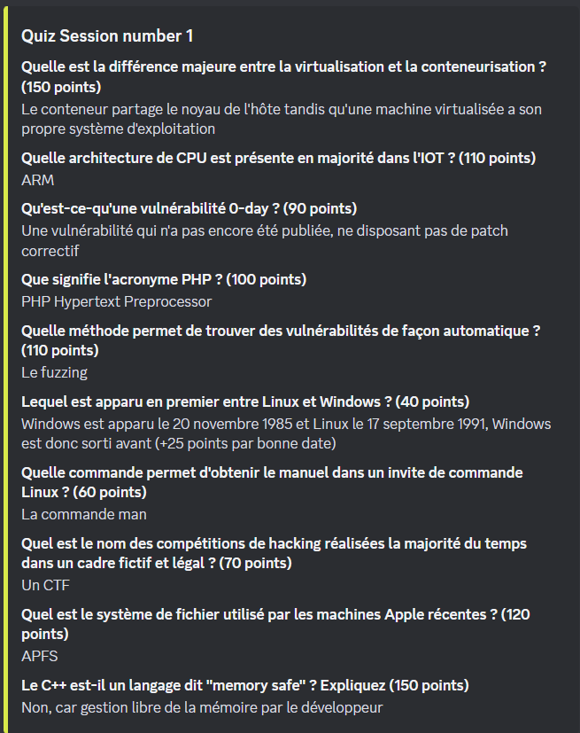
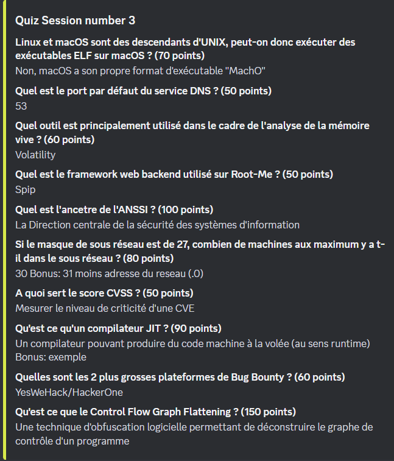
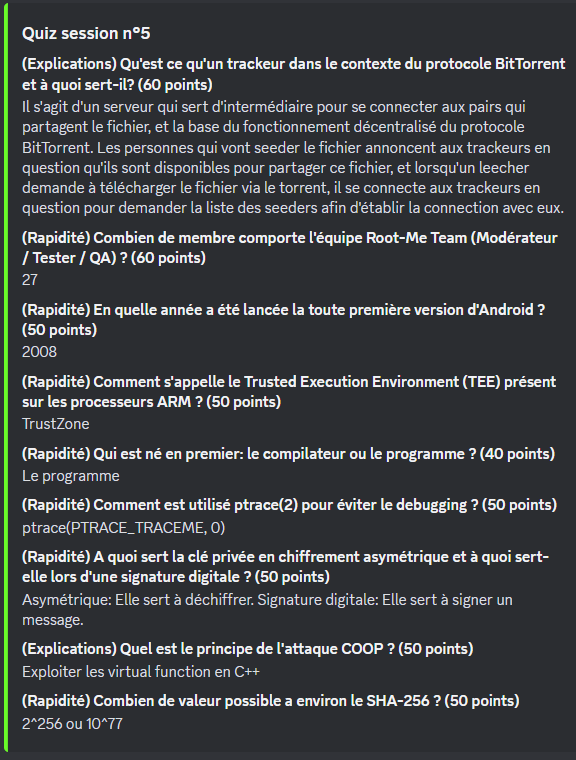

## Certifications

- https://pauljerimy.com/security-certification-roadmap/

### BSCP

- https://nishacid.guru/fr/articles/bscp/

### EJPT

- https://github.com/danielwalo/eJPT
- https://github.com/leandreonizuka/eJPTv2_reviewFR

### OSCP

- https://narekkay.fr/posts/oscp-retex-narekkay/

### OSEP

- https://exploit-me.com/blog/osep-cheat-sheet/

### Splunk

- https://github.com/Ahmed-AL-Maghraby/SIEM-Cheat-Sheet/tree/main/Splunk-Cheat-Sheet

## Entretien

- https://github.com/bregman-arie/devops-exercises/blob/master/topics/security/README.md

- `Quiz`

