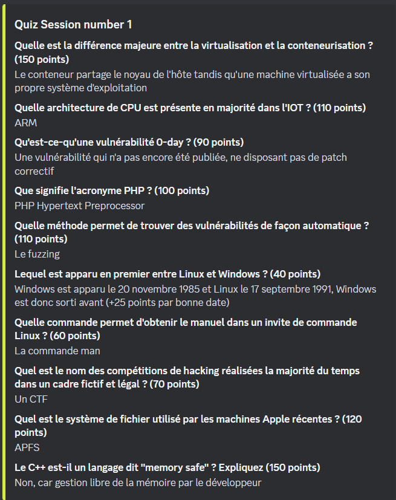
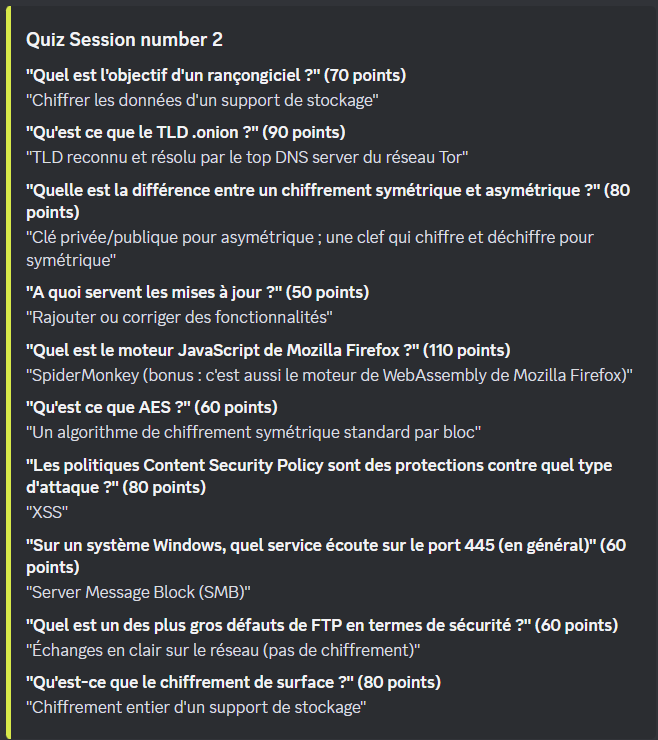
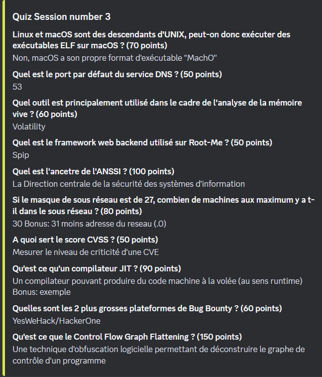
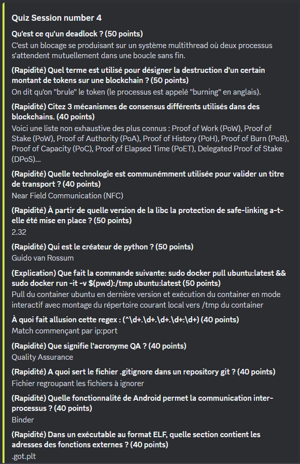
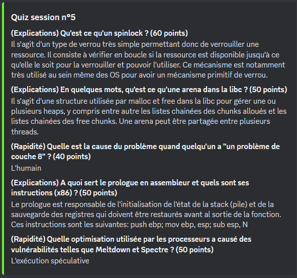
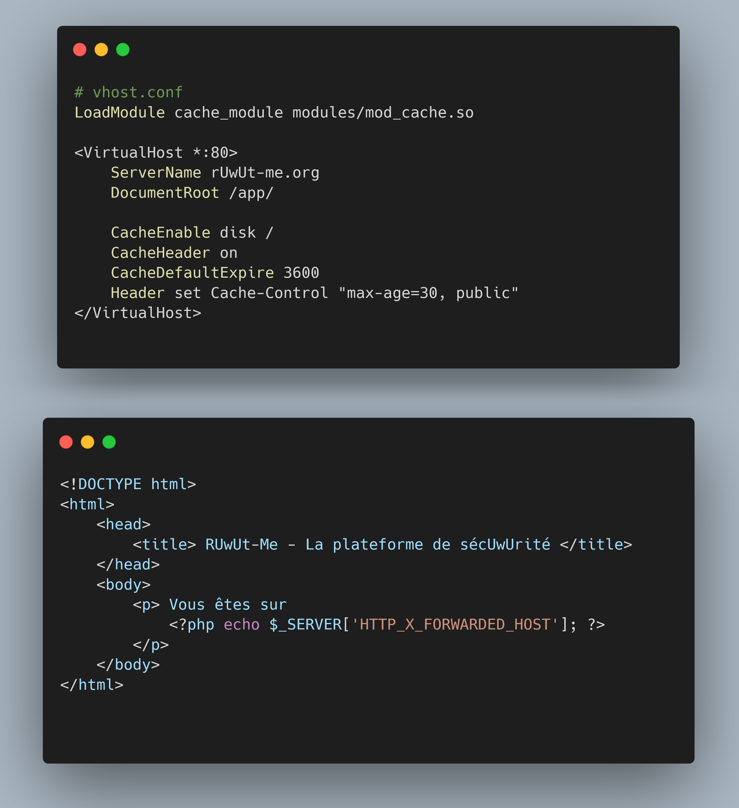
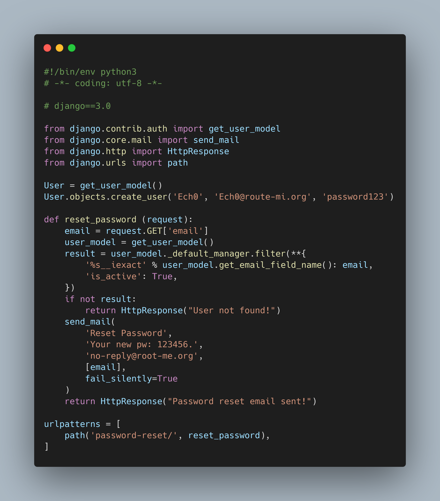
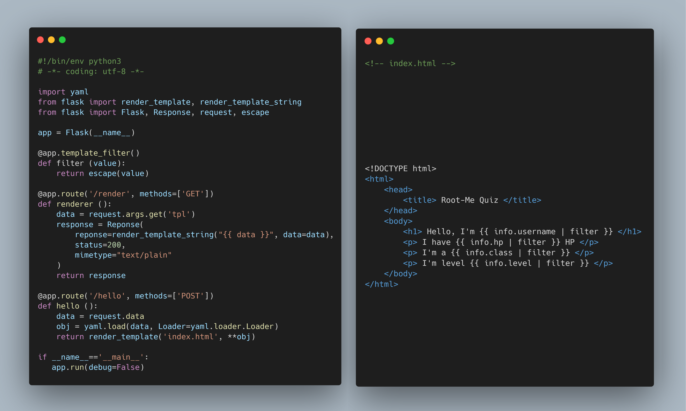
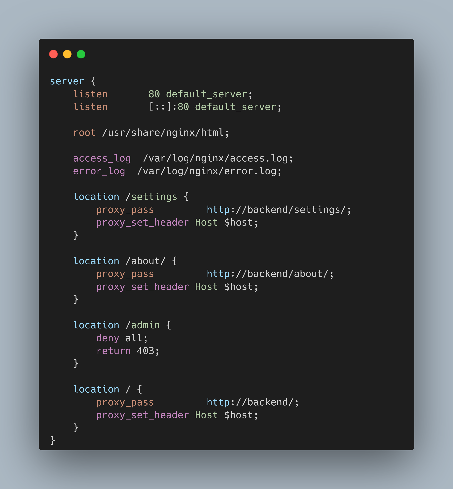

## Quiz RM

## Bonus

**(Rapidité) Quelle est le nom de la faille de cette configuration ?**

Solve: Web Cache Poisonning

**(Explication) Comment peut-on pirater l'utilisateur Ech0 sur root-me.org selon cette configuration ?**

Solves:

- 1. Rachat d'un route-mi.org en punycode et demande à envoyer le password reset sur ce domaine
- 2. Enregistrer un e-mail sur route-mi.org avec une lettre de "Ech0" en unicode qui pourrait tromper Django

-- Le parsing de l'email est mal fait sur cette version de django: il transforme l'unicode en utf-8/ascii/jsp. Mais il envoie le mail à l'e-mail non traitée, ça reste l'unicode dans le mail

**(Explication) Quelle est la faille présente dans ce code ? Décrivez les impacts**

Solve: Python YAML Deserialization, possibilité de RCE

**(Explication) Donnez le nom de la faille présente dans cette configuration ainsi que le payload pour accéder à /admin**

Solve: Secondary Context Attack, payload: `http://domain/settings../admin/`
