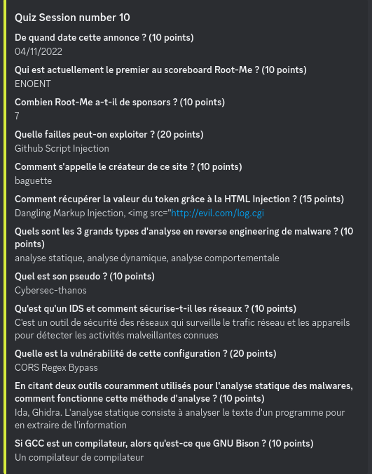

## Quiz RM

**Bonus: code des questions 8,9 et 12**

*HTTP Request Smuggling  TE:CL*

*Git - code*

*Split - code*

**Bonus: code des questions 6 et 8**

*Command Injection*

*Plus petit ELF x64*

**Bonus: code des questions 2 et 9**

*HTTP Parameter Pollution*

*File Upload Null Byte*

**Bonus: code des questions 7 et 12**

*Fuzz: énumération des dossiers à 1 niveau*

*Assembleur: Intel Z80*

**Bonus: code des questions 2,4 et 9**

*Rust*

*CSV injection*

*Erase disk - null bytes*

**Bonus: code des questions 4,6 et 10**

*Github Script Injection*

*Dangling Markup*

*CORS Regex Bypass (`.` au lieu de `\.`*

Possibilité de bypass les `.` avec un DNS comme: `flags2root-mi.org`
