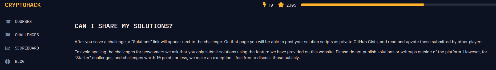

## Doc

### Maths

- https://cpge-paradise.com/sites.php

### Crypto

- https://www.youtube.com/@meichlseder

- https://www.nassiben.com/video-based-crypta

- https://cryptobook.nakov.com/

### Hashs

- https://security.stackexchange.com/questions/211/how-to-securely-hash-passwords

- https://stackoverflow.com/questions/401656/secure-hash-and-salt-for-php-passwords

- https://github.com/someshkar/colabcat

### Cle publique

- https://fr.wikipedia.org/wiki/Cryptographie_asym%C3%A9trique

- [RSA](https://crypto.stanford.edu/~dabo/pubs/papers/RSA-survey.pdf), 
 https://vozec.fr/crypto-rsa/ , [Side Channel RSA - RSA CRT cf FCSC](https://www.cosade.org/cosade19/cosade14/presentations/session2_b.pdf)

- [DSA,ElGamal, RSA-CRT - Zenk](https://repo.zenk-security.com/Cryptographie%20.%20Algorithmes%20.%20Steganographie/Cle%20Publique.pdf)

- [ROCA](https://ctftime.org/writeup/8805)

- [Shamir Secret Sharing](https://max.levch.in/post/724289457144070144/shamir-secret-sharing)

- [Crypto.PublicKey: import_key](https://pycryptodome.readthedocs.io/en/latest/src/public_key/public_key.html)

### Cle secrete - Blocs

- https://fr.wikipedia.org/wiki/Cryptographie_sym%C3%A9trique

- https://fr.wikipedia.org/wiki/Chiffrement_par_bloc

- [AES](https://braincoke.fr/blog/2020/08/the-aes-encryption-algorithm-explained/#encryption-algorithm-overview), https>
        - https://stackoverflow.com/questions/1220751/how-to-choose-an-aes-encryption-mode-cbc-ecb-ctr-ocb-cfb

- [Block cipher modes of operation](https://en.wikipedia.org/wiki/Block_cipher_mode_of_operation)
	
	- https://en.wikipedia.org/wiki/Padding_oracle_attack

	- https://security.stackexchange.com/questions/271007/aes-ecb-cookie-bypass

        - https://crypto.stackexchange.com/questions/66085/bit-flipping-attack-on-cbc-mode

        - https://research.nccgroup.com/2021/02/17/cryptopals-exploiting-cbc-padding-oracles/

	- https://pypi.org/project/padding-oracle/

```python
#ECB Padding
def oracle(input):
	bloc = input.encode().hex(); print(bloc)
	r = requests.get(url+bloc).json()
 	r2 = split_string(r["ciphertext"]); print(r2);return r2

known = ""
while "}" not in known:
	target = oracle("A"*(63-len(known)))[3]
	for s in string.printable:
		brute = oracle( ("A"*(63-len(known))+known+s))
		if brute[3] == target: ##AAAAAAAAAcrypto|{ == AAAAAAAAAcrypto{ p3n6u1 ?
			known +=s; print("[+]Flag = ",known)
			break
```

```python
#CBC - Bit Flipping
def split_string(input):
	return [input[i:i+16] for i in range(0, len(input), 16)]

def stringxor(a, b):
	return bytes(x ^ y for x, y in zip(a, b))

def flip(bloc,true,false):
	mask = stringxor(true.encode(), false.encode()); print("Mask: ",mask)
	assert(stringxor(true.encode(), mask) == false.encode())
	mask += bytes([0] * (16 - len(mask)))
	bloc_faked = stringxor(bloc, mask) #fake previous bloc -> CBC(Bi + Pi)  = Bi+1 
	return bloc_faked
```

### Cle secrete - Flux

- https://fr.wikipedia.org/wiki/Chiffrement_de_flux

- https://fr.wikipedia.org/wiki/RC4

- https://thehackernews.com/2015/07/crack-rc4-encryption.html

- https://crypto.stackexchange.com/questions/83629/forgery-attack-on-poly1305-when-the-key-and-nonce-reused


### PRNG

```c
rand()
```

- si **initialisée**: -> voir `break_rand.c`: réinitialiser avec la même seed donne la même suite de nombres

- sinon: **seed=1**

### OTP

- https://github.com/derbenoo/otp_pwn

### Hash length extension

- https://github.com/stephenbradshaw/hlextend
- https://tipi-hack.github.io/2018/04/01/quals-NDH-18-Wawacoin.html

### Lattices et ECC

- https://vozec.fr/crypto-lattice/lattice-introduction/

- [Elliptic Curves](https://people.cs.nctu.edu.tw/~rjchen/ECC2012S/Elliptic%20Curves%20Number%20Theory%20And%20Cryptography%202n.pdf)

## Cheatsheet

- https://github.com/zademn/EverythingCrypto
- https://github.com/jvdsn/crypto-attacks

## Outils

- [cupp (interactive wordlist)](https://github.com/Mebus/cupp)
- [z3](https://theory.stanford.edu/~nikolaj/programmingz3.html)
- [OpenSSL cheatsheet](https://www.freecodecamp.org/news/openssl-command-cheatsheet-b441be1e8c4a/)

https://www.login-securite.com/2021/10/29/sthackwriteup-forensic-docker-layer/
```bash
# AES-CBC
openssl aes-256-cbc -d -iter 10 -pass pass:$(cat /pass.txt) -in flag.enc -out flag.dec
```

```
bash
# Base64 & digest - JWT
echo <b64(header).b64(payload)> | openssl dgst -sha256 -mac HMAC -macopt:hexkey:$(cat key.pem | xxd -p | tr -d "\\n")
python -c 'import hmac, hashlib, base64; print(base64.urlsafe_b64encode(hmac.new(<key>, <token>, hashlib.sha256).digest()).replace("=", ""))'
```

- [Hashes.com](https://hashes.com)
- [Dcode](https://www.dcode.fr/)
- [Cyberchef](https://gchq.github.io/CyberChef/) : Divers encodages/hashs et autres
- [Alpertron](https://www.alpertron.com.ar/ECM.HTM) : RSA (en + de `factordb` et `simpy`)

- https://github.com/tna0y/Python-random-module-cracker

- [Gmpy2](https://gmpy2.readthedocs.io/en/latest/overview.html)
- [Pycryptodome](https://pycryptodome.readthedocs.io/en/latest/src/api.html)
- [Sage (ECC)](https://doc.sagemath.org/html/en/reference/arithmetic_curves/sage/schemes/elliptic_curves/constructor.html)
- [Sympy (docs)](https://docs.sympy.org/latest/modules/polys/reference.html)

## Cours: Cryptohack Starters



Voir:

- `./elliptic_curves`

