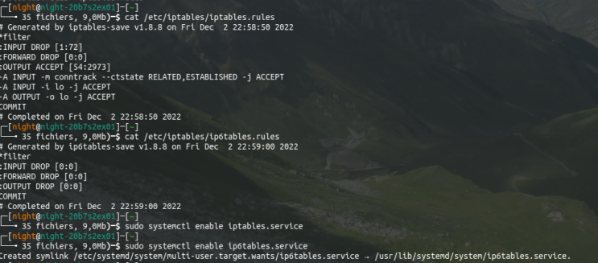

## Doc

- https://wiki.bi0s.in/
- https://primer.picoctf.org/
- https://ctf-wiki.mahaloz.re/ 
- https://blog.reinom.com/securitymethods/


## Challenges

- https://ctftime.org/
- https://www.wechall.net/linked_sites


## Tools / Tips

- https://github.com/zardus/ctf-tools

### Work alone in /tmp

```bash
cd $(mktemp -d)
```

### Scrap challenges 

- https://github.com/p0dalirius/ctfd-parser

### Share files (private network)

```python
ip -br a ; mkdir secret && cd secret ; python3 -m http.server 8000
```

### Firewall

```bash
#!/bin/bash

# Set default chain policies
iptables -P INPUT ACCEPT
iptables -P FORWARD ACCEPT
iptables -P OUTPUT ACCEPT
iptables -F

# Allow established sessions to receive traffic
iptables -A INPUT -m conntrack --ctstate ESTABLISHED,RELATED -j ACCEPT

# Set default chain policies
iptables -P INPUT DROP
iptables -P FORWARD DROP
iptables -P OUTPUT ACCEPT

# Accept on localhost
iptables -A INPUT -i lo -j ACCEPT
iptables -A OUTPUT -o lo -j ACCEPT
```

```bash
sudo iptables-save -f /etc/iptables/iptables.rules #sudo ip6tables-save -f /etc/iptables/ip6tables.rules
sudo iptables-restore -f /etc/iptables/iptables.rules  #sudo ip6tables-restore -f /etc/iptables/ip6tables.rules
```


