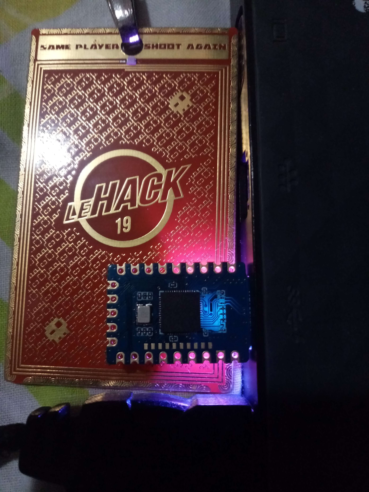

## Doc

- http://virtualabs.fr/
- https://connectorbook.com/identification.html
- https://www.lions-wing.net/lessons/hardware/hard.html
- https://github.com/m3y54m/Embedded-Engineering-Roadmap/
- https://swisskyrepo.github.io/HardwareAllTheThings/
- https://voidstarsec.com/hw-hacking-lab/vss-lab-guide
- https://cyber.gouv.fr/publications/exigences-de-securite-materielles

### Low cost - Purchases

- https://atvido.com/
- https://kubii.com/        # Arduino, Raspberry Pi, Micro::Bit, Nvidia GPUs + accessories
- https://freenove.com/about# Kits compatible with Arduino IDE, Raspberry Pi, micro:bit, ESP32, ESP8266, etc
- https://servethehome.com/ # Servers, storage, networking gear
- https://deals.bleepingcomputer.com/ # US
- https://www.tomsguide.fr/meilleur-forfait-mobile-notre-comparatif/
- https://blog.quentinra.dev/tools-and-frameworks/random/unsorted/purchases.md

### Articles

- [Half adder](https://stackoverflow.com/questions/55193135/what-is-a-b-and-a-b-1/55193672)
- http://taz.newffr.com/TAZ/Miscellanous/Cours_Electronique_Base.pdf
- http://files.righto.com/calculator/sinclair_scientific_simulator.html
- https://elrindel.github.io/
- https://www.reddit.com/r/beneater/

## Challenges

- https://www.nand2tetris.org/
- https://hackropole.fr/en/hardware/
- https://github.com/iamABH/awesome-hardware-ctf

## Computer

### Bios

- https://davidzou.com/articles/bios-password-bypass
- https://fr.wikihow.com/casser-le-mot-de-passe-d'un-BIOS

### Micro Controllers

- https://github.com/apoirrier/CTFs-writeups/?tab=readme-ov-file#micro-controllers-and-circuits

### PCI - Dump Direct Memory Access

- https://github.com/ufrisk/pcileech

### Rfid

- https://resources.bishopfox.com/resources/tools/rfid-hacking/attack-tools/
- https://www.latelierdugeek.fr/2017/07/12/rfid-le-clone-parfait/

### Uart

- https://youtu.be/01mw0oTHwxg
- https://www.circuitbasics.com/basics-uart-communication/
- https://en.wikipedia.org/wiki/Universal_asynchronous_receiver-transmitter
- https://github.com/apoirrier/CTFs-writeups/blob/master/BrigitteFriang/ASCII_UART.md
- https://faire-ca-soi-meme.fr/domotique/2021/03/22/hack-detournement-de-la-passerelle-lidl-silvercrest
- https://medium.com/csg-govtech/hardware-implant-attacks-part-1-console-access-attacks-on-vulnerable-iot-devices-104662f472dc

### Usb

- https://www.sstic.org/2022/presentation/sasusb_presentation_dun_protocole_sanitaire_pour_lusb/

### Side-Channel

- [An-introduction-to-fault-injection-part-1-3](https://web.archive.org/web/20230804042320/https://research.nccgroup.com/2021/07/07/an-introduction-to-fault-injection-part-1-3/)
- https://chipwhisperer.readthedocs.io/
- https://coastalwhite.github.io/intro-power-analysis/intro.html
- https://crypto.stackexchange.com/questions/42571/why-are-side-channel-attacks-such-as-spa-dpa-cpa-based-on-the-aes-subbytes-rout

## Tools

### Raspberry

- https://kubii.com/
- https://www.framboise314.fr/articles/
- https://www.waveshare.com/wiki/RP2040-One
- https://www.electronique-mag.com/article20308.html    # Pico EDAC connectors
- https://github.com/thibmaek/awesome-raspberry-pi#readme
- https://www.waveshare.com/w/upload/3/30/Getting_started_with_pico.pdf
- https://fabacademy.org/2023/labs/riidl/students/jesal-mehta/weekly/week4D/

- **boot** : accès à rpi-rp2 en tant que usb
- **reset** : lancer le programme uf2 (blink, circuitpython)

#### Pico Ducky

- https://github.com/dbisu/pico-ducky
- https://x.com/androidmalware2/status/1676884184424431616/
- https://github.com/hak5/usbrubberducky-payloads/tree/master/payloads/extensions
- https://null-byte.wonderhowto.com/how-to/make-your-own-bad-usb-0165419/

#### Router OpenWRT

- https://blog.cybiere.fr/post/implant-reseau-redteam-openwrt/

### Flipper Zero

- https://github.com/bigbrodude6119/flipper-zero-evil-portal?tab=readme-ov-file

