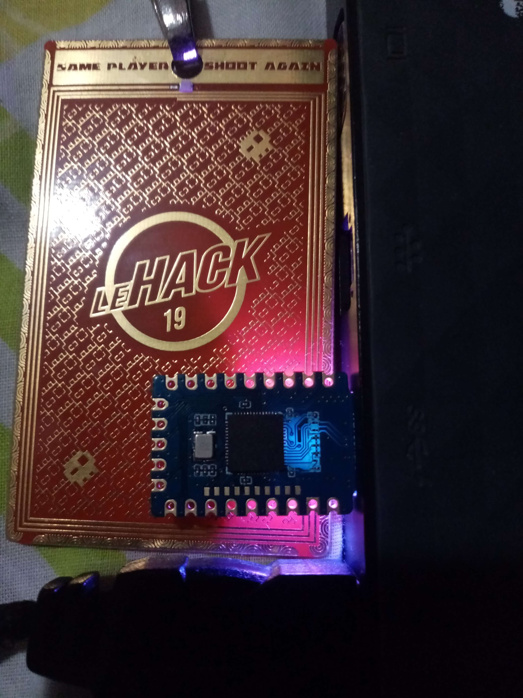

## Outils

### Dump Direct Memory Access - Bus PCI

- https://github.com/ufrisk/pcileech

## Doc

- https://www.waveshare.com/wiki/RP2040-One
- https://github.com/dbisu/pico-ducky
- https://www.waveshare.com/w/upload/3/30/Getting_started_with_pico.pdf
- https://fabacademy.org/2023/labs/riidl/students/jesal-mehta/weekly/week4D/

### Arch / Composants

- https://freenove.com/tutorial.html
- http://www.electronique-mag.com/article20308.html

### Circuitpython

- https://docs.circuitpython.org/en/latest/README.html
- https://circuitpython.org/downloads

