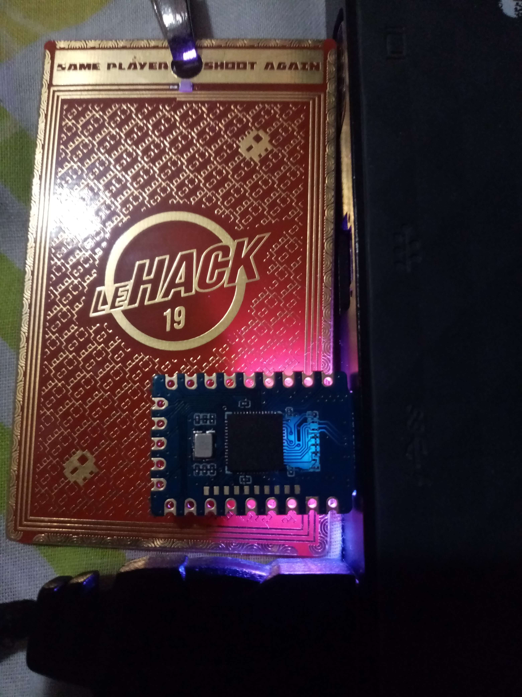

## Doc

- http://virtualabs.fr/
- https://mobilespecs.net/hardware/
- https://wiki.osdev.org/Category:Hardware
- https://connectorbook.com/identification.html
- https://voidstarsec.com/hw-hacking-lab/vss-lab-guide
- https://github.com/biero-el-corridor/OT_ICS_ressource_list
- https://cyber.gouv.fr/publications/exigences-de-securite-materielles

### Courses / Resources

- [Cours electronique - CNAM](https://web.archive.org/web/20181030211958/https://taz.newffr.com/TAZ/Miscellanous/Cours_Electronique_Base.pdf)
- https://www.lions-wing.net/lessons/hardware/hard.html
- https://fr.wikibooks.org/wiki/Fonctionnement_d%27un_ordinateur
- https://github.com/m3y54m/Embedded-Engineering-Roadmap/
- https://swisskyrepo.github.io/HardwareAllTheThings/
- https://github.com/V33RU/awesome-connected-things-sec
- https://github.com/IamAlch3mist/Awesome-Embedded-Systems-Vulnerability-Research


### Purchases

- https://geizhals.de/
- https://www.ebay.de/
    - https://www.ebay.co.uk/str/dideko089
    - https://www.ebay.co.uk/usr/tubbyoldmole
    - https://www.ebay.fr/str/bargainhardwarestore
    - https://www.ebay.com/str/pcsistem
    - https://www.ebay.de/str/compicool
    - https://www.ebay.de/str/piospartslap
    - https://www.ebay.co.uk/str/ecopc
    - https://www.ebay.de/str/interbolteustore
- https://www.humblebundle.com/ # books & games


#### Refurbished (Consumer grade)

- https://www.ecodair.com/
- https://www.afbshop.fr/
- https://www.dealabs.com/
- https://www.backmarket.com/
- https://www.leboncoin.fr/c/ordinateurs

#### Stores Outside EU

- https://atvido.com/ # UK & German Address
- https://deals.bleepingcomputer.com/ # US

#### Microcontrollers & Cards

- https://kiisu.io/         # Flipper 0 alternative
- https://kubii.com/        # Arduino, Raspberry Pi, Micro::Bit, Nvidia GPUs + accessories
- https://freenove.com/about# Kits compatible with Arduino IDE, Raspberry Pi, micro:bit, ESP32, ESP8266, etc

#### Network & storage (Enterprise grade, Refurbished)

- https://diskprices.com/
- https://servermall.com/
- https://www.server-parts.eu/
- https://www.interbolt.eu/en/
- https://www.serverschmiede.com/
- https://www.servershop24.de/en/
- https://www.secondhandserver.eu/
- https://www.furbify.hu/szerverek
- https://integrity.hu/hardver/hasznalt-szerverek/
- https://geizhals.de/?cat=hde7s&xf=1080_SATA+1.5Gb%2Fs~1080_SATA+3Gb%2Fs~1080_SATA+6Gb%2Fs~3772_3.5&pagesize=30&sort=r&promode=false
- https://www.bargainhardware.co.uk/components/enterprise-hdds-sdds-storage

```bash
# Benchmark SSD (~400MB/s USB3.0 ; 10x faster then USB2.0)
fio --name=read --directory=/mnt --rw=read --size=2G --bs=1M --direct=1 --ioengine=libaio

# Troubleshoot
findmnt -R /mnt/SSD
sudo fuser -vm /mnt/SSD/
```

#### PC

- https://system76.com/laptops
- https://frame.work/fr/en/marketplace
- https://www.tuxedocomputers.com/
- https://novacustom.com/cat/privacy-friendly-laptops/

#### Phones

- https://volla.online/
- https://pine64eu.com/
- https://www.fairphone.com/
- https://shop.nitrokey.com/shop
- https://puri.sm/products/librem-5/ # avoid
- https://murena.com/products/smartphones/
- https://www.tomsguide.fr/meilleur-forfait-mobile-notre-comparatif/


### Articles

- http://files.righto.com/calculator/sinclair_scientific_simulator.html
- https://elrindel.github.io/
- https://www.reddit.com/r/beneater/


## Challenges

- https://www.nand2tetris.org/
- https://hackropole.fr/en/hardware/
- https://github.com/iamABH/awesome-hardware-ctf


## Router

- https://blog.cybiere.fr/post/implant-reseau-redteam-openwrt/
- https://lafibre.info/remplacer-livebox/remplacement-de-la-livebox-par-un-routeur-openwrt-18-dhcp-v4v6-tv/
- https://www.gl-inet.com/en-de/collections/all-products?filter.p.m.custom.product_categories=Home+Routers&grid_list=grid-view

## Computer

### EEPROM

- https://davidzou.com/articles/bios-password-bypass
- https://blog.quarkslab.com/eeprom-when-tearing-off-becomes-a-security-issue.html

### Micro Controllers

- https://www.saleae.com/downloads
- https://github.com/logisim-evolution/logisim-evolution
- https://rdomanski.github.io/Reverse-engineering-of-ARM-Microcontrollers/
- https://fr.wikihow.com/casser-le-mot-de-passe-d'un-BIOS#Retirer-la-batterie-CMOS
- https://github.com/apoirrier/CTFs-writeups/?tab=readme-ov-file#micro-controllers-and-circuits

#### SIM

- https://github.com/mitshell/card
- https://srlabs.de/blog/new-sim-attacks


### Buses (attacks, firmware extraction)

- https://www.synacktiv.com/en/publications/i-hack-u-boot

#### PCI

- https://en.wikipedia.org/wiki/Peripheral_Component_Interconnect
- https://github.com/ufrisk/pcileech # Dump DMA

#### SPI

- https://www.circuitbasics.com/basics-of-the-spi-communication-protocol/
- https://en.wikipedia.org/wiki/Serial_Peripheral_Interface
- https://en.wikipedia.org/wiki/Low_Pin_Count
- https://blog.quarkslab.com/flash-dumping-part-i.html
- https://pulsesecurity.co.nz/articles/TPM-sniffing

#### UART

- https://youtu.be/01mw0oTHwxg
- https://www.circuitbasics.com/basics-uart-communication/
- https://en.wikipedia.org/wiki/Universal_asynchronous_receiver-transmitter
- https://github.com/apoirrier/CTFs-writeups/blob/master/BrigitteFriang/ASCII_UART.md
- https://faire-ca-soi-meme.fr/domotique/2021/03/22/hack-detournement-de-la-passerelle-lidl-silvercrest
- https://medium.com/csg-govtech/hardware-implant-attacks-part-1-console-access-attacks-on-vulnerable-iot-devices-104662f472dc

#### USB

- https://ventoy.net/
- https://en.wikipedia.org/wiki/USB#2.0HS
- https://en.wikipedia.org/wiki/USB_3.0#3.1
- https://github.com/jamesjara/USB-traffic-protocol-decoder
- https://www.sstic.org/2022/presentation/sasusb_presentation_dun_protocole_sanitaire_pour_lusb/


### RFID / NFC

- https://resources.bishopfox.com/resources/tools/rfid-hacking/attack-tools/
- https://www.latelierdugeek.fr/2017/07/12/rfid-le-clone-parfait/
- https://github.com/ikarus23/MifareClassicTool # NFC / RFID reader for Android

### Attacks

- https://beta.hackndo.com/meltdown-spectre/

#### Fault injection & Side-Channel

- [../crypto](https://github.com/4nuit/Hacking/tree/master/crypto/sym#aes)
- [An-introduction-to-fault-injection-part-1-3](https://web.archive.org/web/20230804042320/https://research.nccgroup.com/2021/07/07/an-introduction-to-fault-injection-part-1-3/)
- https://chipwhisperer.readthedocs.io/
- https://coastalwhite.github.io/intro-power-analysis/intro.html
- https://crypto.stackexchange.com/questions/42571/why-are-side-channel-attacks-such-as-spa-dpa-cpa-based-on-the-aes-subbytes-rout


## Raspberry

- https://kubii.com/
- https://www.framboise314.fr/articles/
- https://wiki.zenk-security.com/doku.php?id=raspberry_pi
- https://github.com/thibmaek/awesome-raspberry-pi#readme

### RPI 5

- https://raspberry-pi.fr/lancement-raspberry-pi-5/
- https://www.networkmanager.dev/docs/api/1.46.0/nm-settings-nmcli.html
- https://www.raspberrypi.com/documentation/computers/getting-started.html#headless-setup

```bash
# add ethernet connection
nmcli connection add type ethernet ifname enp0s25 con-name pi-direct ipv4.method shared ipv6.method disabled
nmcli connection up pi-direct
```

```bash
# update firewall
sudo iptables -I FORWARD 1 -i enp0s25 -o wlan0 -s 10.42.0.0/24 -j ACCEPT
sudo iptables -I FORWARD 1 -i wlan0 -o enp0s25 -d 10.42.0.0/24 -m conntrack --ctstate ESTABLISHED,RELATED -j ACCEPT
sudo iptables -I DOCKER-USER 1 -i enp0s25 -o wlan0 -j ACCEPT
sudo iptables -I DOCKER-USER 2 -i wlan0 -o enp0s25 -m conntrack --ctstate RELATED,ESTABLISHED -j ACCEPT
sudo iptables-save -f /etc/iptables/iptables.rules
```

```bash
## nmap -sC -sV -Pn 10.42.0.1/24
ip neigh show dev enp0s25
ssh -o IdentitiesOnly=yes -i ~/.ssh/id_ed25519_raspi night@10.42.0.189
```

#### Utilities

- https://www.elinux.org/RPI_vcgencmd_usage
- https://www.raspberrypi.com/documentation/computers/os.html#utilities
- https://www.raspberrypi.com/documentation/computers/raspberry-pi.html#raspberry-pi-boot-eeprom
- https://payatu.com/blog/using-rasberrypi-as-poor-mans-hardware-hacking-tool/

```bash
raspi-config
vcgencmd measure_temp

rpi-eeprom-config
rpi-eeprom-update
flashrom
```

### RP2040 Pico

- https://www.waveshare.com/wiki/RP2040-One
- https://www.electronique-mag.com/article20308.html    # Pico EDAC connectors
- https://www.waveshare.com/w/upload/3/30/Getting_started_with_pico.pdf
- https://fabacademy.org/2023/labs/riidl/students/jesal-mehta/weekly/week4D/


- **boot**: access rpi-rp2 as a USB drive
- **reset**: launch the uf2 program (blink, circuitpython)

#### Pico Ducky

- https://github.com/dbisu/pico-ducky
- https://x.com/androidmalware2/status/1676884184424431616/
- https://github.com/hak5/usbrubberducky-payloads/tree/master/payloads/extensions
- https://null-byte.wonderhowto.com/how-to/make-your-own-bad-usb-0165419/

### Flipper Zero

- https://github.com/bigbrodude6119/flipper-zero-evil-portal?tab=readme-ov-file




