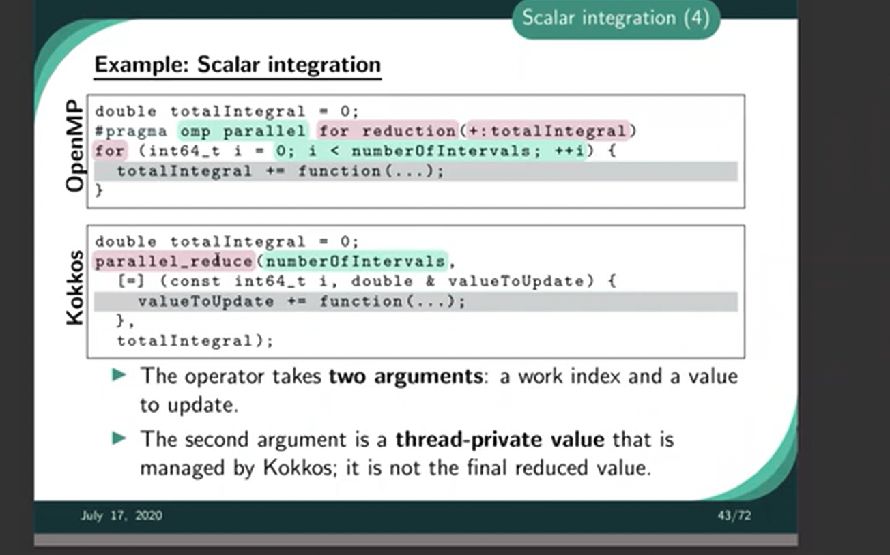

## Doc

- https://docs.lxp.lu/
- [SuperComputing 2024](https://mega.nz/folder/sbkBwZ4B#F2LgLshStZyBrLeOihhJQg)
- https://hpc-tutorials.llnl.gov/
- https://en.algorithmica.org/hpc/
- https://github.com/heathermiller/dist-prog-book
- https://ulhpc-tutorials.readthedocs.io/en/latest/
- https://rayseyfarth.com/asm/pdf/ch16-high-performance.pdf
- https://web.eecs.umich.edu/~mosharaf/Readings/DC-Computer.pdf
- https://carpentries-incubator.github.io/hpc-intro/aio/index.html


## High Performance Data Analysis

[machine learning](../machine_learning)

## Distributed Training

- https://blog.eleuther.ai/transformer-math/
- https://kipp.ly/transformer-inference-arithmetic/

## Distributed Inference

- [Running LLMS on HPC: Transformers, Inference & Deployment](https://events.grnet.gr/event/158/timetable/)
- https://docs.lxp.lu/software/module_example/HFInference/
- https://huggingface.co/docs/accelerate/usage_guides/distributed_inference/

## Tools

- https://docs.vllm.ai/en/latest/
- https://stackoverflow.com/questions/20327621/calling-ipython-from-a-virtualenv/

### PyTorch

- https://github.com/Kaixhin/grokking-pytorch
- https://www.aime.info/blog/en/multi-gpu-pytorch-training/


## High Performance Computing

### Architecture of Open Source Applications & Parallel Programming

- https://aosabook.org/en/index.html
- [Data Parallel C++ free ebook](https://link.springer.com/book/10.1007/978-1-4842-9691-2)
- https://github.com/heathermiller/dist-prog-book

#### Guidelines

- https://dubrayn.github.io
- https://dubrayn.github.io/#2
- https://en.algorithmica.org/hpc/
- https://rookiehpc.org/index.html/
- https://maxnilz.com/images/lang/moderncpp/

#### Performance

- https://wordsandbuttons.online/challenge_your_performance_intuition_with_cpp_sine.html
- https://wordsandbuttons.online/check_if_your_performance_intuition_still_works_with_cuda.html

### Cluster

- https://docs.easybuild.io/
- https://modules.sourceforge.net/
- https://github.com/fasrc/User_Codes
- https://github.com/NVIDIA/cuda-samples
- https://github.com/romain-jacotin/cuda
- https://slurm.schedmd.com/quickstart.html/
- https://wiki.lustre.org/images/6/64/LustreArchitecture-v4.pdf
- https://thomaswiemann.com/Cluster-Computing-with-VS-Code
- https://en.wikipedia.org/wiki/Apache_Spark # Distributed Computing, Horizontal Scaling &Fault tolerant
- https://stanford.edu/~rezab/sparkclass/slides/itas_workshop.pdf
- https://curc.readthedocs.io/en/latest/running-jobs/slurm-commands.html#analyzing-past-jobs-with-sacct

```bash
#nodelist to get the nodes
sacct -e
sacct -a -S2025-01-01-7:00 -E2025-01-01-23:00 -X -o jobid,start,end,state,nodelist
```

### OS

- https://cpu.land/
- https://pages.cs.wisc.edu/~remzi/OSTEP/
- https://people.eecs.berkeley.edu/~matei/papers/2011/hotcloud_datacenter_os.pdf
- https://csc-knu.github.io/sys-prog/books/Andrew%20S.%20Tanenbaum%20-%20Modern%20Operating%20Systems.pdf
- [M.Perache - ARSE Mem Alloc + Ordonnancement](https://drive.google.com/drive/folders/16FnbMmbfreb2SJX0px-5ce5KFq0Pjd1M)
- https://blog.silentsignal.eu/2022/09/05/simple-ibm-i-as-400-hacking/

#### Memory (MMIO,DMA,TLP)

- [What every programmer should know about memory - lwn.net](https://lwn.net/Articles/250967/)
- https://ctf.re/kernel/pcie/tutorial/dma/mmio/tlp/2024/03/26/pcie-part-2/


### 1°) Symmetric Multi Processing - Shared memory

- https://developer.codeplay.com/products/oneapi/nvidia/2025.0.0/guides/performance/common-optimizations

| Aspect              | **OpenMP**                                    | **SYCL**                                    | **CUDA**                                   |
|---------------------|-----------------------------------------------|---------------------------------------------|--------------------------------------------|
| **Programming Style** | Directive-based (`#pragma omp`)             | C++ API with lambdas for kernels            | Explicit C/C++ APIs for kernel programming |
| **Primary Focus**     | Shared memory, multi-threading (SMP/CPU)    | Heterogeneous systems (GPU, CPU, FPGAs)     | GPU computing                              |
| **Data Parallelism**  | `#pragma omp parallel for`, `shared`         | `parallel_for` for distributed computation  | Grid-Block-Thread hierarchy with `__global__` kernels |
| **Task Parallelism**  | `#pragma omp task`, `#pragma omp single`     | `single_task`, task graphs with queues      | Streams and events for overlapping kernels |
| **Portability**       | SMP systems primarily                       | Multi-device, heterogeneous systems         | GPU-specific; some portability via CUDA-aware frameworks like HIP |
| **Memory Model**      | Shared memory                               | Explicit device memory management           | Explicit device, shared, and global memory management |


#### MapReduce

- https://static.googleusercontent.com/media/research.google.com/en//archive/mapreduce-osdi04.pdf
- [The Kokkos Lectures - module1](https://youtube.com/playlist?list=PLqtSvL1MDrdFgDYpITs7aQAH9vkrs6TOF)

```c
double totalIntegral = 0;
#pragma omp parallel for reduction(+:totalIntegral)
for (int64_t i = 0; i < numberOfIntervals; ++i){
	totalIntegral += function(...);
}
```



#### CPU (Pthread / OpenMP)

`1 CPU = sockets x cores` 

- Personal computer  ~ 1 x (2 or 4 cores) 
- HPC supercalulator ~ 2 x (32 or 64 cores) (per CPU/node)
- https://www.yanismansour.com/articles/20210723-Threads-VS-Forks-C++

ex with 200 nodes: 2CPU/node, with 2 sockets, 64 cores each => 400 CPU, 128 cores/node


- https://gitlab.com/perache.marc/pbt_mpp
- https://www.openmp.org/wp-content/uploads/SC19-Ruud-SpeedUp.pdf
- https://sites.cs.ucsb.edu/~tyang/class/240a16w/slides/lectureOpenMP.pdf
- [The Scalable Commutativity Rule: Designing Scalable Software for MultiCore Processors](https://dl.acm.org/doi/pdf/10.1145/2699681)
- https://web.archive.org/web/20120120160334/http://www.ibm.com/developerworks/library/l-linux-smp/
- https://doc.lagout.org/programmation/Programmation%20Parallele%20et%20Distribuee.pdf
- https://doc.lagout.org/programmation/unix/Programmation%20Parallele%20et%20Distribuee%20OpenMP.pdf

#### GPU (CUDA / OpenCL)

- https://tog.re/articles/gpuland/
- https://web.archive.org/web/20240520150228/https://own2pwn.fr/gpu-intro
- https://stackoverflow.com/questions/50560395/how-to-install-cuda-in-google-colab-gpus
- https://developer.nvidia.com/blog/cuda-refresher-cuda-programming-model/
- https://developer.nvidia.com/blog/easy-introduction-cuda-c-and-c/
- https://www.nvidia.com/docs/IO/116711/sc11-cuda-c-basics.pdf
- https://engineering.purdue.edu/~smidkiff/ece563/NVidiaGPUTeachingToolkit/Mod20OpenCL/3rd-Edition-AppendixA-intro-to-OpenCL.pdf
- https://github.com/gpu-mode/lectures/tree/main?tab=readme-ov-file#lecture-37-introduction-to-sass--gpu-microarchitecture
- https://github.com/tpn/pdfs/blob/master/General-Purpose%20Graphics%20Processor%20Architecture%20(2018).pd

**Nvidia cores**:

- **CUDA cores**
- **Ray tracing cores**
- **Tensor cores**

**Nvidia SMs**:

- https://developer.nvidia.com/dcgm
- https://github.com/NVIDIA/cuda-samples/tree/master/Samples/1_Utilities

```bash
nvidia-smi -q
nvcc --run deviceQuery
dcgmi
```

**Debugging & Profiling GPU apps**

- https://developer.download.nvidia.com/compute/cuda/2_1/cudagdb/CUDA_GDB_User_Manual.pdf
- https://www.linaro.org/blog/debugging-and-profiling-on-the-nvidia-gh200-grace-hopper-superchip/

See the DMA/Memory management, specific for each device (gpu,fpga)


`1 GPU = sockets x SMs` 

- 1 GPC = 16 SMs (A100); 1 SM ~ 1 CPU core
- A kernel grid is split among a GPU:
	- 1 SM ~ 1 block. 4 TensorCore / SM
	- 1 CUDA Core = 1 thread = 1 register. 16 FP32 (+ 16INT32)/TensorCore => 64 FP32(+64INT32) CUDA CORE /SM; 32 FP64 CUDA Core/SM
	- 1 warp = smallest unit of // = 32 threads (+/- 2 blocks)

- See page 19: [A100 Official doc](https://images.nvidia.com/aem-dam/en-zz/Solutions/data-center/nvidia-ampere-architecture-whitepaper.pdf)


ex with 200 nodes: 4GPU /node, with 4 sockets, 128 SMs each => 800 GPU, 512 SMs/node


#### FPGA

- https://github.com/m3y54m/FPGA-ASIC-Roadmap
- https://www.intel.com/content/www/us/en/docs/programmable/683846/22-4/overview.html
- https://luxprovide.github.io/QuantumFPGA/
- https://docs.lxp.lu/fpga/opencl/pyopencl_ifpgasdk/

#### SYCL - Heterogeneous accelerators programming

- https://enccs.github.io/sycl-workshop/
- https://github.khronos.org/SYCL_Reference/
- https://www.intel.com/content/www/us/en/docs/sycl/introduction/latest/index-001.html
- https://cosmos-ctc-cambridge.github.io/sycl-hackathon/
- https://github.com/zjin-lcf/HeCBench/

**Modern C++ required**

- https://en.cppreference.com/w/cpp/language/templates
- https://en.cppreference.com/w/cpp/language/lambda
- https://maxnilz.com/docs/005-lang/moderncpp/001-moderncpp/
- https://openclassrooms.com/fr/courses/7137751-programmez-en-oriente-objet-avec-c/7533236-creez-des-templates

**1API Spec**

- https://oneapi-spec.uxlfoundation.org/specifications/oneapi/v1.3-rev-1/
- https://www.intel.com/content/www/us/en/developer/articles/technical/compiling-sycl-with-different-gpus.html
- https://www.intel.com/content/www/us/en/developer/articles/technical/learn-sycl-in-an-hour-maybe-less.html

### 2°) Distributed (and Hybrid) Programming

#### MPI

- https://www.geeksforgeeks.org/operating-systems/mpi-distributed-computing-made-easy/
- https://researchcomputing.princeton.edu/sites/g/files/toruqf311/files/documents/MPI_tutorial_Fall_Break_2022.pdf
- https://www.cac.cornell.edu/education/training/ParallelMay2012/HybridProgMay2012.pdf


