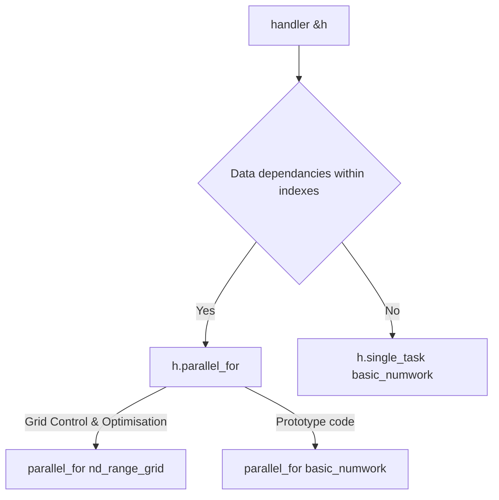

## 1API DPC++ toolkit

- https://www.intel.com/content/www/us/en/developer/articles/containers/oneapi-base-toolkit.html
- https://www.intel.com/content/www/us/en/developer/tools/oneapi/fpga-download.html?operatingsystem=linux&linux-install=offline
- https://www.intel.com/content/www/us/en/docs/oneapi/programming-guide/2024-2/use-the-setvars-and-oneapi-vars-scripts-with-linux.html

```bash
. /opt/intel/oneapi/setvars.sh --force && . /opt/intel/oneapi/2025.0/oneapi-vars.sh  --force
icpx -v fsycl src/*
```

## Reminders

- https://enccs.github.io/sycl-workshop/
- https://www.intel.com/content/www/us/en/docs/sycl/introduction/latest/04-matrix-multiplication-usm.html

TODO: test 2d index, ND Range. Exos here: https://luxprovide.github.io/QuantumFPGA/oneapi_quantum/

Notes:

- Work-item ~ thread => Sub Groups ~ Cuda Warps => Work groups ~ Blocks; NDRange ~ Grid 
- Single Work Item (single_task) kernels are meant to be use without data dependancies (e.g A[i]=i). ND Range are meant to be use with data dependancies within items (e.g A[i]=A[i-1]*2).
- FPGA use data pipelining with Single Work Item kernels

**On Task parallelism**

- USM mallocs use shared pointers under the hood. Fast, but becomes slower than buffer accessors with many task dependancies.
- [SYCL 101 task](https://www.intel.com/content/www/us/en/docs/sycl/introduction/latest/02-sycl-basic-code-single-task.html)

**On Data parallelism**

- kernels (here `parallel_for`) are multi dimensionnal, and **2D genericity** is possible:

```c
// same writing for 1D index
// simple parallel addition - equivalent to a for loop - c[id(i,j)] = a[id(i,j)] + b[id(i,j)]
[=](sycl::id<2> idx){ c[idx] = a[idx] + b[idx]}

// simple parallel multiplication - each thread computes coeff
[=](sycl::id<2> idx){ int j=idx[0]; int i=idx[0]; for(int k=0; k<N; ++k){ c[j][i] += a[i][k] + b[k][i]};}
```
 
- ND Range kernels are like basic data parallel kernels but with more contol. See the [less naive matmul implementation](https://enccs.github.io/sycl-workshop/expressing-parallelism-nd-range/)



## Simplidied definition of the main classes

(From **DPC++ book**)
See [../../prog/c++](../../prog/c++/) for modern cpp memos.

Notes: 

- DPC++ tackles deeper about graph tasks, dependance solving , kernel as a function or lambda, and device specific implementations.

- For FPGA, **segregating code with kernel as a function** saves compiling time (many hours for full image).

### Queue

```c
class queue{
    public:
    //Create a queue associated with a default (implementation chosen) device
    queue(const property_list & = {});
    queue(const async_handler &, const property_list & = {});

    //Create a queue using a DeviceSelector (cpu_selector_v,gpu_selector_v,other ranked devices)
    template <typename DeviceSelector>
    explicit queue(const DeviceSelector &deviceSelector, const property_list &proplist = {});

    //Create a queue associated with and explicit device
    queue(const device &, const property_list & = {});

    //Create a queue associated with a device in a specific SYCL context. Selector could replace device.
    queue(const context &, const device &, const property_list & = {});
};
```

### Handlers

```c
// Access modes

queue q;
buffer a_device{a};
buffer b_device{b};

q.submit([&](handler &h){
    accessor a(a_device, h, read_only);
    accessor b(b_device, h, write_only);
    h.parallel_for(NumWork, KernelFunc);
});

/* a and b can be reused in other kernels */
host_accessor host_acc_a(a_device, read_only);
host_accessor host_acc_b(b_device, write_only);
```

```c
class handler{
    // Accessors members
    //Specifies events that must be complete before action.
    //Src: accessor,    Dest: shared_ptr
    //Src: accessor,    Dest: pointer
    //Src: shared_ptr   Dest: accessor
    //Src: pointer      Dest: accessor
    //Src accessor      Dest: accessor

    template <typename T_Src, typename T_Dst, int Dims, access::mode AccessMode, access::target AccessTarget, access::placeholder IsPlaceholder = access::placeholder::false_t>
    void copy(accessor<T_Src, Dims, AccessMode, AccessTarget, IsPLaceholder> Src, shared_ptr_class<T_Dst> Dst);
    //other overloaded equivalents

    // guarantees that the object refered by accessor is updated on the host after action
    template <typename T, int Dims, access::mode AccessMode, access::target AccessTarget, access::placeholder IsPlaceholder = access::placeholder::false_t>
    void update_host(accessor<T, Dims, AccessMode, AccessTarget, IsPlaceholder> Acc);

    // Non-accessors members
    void depends_on({event &});
    
    // Memory Commands
    void memcpy(void* Dest, const void* Src, size_t Count);
    //Enqueue a memcpy
    template <typename T>
    void copy(const T* Src, T* Dest, size_t Count);
    
    void memset(void* Ptr, int Value, size_t Count);
    //Enqueue a memset
    template <typename T>
    void fill(void* Ptr, const T& Pattern, size_t Count);

    // Kernel Commands
    template <typename KernelName, typename KernelType>
    void single_task(KernelType KernelFunc);

    template <typename KernelName, typename KernelType, int Dims>
    void parallel_for(range<Dims> NumWork, KernelType KernelFunc);
    // Exemple (1D, 2D kernels (up to 3D))
    // NumWork      =   sycl::range<1>(N),                          sycl::range<2>(N, N)
    // KernelFunc   =   [=](sycl::id<1> i){ device_acc[i]++; },     [=](sycl::id<2> idx){ int j,i = idx[0],idx[1]; for(int k=0; k<N; ++k){ c[j][i] += a[j][k]*b[k][i] }; }
    
    //nd_range overloaded
    //For dim2, ExecutionRange= {NBlock, NThread/Block}
    void parallel_for(nd_range<Dims> ExecutionRange, KernelType KernelFunc);
};
```

### Kernels

#### Basic data parallel kernels (kernel = work item = size (1,1,1))

=> Prototype code and productivity

```c
template <int Dimensions =1>
// id class is basically the same
class range {
    public:
        // range / id constructors
        range(size_t dim0);
        range(size_t dim0, size_t dim1);
        range(size_t dim0, size_t dim1, size_t dim2);

        // return the size of the range / id in a specific dimension
        size_t get(int dimension) const;
        size_t &operator[](int dimension);
        size_t operator[](int dimension) const;

        // return the product of the size of each dimension - range specific
        size_t size() const;
};
```

`item` encapsulates both execution range and instance's index within that range.

```c
template <int Dimensions =1, bool WithOffset = true>
class item {
    public:
        // return the index of this item in the kernel's execution range
        id<Dimensions> get_id() const;
        size_t get_id(int dimension) const;
        size_t operator[](int dimension) const;

        // return the execution range of the kernel executed by this item
        range<Dimensions> get_range() const;
        size_t get_range(int dimension) const;

        // return the offset of this item (if WithOffset == true)
        id<Dimensions> get_offset() const;

        //return the linear index of this item (e.g id(0)*range(1)*range(2) + id(1)*range(2) + id(2))
        size_t get_linear_id() const;
};
```

#### ND-Range kernels (~CUDA, sub groups ~ warp)

=>  Portability (existing code) and performance features

```c
template <int Dimensions =1>
class nd_range {
    public:
        // Construct a nd_range from global and work-group local ranges
        nd_range(range<Dimensions> global, range<Dimensions> local);

        // return the global and work-group local ranges
        range<Dimensions> get_global_range() const;
        range<Dimensions> get_local_range() const;

        //return the number of work-groups in the global range
        range <Dimensions> get_group_range() const;
};
```

`nd_item` class is the ND-Range version of the `item` class.

```c
class nd_item{
    ...
    group<Dimensions> get_group const;
    sub_group get_sub_group() const;
};
```

Many of the functions that the `group` class provides each have equivalent in the `nd_item` class: e.g. `group.get_group_id = item.get_group_id()` .

```c
void body(group &g);

h.parallel_for(nd_range{global, local}, [=](nd_item<1> it)){
    group<1> g =  it.get_group();
    range<1> r = g.get_local_range();
    ...
    body(g);
});
```

Unlike with *work-groups*, the `sub-group` class is the only way to access **sub-group** functionality; none of its functions are duplicated in `nd_item`.

```c
class sub_group{
    public:
        // return sub-group index - n° of other subgroups in the parent work-group
        id<1> get_group_id() const;
        range<1> get_group_range() const;

        // return work-item index - n° of other work-item in the parent sub-group
        id<1> get_local_id() const;
        range<1> get_local_range() const;

        // return the maximum n° if work-items in any sub-group in this item's parent work-group
        range<1> get_max_local_range() const;
};
```

## Exception handling

### Synchronous error

```c
//host code
try{

}
catch (sycl::exception &e){
        std::cout << "Caught sync exception:" << e.what() << "\n";
        return 1;
}
```

### Asynchronous error

```c
auto handle_async_error = [](exception_list elist){
        for (auto& e: elist){
                try{
                        std::rethrow_exception(e);
                }
                catch(sycl::exception& e){
                        std::cout << "Aync exception:" << e << "\n";
                }
                catch(...){
                        std::cout << "Unknown exception" << e << "\n";
                }
        }
        std::terminate();
};

queue my_queue{gpu_selector_v, handle_async_error};
```
