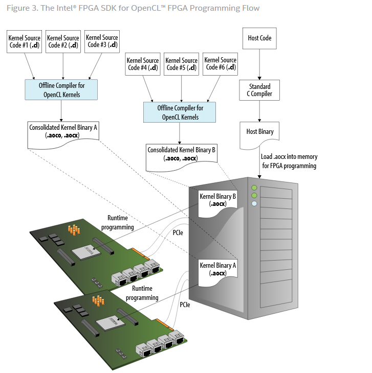
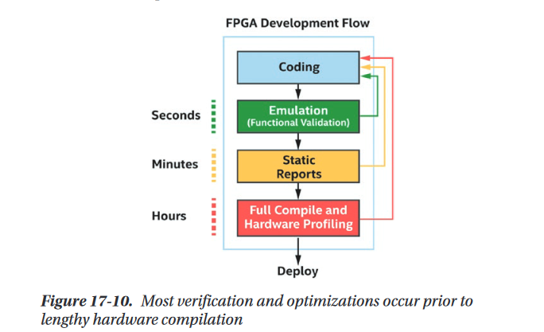
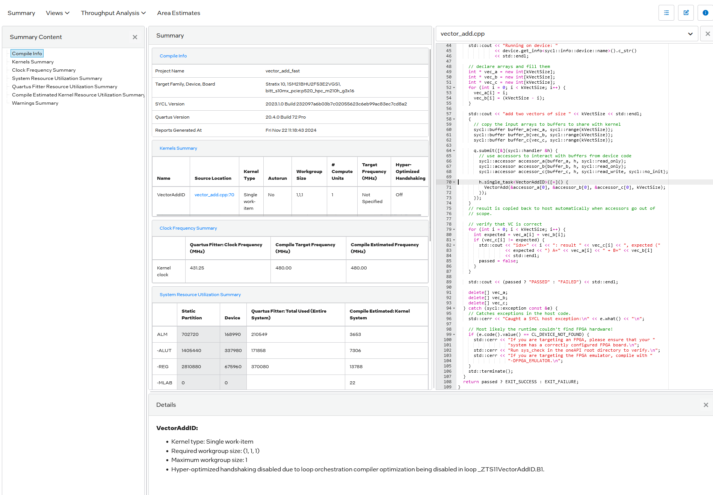
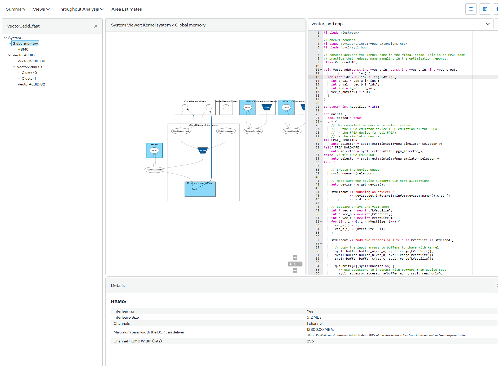
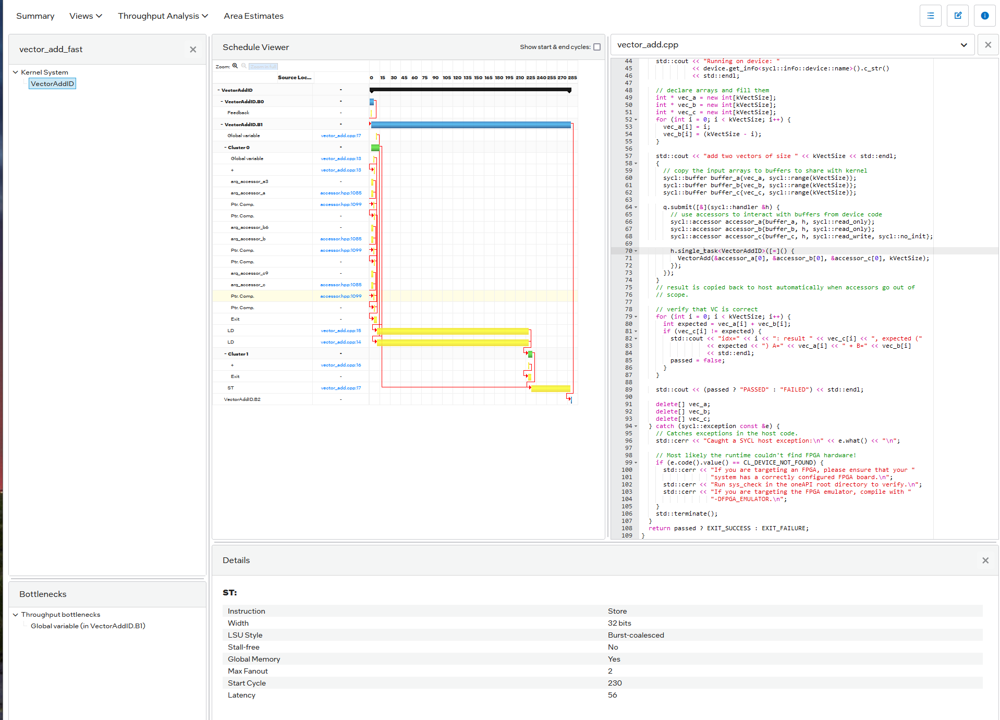
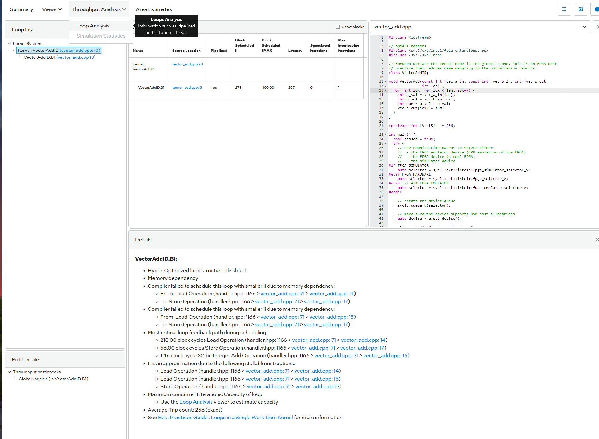
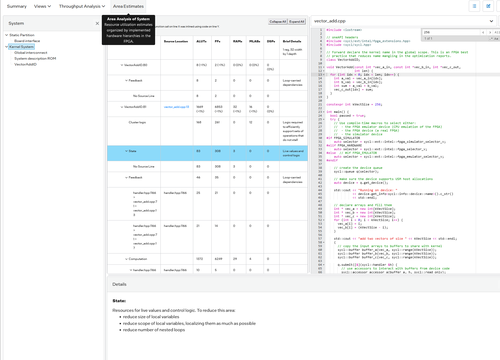

## Notes

See `Makefile` for the different kinds of compilation (~3h for the sbatch vector_add).
You need to `make full_compile` in order to get the result in the report.
To see the emulation result:

```bash
[user@nodeX fpga]$ module load env/staging/2023.1 intel-fpga 520nmx/20.4
[user@nodeX fpga]$ ./vector_add.fpga_emu

Running on device: Intel(R) FPGA Emulation Device
add two vectors of size 256
PASSED
```

Reports:

- compile with `early_image`
- download the `vector_add_report.prj/reports`
- open `report.html`




**Views**

*Summary*



*Global memory*



*Schedule viewer*



*Loop analysis*



*Area estimates


