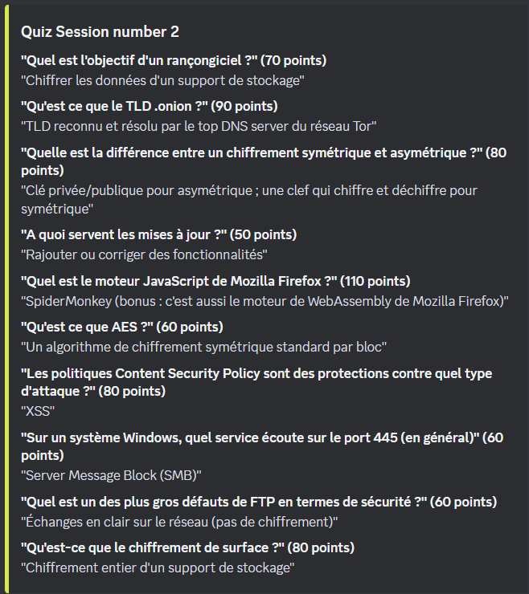
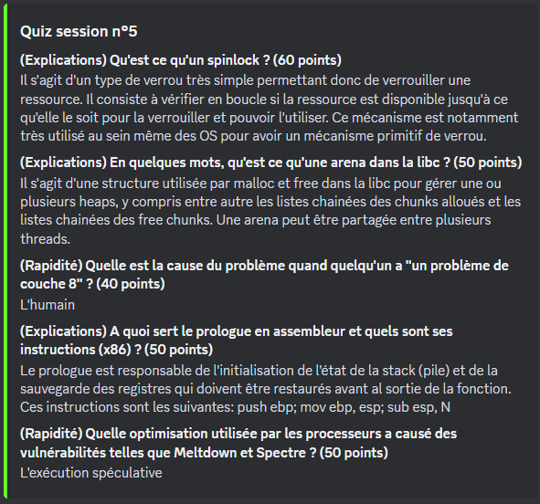
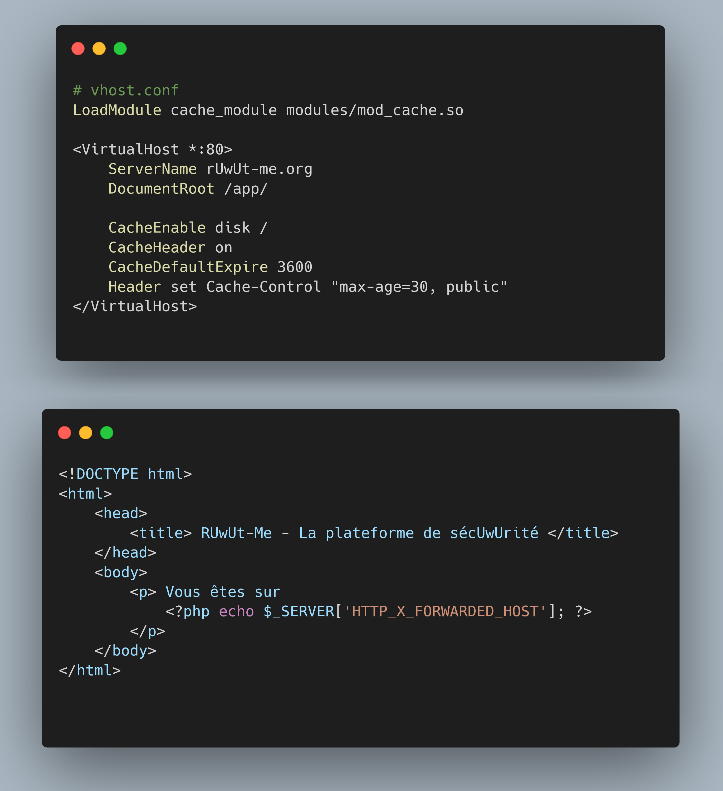
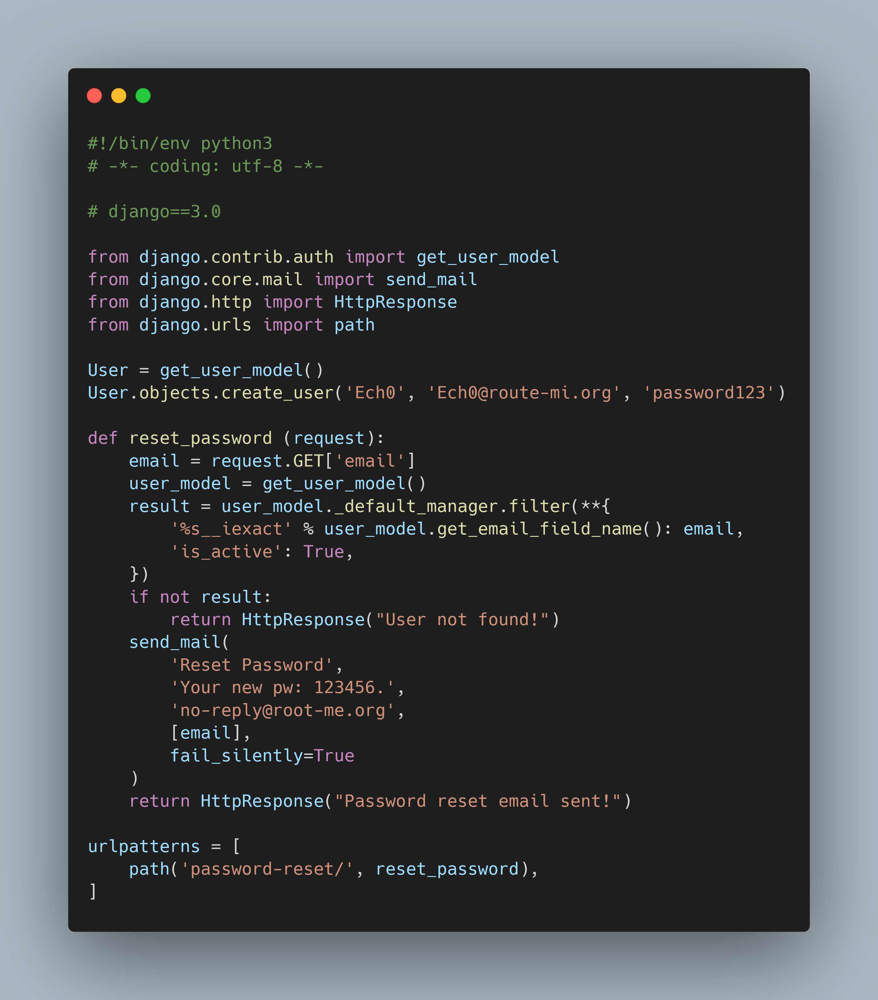
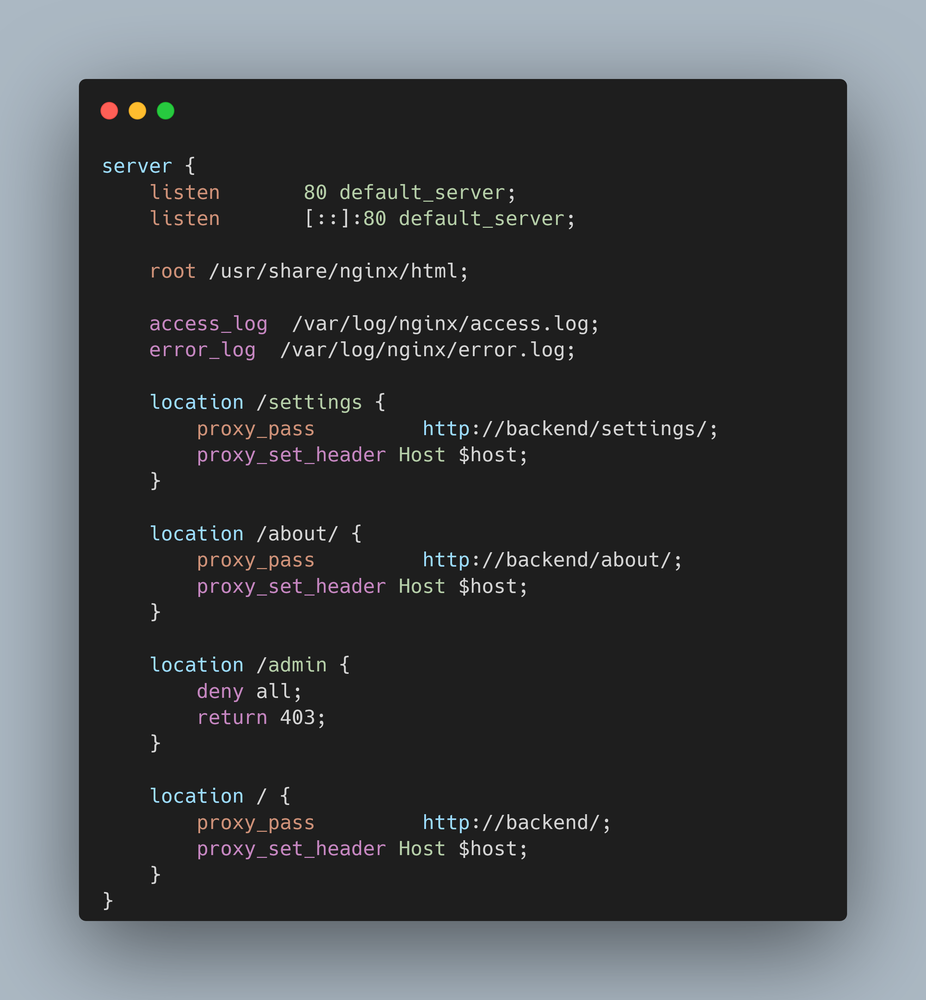

## Quiz RM

## Bonus

**(Speed) What is the name of the flaw in this configuration?**

Solve: Web Cache Poisonning

**(Explanation) How can the user Ech0 be hacked on root-me.org given this configuration?**

Solves:

- 1. Buy route-mi.org in punycode and ask to send the password reset to this domain
- 2. Register an email on route-mi.org with a letter of "Ech0" in unicode that could fool Django

-- The email parsing is done poorly on this version of django: it converts the unicode to utf-8/ascii/whatever. But it sends the mail to the unprocessed email address, so the unicode stays in the email

**(Explanation) What is the flaw present in this code? Describe the impacts**

Solve: Python YAML Deserialization, possibility of RCE

**(Explanation) Give the name of the flaw present in this configuration as well as the payload to access /admin**

Solve: Secondary Context Attack, payload: `http://domain/settings../admin/`
