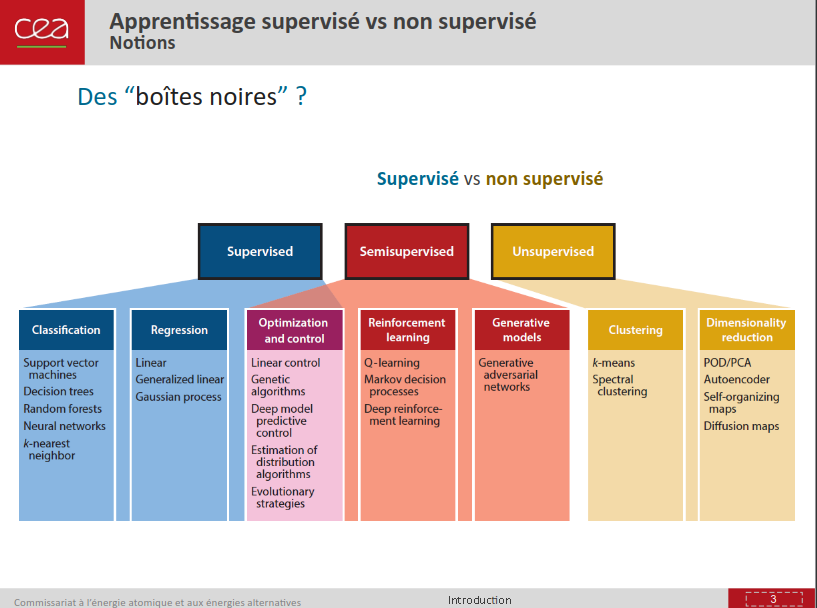

## Doc & Courses

- https://www.kaggle.com/
- https://www.youtube.com/@bycloudAI/videos 
- https://www.youtube.com/@aiDotEngineer/videos
- https://github.com/dair-ai/Mathematics-for-ML
- https://github.com/microsoft/ML-For-Beginners
- https://github.com/microsoft/mcp-for-beginners
- https://github.com/microsoft/generative-ai-for-beginners
- https://machinelearningmastery.com/python-machine-learning-mini-course/
- https://machinelearningmastery.com/machine-learning-algorithms-mini-course/
- https://github.com/ahmedbahaaeldin/From-0-to-Research-Scientist-resources-guide
- https://github.com/ZuzooVn/machine-learning-for-software-engineers?tab=readme-ov-file#interview-questions

#### Concerns

- https://www.wheresyoured.at/make-fun-of-them/
- https://www.wheresyoured.at/the-era-of-the-business-idiot/
- https://www.dane.ac-versailles.fr/spip.php?article1167
- https://addxorrol.blogspot.com/2025/07/a-non-anthropomorphized-view-of-llms.html

## Cheatsheets

- https://github.com/SuperCowPowers/data_hacking
- https://github.com/Trusted-AI/adversarial-robustness-toolbox

### Classification

- https://github.com/humphd/have-fun-with-machine-learning

### Clustering

- https://www.intercom.com/blog/machine-learning-way-easier-than-it-looks/

### DeepLearning

- https://github.com/veekaybee/what_are_embeddings
- https://medium.com/@alexandreluca23/building-yolo-your-guide-to-smarter-object-detection-6fce20f81e0a

#### GenAI & LLMs

- https://lmarena.ai/leaderboard
- https://artificialanalysis.ai/leaderboards/models
- https://github.com/AlexBuz/llama-zip
- https://github.com/konrad-gajdus/miniMNIST-c
- https://github.com/asgeirtj/system_prompts_leaks

#### Understanding / Building LLM applications

- [Large Language Models as Markov Chains](https://arxiv.org/pdf/2410.02724)
- [On the biology of a Large Language Model](https://transformer-circuits.pub/2025/attribution-graphs/biology.html)
- https://robot9.me/write-gpt-from-scratch/
- https://github.com/rasbt/LLMs-from-scratch
- https://github.com/microsoft/generative-ai-for-beginners/
- https://www.deeplearning.ai/courses/generative-ai-with-llms/
- https://www.deeplearning.ai/short-courses/getting-started-with-mistral/
- https://cyber.gouv.fr/publications/recommandations-de-securite-pour-un-systeme-dia-generative

### Quantum Machine Learning

- https://qml-tutorial.github.io/

### Training (Deep Learning, multi GPU)

- https://blog.eleuther.ai/transformer-math/
- https://kipp.ly/transformer-inference-arithmetic/

#### Tensorflow (deprecated)

- https://github.com/vahidk/EffectiveTensorflow
- https://github.com/hunkim/DeepLearningZeroToAll/

#### PyTorch

- https://github.com/Kaixhin/grokking-pytorch
- https://www.aime.info/blog/en/multi-gpu-pytorch-training/

## Challenges

- https://gandalf.lakera.ai/
- https://www.jailbreakchat.com/
- https://lakera-marketing-public.s3.eu-west-1.amazonaws.com/Lakera+AI+-+Real+World+LLM+Exploits+(Jan+2024).pdf

## Outils

- https://opencode.ai/		# Pay as you go on various models
- https://huggingface.co/models
- https://colab.research.google.com/
- https://www.tensorflow.org/install/docker
- https://qwenlm.github.io/qwen-code-docs/en/cli/
- https://github.com/cheahjs/free-llm-api-resources/

### MCP

- https://developers.openai.com/codex/mcp
- https://github.com/clearbluejar/pyghidra-mcp
- https://modelcontextprotocol.io/docs/tools/inspector

### Python

- https://cheatography.com/tetrisj/cheat-sheets/ipython/
- https://ipython.readthedocs.io/en/stable/interactive/magics.html/
- https://stackoverflow.com/questions/20327621/calling-ipython-from-a-virtualenv/

### Browser

- https://worldview.ai/
- [Tensorflow Playground](https://playground.tensorflow.org/#activation=tanh&batchSize=10&dataset=circle&regDataset=reg-plane&learningRate=0.03&regularizationRate=0&noise=0&networkShape=4,2&seed=0.93066&showTestData=false&discretize=false&percTrainData=50&x=true&y=true&xTimesY=false&xSquared=false&ySquared=false&cosX=false&sinX=false&cosY=false&sinY=false&collectStats=false&problem=classification&initZero=false&hideText=false)

### Local LLMs

- https://jan.ai/
- https://gpt4all.io/index.html
- https://ollama.com/library/codellama
- https://github.com/SecureAI-Tools/SecureAI-Tools

## Attacks

### Indirect Prompt Injection Threats

- https://greshake.github.io/
- [https://research.nccgroup.com/2022/12/05/exploring-prompt-injection-attacks/](https://web.archive.org/web/20230828221806/https://research.nccgroup.com/2022/12/05/exploring-prompt-injection-attacks/)
- [Ignore Previous Prompt: Attack Techniques For Language Models](https://arxiv.org/abs/2211.09527)
- https://jia.je/ctf-writeups/2025-09-05-imaginary-ctf-2025/tax-return.html # System prompt leak
- https://jia.je/ctf-writeups/2025-12-20-tsg-ctf-2025/chatbot.html          # Recover prompt from kv cache

#### Against GPT

- https://github.com/0xk1h0/ChatGPT_DAN
- https://simonwillison.net/2022/Sep/12/prompt-injection/

### Pickle file attacks

- https://blog.trailofbits.com/2024/06/11/exploiting-ml-models-with-pickle-file-attacks-part-1/
- https://blog.trailofbits.com/2022/10/03/semgrep-maching-learning-static-analysis/

### Adversarial Attacks

- https://tog.re/articles/conf_rm/
- https://tog.re/articles/asr_research/
- https://github.com/Trusted-AI/adversarial-robustness-toolbox

