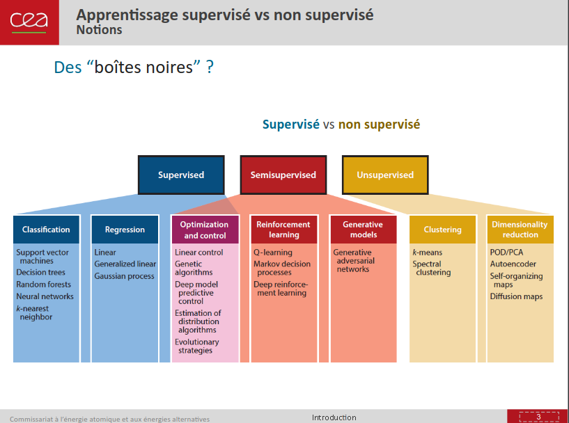

## Doc

- https://robot9.me/write-gpt-from-scratch/
- https://github.com/rasbt/LLMs-from-scratch
- https://arxiv.org/pdf/2410.02724
- https://github.com/dair-ai/Mathematics-for-ML
- https://lakera-marketing-public.s3.eu-west-1.amazonaws.com/Lakera+AI+-+Real+World+LLM+Exploits+(Jan+2024).pdf

## Outils

- https://huggingface.co/models
- https://www.tensorflow.org/install/docker
- https://colab.research.google.com/
- https://cheatography.com/tetrisj/cheat-sheets/ipython/
- https://ipython.readthedocs.io/en/stable/interactive/magics.html/
- https://stackoverflow.com/questions/20327621/calling-ipython-from-a-virtualenv/

### Browser

- https://worldview.ai/
- https://www.chatpdf.com/
- [Tensorflow Playground](https://playground.tensorflow.org/#activation=tanh&batchSize=10&dataset=circle&regDataset=reg-plane&learningRate=0.03&regularizationRate=0&noise=0&networkShape=4,2&seed=0.93066&showTestData=false&discretize=false&percTrainData=50&x=true&y=true&xTimesY=false&xSquared=false&ySquared=false&cosX=false&sinX=false&cosY=false&sinY=false&collectStats=false&problem=classification&initZero=false&hideText=false)

### LLM

- https://gpt4all.io/index.html
- https://jan.ai/
- https://ollama.com/library/codellama
- https://www.jailbreakchat.com/

## Challenges

- https://gandalf.lakera.ai/

## Attacks

### Indirect Prompt Injection Threats

- https://lnkd.in/ecwPsBMt
- https://lnkd.in/eck-mDuG # LLM Hacker's Handbook
- https://lnkd.in/eY774UPE # ChatGPT_DAN
- https://lnkd.in/eMKxHM5F # Exploring Prompt Injection Attacks
- https://lnkd.in/eyTzVs5J # Prompt injection attacks against GPT-3
- https://lnkd.in/e5VVpTa4 # Ignore Previous Prompt: Attack Techniques For Language Models
- https://lnkd.in/eZ8vmcMV # What prior injection attacks can teach us for LLM prompt injections
- https://lnkd.in/ew6NAXi2 # Github - LLM Security

### Pickle file attacks

- https://blog.trailofbits.com/2024/06/11/exploiting-ml-models-with-pickle-file-attacks-part-1/
- https://blog.trailofbits.com/2022/10/03/semgrep-maching-learning-static-analysis/

