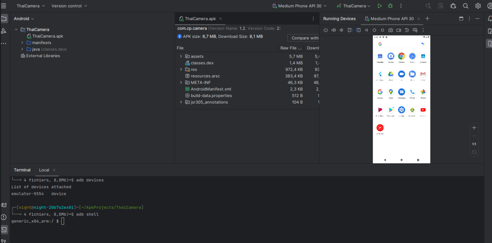

## Doc

- https://codeshare.frida.re/
- https://timsh.org/tracking-myself-down-through-in-app-ads/
- https://interactive.arm.com/story/the-arm-manga-guide-to-the-mali-gpu
- https://web.archive.org/web/20240615185524/https://dmz.torontomu.ca/wp-content/uploads/2020/12/Reverse-Engineering-101.pdf

### Cheatsheets

- https://github.com/DERE-ad2001/Frida-Labs
- https://github.com/cyberheartmi9/Frida-Guide
- https://github.com/randorisec/MobileHackingCheatSheet/

### Android

- https://developer.android.com/tools/releases/platform-tools
- https://www.stashofcode.fr/developper-sur-android-sans-ide/
- https://www.evilsocket.net/2017/04/27/Android-Applications-Reversing-101/
- https://medium.com/purplebox/step-by-step-guide-to-building-an-android-pentest-lab-853b4af6945e
- https://www.reversemode.com/2023/10/reversing-france-identite-new-french.html?m=1

#### Root

- https://www.framaroot.net/
- https://xdaforums.com/t/info-boot-process-android-vs-linux.3785254/
- https://xdaforums.com/t/guide-2025-how-to-root-a-phone-a-complete-truthful-up-to-date-crap-free-and-no-bs-guide.4710038/

### Ios

- https://github.com/tcurdt/iProxy/wiki
- https://github.com/iosre/iOSAppReverseEngineering ## Book
- https://andreafortuna.org/2020/08/31/ios-forensics-hfs-file-system-partitions-and-relevant-evidences/
- https://docs.google.com/spreadsheets/d/1z-44BUA2AVf8uqnoiDDSi7UxbyWy8KJqK4uaYq_0YYg/edit#gid=9
- https://connect.ed-diamond.com/MISC/misc-091/auditer-la-securite-d-une-application-ios-avec-needle

#### JailBreak

- https://checkra.in/
- https://github.com/axi0mX/ipwndfu


## Courses

- https://mobisec.reyammer.io/slides
- https://www.ragingrock.com/AndroidAppRE/ -> **ThaiCamera,FotaProvider,Mediacode corrigés**
- https://www.evilsocket.net/2017/04/27/Android-Applications-Reversing-101/

**Corrections**

[ThaiCamera](./ragingrock/ThaiCamera/README.md)

[FotaProvider](./ragingrock/FotaProvider/README.md)

[MediaCode](./ragingrock/MediaCode/README.md)

### Structure (statique)

- `Manifest`

Exemple de permissions d'une application malveillante

```xml
<?<xml version="1.0" encoding="utf-8"?>
<manifest xmlns:android="http://schemas.android.com/apk/res/android" android:versionCode="2" android:versionName="1.2" package="com.cp.camera" platformBuildVersionCode="23" platformBuildVersionName="6.0-2704002">
    <uses-sdk android:minSdkVersion="15" android:targetSdkVersion="23"/>
    <uses-permission android:name="android.permission.INTERNET"/>
    <uses-permission android:name="android.permission.WRITE_EXTERNAL_STORAGE"/>
    <uses-permission android:name="android.permission.CAMERA"/>
```

- `Code`
- `Ressources`
- `Launcher Activity`

```java
android.intent.category.LAUNCHER
```

Une application malveillante peut accéder aux données de cette application et éxécuter du code:

```bash
- com.my.appstore.search
	com.app.myfolder.activity.FoldersSearchActivity

- android.intent.action.AdupsFota.WriteCommandReceiver
	com.adups.fota.sysoper.WriteCommandReceiver
```

### Java Native Interface

- https://developer.android.com/ndk/guides/jni-tips
- https://mas.owasp.org/MASTG/techniques/android/MASTG-TECH-0018/

```java
public class MainActivity extends AppCompatActivity {
    @Override protected void onCreate(Bundle bundle) {
      super.onCreate(bundle);
      // doStuff
      stringFromJNI());
    }
    
    static {
        System.loadLibrary("native-lib");
    }
    public native String stringFromJNI();
}
```

[reverse the shared library using IDA/Ghidra](../reverse/Reversing_Crypto)

`/lib/<cpu>/lib<native-lib>.so`

## Outils

- https://mobsf.live/
- https://codeshare.frida.re/
- https://github.com/skylot/jadx
- https://github.com/tcurdt/iProxy/
- https://developer.android.com/tools/
- https://github.com/APKLab/APKLab
- https://github.com/niklashigi/apk-mitm
- https://github.com/dwisiswant0/apkleaks
- https://github.com/P1sec/hermes-dec
- https://github.com/choff/anbox-modules                           # Fix Waydroid binder
- https://docs.waydro.id/usage/install-and-run-android-applications 
- https://android.googlesource.com/platform/system/tools/mkbootimg/+/refs/heads/master/unpack_bootimg.py

```bash
zcat ramdisk | cpio -imdv
```

### Pentest Lab (Android)

- https://xdaforums.com/t/guide-emui-11-complete-debloating-guide-bloatware-list.4217323
- https://medium.com/purplebox/step-by-step-guide-to-building-an-android-pentest-lab-853b4af6945e
- https://connect.ed-diamond.com/misc/misc-116/un-edr-sous-android

### Android Studio (dynamique)

- https://developer.android.com/studio/command-line/adb?hl=fr
- https://github.com/android/ndk/wiki/unsupported-downloads#r9d # GDBserver
- https://stackoverflow.com/questions/48319646/how-to-disable-saving-state-on-android-emulator
- https://braincoke.fr/blog/2021/03/android-reverse-engineering-for-beginners-frida/#static-analysis-reminder


```bash
# Si téléphone éteint - run Thaicamera échoue
rm ~/.android/avd/Pixel_5_API_31.avd/*.lock
```



#### NDK

```bash
cd ~/android-ndk*
adb push prebuilt/android-arm/gdbserver/gdbserver /data/local/tmp/

adb shell
su
chmod 755 /data/local/tmp/gdbserver
/data/local/tmp/gdbserver :5039 /data/local/tmp/arm_bin
```

```bash
adb forward tcp:5039 tcp:5039
```

```bash
~/android-ndk*/toolchains/arm-linux-androideabi-X/prebuilt/linux-x86_64/bin/arm-linux-androideabi-gdb arm_bin
(gdb) target remote :5039
(gdb) set architecture arm
(gdb) set pagination off
(gdb) set disassemble-next-line on
(gdb) info registers
(gdb) layout asm
```


### Frida

#### Frida-Inject (Process)

```bash
wget https://github.com/frida/frida/releases/download/16.1.8/frida-inject-16.1.8-android-x86_64.xz #choisir l'architecture en fonction du tel émulé
xz -d frida-inject*
```

Créer `exploit.js`:

```js
var a = MainActivity.a;
a.overload('java.lang.String').implementation = function() {
    code.
}
```

Exemple:

```js
Java.perform(function () {
        var main_activity = Java.use("com.example.<application/projet>.<Main (sans smali)>");
        main_activity.<main_method>.overload("java.lang.String").implementation = function(var0) {
        var decrypt = this.<main_method>(var0);
   console.log("FLAG: " + decrypt);
        }
});
```

Avec ADB:

```bash
adb devices
adb shell
adb shell pm list packages -f
adb shell pm uninstall --user 0 com.facebook.services
adb install tp.apk 
adb shell am start -n com.hack_apk.main/.MainActivity --em "key" "test"
```

```bash
adb push exploit.js /data/local/tmp
adb push frida-inject-16.1.8-android-x86_64 /data/local/tmp #depend de l'arch du tel choisi
```

```bash
adb shell "ps -A | grep <nom application/projet>"
adb shell "/data/local/tmp/frida-inject* -p <PID obtenu>   -s exploit.js"
```

#### Frida-Server

```bash
wget https://github.com/frida/frida/releases/download/17.2.11/frida-server-17.2.11-android-x86_64.xz
xz -d frida-server*


adb push frida-server-*-android-x86_64 /data/local/tmp/frida/frida-server
adb shell "chmod 777 /data/local/tmp/frida/frida-server"
adb shell "/data/local/tmp/frida/frida-server"
#adb shell "/data/local/tmp/frida-server &"
```

```js
Java.perform(function () {
 send("Hooking fraud application");
 var sendSMS = Java.use("android.telephony.SmsManager");

 sendSMS.getDefault().sendTextMessage.overload("java.lang.String","java.lang.String", "java.lang.String", "android.app.PendingIntent", "android.app.PendingIntent").implementation = function(var1, var2, var3, var4, var5) {
   send("phone number : " + var1);
   send("sms value : " + var3);
   return true;
 };
});
```

```bash
adb push exploit.js /data/local/tmp
frida -U -f com.fraud_app -l exploit.js --no-pause
```
