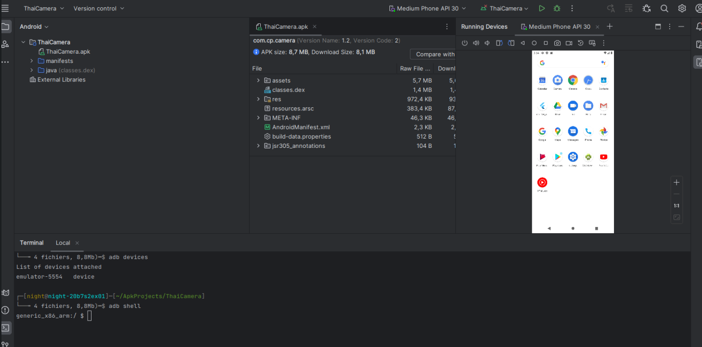

## Doc

- https://github.com/randorisec/MobileHackingCheatSheet/
- https://twitter.com/androidmalware2/status/1676884184424431616/
- https://xdaforums.com/t/info-boot-process-android-vs-linux.3785254/

## Tools

- https://appetize.io/
- https://mobsf.live/
- https://frida.re/
- https://developer.android.com/studio
- https://github.com/dwisiswant0/apkleaks
- https://android.googlesource.com/platform/system/tools/mkbootimg/+/refs/heads/master/unpack_bootimg.py

```bash
zcat ramdisk | cpio -imdv
```

### AVD, Emulation & Privacy

**Utiliser FreeOTP+ -> Export key**

- https://aurorastore.org/
- https://www.apkmirror.com/
- https://stackoverflow.com/questions/48319646/how-to-disable-saving-state-on-android-emulator

### Backup

- https://stackoverflow.com/questions/34482042/adb-backup-does-not-work (désactiver redmoon)
- https://gist.github.com/AnatomicJC/e773dd55ae60ab0b2d6dd2351eb977c1

```bash
#adb pull /data .
#adb backup -all -shared -noapk -system 

adb pull /sdcard .
adb backup -f all -all -apk -nosystem
adb restore backup.ab
```

- https://forum.frandroid.com/topic/139590-tuto-adb-fastboot-drivers-root-recovery-backup-sans-toolkit/
- https://www.droidthunder.com/dc-unlocker/
- https://stackoverflow.com/questions/18533567/how-to-extract-or-unpack-an-ab-file-android-backup-file

**SAUVEGARDER SES DONNEES ET NE PAS TOUT DESINSTALLER**

### Pentest Lab

- https://xdaforums.com/t/guide-emui-11-complete-debloating-guide-bloatware-list.4217323
- https://medium.com/purplebox/step-by-step-guide-to-building-an-android-pentest-lab-853b4af6945e
- https://connect.ed-diamond.com/misc/misc-116/un-edr-sous-android

## Android

- https://github.com/dwisiswant0/apkleaks
- https://github.com/APKLab/APKLab

### Doc

- https://www.evilsocket.net/2017/04/27/Android-Applications-Reversing-101/
- https://medium.com/purplebox/step-by-step-guide-to-building-an-android-pentest-lab-853b4af6945e

### Outils

- `Appetize`: https://appetize.io/
- `Android Studio`: https://developer.android.com/studio
- `Frida`: https://github.com/frida/frida/releases/tag/16.1.8
- `Waydroid`: https://docs.waydro.id/usage/install-and-run-android-applications 
- `Corriger binder waydroid`: https://github.com/choff/anbox-modules

```bash
waydroid init
```

- https://www.virustotal.com/gui/home/upload
- https://mobsf.live/

### Exercices & Corrections

- https://mobisec.reyammer.io/slides
- https://www.ragingrock.com/AndroidAppRE/ -> **ThaiCamera,FotaProvider,Mediacode corrigés**
- https://www.evilsocket.net/2017/04/27/Android-Applications-Reversing-101/

**Corrections**

[ThaiCamera](./ragingrock/ThaiCamera/README.md)

[FotaProvider](./ragingrock/FotaProvider/README.md)

[MediaCode](./ragingrock/MediaCode/README.md)

### Structure (statique)

- `Manifest`

Exemple de permissions d'une application malveillante

```xml
<?<xml version="1.0" encoding="utf-8"?>
<manifest xmlns:android="http://schemas.android.com/apk/res/android" android:versionCode="2" android:versionName="1.2" package="com.cp.camera" platformBuildVersionCode="23" platformBuildVersionName="6.0-2704002">
    <uses-sdk android:minSdkVersion="15" android:targetSdkVersion="23"/>
    <uses-permission android:name="android.permission.INTERNET"/>
    <uses-permission android:name="android.permission.WRITE_EXTERNAL_STORAGE"/>
    <uses-permission android:name="android.permission.CAMERA"/>
```

- `Code`

- `Ressources`


Point d'entrée:

- `Launcher Activity`

```java
android.intent.category.LAUNCHER
```

Une application malveillante peut accéder aux données de cette application et éxécuter du code:

```bash
- com.my.appstore.search
	com.app.myfolder.activity.FoldersSearchActivity

- android.intent.action.AdupsFota.WriteCommandReceiver
	com.adups.fota.sysoper.WriteCommandReceiver
```

### Android Studio (dynamique)

- https://developer.android.com/studio/command-line/adb?hl=fr
- https://braincoke.fr/blog/2021/03/android-reverse-engineering-for-beginners-frida/#static-analysis-reminder


```bash
# Si téléphone éteint - run Thaicamera échoue
rm ~/.android/avd/Pixel_5_API_31.avd/*.lock
```



### Frida

#### Frida-Inject (Process)

```bash
wget https://github.com/frida/frida/releases/download/16.1.8/frida-inject-16.1.8-android-x86_64.xz #choisir l'architecture en fonction du tel émulé
xz -d frida-inject*
```

Créer `exploit.js`:

```js
var a = MainActivity.a;
a.overload('java.lang.String').implementation = function() {
    code.
}
```

Exemple:

```js
Java.perform(function () {
        var main_activity = Java.use("com.example.<application/projet>.<Main (sans smali)>");
        main_activity.<main_method>.overload("java.lang.String").implementation = function(var0) {
        var decrypt = this.<main_method>(var0);
   console.log("FLAG: " + decrypt);
        }
});
```

Avec ADB:

```bash
adb devices
adb shell
adb shell pm list packages -f
adb shell pm uninstall --user 0 com.facebook.services
adb install tp.apk 
adb shell am start -n com.hack_apk.main/.MainActivity --em "key" "test"
```

```bash
adb push exploit.js /data/local/tmp
adb push frida-inject-16.1.8-android-x86_64 /data/local/tmp #depend de l'arch du tel choisi
```

```bash
adb shell "ps -A | grep <nom application/projet>"
adb shell "/data/local/tmp/frida-inject* -p <PID obtenu>   -s exploit.js"
```

#### Frida-Server

```bash
wget https://github.com/frida/frida/releases/download/17.2.11/frida-server-17.2.11-android-x86_64.xz
xz -d frida-server*


adb push frida-server-*-android-x86_64 /data/local/tmp/frida/frida-server
adb shell "chmod 777 /data/local/tmp/frida/frida-server"
adb shell "/data/local/tmp/frida/frida-server"
#adb shell "/data/local/tmp/frida-server &"
```

```js
Java.perform(function () {
 send("Hooking fraud application");
 var sendSMS = Java.use("android.telephony.SmsManager");

 sendSMS.getDefault().sendTextMessage.overload("java.lang.String","java.lang.String", "java.lang.String", "android.app.PendingIntent", "android.app.PendingIntent").implementation = function(var1, var2, var3, var4, var5) {
   send("phone number : " + var1);
   send("sms value : " + var3);
   return true;
 };
});
```

```bash
adb push exploit.js /data/local/tmp
frida -U -f com.fraud_app -l exploit.js --no-pause
```

## Ios

- https://andreafortuna.org/2020/08/31/ios-forensics-hfs-file-system-partitions-and-relevant-evidences/
- https://docs.google.com/spreadsheets/d/1z-44BUA2AVf8uqnoiDDSi7UxbyWy8KJqK4uaYq_0YYg/edit#gid=9
- https://connect.ed-diamond.com/MISC/misc-091/auditer-la-securite-d-une-application-ios-avec-needle
