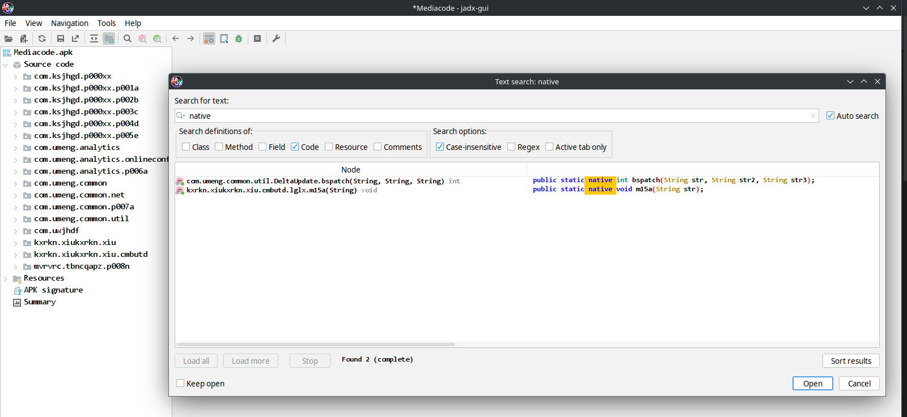
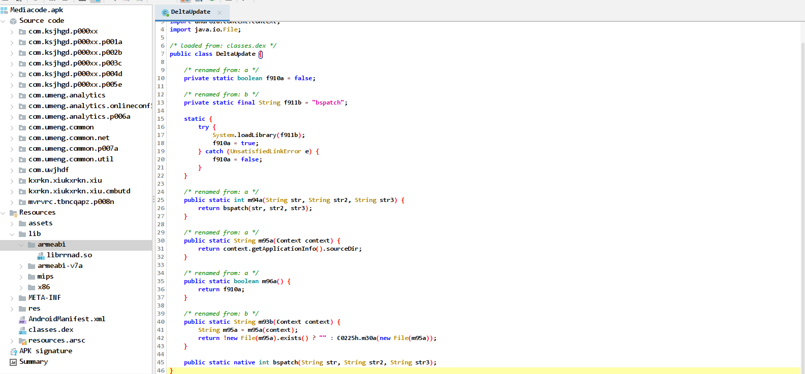
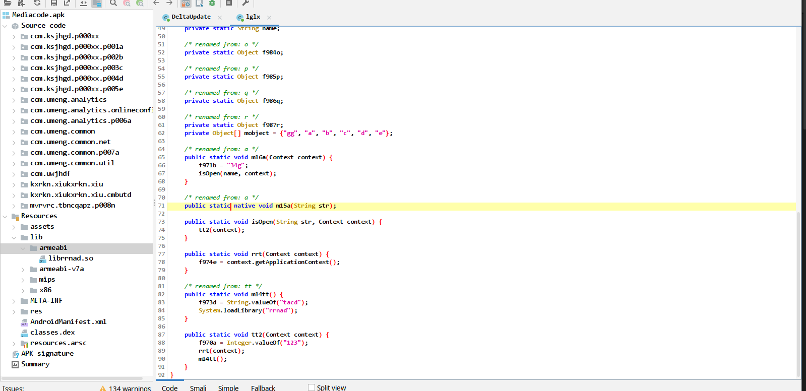
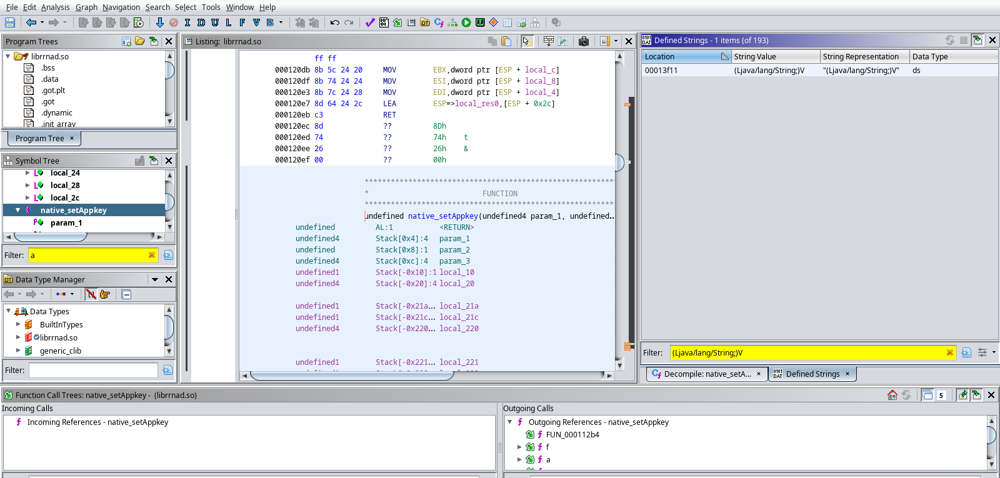
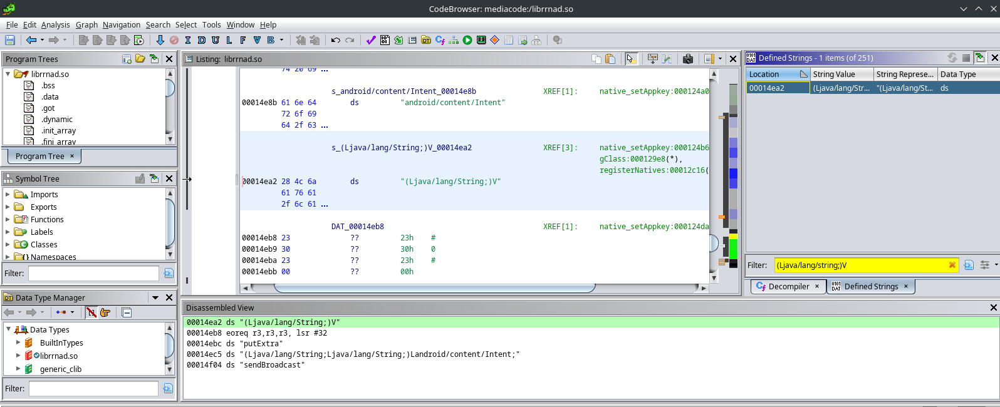
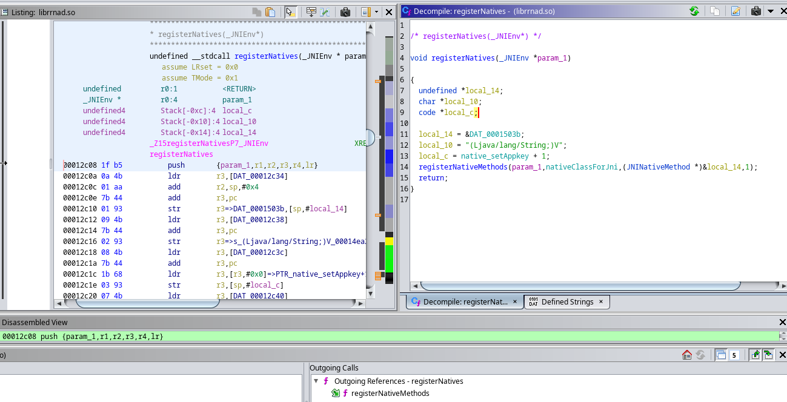

# MediaCode

Que font les fonctions natives utilisees par l'application ?

(code directement reconnu par le processeur, JNI permettant d'appeler du C -> plus bas niveau)

- https://fr.wikipedia.org/wiki/Java_Native_Interface

## Trouver les fonctions natives

On fait une recherche avec , exactement, ` native ` :

- 1 ) On observe une librairie `bspatch` mais qui n'est pas présente dans `/lib` (code mort?):

- 2 ) La seconde correspond à la méthode `m15a` de la lib `librrnad.so`:

## Analyser librrnad.so (arm) avec Ghidra

On cherche la méthode `a` ou `m16a` vue plus haut -> chercher la signature est plus facile

(Windows -> Defined Strings)

Syntaxe `(Ljava/lang/String;V)` : V = void (type de retour)

D'où la XREF (cross reference) et la version désassemblé:

On trouve

- `registerNatives` (une fonction custom des développeurs != `RegisterNatives`)

- `native_setAppkey` qui est appelée par la fonction précédente

qui éxécute entre autres `sendBroadcast` https://developer.android.com/develop/background-work/background-tasks/broadcasts (jsp trop)
