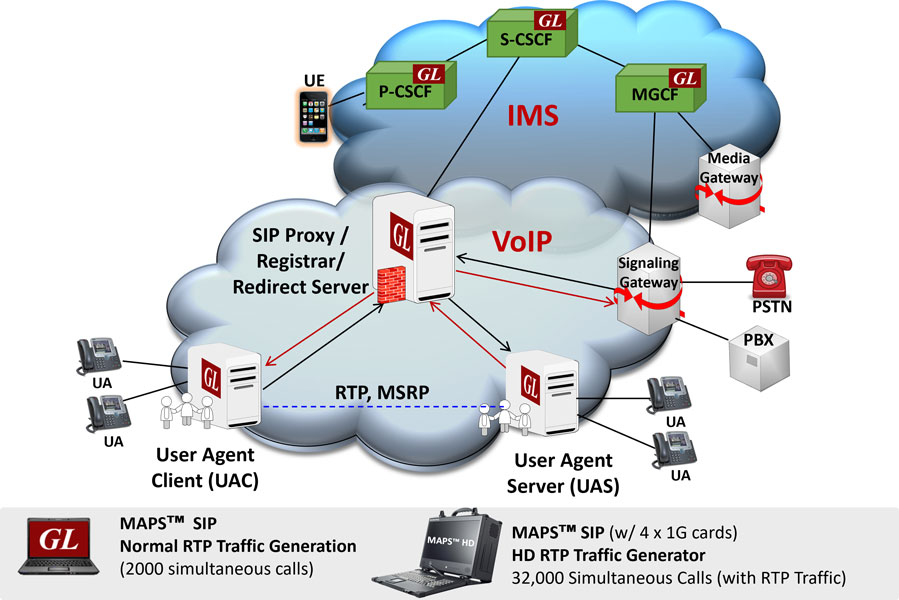

## Documentation

- https://ctf-wiki.mahaloz.re/misc/traffic/introduction/
- https://www.cyberciti.biz/files/pdf/dig%20command%20cheat%20sheet.pdf
- https://cheatsheet.haax.fr/shells-methods/reverse/
- https://github.com/sergiomarotco/Network-segmentation-cheat-sheet
- https://www.orangecyberdefense.com/fr/insights/blog/ethical-hacking/etat-de-lart-du-pivoting-reseau-en-2019
- https://heystacks.com/doc/401/attacking-secondary-contexts-in-web-applications
- https://github.com/V0lk3n/WirelessPentesting-CheatSheet
- https://www.wifi-professionals.com/2019/01/4-way-handshake

## Cours

- https://zestedesavoir.com/tutoriels/2789/les-reseaux-de-zero/
- https://maxnilz.com/docs/004-network/005-linux-rx-v0/
- https://beej.us/guide/bgnet0/html/split/

## Tools

- [Bettercap](https://www.bettercap.org/installation/)
- [Eaphammer](https://github.com/s0lst1c3/eaphammer)
- [GNURadio](https://wiki.gnuradio.org/index.php/Main_Page)
- [Hex Packet Decoder](https://www.gasmi.net/hpd/)
- [Ngrok](https://ngrok.com/)
- [Revshells](https://revshells.com)
- [Tshark](https://tshark.dev/)

### Captures / Challenges

- https://packetlife.net/blog/2009/jul/13/quick-packet-capture-data-extraction/
- https://wifichallengelab.com/

- https://wiki.wireshark.org/SampleCaptures
- https://tshark.dev/analyze/packet_hunting/packet_hunting/ (memo)

```bash
tshark -2 -r chall.pcap -T fields -e data
# add -R "ip.addr == 127.0.0.1 && icmp.type==8"
```

- https://stackoverflow.com/questions/10300656/capture-incoming-traffic-in-tcpdump

```bash
sudo tcpdump -l -n -i wlan0
```

### Nat

- https://zestedesavoir.com/tutoriels/2789/les-reseaux-de-zero/reprenons-du-service/nat/

### Règles / Firewall

- https://zestedesavoir.com/tutoriels/2789/les-reseaux-de-zero/apprenons-a-securiser-un-reseau/allumez-le-pare-feu/
- https://docs.suricata.io/en/suricata-6.0.0/rules/intro.html

### Subnetting

`Memo: masque=subnet+host`

- https://zestedesavoir.com/tutoriels/2789/les-reseaux-de-zero/veuillez-vous-identifier-pour-communiquer/le-subnetting-en-pratique/
- https://youtu.be/B1vqKQIPxr0

```
10.1.1.0/24 ->3  subnets, 40 hosts 1st one 
- `/24`-> 24 x '1' : 255.255.255.0
- nosferat2: 40 <=64 = 2  ^ 6:  -> increment = (nosferatu (1) 1 (0 0 0 0 0 0) -> 64)) 
- m = ssssss hh : 255.255.255.192 (nosfera2 : 1+1 -> 128+64)= /26 (CIDR notation)
- 10.1.1.0-> 10.1.1.63 (inc=64) -> 2^6 - 2 machines
```

```
1st: 10.1.1.0/26
2nd: 10.1.1.64/26
3d: 10.1.1.128/26
```

### Iptables / http.server

`voir ../ctf`

## Curl

`curl  is a tool for transferring data from or to a server. It supports these protocols: DICT, FILE, FTP, FTPS,
GOPHER, GOPHERS, HTTP, HTTPS, IMAP, IMAPS, LDAP, LDAPS, MQTT, POP3, POP3S, RTMP, RTMPS, RTSP, SCP, SFTP,  SMB,
SMBS, SMTP, SMTPS, TELNET or TFTP. The command is designed to work without user interaction.`

- https://devhints.io/curl

### ARP

```bash
arp-scan wlan0
```

### DNS

- https://www.noip.com/

*DNSCrypt v/s DNSSec*

- https://github.com/DNSCrypt/dnscrypt-proxy/wiki/Installation-linux
- https://security.stackexchange.com/questions/122547/is-there-a-point-to-dnscrypt-when-using-vpn
- https://github.com/DNSCrypt/dnscrypt-proxy/issues/519

**1.1.1.1**

- https://security.stackexchange.com/questions/238871/will-1-1-1-1-hide-my-traffic-from-my-landlords-router
- https://www.reddit.com/r/CloudFlare/comments/15inies/difference_between_1111_and_warp/

ou

```bash
sudo pacman -S dnsproxy
sudo rm -f /etc/resolv.c*
sudo nano /etc/resolv.conf
#nameserver 127.0.0.1
#options edns0

sudo dnscrypt-proxy -service install
sudo dnscrypt-proxy -service start
dnscrypt-proxy -config /etc/dnscrypt-proxy/dnscrypt-proxy.toml -resolve example.com
```

- https://lig-membres.imag.fr/sicard/tpRES/DNSRICM2-TP.pdf
- https://digi.ninja/projects/zonetransferme.php
- https://lock.cmpxchg8b.com/rebinder.html

` Bypass dns [.-a-z]`

- https://nip.io/ 

- https://web-check.as93.net/
	`External tools & more`

	- https://dnsdumpster.com/ (map)

	- https://search.censys.io/

	- https://www.ssllabs.com/ssltest/

- https://subdomainfinder.c99.nl/

- https://www.duckdns.org/

```bash
whois google.com
```

*Zone transfer*

Get AXFR records without auth:

- get subdomains from domain_name
- all records for a subdomain

```bash
dig axfr @IP (sub)_domain_name
#@server/routeur subdomain

host -t axfr zonetransfer.me nsztm1.digi.ninja.
```

### Reverse lookup

```bash
nslookup flaws.cloud
nslookup 52.92.249.179
```

### FTP

- https://fr.wikipedia.org/wiki/File_Transfer_Protocol

Serveur:

```bash
mkdir secret; cd secret
python -m pyftpdlib -D
ngrok tcp 2121
```

### HTTP

[Curl Options & POST](https://gist.github.com/subfuzion/08c5d85437d5d4f00e58)

```bash
mkdir secret; cd secret
ngrok tcp 4444

# Requêtes
nc -nlvp 4444

# Ou (serveur)
python -m http.server 4444
```
### LDAP

- https://serverfault.com/questions/1083914/replace-anonymous-ldapsearch-command-with-curl-command

### MAIL

- https://support.mozilla.org/en-US/kb/blocking-sender
- https://elsicarius.fr/les-adresses-email-vous-connaissez

### QUIC

- https://github.com/francoismichel/ssh3

### Radio

### GnuRadio Modulation

`hw:0,0`: name device

```bash
sudo pacman -S qwt
aplay -l
cat /proc/asound/cards
```

- https://recolog.blogspot.com/2017/08/demodulating-am-signals-using-gnuradio.html

#### Slow-Scan Television

- https://www.qsl.net/on4qz/qsstv/manual/index.html

### SIP



- https://www.commentcamarche.net/telecharger/communication/24399-x-lite/

## Reverse Proxy - Ip Spoofing

**Ngrok**

### HTTP (public link - to device)

```bash
ngrok http --region eu 12001
python -m http.server 12001
```

### SNMP

- https://www.0x0ff.info/2013/snmpv3-des-cryptool/

### TCP (reverse shell - to host)

```bash
ngrok tcp 4444
pwncat-cs -lp 4444
```

**Nginx**

```bash
sudo apt install nginx
```

```bash
sudo vim etc/nginx/sites-available/default
```

```
server {
   ...
         # remplacer location /
	location / {
                proxy_pass http://vulnerable-site.org ; 
                proxy_set_header X-Forwarded-For $remote_addr ;
	}
   ...
}
```

```bash
sudo systemctl restart nginx
firefox $(ip a s eth0 | awk -F'[/ ]+' '/inet[^6]/{print $3}')/page #http://vulnerable-site.org/page
```

## Wifi - Arp Spoofing

- https://security.stackexchange.com/questions/225985/is-there-any-point-of-arp-spoofing-on-a-wifi-network

```bash
sudo ip l set wlanx down
sudo iw wlanx set monitor none
sudo ip l set wlanx up
sudo iw wlanx info
sudo wireshark&
```

- https://dl.aircrack-ng.org/breakingwepandwpa.pdf

## WEP

```txt
#wep challenge in wireshark
wlan.fc.type_subtype == 0x0020
```

- https://tbhaxor.com/decrypt-wep-traffic-with-insufficient-ivs/

*Authentification*
```txt
response = challenge ^ RC4(iv|psk)

iv = 24 bits
key = iv|psk
psk = 5 chars = 40 bits <-> key = iv|psk = 64 bits
psk = 13 chars = 104 bits <-> key = iv|psk = 128 bits
```

*Capture*

```bash
sudo su
airmon-ng start wlan0 #set monitor & rename wlan0 (wlan0mon)
airodump-ng wlan0mon #scan network
airodump-ng --bssid 68:A3:78:01:C9:EF -w wep wlan0mon #find bssid (last command) , -w = prefix name
airodump-ng stop wlan0mon #set back monitor->managed
```

*Bruteforce*

```bash
# -a 1 = wep (default)
# -k = korek attack , -z = ptw attack
airdecap-ng -w $(echo "test1test1tes" |xxd -ps) -b 68:A3:78:01:C9:EF  wep-01.cap #w = hex key
aircrack-ng -w rockyou.txt -b 68:A3:78:01:C9:EF -n 128 wep-01.cap 		 #n = length key
```

## WPA - PSK

- https://www.aircrack-ng.org/doku.php?id=cracking_wpa
- https://www.evilsocket.net/2019/02/13/Pwning-WiFi-networks-with-bettercap-and-the-PMKID-client-less-attack/

### Aircrack

```bash
# -a 2 = wpa-psk
aircrack-ng -a 2 -w rockyou.txt -b 68:A3:78:01:C9:EF wpa-01.cap
```

### Bettercap

```bash
sudo docker run -it --privileged --rm --net=host bettercap/bettercap -iface wlanx
#wifi.recon help

wpapcap2john bettercap-wifi-handshakes.pcap
```

## WPA - EAP

```bash
sudo python3 ./eaphammer –cert-wizard
sudo python3 ./eaphammer -i wlan6 --creds -e "xxx" -b xx:xx:xx:xx:xx:xx #BSSID /MAC
```
