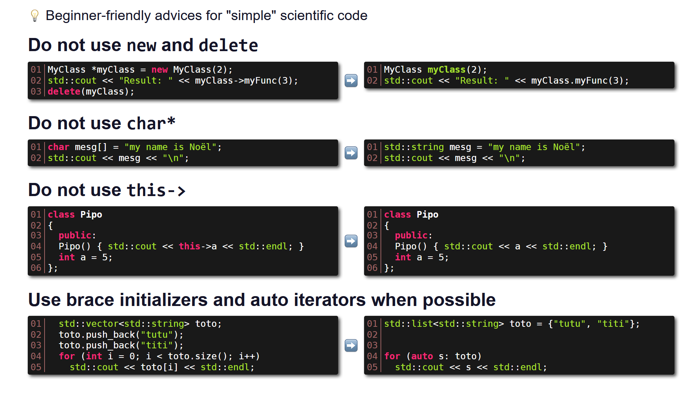
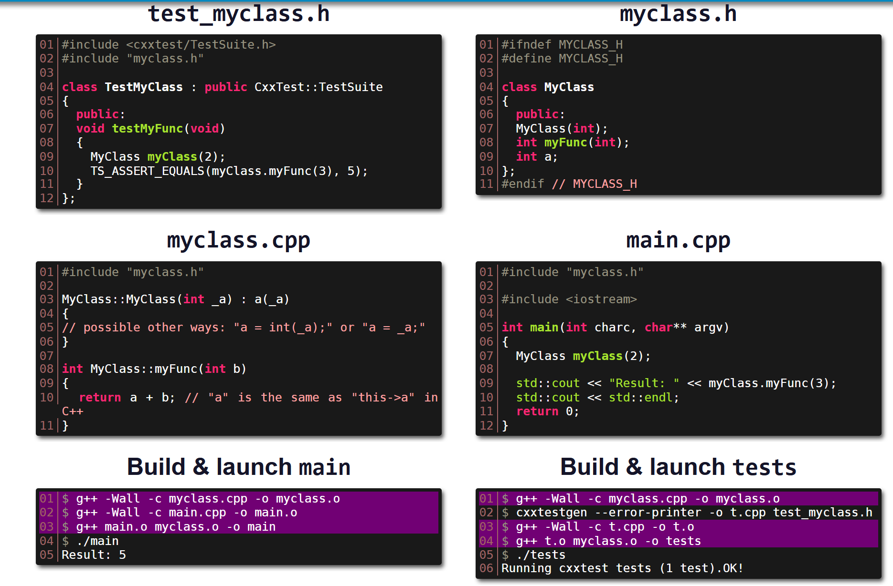
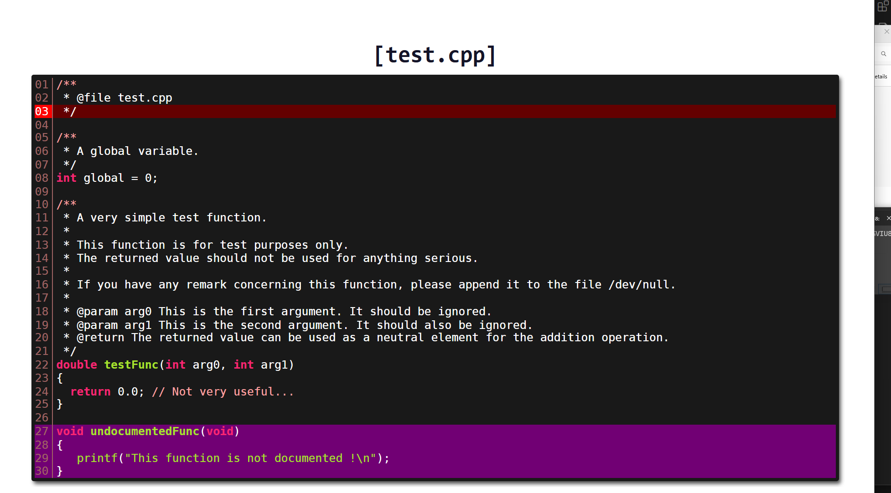

See [../python](../python) for comparisons

## C++ norms

- https://www.learncpp.com
- https://en.cppreference.com/w/cpp/language/history
- https://github.com/federico-busato/Modern-CPP-Programming
- https://github.com/burlachenkok/CPP_from_1998_to_2020/blob/main/Cpp-Technical-Note.md

```cpp
template<class T, class... Args>
std::enable_if_t<!std::is_array<T>::value, std::unique_ptr<T>>
make_unique(Args&&... args)
{
    return std::unique_ptr<T>(new T(std::forward<Args>(args)...));
}
```

### CPPCon

[Back to basics: Modern C++](https://www.youtube.com/watch?v=xnqTKD8uD64)

#### Defaults

```
In/Out: f(&X)
Copy:	f(const &X)
```

#### Raw pointers , Unique Pointers, make_unique

```cpp
#C++98 vs C++11/14

widget* factory();		<=> std::unique_ptr<widget> factory();
widget* w = factory();		<=> std::unique_ptr<widget> w = factory();		<=> auto w = factory();

gadget* g = new gadget();	<=> std::unique_ptr<gadget> g = make_unique<gadget>();	<=> auto g = make_unique<gadget>();
```

#### Unique pointers & Inheritance

```cpp    
#C++98
base *pb = new derived();

#C++14
unique_ptr<base> = make_unique<derived>();

# explicit pointer conversion
auto pb = unique_ptr<base>{make_unique<derived>();
```

#### Shared pointers

```cpp
shared_ptr<widget> g_p

// DONT PASS f(*g_p)

void my_code(){
	auto pint = g_p	// 1++ for whole reference tree
	f(*pin);	//ok, *local
	pin->foo();	//ok, *local->
}
```

#### Left to right: Auto

```cpp
auto e = employee{empid};
auto x = 42.f;
auto x = "42"s;
audo func ( double) -> int;
auto func = [=]( double) {/*...*/};

using dict = std::set<string>;

template<class T>
using myvec = std::vector<T,myalloc>
```

## Cmake

Voir [devops](../../devops) pour `ctest`

- https://enccs.github.io/cmake-workshop/cmake-syntax/
- https://enccs.github.io/cmake-workshop/hello-ctest/


**Add dependancies:**

- https://cmake.org/cmake/help/latest/module/FetchContent.html

```bash
# or submodules
git submodule add https://github.com/enterprise/project_dep.git external/project_dep
add_subdirectory(external/project_dep)
```

**Usage:**

```bash
cmake -DSOURCE_FILES="src/main.cpp;src/algo.cpp" -DUSER_FLAGS="-lGL -lGLU -lglut" -S . -B build
cmake --build build -j$(nproc) --target gpu
```

**Debug:**

```bash
mkdir build && cd build
cmake -DSOURCE_FILES="src/main.cpp;src/algo.cpp" -DUSER_FLAGS="-lGL -lGLU -lglut" ..
make VERBOSE=3 gpu
```

**Tests:**

```bash
# "root" CMakeLists.txt
...
enable_testing()

option(BUILD_TESTS "Build the tests" ON)
if(BUILD_TESTS)
    add_subdirectory(tests)
endif()
...
set(SOURCE_FILES src/main.cpp src/algo.cpp)
```

```bash
# tests/CMakeLists.txt
enable_testing()
set(TEST_SRC_FILES ../src/main.cpp ../src/algo.cpp test_algo.cpp)

include_directories(${USER_INCLUDE_PATHS})
link_directories(${USER_LIB_PATHS})
link_libraries(${USER_LIBS})

add_executable(test_algo ${TEST_SRC_FILES})
set_target_properties(test_algo PROPERTIES RUNTIME_OUTPUT_DIRECTORY ${CMAKE_BINARY_DIR}/tests)
add_test(NAME test_algo COMMAND ${CMAKE_BINARY_DIR}/tests/test_algo)
target_compile_options(test_algo PRIVATE ${COMMON_COMPILE_FLAGS})
target_link_libraries(test_algo PRIVATE ${COMMON_LINK_FLAGS})
set_target_properties(test_algo PROPERTIES RUNTIME_OUTPUT_DIRECTORY ${CMAKE_BINARY_DIR}/tests)
```

in the build
```bash
cd build
make help
make test1
make tests

cmake -R test1
ctest -j4 --output-on-failure -V
```

without moving
```bash
cmake --build build/tests --target test1
ctest --test-dir build -R test1 -V	#-j4 --output-on-failure 
```

## Notes

- `struct{}` is a `Class{}` with all public members, with RAII all constructors/destructors initialized by default (struct are useful for a small project, but Class are better)
- see `shared_pointers` for memory management
- use `nullptr` (cast/overload NULL = 8*'\x00')

*Modern C++(11)*

- https://www.intel.com/content/www/us/en/docs/sycl/introduction/latest/index-001.html




