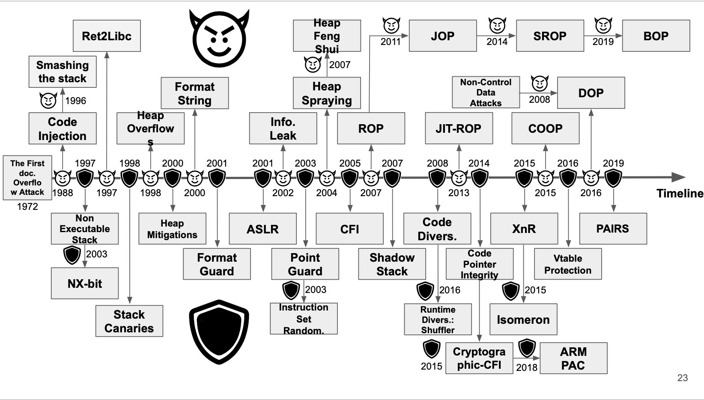
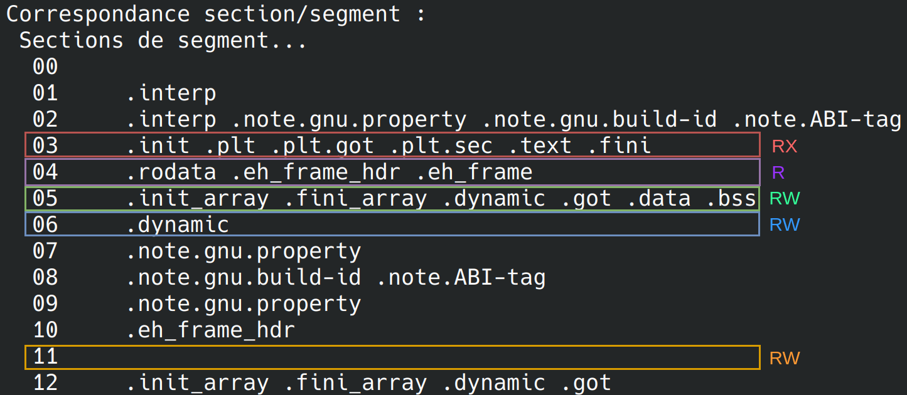
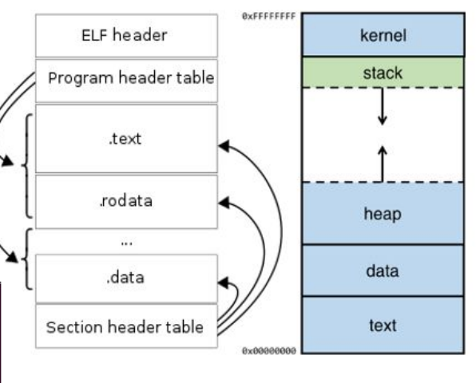
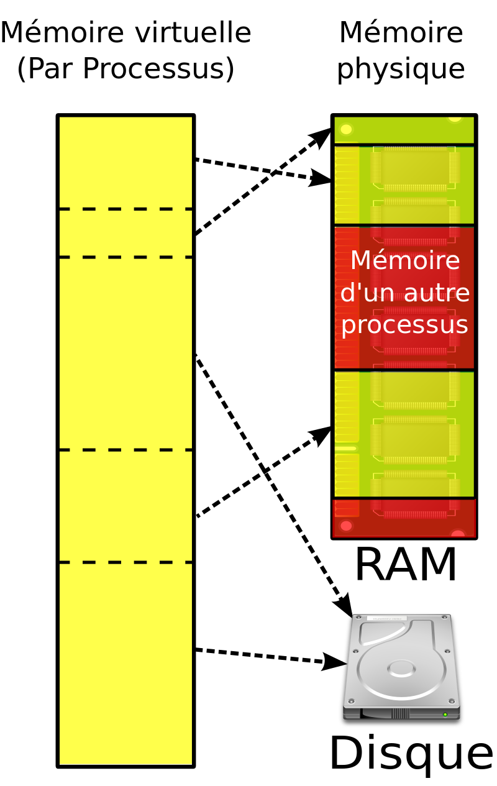
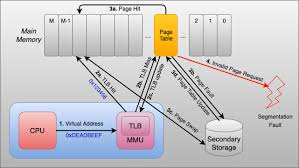
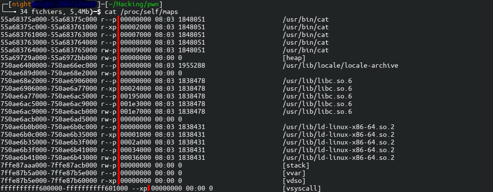
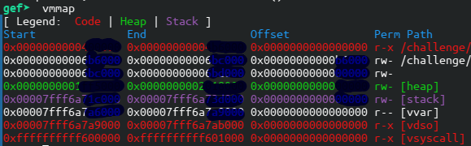

# Prérequis

- [Prog - C](../prog/c_memo/undefined_behaviours/)
- [Prog - Asm](../prog/asm_emulation/)
- [Reverse](../reverse)
- https://github.com/hackclub/some-assembly-required
- https://beta.hackndo.com/rappels-d-architecture/
- https://github.com/wirasecure/pentest-notes/blob/master/buffer_overflow/assembly/course_notes.md


## Tutos

- https://github.com/RPISEC/MBE
- https://github.com/rosehgal/BinExp
- https://training.tosch.io/appsec101
- https://github.com/guyinatuxedo/nightmare
- https://github.com/ayoubfaouzi/cpu-internals
- https://github.com/larsbrinkhoff/awesome-cpus
- https://bases-hacking.org/failles-applicatives.html
- https://wiki.zenk-security.com/doku.php?id=failles_app
- https://www.cgsecurity.org/Articles/SecProg/buffer.html
- https://web.archive.org/web/20241002005448/http://own2pwn.fr/
- https://cyber.gouv.fr/publications/regles-de-programmation-pour-le-developpement-securise-de-logiciels-en-langage-c


### Analysis

- [Audit code: Reversing Binaries](https://github.com/4nuit/Hacking/tree/master/audit_code#reversing-binaries-blackbox)
- https://codeql.github.com/
- https://github.com/NASA-SW-VnV/ikos
- https://github.com/weggli-rs/weggli
- https://www.lazenca.net/display/TEC/03.Analysis
- https://www.lazenca.net/display/TEC/04.Fuzzing

```bash
#https://github.com/0xdea/weggli-patterns
weggli '{_ $buf[_]; $buf[_]=_;}' .

#https://github.com/synacktiv/Weggli_rules_SSTIC2023 
bash dangerous_functions.qry binary.c
bash malloc_overflow.qry  binary.c
bash stack.qry binary.c


#https://github.com/0xdea/semgrep-rules
#https://github.com/semgrep/semgrep-rules/
semgrep --config ~/semgrep-rules/rules/ --severity ERROR --severity WARNING --sarif --sarif-output=pwn.sarif .
```

```bash
#www.lazenca.net
scan-build gcc main.c
scan-build: Using '/usr/bin/clang-18' for static analysis

clang -Wall -Wextra -std=c99 -fsanitize=address -g -o main main.c && ./main

valgrind --tool=memcheck --leak-check=full ./main
```

### Beginning (Stack/Heap)

- https://www.youtube.com/c/PinkDraconian
- https://www.youtube.com/@paulviel5931
- https://www.youtube.com/@que20
- [CryptoCat](https://www.youtube.com/watch?v=wa3sMSdLyHw)

## Cheatsheets

- [ELF Format Cheatsheet](https://gist.github.com/x0nu11byt3/bcb35c3de461e5fb66173071a2379779)
- [Pwntools cheatsheet](https://gist.github.com/anvbis/64907e4f90974c4bdd930baeb705dedf)
- [Pwndbg cheatsheet](https://pwndbg.re/CheatSheet.pdf)
- https://ir0nstone.gitbook.io/notes/
- https://www.ctfrecipes.com/pwn/
- https://github.com/nobodyisnobody/docs
- https://ctf-wiki.mahaloz.re/pwn/readme/
- https://hackmd.io/@u1f383/pwn-cheatsheet
- https://github.com/xairy/linux-kernel-exploitation
- https://www.lazenca.net/display/TEC/05.Basic+exploitation+techniques


### Common Issues

- https://github.com/OpenToAllCTF/Tips
- https://github.com/Naetw/CTF-pwn-tips


| **Byte** (Hex Value) | **Problematic Methods** |
|----------------------|-------------------------|
| Null Byte \0 (0x00)  |         strcpy          |
|----------------------|-------------------------|
| Newline \n (0x0a)    | scanf gets getline fgets|
|----------------------|-------------------------|
| Return \r (0x0d)     | scanf                   |
|----------------------|-------------------------|
|     Space (0x20)     | scanf                   |
|----------------------|-------------------------|
|     Tab \t (0x09)    | scanf                   |
|----------------------|-------------------------|
|     Del (0x7f)       | protocols (telnet,VT100)|


### Protections

- https://www.ctfrecipes.com/pwn/protections/
- https://connect.ed-diamond.com/MISC/misc-062/la-securite-applicative-sous-linux
- https://wiki.zenk-security.com/doku.php?id=failles_app:aslr
- https://www.dailysecurity.fr/la-stack-smashing-protection/
- [https://ironhackers.es/en/tutoriales/pwn-rop-bypass-nx-aslr-pie-y-canary](https://web.archive.org/web/20240914140056/https://ironhackers.es/en/tutoriales/pwn-rop-bypass-nx-aslr-pie-y-canary/)
- https://blog.siphos.be/2011/07/high-level-explanation-on-some-binary-executable-security/
- https://media.blackhat.com/bh-us-10/whitepapers/Meer/BlackHat-USA-2010-Meer-History-of-Memory-Corruption-Attacks-wp.pdf


```bash
(hacking) night@me:~/towerctf$ checksec vuln
[*] '/home/night/towerctf/vuln'
    Arch:       amd64-64-little
    RELRO:      No RELRO
    Stack:      No canary found
    NX:         NX enabled
    PIE:        No PIE (0x400000)
    Stripped:   No
    Debuginfo:  Yes
```

Exploits often follows protections. See **Segmentation** section for further details.


| **Protection**               | **Description**                                                | **Bypass**                    | **Disable**                                               |
|------------------------------|----------------------------------------------------------------|-------------------------------|-----------------------------------------------------------|
| **RELRO**                     | Makes GOT/PLT read-only to prevent overwriting.                | Ret2libc.                | `gcc -z noreloc`                                           |
| **NX** or **DEP**                  | Non-executable stack to prevent code execution.           | Ret2libc.                | **Linux**: `gcc -z execstack`<br>**Windows**: `bcdedit /set nx AlwaysOff` |
| **ASLR** (+PIE for Windows)   | Randomizes stack/heap/libs base addresses.                    | Leak address/Bf, Ret2plt.     | **Linux**: `echo "0" > /proc/sys/kernel/randomize_va_space`<br>**Windows**: `bcdedit /set noaslr` |
| **PIE**                       | Randomizes binary (text/data) section offsets.                | Leak base address, ROP.       | `gcc -no-pie`                                             |
| **SSP/Canary**                | Protects against stack overflows with a canary value.         | Leak canary value, overwrite return address. | `gcc -fno-stack-protector`                                 |
| **FORTIFY_SOURCE**            | Compiler hardening for buffer overflows.                      |                               | `gcc -D_FORTIFY_SOURCE=0`                                  |
| **KASLR**                     | Randomizes kernel memory addresses.                           | Leak kernel memory (via debug or vuln). | **Linux**: `echo 0 > /proc/sys/kernel/randomize_va_space`   |
| **SMEP**                      | Prevents executing user-mode code in kernel mode.             | Use ROP in kernel.            |                                                           |
| **KPTI**                      | Isolates kernel and user-space memory to mitigate Spectre/Meltdown. | Kernel exploit.              |                                                           |
| **Secure Boot / Module Signing** | Only signed kernels/modules allowed.                          | Exploit misconfigurations or use custom signed modules. |                                                           |
| **Control Flow Integrity (CFI)** | Prevents control flow hijacking.                              | Use ROP gadgets.              |                                                           |
| **UEFI Secure Boot**          | Ensures only trusted bootloaders/kernel images are loaded.    | Exploit firmware vuln to bypass. |                                                           |





## Challenges

- https://pwnable.kr/ # conseillé
- https://exploit.education #à faire
- https://pwn.college # à faire
- https://sourcery.pwnadventure.com/
- https://github.com/bkerler/exploit_me # ARM stack bof
- https://app.tower-ctf.fr/adventure/map/carte-des-aventuriers-du-pwn
- https://wiki.zenk-security.com/doku.php?id=exploit_exercises_protostar
- https://www.root-me.org/en/Challenges/App-System/

## Outils

- [GEF - Installer](./gef_bata24_install.sh)
- https://libc.rip/
- [reversing bits - cheatsheets](https://github.com/mohitmishra786/reversingBits/tree/main/src)
- [libvirt](https://libvirt.org/)
- [glibc matrix all in one](https://github.com/matrix1001/glibc-all-in-one)
- [One Gadget](https://github.com/david942j/one_gadget)
- [pwntools](https://docs.pwntools.com/en/stable/) or [ptrlib](https://github.com/ptr-yudai/ptrlib/) for windows
- [pwntools - patch elf](https://www.aldeid.com/wiki/Pwntools)
- [pwninit](https://github.com/io12/pwninit/)
- [ROPgadget](https://github.com/JonathanSalwan/ROPgadget)
- [Zeratool](https://github.com/ChrisTheCoolHut/Zeratool)   # Autopwner
- https://github.com/guyinatuxedo/remenissions              # Autopwner
- https://shell-storm.org/shellcode/index.html
- https://github.com/nobodyisnobody/tools/tree/main/pwn2204

### Setup notes

#### Pwntools notes

```python
p.send(payload)		# do a sendline() without "\n" (e.g without overflowing a following read()
p.clean(1)		# do a recvline() + clean buffer
pwn template -h		# alternative to gdbscript + generates boilerplate
pwn asm -h		# generates shellcode from any asm
pwn debug --exec ./ch10 # same as clean_exploit_testing.py but from the command line
```

See [full_exploit_testing.py](./full_exploit_testing.py) :

```bash
pwn template ./ch20 --quiet --host challenge05.root-me.org --port 50000
```

**Tmux, GDB & Qemu integration** (How to edit the generated template)

```python
# Tmux integration
# https://halb.it/posts/pwntools-gdb/
context.terminal = ['tmux', 'splitw', '-h']

# GDB integration without aslr

if args.GDB:
    return gdb.debug([exe.path] + argv, gdbscript=gdbscript, *a, **kw, aslr=False)
```

```python
# QEMU user integration (optional)
if args.GDB:
    io = process(["qemu-aarch64", "-g", "12345", elf.path])
elif args.LOCAL:
    io = process(["qemu-aarch64", elf.path])
```

```bash
tmux

# LOCAL DEBUGGING
python solve.py LOCAL GDB ./vuln

# REMOTE SOLVE
python solve.py 
```

#### Patchelf & Pwninit notes

Check also [../reverse](../reverse) with patchelf

```bash
#yay -S pwninit || cargo install pwninit 
$ file ch46
ch46: ELF 32-bit LSB executable, ARM, EABI5 version 1 (SYSV), dynamically linked, interpreter /lib/arm/2.27/lib/ld-linux.so.3, BuildID[sha1]=a9888dc2282c6a76631e4dda710d1251a5faaead, for GNU/Linux 3.2.0, not stripped
$ sudo dpkg --add-architecture armel
$ sudo apt update sudo apt install libc6:armel
$ pwninit --bin ch46 --ld /usr/arm-linux-gnueabi/lib/ld-linux.so.3
bin: ch46
ld: /usr/arm-linux-gnueabi/lib/ld-linux.so.3

copying ch46 to ch46_patched
running patchelf on ch46_patched
$ qemu-arm -d strace ./ch46_patched
Give me data to dump:
```

### Arguments et payload

- https://www.gnu.org/savannah-checkouts/gnu/bash/manual/bash.html#Process-Substitution
- https://reverseengineering.stackexchange.com/questions/13928/managing-inputs-for-payload-injection

```bash
# Payload dans argv[1]
./vuln $(cat payload.txt)

# Payload dans le buffer 

## Python, encoding
python2 -c 'print "AAAA\n.."' | ./vuln
python3 -c 'import sys; sys.stdout.buffer.write(b"AAAA\n" + b"nope\n")'

## In GDB
## Does NOT filter out all NULL bytes 
run < <(python3 -c 'import sys; sys.stdout.buffer.write(b"AAAA\n" + b"nope\n")')

## Keep shell
(echo -ne <payload> ; cat) | ./vuln
(echo -ne <payload> ; cat) | qemu-mips -g 1234 ./vuln
```

### Debuggers

See [pwntools + gdb clean exploit testing](./clean_exploit_testing.py) for **pwntools**.

- https://github.com/bata24/gef (linux)
- https://learn.microsoft.com/en-us/windows-hardware/drivers/debugger/getting-started-with-windbg (windows)
- https://drdobbs.com/cpp/multithreaded-debugging-techniques/199200938?pgno=6

#### GDB vanilla (bad)

```bash 
break main+3
hbreak main+3
find <start>, +<length>, <data...>      // search string
info breakpoints                        // see breakpoints
info frame                              // see saved registers
info proc mappings                      // see memory = vmmap
next instruction                        // execute ni
step instruction                        // execute and steps into function
x/2xw 0xdeadbeef                        // prints out 2 addresses in x86
x/2xg 0xdeadbeef                        // prints out 2 addresses in x86_64
p/d (0xffc485bc-0xffc484ac)/4           // prints out offset between two addresses in x86
```

#### GEF

```bash
grep "/bin/sh"                          // search string
grep 0x181d5000                         // search value
search-pattern "/bin/sh"		// grep for bata24 gef fork
vmmap                                   // see virtual address segmentation  -> useful for getting writable address
hexdump dword --size 100 0xbffff404 	// get 100 addresses post offset 404 -> useful for nops/locating shellcode
telescope                               // expand stack 
canary                                  // get the SSP value if active
got                                     // prints the global offset table once the binary is run (starti). useful for GOT overwrite.
                                        // Name              | PLT            | GOT            | GOT value
                                        // exit              | 0x000000401160 | 0x000000404060 | 0x0000004010c0 <.plt+0xa0>
``` 

### Emulation

- https://people.debian.org/~aurel32/qemu/ # QEMU Images for all architectures
- https://unix.stackexchange.com/questions/499752/qemu-user-get-memory-maps-while-debugging-remotely
- https://nicolargo.developpez.com/tutoriels/virtualisation/apprentissage-qemu-libvirt-exemple/

#### QEMU + GDBServer notes

**Local setup** (e.g under x86/amd64 proc , using docker for debian (gdb-multiarch available))

```bash
#tmux
#1st term
qemu-arm -L /usr/arm-linux-gnueabihf -g 1234 ./arm_bin
#2nd term
gdb-multiarch -q \
  -ex 'source ~/.gdbinit' \
  -ex 'set architecture arm' \
  -ex 'set sysroot /usr/arm-linux-gnueabihf' \
  -ex 'file arm_bin' \
  -ex 'target remote localhost:1234' \
  -ex 'break main' \
  -ex 'continue' \
  -ex 'layout split'
```

**Remote setup (Libvirt VM)** (e.g under arm/aarch64 proc)

```bash
#see ../reverse for custom vms (LibVirt, arm_now -> opkg broken)
#fix missing libc/path (VM/emulated hardware)
dpkg --add-architecture armel armhf
apt update && apt install libc6:armel libc6:armhf
pwninit

tmux
#1st term
gdbserver localhost:1234 ./arm_bin
#2nd term
gef -ex "target remote localhost:1234"
```

## Basic stuff; common hints & pitfalls

### Bash environment/gdb tricks

**-i only sets the following variable on the stack**

Probleme: decalage de l'environnement

```bash
env -i pwn_string="cat /etc/passwd" gdb-gef ./ex3
# ou dans gdb
# unset env LINES
# unset env COLUMNS
```

```bash
b *main
r
x/s *(environ)
#entry to see other env. variables
```

```bash
env -i SHELLCODE=$(echo -ne "...") gdb -gef ./vuln
```

- https://security.stackexchange.com/questions/51375/why-stack-is-not-at-the-same-address-when-exec-running-in-gdb
- https://www.root-me.org/fr/Documentation/Applicatif/Debordement-de-tampon-utiliser-l-environnement

[Automatiser la création de shellcodes](./shellcodes/doall.sh)
[Connaître l'addresse d'une variable d'env - getenv.c](./shellcodes/getenv.c)

### SUID - Permissions

- https://www.root-me.org/?page=forum&id_thread=12932
- https://stackoverflow.com/questions/32455684/difference-between-real-user-id-effective-user-id-and-saved-user-id
- https://tbhaxor.com/demystifying-suid-and-sgid-bits/
- https://book.hacktricks.xyz/linux-hardening/privilege-escalation/euid-ruid-suid/
- https://podalirius.net/fr/reverse-shells/unix-shells-dropping-suid-rights-in-shellcodes/

`int setuid(uid_t uid);`

```txt
Set le euid (modifie les droits du binaire SUID -> seul intérêt = drop les privilèges)
```

**Méthode**:

`uid_t geteuid(void);`

```txt
Retourne l'euid du binaire SUID -> on souhaite changer nos droits ruid <- euid
```

**Attention: par défaut system() appelle bash, qui drop les priv en forçant euid<-rid**

- contournement avec `bash -p`
- contournement avec `setreuid(geteuid(),geteuid())`

`int setreuid(uid_t ruid, uid_t euid);`
`int setresuid(uid_t ruid, uid_t euid, uid_t suid);`

```txt
Set le euid et surtout le ruid de l'utilisateur attaquant le binaire SUID
setreuid(geteuid(),geteuid())
```

Intérêt: forcer rid<-euid et ainsi appeler bash en tant qu'user privilégié et identifé par rid=euid du binaire

De même

```
setresuid(geteuid(),geteuid(),geteuid())
```

### Race Conditions

- https://en.wikipedia.org/wiki/Time-of-check_to_time-of-use

### Assembleur et registres (CPU x86/amd64)

- [Comparing Modern x86 and ARM Assembly Language](https://www.cs.uaf.edu/2011/spring/cs641/lecture/02_10_assembly.html)
- https://www.root-me.org/fr/Documentation/Applicatif/Memoire-introduction
- https://flint.cs.yale.edu/cs421/papers/x86-asm/asm.html

[Section memo asm](./asm)


### Endianness

- https://serverfault.com/questions/163487/how-to-tell-if-a-linux-system-is-big-endian-or-little-endian

### Syscalls (Linux & Windows)

```
Un appel système est exactement ce que son nom indique : une demande au système d'exploitation de faire quelque chose au nom du programme de l'utilisateur.
Les appels système sont des fonctions utilisées dans le noyau lui-même.
Pour le programmeur, l'appel système apparaît comme un appel de fonction C.
```

- https://syscalls.mebeim.net/?table=x86/64/x64/v6.6
- https://j00ru.vexillium.org/syscalls/nt/64/
- https://fr.wikipedia.org/wiki/Ioctl
- https://fr.wikipedia.org/wiki/Interrupt_Descriptor_Table

- **Système de fichiers**
    - create, open, close, read, write, lseek3 , dup, link, unlink, stat, fstat, access, chmod, chown, umask, ioctl

- **Contrôle des processus**
    - execve, fork, wait, _exit, getuid, geteuid, getgid, getegid, getpid, getppid, signal, kill, alarm, chdir

- **Communication inter-processus**
    - pipe4, msgget, msgsnd, msgrcv, msgctl, semget, semop, shmget, shmat, shmdt5


## Segmentation et Architecture (MMU,TLB)

- https://www.root-me.org/fr/Documentation/Applicatif/Memoire-utilisation
- https://www.root-me.org/fr/Documentation/Applicatif/Memoire-segmentation
- https://beta.hackndo.com/rappels-d-architecture/
- https://www.0x0ff.info/2014/segmentation-memoire-buffer-overflow/

[Segmentation de la mémoire - memory_layout.c](memory_layout.c)

### ELF Format 

- [ELF Format Cheatsheet](https://gist.github.com/x0nu11byt3/bcb35c3de461e5fb66173071a2379779)




Source: https://reverse.zip/posts/introduction_au_reverse_partie_3/

#### ELF Magic numbers

- [How programs get run - lwn.net](https://lwn.net/Articles/631631/)
- https://docs.pwntools.com/en/stable/elf/elf.html
- https://eli.thegreenplace.net/2012/08/13/how-statically-linked-programs-run-on-linux


### Virtual vs Physical memory

- https://fr.wikipedia.org/wiki/Fragmentation_(informatique)
- https://fr.wikipedia.org/wiki/M%C3%A9moire_virtuelle
- https://fr.wikipedia.org/wiki/Gestionnaire_de_m%C3%A9moire_virtuelle




- https://en.wikipedia.org/wiki/Memory_segmentation
- https://en.wikipedia.org/wiki/Memory_management_unit
- https://en.wikipedia.org/wiki/Page_table
- https://en.wikipedia.org/wiki/Translation_lookaside_buffer
- https://www.root-me.org/fr/Documentation/Applicatif/Memoire-segmentation
- https://stackoverflow.com/questions/41090469/linux-kernel-how-to-get-physical-address-memory-management



#### Pages

```bash
cat /proc/<pid>/maps
```



#### Frames, Sections

**GEF/Pwndbg vmmap**

NB: `code(text)|bss|data|heap|stack|kernel(vvar,vdso,vsyscall)` (bss|data are not named like [stack]). Kernel land=50% of the program, accessible only in kernel mode, from 0xbfffffffff to 0xffffffffff.



### IPC, Process Scheduling

- https://fr.wikipedia.org/wiki/Communication_inter-processus
- https://fr.wikipedia.org/wiki/Signal_(informatique)
- https://github.com/mohitmishra786/exploring-os
- https://drive.google.com/drive/folders/16FnbMmbfreb2SJX0px-5ce5KFq0Pjd1M
