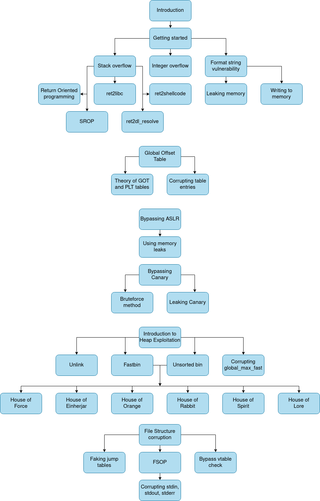

# Prérequis

Voir [Reverse](../reverse)

## Doc :

- Vidéos/Plateformes/Docs: https://mksec.fr/tricks/pwn_ressources/

- https://www.mycybersharing.com/cybersecu/app_sys_start_gradually/

- Overview du pwn en fr: https://own2pwn.fr 

- https://ir0nstone.gitbook.io/notes/

- https://syscall.sh/

- https://github.com/guyinatuxedo/remenissions/blob/master/docs/exploit-methods.md

## Cheatsheet

[Pwntools](https://gist.github.com/anvbis/64907e4f90974c4bdd930baeb705dedf)

- https://github.com/Naetw/CTF-pwn-tips

- https://chovid99.github.io/posts/tcp1p-ctf-2023/#pwn

- https://libc.blukat.me


### Tools

- https://github.com/nobodyisnobody/tools/tree/main/pwn2204

## Arguments et payload

- Si en argv[1]: ./vuln $(payload) 
- Sinon : python -c "print 'AAAA\n..'" | ./vuln
- https://reverseengineering.stackexchange.com/questions/13928/managing-inputs-for-payload-injection


- Voir `./asm`
- https://0xninja.fr/xchg-rax-rax/

## Assembleur et registres

### 32 vs 64 bits

En 32 bits, tous les paramètres sont poussés vers la pile avant que la fonction ne soit appelée (STDCALL).
En 64 bits, cependant, les 6 premiers sont stockés dans les registres RDI, RSI, RDX, RCX, R8 et R9 respectivement selon la convention d'appel (FASTCALL, dépend de l'OS).

- https://beta.hackndo.com/conventions-d-appel/
- https://beta.hackndo.com/rappels-d-architecture/

### Débuggers (pour binaires ELF (Linux), plus courants en pwn)

voir `../tutos` (cours/prog C)

- [gdb pour pwn](https://tc.gts3.org/cs6265/2019/tut/tut01-warmup1.html) , pou r la **stack** [gdb-gef](https://github.com/hugsy/gef), pour la **heap** [pwndbg](https://github.com/pwndbg/pwndbg/blob/dev/FEATURES.md)


- `r2`: https://github.com/radareorg/radare2


```bash
#obtenir le shell code en arm, 64 bits
rasm2 -aarm -b64 -C 'nop'
```

*Note*: gdb modifie l'environement en ajoutant $LINES $COLUMNS et le nom du prog avec un path absolu, le décalage n'est que dans la stack, pour corriger:

```bash
unset env LINES
unset env COLUMNS
```

- https://security.stackexchange.com/questions/51375/why-stack-is-not-at-the-same-address-when-exec-running-in-gdb

voir aussi les outils sous `./windows`

### Endianness

- https://serverfault.com/questions/163487/how-to-tell-if-a-linux-system-is-big-endian-or-little-endian

### Syscalls

https://chromium.googlesource.com/chromiumos/docs/+/HEAD/constants/syscalls.md

## Stack et registres:


[ret2stack](./stack)

### Protections

Erratum : 

- **ASLR** : randomise base address 
- **PIE** : randomise offset 

[CANARY](https://vozec.fr/writeups/tweetybirb-killerqueenctf-2021/) :

- aussi appelé **SSP**: Stack Smashing Protector
- protection qui peut être sur la pile , change si écrasé : segfault 
- peut alors être leak : https://learn-cyber.net/article/Understanding-and-Defeating-the-Canary
- https://j00ru.vexillium.org/slides/2015/insomnihack.pdf

## Shellcodes

https://shell-storm.org/shellcode/index.html

```bash
nasm -f elf32 shellcode.s
objcopy -O binary -K shellcode shellcode.o shellcode.bin
```

[ret2shellcode](./shellcode)

## Format Strings

[./format_string.md](./format_string.md)

- https://axcheron.github.io/exploit-101-format-strings/
- https://docs.pwntools.com/en/stable/fmtstr.html
- [Patriot CTF - GOT Overwrite](https://github.com/4nuit/Writeup/tree/master/2023/Patriot/pwn/printshop)

## Ordonnancement, Mémoire virtuelle

- https://drive.google.com/drive/folders/16FnbMmbfreb2SJX0px-5ce5KFq0Pjd1M

## Heap

[heap](./heap)



## Kernel

- https://lkmidas.github.io/posts/20210123-linux-kernel-pwn-part-1/

- Kernelmap interactive: https://makelinux.github.io/kernel/map/

- Kernel: https://0xax.gitbooks.io/linux-insides/content/

### ARM - Egghunter

```bash
arm-linux-gnueabihf-as -o hunter hunter.s
arm-linux-gnueabihf-ld -N hunter.o -o hunter
arm-linux-gnueabihf-objcopy -O binary hunter hunter.bin
hexdump -v -e '"\\""x" 1/1 "%02x" ""' hunter.bin
```
