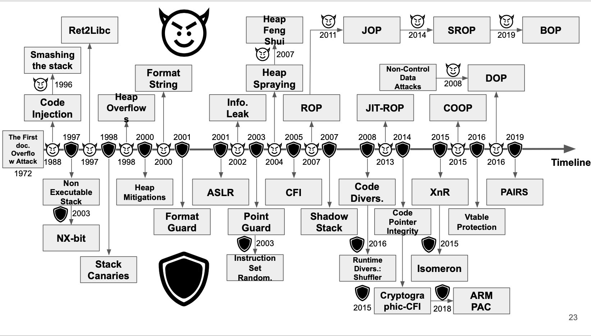
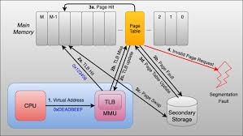
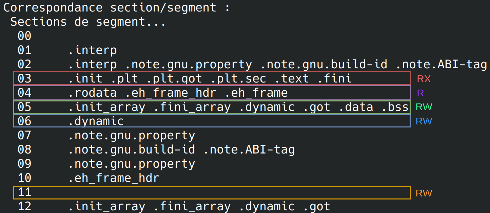
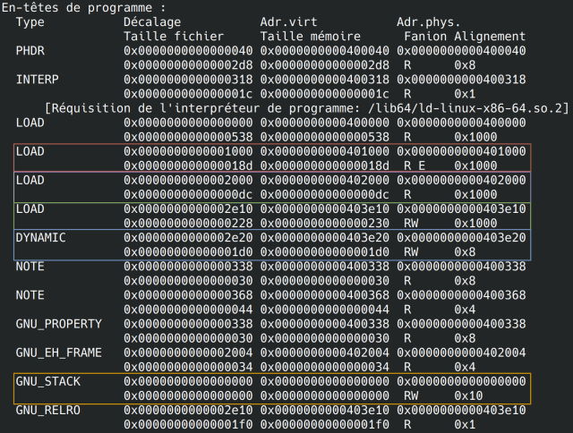
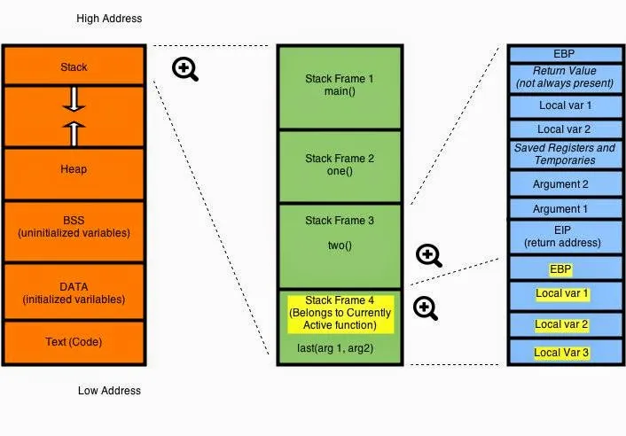
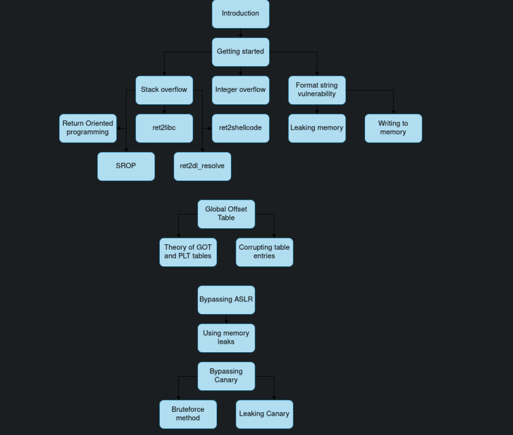
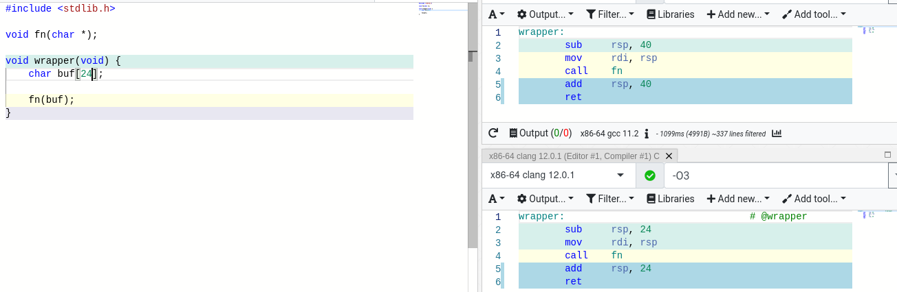
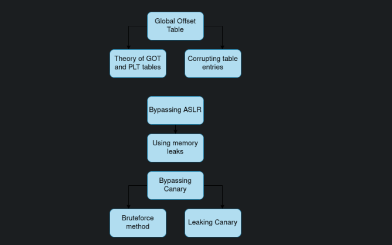
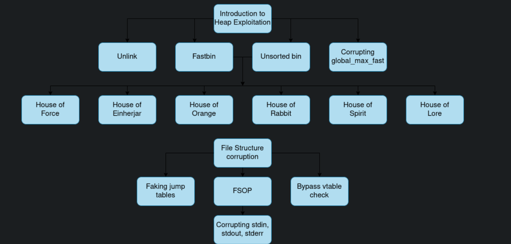

# Prérequis

Voir [Reverse](../reverse)

- https://beta.hackndo.com/rappels-d-architecture/
- https://fr.wikibooks.org/wiki/Fonctionnement_d'un_ordinateur

## Doc :

- https://training.tosch.io/appsec101
- https://www.mycybersharing.com/cybersecu/app_sys_start_gradually/

- Overview du pwn en fr: https://own2pwn.fr 
- https://hackcess.org/pdf/Pwn_like_its_2007.pdf

- https://ir0nstone.gitbook.io/notes/
- https://github.com/guyinatuxedo/remenissions/blob/master/docs/exploit-methods.md
- https://www.corelan-training.com/index.php/training/heap/

## Challenges

- https://pwnable.kr/ # conseillé
- https://exploit.education #à faire
- https://pwn.college # à faire

## Cheatsheet

- https://mksec.fr/tricks/pwn_ressources/

- [pwntools tuto](https://gist.github.com/anvbis/64907e4f90974c4bdd930baeb705dedf)
- https://github.com/Gallopsled/pwntools-tutorial
- https://github.com/Naetw/CTF-pwn-tips
- https://chovid99.github.io/posts/tcp1p-ctf-2023/#pwn
- http://dbp-consulting.com/tutorials/debugging/
- https://libc.blukat.me



## Tools

- https://github.com/nobodyisnobody/tools/tree/main/pwn2204
- https://github.com/ptr-yudai/ptrlib (windows)

## Bash

- https://en.wikibooks.org/wiki/Bash_Shell_Scripting

### Environnement

```bash
env
env -i MYVAR=10 gdb ./prog
env -i pwn_string="cat /etc/passwd" gdb-gef ./ex3
```

*Note*: gdb modifie l'environement en ajoutant $LINES $COLUMNS et le nom du prog avec un path absolu, le décalage n'est que dans la stack, pour corriger:

```bash
unset env LINES
unset env COLUMNS
```

- https://security.stackexchange.com/questions/51375/why-stack-is-not-at-the-same-address-when-exec-running-in-gdb
- https://www.root-me.org/fr/Documentation/Applicatif/Debordement-de-tampon-utiliser-l-environnement

[Cqqonnaître l'addresse d'une variable d'env - getenv.c](./getenv.c)

### SUID - Permissions

- https://www.root-me.org/?page=forum&id_thread=12932
- https://stackoverflow.com/questions/32455684/difference-between-real-user-id-effective-user-id-and-saved-user-id
- https://book.hacktricks.xyz/linux-hardening/privilege-escalation/euid-ruid-suid/
- https://tbhaxor.com/demystifying-suid-and-sgid-bits/

`int setuid(uid_t uid);`

```txt
Set le euid (modifie les droits du binaire SUID -> seul intérêt = drop les privilèges)
```

**Méthode**:

`uid_t geteuid(void);`

```txt
Retourne l'euid du binaire SUID -> on souhaite changer nos droits ruid <- euid
```

**Attention: par défaut system() appelle bash, qui drop les priv en forçant euid<-rid**

- contournement avec `bash -p`
- contournement avec `setreuid(geteuid(),geteuid())`

`int setreuid(uid_t ruid, uid_t euid);`
`int setresuid(uid_t ruid, uid_t euid, uid_t suid);`

```txt
Set le euid et surtout le ruid de l'utilisateur attaquant le binaire SUID
setreuid(geteuid(),geteuid())
```

Intérêt: forcer rid<-euid et ainsi appeler bash en tant qu'user privilégié et identifé par rid=euid du binaire

De même

```
setresuid(geteuid(),geteuid(),geteuid())
```

### Race Conditions

- https://en.wikipedia.org/wiki/Time-of-check_to_time-of-use

## Assembleur et registres (CPU)

- https://www.root-me.org/fr/Documentation/Applicatif/Memoire-introduction

[Section memo asm](./asm)

### 32 vs 64 bits

En 32 bits, tous les paramètres sont poussés vers la pile avant que la fonction ne soit appelée (STDCALL).
En 64 bits, cependant, les 6 premiers sont stockés dans les registres RDI, RSI, RDX, RCX, R8 et R9 respectivement selon la convention d'appel (FASTCALL, dépend de l'OS).

- https://beta.hackndo.com/conventions-d-appel/
- https://beta.hackndo.com/rappels-d-architecture/

### Endianness

- https://serverfault.com/questions/163487/how-to-tell-if-a-linux-system-is-big-endian-or-little-endian

### Memo

- https://flint.cs.yale.edu/cs421/papers/x86-asm/asm.html

### Syscalls

```
Un appel système est exactement ce que son nom indique : une demande au système d'exploitation de faire quelque chose au nom du programme de l'utilisateur.
Les appels système sont des fonctions utilisées dans le noyau lui-même.
Pour le programmeur, l'appel système apparaît comme un appel de fonction C.
```

- https://syscalls.mebeim.net/?table=x86/64/x64/v6.6
- https://fr.wikipedia.org/wiki/Ioctl


- **Système de fichiers**

    - create, open, close, read, write, lseek3 , dup, link, unlink, stat, fstat, access, chmod, chown, umask, ioctl

- **Contrôle des processus**

    - execve, fork, wait, _exit, getuid, geteuid, getgid, getegid, getpid, getppid, signal, kill, alarm, chdir

- **Communication inter-processus**

    - pipe4, msgget, msgsnd, msgrcv, msgctl, semget, semop, shmget, shmat, shmdt5


## Segmentation et Architecture (MMU,TLB)

- https://www.root-me.org/fr/Documentation/Applicatif/Memoire-utilisation
- https://www.root-me.org/fr/Documentation/Applicatif/Memoire-segmentation
- https://beta.hackndo.com/rappels-d-architecture/
- https://www.0x0ff.info/2014/segmentation-memoire-buffer-overflow/

[Segmentation de la mémoire - memory_layout.c](memory_layout.c)

### Mémoire virtuelle vs physique

- https://fr.wikipedia.org/wiki/Fragmentation_(informatique)
- https://fr.wikipedia.org/wiki/M%C3%A9moire_virtuelle
- https://fr.wikipedia.org/wiki/Gestionnaire_de_m%C3%A9moire_virtuelle

**Multitâche (en temps et espace) permis par la mémoire virtuelle**


- https://en.wikipedia.org/wiki/Memory_segmentation
- https://en.wikipedia.org/wiki/Memory_management_unit
- https://en.wikipedia.org/wiki/Page_table
- https://en.wikipedia.org/wiki/Translation_lookaside_buffer
- https://www.root-me.org/fr/Documentation/Applicatif/Memoire-segmentation
- https://stackoverflow.com/questions/41090469/linux-kernel-how-to-get-physical-address-memory-management



```bash
readelf -l /bin/ls
```

1 segment = plusieurs sections





Source: https://reverse.zip/posts/introduction_au_reverse_partie_3/

### IPC: Ordonnancement des processus, grand mémo de ce qui précède

- https://fr.wikipedia.org/wiki/Communication_inter-processus
- https://fr.wikipedia.org/wiki/Signal_(informatique)

- https://drive.google.com/drive/folders/16FnbMmbfreb2SJX0px-5ce5KFq0Pjd1M
- https://github.com/4nuit/Systeme_Exploitation/blob/master/TP1/TP1_ARSE.pdf

## Exploitation

### Arguments et payload

- Si en argv[1]: ./vuln $(payload)
- Sinon : python -c "print 'AAAA\n..'" | ./vuln
- https://reverseengineering.stackexchange.com/questions/13928/managing-inputs-for-payload-injection

- Voir `./asm`
- https://0xninja.fr/xchg-rax-rax/

### Débuggers

```bash
gdb -q ./exploit
list 1
break 3 # break at 3 line of source code
```

### Core files

- https://unix.stackexchange.com/questions/89933/how-to-view-core-files-for-debugging-purposes-in-linux

```bash
ulimit -c unlimited
echo 'core' | sudo tee /proc/sys/kernel/core_pattern
```

### Find offset / 'A' padding

- https://hugsy.github.io/gef/commands/pattern/
- https://hugsy.github.io/gef/commands/search-pattern/

### Shellcodes

- https://blog.devgenius.io/understanding-the-stack-a-precursor-to-exploiting-buffer-overflow-8c6972fdb4ac

#### Principe

- https://www.root-me.org/fr/Documentation/Applicatif/Shellcode-introduction
- https://www.root-me.org/fr/Documentation/Applicatif/Shellcode-ecrire-un-bytecode
- https://www.root-me.org/fr/Documentation/Applicatif/Shellcode-caracteres-interdits


```bash
nasm -f elf32 shellcode.s
objcopy -O binary -K shellcode shellcode.o shellcode.bin
```

[ret2shellcode](./shellcode)

#### Technique plus simples (pas de calcul pour les NOP)



- *Find Offset (eip = return address)* (`msf-pattern_create -t 100` puis `msf-pattern_offset -q <contenu eip>`)

- *Find Shellcode Address*
	- *using previous esp (procedure n-1) in gdb* : `b *main; r $(python -c 'print('A'*<offset_eip>); print $esp`
	- *using environment*: `export LOGNAME = $(python -c "print('\x90'*100 + <shellcode>")` and use [./getenv LOGNAME](./getenv.c)

- Go to shell-storm 

- Exploit

```bash
./vuln $(python -c "print('A'*<offset_eip> + <addresse previous esp> + '\x90'*100 + <shellcode>
# OR
./vuln $(python -c "print('A'*<offset_eip> + <environment_address_var>)"
```

#### Outils

- https://hugsy.github.io/gef/commands/shellcode/
- https://shell-storm.org/shellcode/index.html
- radare2:

```bash
#obtenir le shell code en arm, 64 bits
rasm2 -aarm -b64 -C 'nop'
```

#### Gagner les privileges  - uid du binaire

- https://stackoverflow.com/questions/21337923/why-ptrace-doesnt-attach-to-process-after-setuid
- https://unix.stackexchange.com/questions/451048/from-which-version-does-bash-drop-privileges
- https://www.root-me.org/?page=forum&id_thread=12932

**=> prendre des shellcodes avec setreuid(geteuid,geteuid) ou passant "-p" dans execve**

## Stack

- https://zestedesavoir.com/articles/100/introduction-aux-buffer-overflows/



### Alignement

- https://stackoverflow.c
om/questions/1061818/stack-allocation-padding-and-alignment



```txt
It's a gcc feature controlled by -mpreferred-stack-boundary=n where the compiler tries to keep items on the stack aligned to 2^n. If you changed n to 2, it would only allocate 8 bytes on the stack. The default value for n is 4 i.e. it will try to align to 16-byte boundaries.
```

### Stack Protections

-  https://blog.siphos.be/2011/07/high-level-explanation-on-some-binary-executable-security/

- **RELRO**: rend les headers (GOT,PLT) rx

- **NX**: rend la pile nx -> bypass avec ret2libc

```bash
#désactiver NX
gcc -z execstack ...
```

- **ASLR** : randomise base address 

```bash
#désactiver ASLR
echo "0" > /proc/sys/kernel/randomize_va_space
```

- **PIE** : same, randomise offset -> bypass avec un leak ou rop

- **SSP** (cookie/canary/stack protector) -> valeur protectrice avant ebp

```bash
#désactiver SSP
gcc -fno-stack-protector ...
```

- [FORTIFY SOURCE](https://www.root-me.org/fr/Documentation/Applicatif/Memoire-protection-FORTIFY_SOURCE)


- **SSP/Canary**: stack cookie (gcc feature) -> bypass avec un leak

    - https://vozec.fr/writeups/tweetybirb-killerqueenctf-2021/
    - https://learn-cyber.net/article/Understanding-and-Defeating-the-Canary
    - https://j00ru.vexillium.org/slides/2015/insomnihack.pdf




## Tas

**Allocation - création de la fragmentation et détails**

- https://samwho.dev/memory-allocation/
- https://stackoverflow.com/questions/30542428/does-malloc-use-brk-or-mmap

`If you use malloc in your code, it will call brk() at the beginning, allocated 0x21000 bytes from the heap, that's the address you printed, so the Question 1: the following mallocs requirements can be meet from the pre-allocated space, so these mallocs actually didn't call brk, it is a optimization in malloc. If next time you want to malloc size beyond that boundary, a new brk will be called (if not large than the mmap threshold).`

- https://github.com/4nuit/Systeme_Exploitation/blob/master/TP2/TP2_ARSE-2.pdf

[Section heap](./heap)



## Format Strings (leaks/read + write)

[format_string](./format_string)

- https://axcheron.github.io/exploit-101-format-strings/
- https://docs.pwntools.com/en/stable/fmtstr.html
- [Patriot CTF - GOT Overwrite](https://github.com/4nuit/Writeup/tree/master/2023/Patriot/pwn/printshop)

## Kernel

- https://lkml.org/lkml/2012/12/23/75
- https://littleosbook.github.io/
- https://0xax.gitbooks.io/linux-insides/content/Booting/linux-bootstrap-1.html
- https://github.com/4nuit/Systeme_Exploitation/blob/master/TP7/TP7.pdf
- https://github.com/4nuit/Systeme_Exploitation/blob/master/TP6/Debugging_Kernel_TP_Kernel.pdf
- https://lkmidas.github.io/posts/20210123-linux-kernel-pwn-part-1/

- Kernelmap interactive: https://makelinux.github.io/kernel/map/
- Kernel: https://0xax.gitbooks.io/linux-insides/content/

### ARM - Egghunter

```bash
arm-linux-gnueabihf-as -o hunter hunter.s
arm-linux-gnueabihf-ld -N hunter.o -o hunter
arm-linux-gnueabihf-objcopy -O binary hunter hunter.bin
hexdump -v -e '"\\""x" 1/1 "%02x" ""' hunter.bin
```

