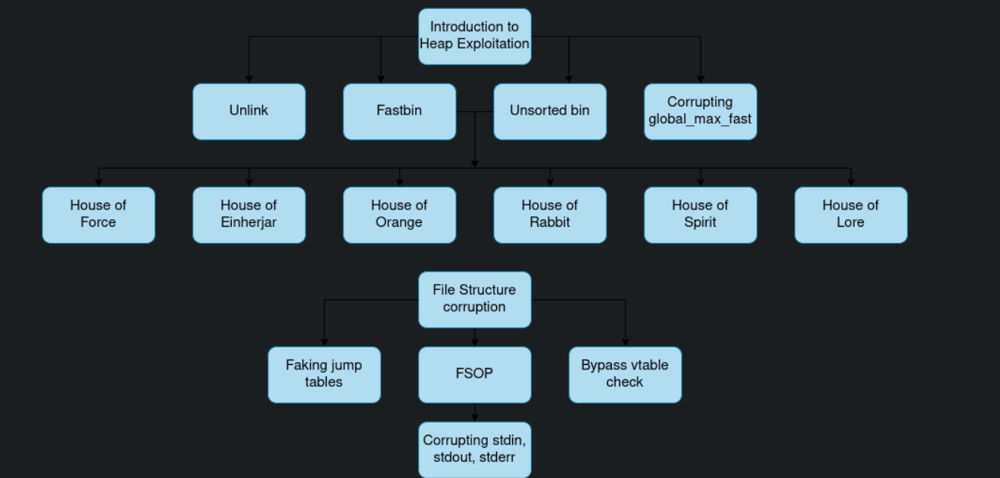

## Documentation 

- https://explorar.dev/bminor/glibc
- https://samwho.dev/memory-allocation/
- https://en.wikipedia.org/wiki/Doubly_linked_list
- https://www.bencode.net/posts/2019-10-19-heap-overflow/
- https://sploitfun.wordpress.com/2015/02/10/understanding-glibc-malloc/
- https://azeria-labs.com/heap-exploitation-part-1-understanding-the-glibc-heap-implementation/
- https://azeria-labs.com/heap-exploitation-part-2-glibc-heap-free-bins/
- [Modern Heap Exploitation](https://www.youtube.com/watch?v=69rAAqtDoSI)

### Cheatsheets

- https://github.com/shellphish/how2heap/
- https://heap-exploitation.dhavalkapil.com/heap_memory

### Challenges

- https://www.corelan-training.com/index.php/training/heap/
- https://blog.quarkslab.com/heap-exploitation-glibc-internals-and-nifty-tricks.html

## Tools

- https://github.com/wapiflapi/villoc

## Vulnérabilités:

### Vue d'ensemble

- https://heap-exploitation.dhavalkapil.com/attacks
- https://0x434b.dev/overview-of-glibc-heap-exploitation-techniques/
- https://www.ambionics.io/blog/iconv-cve-2024-2961-p1

`Protection`:
	- Dont use `free/delete/delete[]`
	- Otherwise, do `ptr = NULL;` / `ptr = nullptr;`

#### Use After Free
	
- https://beta.hackndo.com/use-after-free/
- https://youtu.be/o-nRssrHNMw
- https://github.com/LMS57/TempleOfPwn/blob/main/uaf/exploit.py

#### Double Free

- https://youtu.be/NTSiUtzbWQs
- [House of force](https://mohamed-fakroud.gitbook.io/red-teamings-dojo/binary-exploitation/heap-house-of-force)

À suivre ..

#### Tache exploitation

- https://hackmd.io/@5Mo2wp7RQdCOYcqKeHl2mw/ByTHN47jf

## Houses

- https://github.com/shellphish/how2heap/

### House of apple 

- https://blog.kylebot.net/2022/10/22/angry-FSROP/
