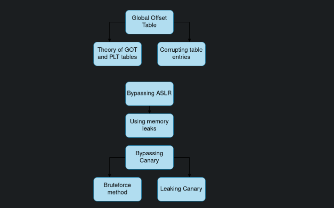

## Doc

- https://www.ctfrecipes.com/pwn/general-knowledge/plt-and-got
- https://intezer.com/blog/executable-and-linkable-format-101-part-3-relocations/
- https://intezer.com/blog/executable-linkable-format-101-part-4-dynamic-linking/
- https://www.technovelty.org//linux/plt-and-got-the-key-to-code-sharing-and-dynamic-libraries.html

### GOT Overwrite (Partiel RELRO)

- https://www.ctfrecipes.com/pwn/stack-exploitation/arbitrary-code-execution/code-reuse-attack/got-overwrite

### Ret2plt

- https://github.com/nnamon/linux-exploitation-course/blob/master/lessons/9_bypass_ret2plt/lessonplan.md
