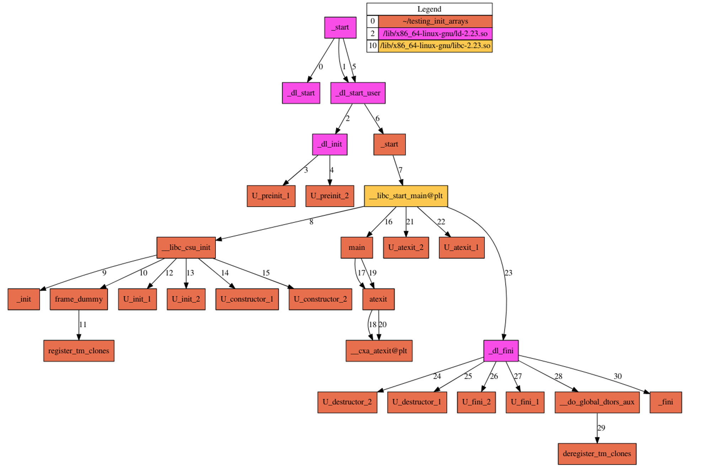

## Doc

- https://github.com/nushosilayer8/pwn/tree/master/ret2_csu_init
- https://github.com/LMS57/TempleOfPwn/blob/main/ret2csu/exploit.py
- http://dbp-consulting.com/tutorials/debugging/linuxProgramStartup.html
- https://www.lazenca.net/pages/viewpage.action?pageId=19300710
- https://stackoverflow.com/questions/61649960/why-do-program-level-constructors-get-called-by-libc-csu-init-but-destructor/69837439#69837439

