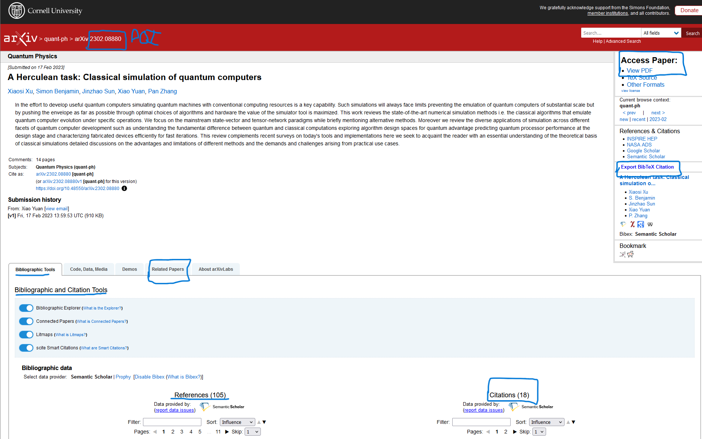

## Outils

- https://arxiv.org
- https://www.overleaf.com/learn/latex/Bibliography_management_in_LaTeX
- https://sci-hub.yncjkj.com/ (accéder à une recherche via son DOI)
- https://libgen.is/

## Articles

- https://dridk.me/index.html
- https://lucas.bourneuf.net/blog/
- https://www.auditsi.eu/?wpfb_dl=338

## Littérature scientifique

- http://classiques.uqac.ca
- https://www.philolog.fr/

## Maths

- http://exo7.emath.fr/index.html
- https://cpge-paradise.com/sites.php
- https://www.bibmath.net/dico/index.php?action=affiche&quoi=./l/lebesgue.html
- https://twitter.com/ProfFeynman/status/1596124871964385282/photo/1

## Chemistry

- https://0.tqn.com/z/g/chemistry/library/goldenchem.pdf
- https://www.sciencemadness.org/whisper/

## Sciences

- https://doc.lagout.org/
- https://paper.bobylive.com/
