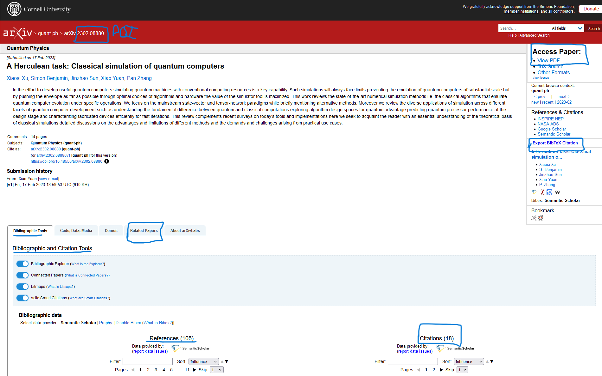

## Doc

## Articles

- https://github.com/tpn/pdfs/
- https://dridk.me/index.html/
- https://lucas.bourneuf.net/blog/
- https://www.auditsi.eu/?wpfb_dl=338/
- https://github.com/lvn/awesome-stuff 
- https://github.com/pFarb/awesome-crypto-papers/

### HPC

- [Ginkgo: Sustainable Software In An Academic Environment](https://github.com/betterscientificsoftware/bssw.io/blob/main/Articles/Blog/GinkgoSustainableSoftwareInAnAcademicEnvironment.md)
- [Chord: A scalable peer-to-peer lookup for internet applications - Frans Kaashoek](https://dl.acm.org/doi/abs/10.1145/964723.383071)
- [How to Build a Quantum Supercomputer](https://arxiv.org/pdf/2411.10406)
- [HPC-oriented Large-scale Code Restructurings with Coccinelle - Julia Lawall](https://archive.fosdem.org/2024/schedule/event/fosdem-2024-2554-hpc-oriented-large-scale-code-restructurings-with-coccinelle/)
- [The Landscape of Software for Tensor Computations](https://arxiv.org/pdf/2103.13756)
- [xv6: a simple, Unix-like teaching operating system - Frans Kaashoek](https://pdos.csail.mit.edu/6.S081/2020/xv6/book-riscv-rev1.pdf)
- https://quantiki.org/wiki/list-qc-simulators

## Theses

- https://pdos.csail.mit.edu/publications/

## Conferences

- https://infocon.org/
- https://www.usenix.org/conferences (research + linux)
- https://github.com/cryptax/confsec
- https://www.synacktiv.com/en/ressources
- https://github.com/quarkslab/conf-presentations

## Outils

### Redaction

- [How to Conduct a State-of-the-Art Literature Review](https://pmc.ncbi.nlm.nih.gov/articles/PMC9765899/)
- https://www.overleaf.com/
- https://typst.app/

### Biblio

- https://scholar.google.com/
- https://arxiv.org
- https://www.overleaf.com/learn/latex/Bibliography_management_in_LaTeX
- https://sci-hub.yncjkj.com/ (acc  der    une recherche via son DOI)
- https://libgen.is/

