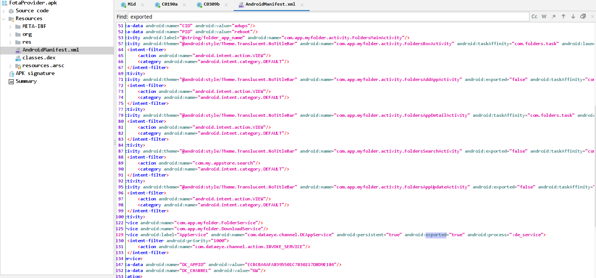
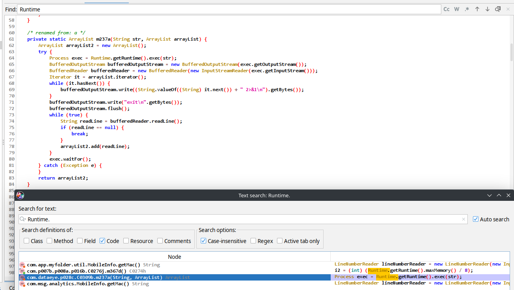
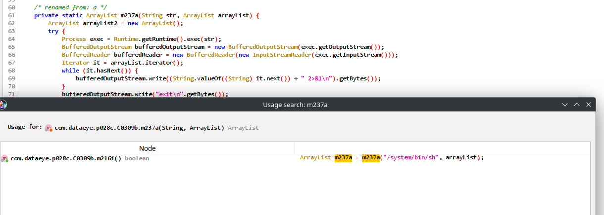
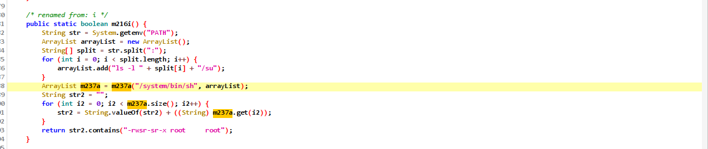
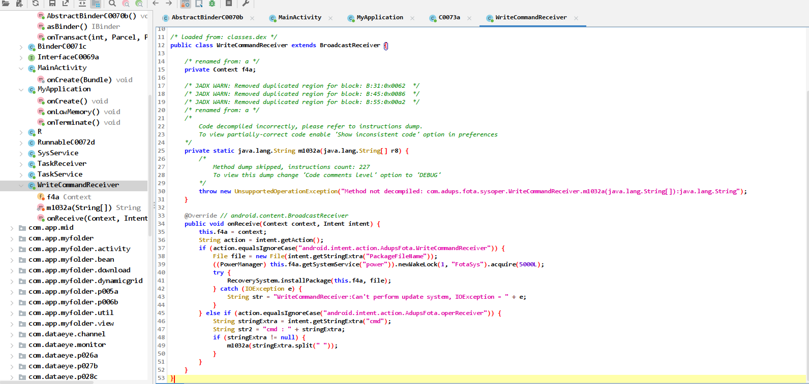
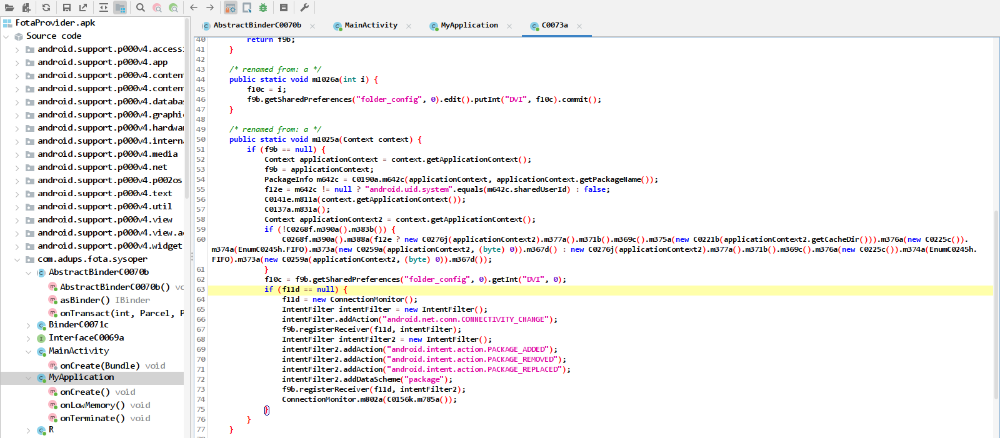

# FotaProvider - Execution de commandes?

Y a-t-il une vulnerabilite dans cette aplication permettant a une autre application d'executer du code ? De quelle maniere ?

- 1) Quels sont les points d'entrée de l'application?

- 2) Quels appels de l'API Android permettent d'éxécuter des commandes?

```java
Runtime.exec()
ProcessBuilder()
Native code: system()
```

## Point d'entrée (exported)

https://developer.android.com/privacy-and-security/risks/android-exported?hl=fr

Lancement d'un composant par un autre -> `true` par défaut



Ainsi ces services sont `exported`:

```java
      <service android:name="com.adups.fota.sysoper.SysService">
            <intent-filter>
                <action android:name="android.intent.action.AdupsFota.SysService"/>
            </intent-filter>
        </service>
        <service android:name="com.adups.fota.sysoper.TaskService"/>
        <receiver android:label="WriteCommandReceiver" android:name="com.adups.fota.sysoper.WriteCommandReceiver">
            <intent-filter>
                <action android:name="android.intent.action.AdupsFota.WriteCommandReceiver"/>
                <action android:name="android.intent.action.AdupsFota.OperReceiver"/>
            </intent-filter>
        </receiver>
        <receiver android:name="com.adups.fota.sysoper.TaskReceiver">
            <intent-filter>
                <action android:name="android.net.conn.CONNECTIVITY_CHANGE"/>
                <action android:name="android.intent.action.ACTION_POWER_CONNECTED"/>
            </intent-filter>
            <intent-filter>
                <action android:name="android.intent.action.PACKAGE_ADDED"/>
                <action android:name="android.intent.action.PACKAGE_REMOVED"/>
                <action android:name="android.intent.action.PACKAGE_REPLACED"/>
                <data android:scheme="package"/>
            </intent-filter>
```

## **Runtime** -> CrossReference (Usage)

On recherche donc `Runtime.`



Puis on cherche une instance avec **FindUsage(x)**



On tombe sur cette méthode statique:



En théorie ça ne fait qu'éxécuter `ls -l` mais des précautions sont à prendre ...

## **ProcessBuilder** : non trouvé -> cf `classes.dex` 

Il faudrait aller plus loin que le Smali obtenu et décompiler le Dalvik.



Cf le Manifest, l'intent récupère l'action (en mode exported) et installe le package;
il ya un `cmd` extra : toute cmd avec un espace sera reçue et éxécutée par cette méthode

## Manifest : **android.uid.system -> Privesc puissante

L'application s'éxécute avec l'uid de **system** (utilisateur le plus privilégié avant root)

```xml
<?xml version="1.0" encoding="utf-8"?>
<manifest xmlns:android="http://schemas.android.com/apk/res/android" android:sharedUserId="android.uid.system" android:versionCode="220" android:versionName="2.2.0" package="com.adups.fota.sysoper">
```


