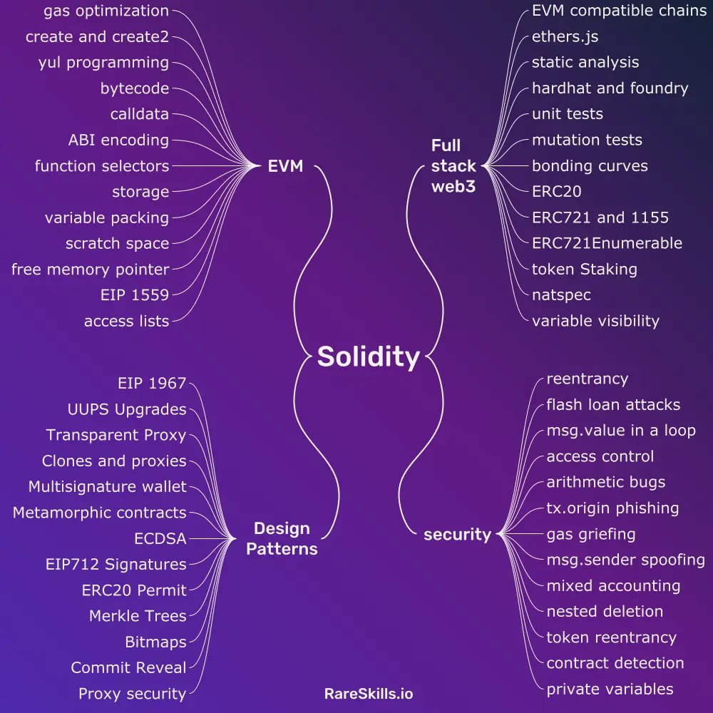

## Doc

- https://youtu.be/xtEQGtaT9MY
- https://cryptozombies.io/en/course
- https://beta.hackndo.com/blockchain/
- https://solidity-by-example.org/hacks/
- https://cypherpunks-core.github.io/ethereumbook/
- https://ethereum.org/fr/developers/docs/web2-vs-web3
- https://github.com/cclabsInc/BlockChainExploitation/blob/master/2020_BlockchainFreeCourse/Tx.Origin/PhishingBankOfEther.sol

## Cheatsheets

- https://github.com/crytic/not-so-smart-contracts



## Tools

### Metamask

- [metamask extension 12.2.4](https://github.com/MetaMask/metamask-extension/releases/tag/v12.2.4) # eth_sign requests
- https://developer.metamask.io/

### Remix

- https://remix.ethereum.org/

### Foundry

**Find RPC**

- Private RPC ?: 
- Public RPC:  https://chainlist.org/chain/11155111 , https://developer.metamask.io/ 

Exemple : https://sepolia.gateway.tenderly.co

```bash
export CONTRACT_ADDRESS=...
export RPC_URL=...
export PRIV_KEY=...
```

```bash
cast call $CONTRACT_ADDRESS "function()(string)" --rpc-url $RPC_URL
cast send $CONTRACT_ADDRESS "pullTrigger()(string)" -r $RPC_URL --private-key $PRIV_KEY
```

```bash
cast call $CONTRACT_ADDRESS "isSolved()(bool)"
```

## Challenges

- https://gist.github.com/dz-root/6d2bd21709d19aeecac3d85afe814240
- https://chovid99.github.io/posts/tcp1p-ctf-2023/#blockchain
- https://github.com/chainflag
