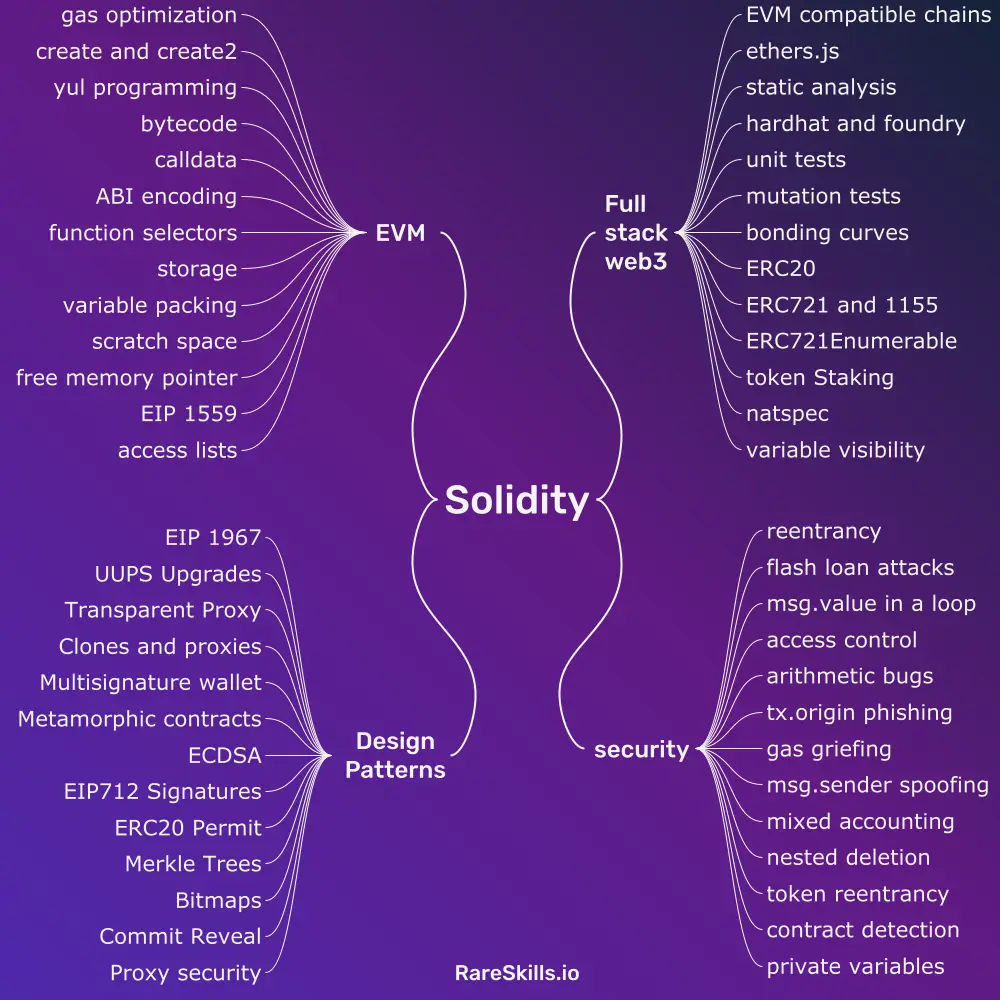

## Doc & Tutos

- https://www.youtube.com/@BenBK
- https://beta.hackndo.com/blockchain/
- https://0xswitch.fr/static/content/eth-smartcontract.pdf
- https://noxx3xxon.notion.site/noxx3xxon/The-EVM-Handbook-bb38e175cc404111a391907c4975426d

#### Overview, RLP encoding & ECDSA signatures

- https://ethereum.org/fr/developers/docs/web2-vs-web3
- https://ethereum.org/developers/docs/data-structures-and-encoding/rlp/
- https://ethereum.stackexchange.com/questions/15766/what-does-v-r-s-in-eth-gettransactionbyhash-mean

### Courses

- https://solidity-by-example.org/hacks/
- https://cypherpunks-core.github.io/ethereumbook/


### Cheatsheets

- https://github.com/dabit3/foundry-cheatsheet
- https://github.com/crytic/not-so-smart-contracts
- https://github.com/oalieno/Crypto-Course/tree/master/Blockchain/ReEntrancy


## Challenges

- https://cryptozombies.io/en/course
- https://chainflag.org/challenges
- https://gist.github.com/dz-root/6d2bd21709d19aeecac3d85afe814240
- https://chovid99.github.io/posts/tcp1p-ctf-2023/#blockchain
- https://github.com/cclabsInc/BlockChainExploitation/blob/master/2020_BlockchainFreeCourse/Tx.Origin/PhishingBankOfEther.sol


## Tools

- https://etherscan.io/
- https://eth-goerli.blockscout.com/
- https://ethereum.org/developers/docs/transactions

```
A validator must pick your transaction and include it in a block in order to verify the transaction and consider it "successful"
=> Data transaction is stored in the "details" of the validator's.
```

### Metamask

- [metamask extension 12.2.4](https://github.com/MetaMask/metamask-extension/releases/tag/v12.2.4) # eth_sign requests
- https://developer.metamask.io/

### Remix

- https://remix.ethereum.org/

### Foundry

- https://getfoundry.sh/

### Web3.py - Ethereum

- https://github.com/ethereum/web3.py

### EVM disassemblers

- https://github.com/palkeo/panoramix
- https://github.com/Arachnid/evmdis
- https://github.com/crytic/pyevmasm

**Find RPC**

- Private RPC ?: 
- Public RPC:  https://chainlist.org/chain/11155111 , https://developer.metamask.io/ 

Exemple : https://sepolia.gateway.tenderly.co

```bash
export CONTRACT_ADDRESS=...
export RPC_URL=...
export PRIV_KEY=...
export CHAIN=...
``` 

```bash
# Compiled contract in hex
cast code $CONTRACT_ADDRESS --rpc-url $RPC
```

```bash
# Read memory
cast storage $CONTRACT_ADDRESS $i --rpc-url $RPC
cast call $CONTRACT_ADDRESS "function()(string)" --rpc-url $RPC_URL
```

```bash
# Send transactions
cast send $CONTRACT_ADDRESS "pullTrigger()(string)" -r $RPC_URL --private-key $PRIV_KEY
cast send $CONTRACT_ADDRESS "claim(string,bytes32)" "hack" "0x1337" -r $RPC_URL --private-key $PRIV_KEY --chain $CHAIN
```

```bash
cast call $CONTRACT_ADDRESS "isSolved()(bool)"
```


