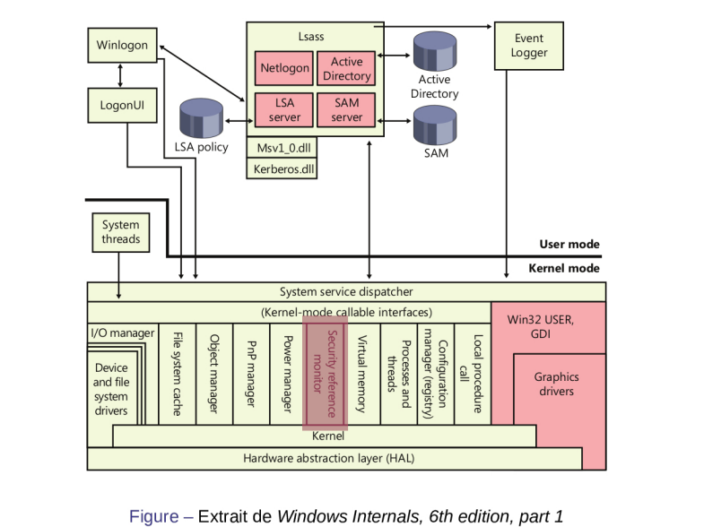
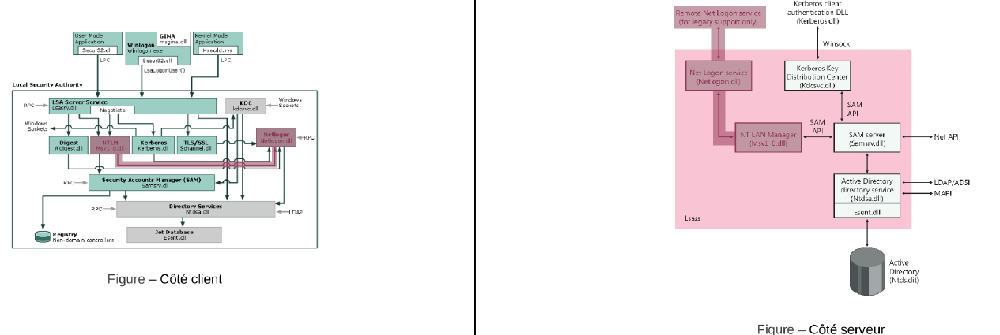
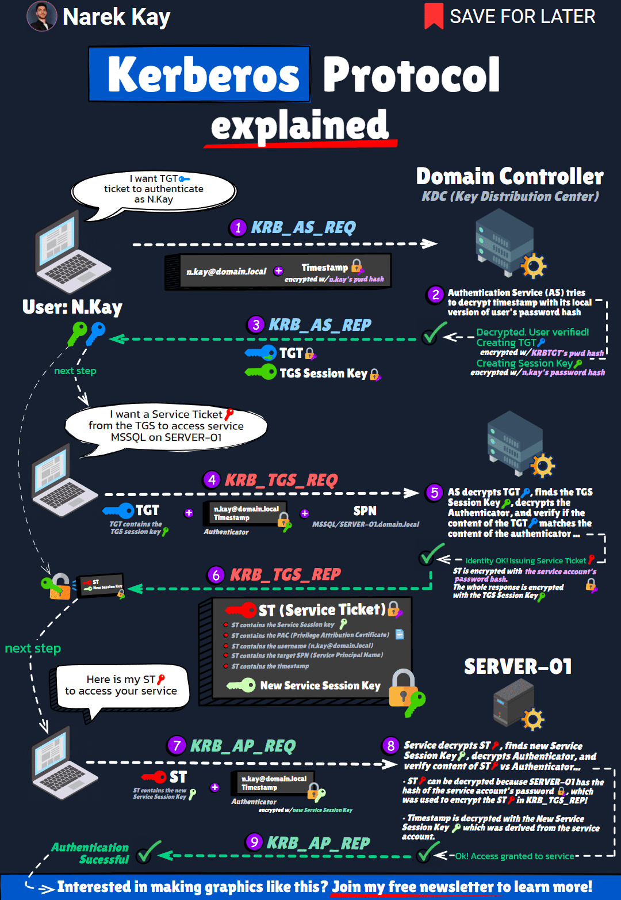

## Documentation

- https://itm4n.github.io/
- https://www.avast.com/c-eternalblue

### LDAP

- https://www.thehacker.recipes/ad/recon/ldap
- https://www-sop.inria.fr/members/Laurent.Mirtain/ldap-livre.html



### Windows (authentication & best practices)

- https://github.com/LoicVeirman/Hello-My-Dir
- https://learn.microsoft.com/en-us/windows/win32/secauthn/lsa-authentication
- https://learn.microsoft.com/en-us/windows-server/identity/laps/laps-overview
- https://learn.microsoft.com/en-us/windows-server/identity/ad-ds/manage/group-managed-service-accounts/group-managed-service-accounts/group-managed-service-accounts-overview
- https://cyber.gouv.fr/publications/recommandations-pour-ladministration-securisee-des-si-reposant-sur-ad
- https://cyber.gouv.fr/publications/securiser-la-journalisation-dans-un-environnement-microsoft-active-directory

### AD

- https://zer1t0.gitlab.io/posts/attacking_ad/
- https://techcommunity.microsoft.com/blog/askds/ntlm-vs-kerberos/4120658
- https://m0chan.github.io/2019/07/30/Windows-Notes-and-Cheatsheet.html
- https://attl4s.github.io/assets/pdf/You_do_(not)_Understand_Kerberos.pdf
- https://hideandsec.sh/books/cheatsheets-82c/page/active-directory-certificate-services

### Cheatsheets

- https://www.thehacker.recipes/
- https://github.com/frostbits-security/MITM-cheatsheet
- https://github.com/S1ckB0y1337/Active-Directory-Exploitation-Cheat-Sheet
- https://book.hacktricks.wiki/en/windows-hardening/lateral-movement/wmiexec.html
- https://orange-cyberdefense.github.io/ocd-mindmaps/img/pentest_ad_dark_2023_02.svg

## Challenges

- https://flu.xxx/challenges/22
- https://tryhackme.com/room/winadbasics

### Setup LAB AD

- `commencement_tp.docx`
- https://docs.contactit.fr/windows_server_ldap/active_directory/installation-active-directory/
- https://docs.contactit.fr/windows_server_ldap/active_directory/active-directory-tp-uo-ou-gg-gl-partages-et-droits-utilisateurs/
- https://github.com/WazeHell/vulnerable-AD
- https://github.com/Orange-Cyberdefense/GOAD


## Tools

### Privesc

- https://wadcoms.github.io/
- https://www.loldrivers.io/
- https://lolbas-project.github.io/
- https://github.com/S3cur3Th1sSh1t/WinPwn # Automation for internal Windows Penetrationtest / AD-Security


### AD / Network protocols 

- https://github.com/ly4k/Certipy
- https://github.com/fortra/impacket/
    - https://github.com/ropnop/impacket_static_binaries
- https://github.com/Pennyw0rth/NetExec
- https://github.com/SpiderLabs/Responder
- https://academy.hackthebox.com/course/preview/active-directory-bloodhound

#### Sysinternals

- [ADExplorer](https://learn.microsoft.com/en-us/sysinternals/downloads/adexplorer)
- [ADInsight](https://learn.microsoft.com/en-us/sysinternals/downloads/adinsight)
- [ADRestore](https://learn.microsoft.com/en-us/sysinternals/downloads/adrestore)
- [PsExec](https://learn.microsoft.com/en-us/sysinternals/downloads/psexec)

## NTLM (depreciated)

- https://beta.hackndo.com/pass-the-hash/#protocole-ntlm
- https://www.801labs.org/research-portal/post/cracking-an-ntlmv2-hash/
- https://www.vaadata.com/blog/fr/authentification-ntlm-principes-fonctionnement-et-attaques-ntlm-relay/
- https://www.thehacker.recipes/ad/movement/credentials/dumping/sam-and-lsa-secrets

**Relaying to LDAP** (Responder/`ntlmrelayx` above): since [ADV190023](https://msrc.microsoft.com/update-guide/en-us/advisory/ADV190023), LDAP signing + channel binding are commonly enforced (not always default, but a common hardening baseline post-2020) - when enforced, relaying NTLM auth *to LDAP* is blocked; relaying to other protocols (SMB without signing, HTTP/ADCS web enrollment - see ESC8 below) can still work. Check current enforcement before assuming a plain relay-to-LDAP works: https://learn.microsoft.com/en-us/troubleshoot/windows-server/active-directory/ldap-session-security-settings-requirements-adv190023


### Internals

- 2 versions (v1 & v2)
- Implemented in `Msv1_0.dll`
- Using **Netlogon** process between 2 machines without AD
- `SAM`: client DB , `NTDS.DIT`: AD DB



### Responder capture

- https://crack.sh/netntlm/

`The client authenticates using the MD4 hash of their password (NT hash) to encrypt the challenge (NTLM)`

#### Net-NTLMv1

```txt
C = 8-byte server challenge, random
K1 | K2 | K3 = NTLM-Hash | 5-bytes-0
response = DES(K1,C) | DES(K2,C) | DES(K3,C)
```

#### Net-NTLMv2

```txt
SC = 8-byte server challenge, random
CC = 8-byte client challenge, random
CC* = (X, time, CC2, domain name)
v2-Hash = HMAC-MD5(NT-Hash, user name, domain name)
LMv2 = HMAC-MD5(v2-Hash, SC, CC)
NTv2 = HMAC-MD5(v2-Hash, SC, CC*)
response = LMv2 | CC | NTv2 | CC*
```


## Kerberos

- https://en.wikipedia.org/wiki/Single_sign-on

### Internals

- Implemented in `Kerberos.dll`, part of **Lsass**
- `SAM`: client DB , `NTDS.DIT`: AD DB


### Encryption Types

- https://web.mit.edu/kerberos/krb5-latest/doc/admin/enctypes.html

```
- 0x18 (aes256-cts-hmac-sha1-96)
- 0x17 (aes128-cts-hmac-sha1-96)
- 0x23 (rc4-hmac)
- 0x24 (rc4-hmac-exp)
- 0x3 (des-cbc-md5)
```

### (Pre) Authentication

- https://beta.hackndo.com/kerberos/
- https://www.chudamax.com/posts/kerberos-102-overview/
- https://vbscrub.com/2020/02/27/getting-passwords-from-kerberos-pre-authentication-packets/
- https://learn.microsoft.com/en-us/entra/identity/hybrid/connect/plan-connect-userprincipalname#upn-format


*Calculation of the kerb5 pre-auth hash*

```txt
Krb5pa meaning kerberos 5 pre-auth, and 18 meaning kerberos encryption type 18 (AES-256) as discussed above.
It encrypts the current time and sends it to the server (as part of the initial kerberos AS-REQ packet) but it encrypts it using the user’s password as the encryption key.
```

- https://stackoverflow.com/questions/12260587/kerberos-fails-when-accessing-site-by-ip-address

```
/etc/hosts
ip DOMAIN
ip DC
```

### Memo: auth + ticket granting



### AsRepRoast

**User without PreAuth**

- https://beta.hackndo.com/kerberos-asrep-roasting/
- https://www.login-securite.com/2022/11/03/analyse-et-poc-de-la-cve-2022-33679/
- ([UAC values](https://jackstromberg.com/2013/01/useraccountcontrol-attributeflag-values/))
- [GetNPUsers.py](https://github.com/fortra/impacket/blob/master/examples/GetNPUsers.py)

*Hash krb5asrep*

```
A user is said to be AS_REP Roastable when Kerberos pre-authentication is not required for that user. We can then request a TGT (Ticket Granting Ticket) from the KDC (Key Distribution Center) on their behalf and crack part of the KRB_AS_REP response, which contains the TGT and a session key encrypted with their NT hash.
An attacker can attempt to recover this domain account's password via offline bruteforce.
```

### Kerberoast

**Non-empty SPN**

- https://beta.hackndo.com/kerberoasting/
- [GetUserSPNs.py](https://github.com/fortra/impacket/blob/master/examples/GetUserSPNs.py)

*Hash krb5tgs*

```
An authenticated user on an AD domain can request a TGT (Ticket Granting Ticket) from the KDC (Key Distribution Center) via a KRB_AS_REQ request; the KDC then sends them a TGT on behalf of the requesting user along with a session key encrypted with the user's NT hash, via a KRB_AS_REP response.
The user can then request a ST (Service Ticket) from the TGS (Ticket Granting Service) by providing their TGT and a valid SPN (Service Principal Name), via a KRB_TGS_REQ request; the KDC then sends an ST for the requested service via a KRB_TGS_REP response.

This ST is encrypted with the NT hash of the requested service account. This account is then said to be Kerberoastable. An attacker can attempt to recover the service account's password via offline bruteforce.
```

### GPO abuse

- [Preferences Policy Key microsoft](https://learn.microsoft.com/en-us/openspecs/windows_protocols/ms-gppref/2c15cbf0-f086-4c74-8b70-1f2fa45dd4be?redirectedfrom=MSDN)
- https://www.it-connect.fr/chapitres/gpp-group-policy-preferences/
- https://www.it-connect.fr/mot-de-passe-dans-une-gpo-mauvaise-idee/
- https://hideandsec.sh/books/red-teaming/page/domain-control-elevation#0x02%20GPP%20and%20SYSVOL
- [GetGPPPasswords.py](https://github.com/fortra/impacket/blob/master/examples/Get-GPPPassword.py)

### Delegation

- https://beta.hackndo.com/constrained-unconstrained-delegation/
- https://beta.hackndo.com/unconstrained-delegation-attack/
- https://beta.hackndo.com/resource-based-constrained-delegation-attack/

#### SAM AccountName

- https://learn.microsoft.com/fr-fr/windows/win32/adschema/a-samaccountname
- [S4User2Self](https://learn.microsoft.com/en-us/openspecs/windows_protocols/ms-sfu/02636893-7a1f-4357-af9a-b672e3e3de13)
- [S4User2Proxy](https://learn.microsoft.com/en-us/openspecs/windows_protocols/ms-sfu/bde93b0e-f3c9-4ddf-9f44-e1453be7af5a)


#### Kerberos Relay

Relay a machine/user's Kerberos AP-REQ (instead of NTLM) to a different service that accepts the same ticket - works because Kerberos, unlike NTLM, doesn't bind the ticket to the target service by default in every scenario. `KrbRelay` targets local privesc via RPC/DCOM-triggered auth relayed to LDAP/ADCS on the same box; `KrbRelayUp` chains this into SYSTEM. Modern equivalent of NTLM relay for environments that disabled/signed NTLM but not Kerberos-based relays.

- https://github.com/cube0x0/KrbRelay
- https://github.com/Dec0ne/KrbRelayUp

#### Shadow Credentials

Abuses `msDS-KeyCredentialLink` (the attribute backing Windows Hello for Business / key-trust auth): if an attacker has `GenericWrite`/`WriteProperty` on that attribute for a target account, they can add their own key-credential entry, then request a TGT for the target via PKINIT using that key - no password/hash needed, and doesn't require resetting the account's password (stealthier than a straight password reset).

- https://posts.specterops.io/shadow-credentials-abusing-key-trust-account-mapping-for-takeover-8ee1a53566ab
- [Whisker](https://github.com/eladshamir/Whisker) / [pywhisker](https://github.com/ShutdownRepo/pywhisker)

### Silver/Golden Ticket

- https://beta.hackndo.com/kerberos-silver-golden-tickets/#pac
- https://learn.microsoft.com/en-us/answers/questions/87978/reset-krbtgt-password
- https://github.com/fortra/impacket/issues/1457

### Memo

[Box Active (HTB)](https://0xdf.gitlab.io/2018/12/08/htb-active.html)

Sync Clock:

`sudo ntpdate <ip>`

**Crackmapexec** :

- check GPPPassword ([share spidering](https://www.infosecmatter.com/crackmapexec-module-library/?cmem=smb-spider_plus): spider_plus): `cme smb <Domain> -u <user> -p <pass> -M gpp_password`
- check SamAccountName: `crackmapexec smb <ip> -M nopac` & `crackmapexec ldap -d <Domain> -u <user> -p <pass> -M Maq` (max machines to create)
- Pass The Hash: `crackmapexec <ip> -u Administrator -H <lmhash:nthash> -x 'whoami'`


**WinRm shell**

`Domain.local/Administrator@127.0.0.1`

`psexec.py <Domain>/<user>:<pass>@<DC.local>`               # noisy, prefer wmiexec
`wmiexec.py <Domain>/<user>@<DC.local> -hashes ':<nthash>'`

```bash
#win-rm protocol
evil-winrm -i <ip> -u <account> -p <password>

#pass the hash
evil-winrm -i <ip> -u <account> -H <hash>
```

**FreeRDP2**

(TryHackMe AD Basics)

```bash
xfreerdp /v:10.10.222.63 /u:THM\Mark /p:M4rk3t1ng.21
```


```bash
#remote desktop protocol
xfreerdp /v:<ip> /u:<account> /p:<password>

#pass the hash
xfreerdp /v:<ip> /u:<account> /pth:<hash>
```

## ADCS (Active Directory Certificate Services)

Misconfigured certificate templates/CA settings let a low-privileged user request a certificate that authenticates as someone else (often Domain Admin) - "ESCn" is the naming convention from the original research. A few of the most common:

- **ESC1**: template allows the requester to supply a Subject Alternative Name (SAN) - request a cert for any UPN, e.g. an admin's.
- **ESC4**: requester has write access to the template object itself - reconfigure it into an ESC1-vulnerable template, then exploit that.
- **ESC8**: NTLM relay to the CA's HTTP web enrollment endpoint (`/certsrv/`) - a classic relay target that's *not* covered by LDAP signing/channel binding above, since it's HTTP, not LDAP.
- Full ESC1-ESC16 catalogue (the list has grown since the original 2021 paper): https://posts.specterops.io/certified-pre-owned-d95910965cd2

```bash
certipy find -u user@domain -p pass -dc-ip <dc_ip> -vulnerable
certipy req -u user@domain -p pass -ca CA-NAME -template VulnTemplate -upn administrator@domain
```

- https://github.com/ly4k/Certipy

## Credential Guard 

- https://research.ifcr.dk/pass-the-challenge-defeating-windows-defender-credential-guard-31a892eee22?gi=92399fdc3e75
- https://specterops.io/blog/2025/10/23/catching-credential-guard-off-guard/

