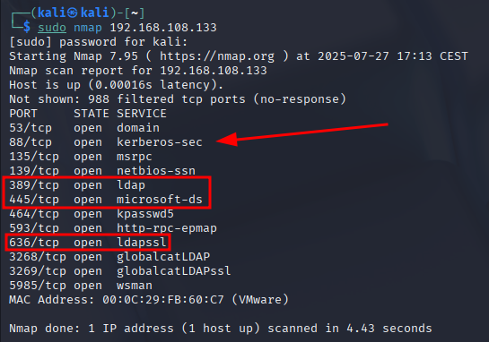
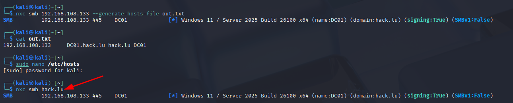
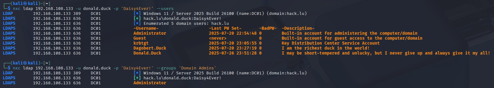
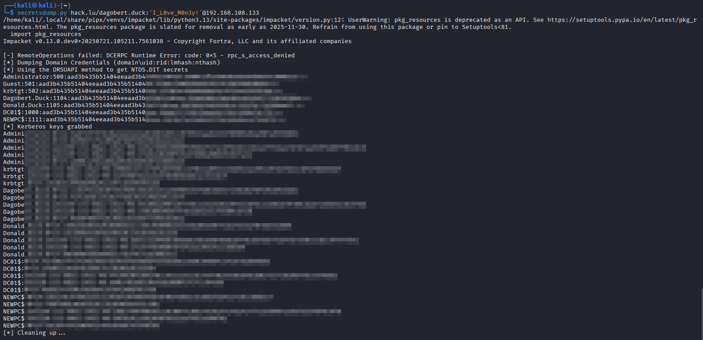
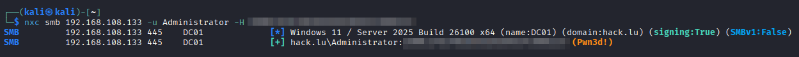

# The world of Active Directory

You have no idea what Active Directory is or how it works? Are you eager to learn how to compromise an Active Directory environment? Then you are in the right place!

## Introduction
First we need to clarify a few terms that are used in the world of Active Directory.

**Active Directory (AD)** is a directory service developed by Microsoft for Windows domain networks. It is used for managing computers and other devices on a network, providing authentication and authorization services, and enabling centralized management of resources.

You will often hear the term **"Domain"**. The domain is on the surface just a fully qualified domain name (FQDN) that is used to identify the Active Directory environment. For example, in this lab the domain is `hack.lu`. However, when talking about Active Directory, the term "domain" often refers to the Active Directory environment itself, which includes the domain controllers, users, computers, and other resources that are part of that environment.

A domain will have **Domain Controllers** (DCs). These are servers that host the Active Directory database and provide authentication and authorization services for users and computers in the domain. Usually a company will have at least two domain controllers for redundancy, but in this lab we will only have one domain controller.

In Active Directory, there are multiple different pre-defined groups. A very important group for an attacker is the **Domain Admins** group. Members of this group have full control over the domain and can perform (nearly) any action in the Active Directory environment. Therefore, the goal of a security assessment is often to become a Domain Admin.

## Setup 🐧

There are a variety of tools that are used by Penetration Testers and Red Teamers. In this Introduction in particular you will get to know the following tools:
- **NetExec**: A tool that allows you to enumerate the network, execute commands on remote systems and harvest credentials.
- **impacket**: A collection of Python classes for working with network protocols with a huge set of examples for various tasks.
- **BloodHound**: A tool that allows you to visualize potential attack paths in an Active Directory environment.

### Installation 🛠️

#### Setup on Kali
- **NetExec**: If you are on Kali, NetExec should be preinstalled. 
- **impacket**: To install impacket, first [install pipx](https://pipx.pypa.io/stable/installation/#on-linux) and then use pipx to install the impacket scripts: `pipx install git+https://github.com/fortra/impacket`
- **BloodHound**: To install Bloodhound, follow the installation instructions [here](https://www.kali.org/tools/bloodhound/). When you are done, you should be logged in to the web interface.

#### Setup on other Linux distributions
We will be using pipx to install NetExec and impacket. Pipx has the advantage that python tooling is available via command line, while pipx takes care of the env handling without polluting your system Python installation. Please install pipx with by following the instructions [here](https://pipx.pypa.io/stable/installation/#on-linux).

Once pipx is installed and set up, you can install NetExec and impacket using the following commands:
```
pipx install git+https://github.com/Pennyw0rth/NetExec
pipx install git+https://github.com/fortra/impacket
```

To install BloodHound please follow their installation instructions [here](https://bloodhound.specterops.io/get-started/quickstart/community-edition-quickstart). You will need [Docker](https://docs.docker.com/engine/install/) installed, as described in step 1. Once you are logged into the web ui, you are ready to go.

# Hands-on ⌨️

### 1. Enumeration 🔍
The first thing you always do is enumerate your network. Fire up nmap and take a look at the Domain Controller:



A domain controller typically has multiple ports open. Especially the SMB port (445), LDAP port (389) and LDAPS port (636) are a good indicator that this is a domain controller. As the port for Kerberos (88) and DNS (53) are open as well, this pretty much confirms our guess.

**SMB** or **Server Message Block** is a network file sharing protocol that is not only used for file sharing, but also for RPC and command execution. This is a very important protocol in Active Directory and the primary protocol that attackers and security professionals use to interact with the domain. The majority of Windows systems in the domain will have SMB enabled. **LDAP** or **Lightweight Directory Access Protocol** arguably the second most important protocol for security assessments. It is a directory service hosted on domain controllers and provides information about most objects in the domain in a tree based structure. This includes users, computers, groups and much more. We can use LDAP to enumerate these objects with very low privileges, as most of the information is available to all authenticated users in the domain.

Let's use NetExec and the SMB protocol to get information about the target. The basic syntax of NetExec (nxc in short) is `netexec <protocol> <target> <command>`. NetExec supports a lot of protocols, but we will focus on SMB and LDAP in this lab. First, just connect to the domain controller via SMB to see which information is available to us:


This already provides valuable information. We can see the build version `26100` which corresponds to either Windows 11 or Windows Server 2025. At the time of writing, this is the latest version of Windows Server. We can also see the target hostname `DC01` and the domain name `hack.lu`.

❗ Before we continue, we should add the hostname and domain name to our `/etc/hosts` file, so if later any tool tries to connect to the domain controller via hostname, it will resolve to the correct IP address❗

NetExec will automatically generate the entry for you with the `--generate-hosts-file` option. Run the following command to generate the hosts file and then add the line to your `/etc/hosts` file:
```bash
nxc smb <ip> --generate-hosts-file
```
If you have configured this correctly, you should be able to use the fully qualified domain name (FQDN) `dc01.hack.lu` to connect to the domain controller:



### 2. Using credentials
For this Lab, we will assume that a user has already been compromised and we have the credentials of this user. So here are the credentials for Donald Duck, who (un)fortunately clicked on our phishing link:
```
Username: donald.duck
Password: Daisy4Ever!
```
Let's verify these credentials by connecting to the domain controller via SMB:
```bash
nxc smb <ip> -u donald.duck -p 'Daisy4Ever!'
```
As we now have valid credentials, we should enumerate the domain and get familiar with the configuration. First, we will query the password policy to see if there are any restrictions for password brute forcing in place:


Interestingly, there is no lock out threshhold defined, which means we do not lock out accounts after a certain number of failed login attempts. As there is also a minimum password length of 7 characters, we could theoretically try to brute force other users. However, brute forcing over the network is not very efficient and will also most certainly raise alarms in any monitoring software.

Let's take a look at the SMB shares that are available to us. We can use the `--shares` option to list all shares on the domain controller:


And indeed, there is an interesting share called `IT-Deployment`. But first, let's break down what each share is used for:
- **ADMIN\$** and **C\$**: These are administrative shares that provide access to the file system on the host. They are typically used for remote administration.
- **IPC\$**: This is the Inter-Process Communication share, which is used for remote communication between processes over named pipes.
- **NETLOGON**: This share is used for logon scripts and group policies. It is a read-only share that contains scripts and files that are executed when a user logs on to the domain.
- **SYSVOL**: This share contains files that are used for domain management, such as group policies (GPOs) and logon scripts

And now the interesting one:
- **IT-Deployment**: So far we don't have READ access, but there could be interesting files in this share. As the name suggests, this share may be used by the IT department to deploy software or updates to computers in the domain. Therefore, admins and possibly **computer accounts** might have access to this share.

### 3. LDAP Enumeration
Let's find out more using the LDAP protocol.
With the commands `--users` and `--groups`, we can enumerate all users and groups in the domain. Specifying a specific group after the `--group` option will enumerate the members of that group.
Two quick commands and we get the list of all domain users and the members of the Domain Admins group:



Enumerating LDAP can be very useful, as most of the attributes in Active Directory are readable by anyone. Not only user and group relations are available, but information about other Active Directory services is also written to LDAP. For example, if Active Directory Certificate Services (AD CS) or Microsoft Endpoint Configuration Manager (MECM, formerly SCCM) are deployed, traces will be left in LDAP.

All of this functionality relies on LDAP queries in the background. Therefore, you can query all attributes manually as follows:
```bash
nxc ldap <ip> -u donald.duck -p 'Daisy4Ever!' --query "(sAMAccountName=donald.duck)" ""
```

**You should have found the first part of the flag by now.**

Another very interesting attribute of the domain is the **ms-DS-MachineAccountQuota**. This attribute defines the number of computer accounts that a low-privileged user can create in the domain. By **default**, this value is set to 10, meaning that any authenticated user can create up to 10 computer accounts in the domain. There is a separate NetExec module to query this attribute:
```bash
nxc ldap <ip> -u donald.duck -p 'Daisy4Ever!' -M maq
```


Do you remember the IT-Deployment share that we found earlier? It's possible that computer accounts have access to it. If we create a computer account, we may be able to access the share and find more interesting information. Creating a computer account is very easy using the `add-computer` module. We will need to provide a name and a password for the new computer account. You can view all the options using the `--options` parameter:

```bash
nxc smb <ip> -u donald.duck -p 'Daisy4Ever!' -M add-computer --options
nxc smb <ip> -u donald.duck -p 'Daisy4Ever!' -M add-computer -o NAME="NEWPC" PASSWORD="test1234"  # beautiful password, I know
```


### 4. Exploring the IT-Deployment share
Now that we have created a computer account, we can try to access the IT-Deployment share. Computer accounts have the `$` sign at the end of their name, so in our case the username is `NEWPC$` (case insensitive). At this point you could also use your file manager, but let's stick to the command line and use NetExec to explore the share. If you want to change the target share, you can use the `--share` option, which defaults to `C$`. Let's list the files in the share:
```bash
nxc smb <ip> -u NEWPC$ -p 'test1234' --share IT-Deployment --dir
```
And we indeed have access to the share! Let's take a look at the files in this share.
You can download and upload files with the `--get-file`/`--put-file` option:
```bash
nxc smb <ip> -u NEWPC$ -p 'test1234' --share IT-Deployment --get-file "\\Path\\to\\file.txt" file.txt
```

SMB shares can be a goldmine, explore the share and see if you can find something useful.

**You should have found the second part of the flag by now.**

### 5. BloodHound
Obtaining new credentials is neat, but did we actually gain any additional privileges? How can we find out what privileges these credentials have? This is where BloodHound comes into play.

#### Gathering data for BloodHound
Another way to query and visualize LDAP information is BloodHound. The [BloodHound GitHub README](https://github.com/SpecterOps/BloodHound) states: "BloodHound leverages graph theory to reveal hidden and often unintended relationships across identity and access management systems.". There are multiple different "collectors" with which you can collect BloodHound data. The most common two are:
- [**SharpHound**](https://github.com/SpecterOps/SharpHound): It is written in C# and can be executed on Windows systems. It collects a lot of different data, including user and group information, sessions, local admin rights, ACLs and much more. Also it is the most feature rich collector, as it is developed by the BloodHound team.
- [**BloodHound.py**](https://github.com/dirkjanm/BloodHound.py): A Python based collector that can be executed on Linux systems, developed by [dirk-jan](https://x.com/_dirkjan). It implements most of the functionality of SharpHound and is usually the preferred choice for Linux users.

NetExec has integrated the BloodHound.py collector, enabling you to collect and directly import data into the BloodHound web interface. As this is a lab environment without proper DNS resolution, and as we are calling an external tool, we should specify the DNS server that BloodHound.py should use to resolve the domain controllers hostname. This can be done using the `--dns-server` option:
```bash
nxc ldap <ip> -u donald.duck -p 'Daisy4Ever!' --bloodhound -c all --dns-server <ip>
```

This will result in a ZIP file that can be imported directly into the BloodHound web interface. If you are on Kali and have completed the setup, simply type 'bloodhound' in your terminal to open the web interface. After logging in, you will be prompted to upload a file, as the database is currently empty. Upload the ZIP file generated by NetExec and wait for the import to finish.

#### Analyzing privileges
There are three main ways to query the data in BloodHound:
- The first one is a simple search, which allows you to search for nodes by name. These can be users, groups, computers or other Active Directory objects.
- The second way is the path finding search, with which you can find paths between two nodes. This allows you to check whether the starting node has some form of privileged control over the target node.
- The third way is to use pre-defined queries. These are queries that are already defined in BloodHound and can be executed with a single click. For example, they include queries to find all Domain Admins, all users with local admin privileges on a specific computer or all computers with unconstrained delegation enabled.

Let's start by querying our user `dagobert.duck`. Clicking on a node on the right will display all of its properties. There are many interesting properties: the `description`, the `LastLogon` timestamp and the `pwdLastSet` timestamp, for example. However, the most interesting information is the "Outbound Object Control". This shows all the objects that our user has some form of control over.

Expanding this category we see that the user `dagobert.duck` has two edges to the domain object:
- GetChanges
- GetChangesAll

**We did it**🎉 These are the permissions that allow the user to replicate the domain database called NTDS.dit. This attack is called DCSync, and it effectively lets us request the password hashes of all users in the domain, including the Domain Admin.

### 6. Dumping the NTDS.dit
Although it is possible to dump the NTDS.dit with NetExec, we will be using the `secretsdump.py` script from the Impacket suite. Impacket offers a wide range of tools for various tasks, and it is advisable to be familiar with the most commonly used ones. The `secretsdump.py` script outputs various hash formats, such as AES-128 and AES-256, which can be used for forging tickets if needed. The syntax of `secretsdump.py` is as follows:
```bash
secretsdump.py <domain>/<username>:<password>@<ip>
```



The format of each NTDS.dit secret is `<RID>:<LM hash>:<NT hash>:<username>:::`. The RID is the user's unique relative identifier within the domain. The LM hash is a legacy hash format that is nowadays mostly unused and will default to the empty hash. The NT hash is the actual password hash and can be used in pass-the-hash attacks or to crack the password. In Active Directory, the NT hash is nearly equivalent to the actual password, as it can be used for most authentication methods.

### 7. Logging in as Domain Admin
Now that we have the NT hash of the Domain Admin, we can use it to authenticate as this user. This can be done with either the NTLM (pass-the-hash) or Kerberos (pass-the-key) protocol. Let's use NetExec to authenticate via NTLM (default method):

```bash
nxc smb <ip> -u 'Administrator' -H '<NT hash>'
```



Wew we did it! The "Pwned!" label indicates that we have command execution, which usually indicates that we have administrative privileges for that machine. As this is the domain controller in this case, we are effectively Domain Admins now. With the `--get-file` command you can download the third part of the flag from the desktop of the Domain Administrator.

If you ask yourself, are these misconfigurations realistic in real world environments? The answer is yes! This is nothing I made up for this lab, I have seen all of these issues on different real engagements. Especially SMB shares can be a gold mine.

## Other resources
If you want to learn more about Active Directory security, here are some resources and tools that I can recommend and personally use on a regular basis:
- [The Hacker Recipes](https://www.thehacker.recipes/): Covers a lot of AD concepts and attacks, including step-by-step instructions.
- [NetExec Wiki](https://www.netexec.wiki/): The official NetExec wiki with a lot of documentation about the tool and attacks you can perform with it.
- [Certipy](https://github.com/ly4k/Certipy): Analyze and exploit the Active Directory Certificate Services (AD CS).
- [Responder](https://github.com/lgandx/Responder): Poisoning tool for LLMNR, NBT-NS and MDNS to capture credentials in the network.
- [ntlmrelayx.py](https://github.com/SecureAuthCorp/impacket/tree/master/examples/ntlmrelayx.py): The most popular tool for relaying attacks on Active Directory.
